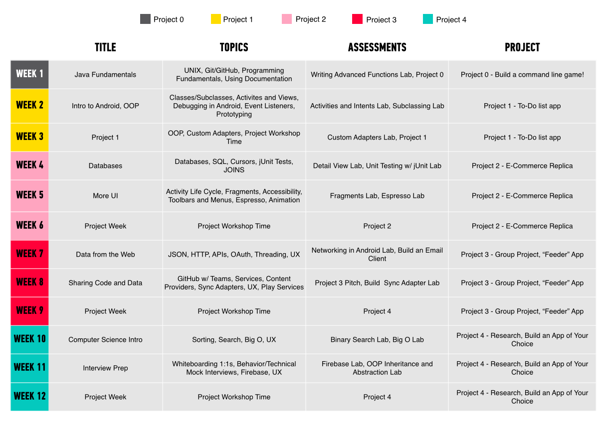

#  ADI: Course Format

The following document will help you understand how the course is structured. Included is an overview of the units, week to week schedule and the specific topics that are covered.

---

## Pre-Course

#### Prerequisite(s)

There are no prerequisites for this course:

- You do not need to be an existing developer in order to enroll in this program.
- You do not need to own an Android device (the classroom will have demo devices).
- You do need to have your own computer (Mac is preferred).

#### Students Admissions and On-Boarding Task

All information relating to the student admissions and on-boarding can be found on [Confluence](https://generalassembly.atlassian.net/wiki/display/CEP/ADI+Pre-Course).

---

## Weekly Schedule

#### How often does class meet?
Class meets 5 times a week for 7-8 hours/day.

#### How much work are students expected to do outside of class?
Students are expected to work at least 10 hours a week outside of class.

---

## Course Syllabus

Below, you'll find the detailed information about the week-to-week content, assessments, and projects:

  

### Holidays

Does the holiday schedule mean that your class is going to be behind schedule? Not to worry. Here are some tips that can help ensure that you cover all the material provided:

- Assign some of the labs and exercises as homework.
- Get started on a project during class so that students can complete the it over the holidays
- Scaffold the capstone project earlier on that even if you miss a week of course because of the break, you can still cover the rest of the material
- And lastly, make sure you're on schedule and not behind. The earlier you keep the better to make sure you're on track to getting through all the material before the class ends.

*Reminder: Immersives get days get added to the course to take into account for holidays, so don't worry about having to restructure the course or tag on extra days!*

Next up, read more about the [course projects and assessments](04-projects-assessments.md).
