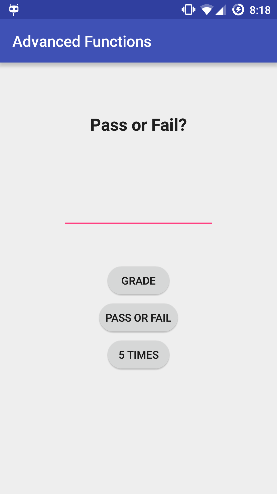
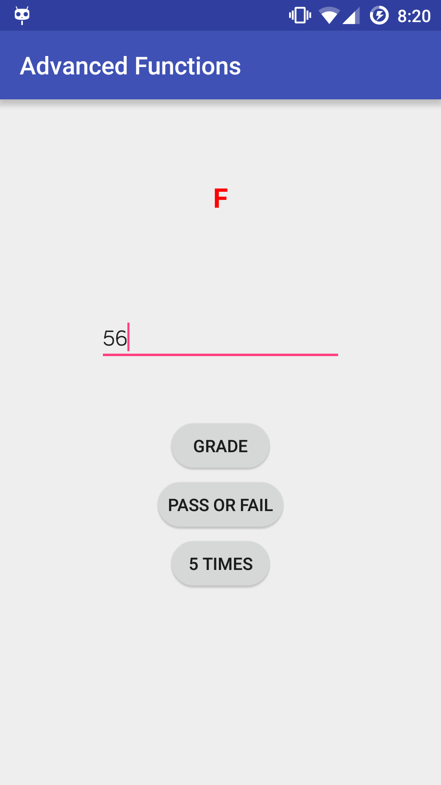
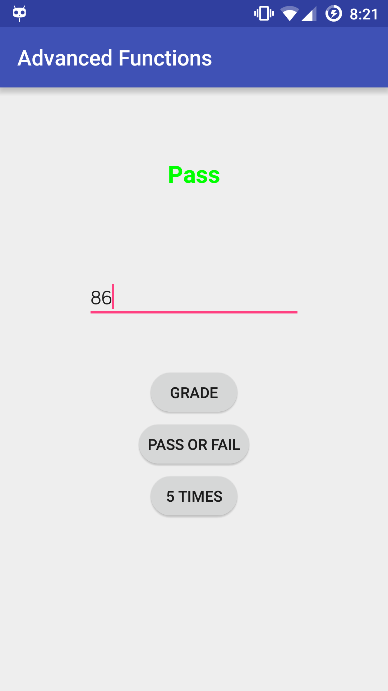
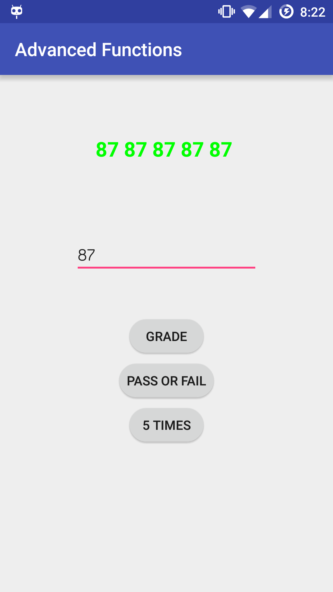

title | type | duration | creator
----- | ---- | -------- | -------
Writing More Advanced Functions | lab | 1:30 | James Davis (New York)

--

#  Writing More Advanced Functions

## Introduction

Pretend you are brand new to numeric grades: you have just started going to school in NYC and can't figure out why your teachers write numbers atop your tests?! Your old school used the good ol' A-F grading scale, and you can't remember what's passing/failing and how the number grades convert!

Enough is enough. You will be creating an app that takes your number grade, from 0 to 100, and tells you the letter grade and whether you passed or failed.  From a content perspective, this lab session will allow you to practice control flow and how to use it writing functions.

## Exercise

#### Requirements

You are expected to create an Android app with the following requirements:

* There should be one EditText for input, one TextView for output, and three buttons:

  * One button that shows a letter grade in the output TextView.
    * ``A > 90, B > 80, C > 70, D > 60, F < 60.``
  * One button that shows "Pass" of "Fail" in the output TextView. Passing is at least 65.
  * One button that prints the given number 5 times.
    * Example: If the given input is 43, the expected output is ``43 43 43 43 43``.


* If the number is greater than 100 or less than 0, a toast should appear saying that the number is not valid.

**Bonus**

* For all of the buttons, make it so the color of the output TextView is green or red, depending on if the given score if passing or failing, respectively.

Refer to the [Solution Code](solution-code) for guidance, if necessary.

#### Starter Code

Found here: [Starter Code](starter-code)

The provided Android Studio project is mostly empty. In the main FunctionActivity, it includes a method called `convertToInteger`. It works as follows:

```java
  int number = convertToInteger("40");

  // number now equals 40
```

#### Deliverable

<p align="center">
  <a href="screenshots/screen1.png"></a> <a href="screenshots/screen2.png"></a>
</p>

<p align="center">
  <a href="screenshots/screen3.png"></a> <a href="screenshots/screen4.png"></a>
</p>

Push your code to your folder on GitHub.

#### Test your code

Included in this lab is a test suite you can use to test you code. The starter-code already has all the tests set up and available to you. These test use AndroidJUnit4 and Espresso. Be sure your phone or emulator are unlocked when running these tests.

In order to run these tests, go to the Build Variants section of Android Studio (usually bottom left of screen) and be sure to set "Test Artifacts" to "Android Instrumentation Test". Right click on the FunctionActivityTest.java file and click "Run FunctionActivityTest".

This will test a couple things about your application.

* If you have all the widgets needed and have id'd them correctly

 * R.id.outputText
 * R.id.inputText
 * R.id.gradeButton
 * R.id.passFailButton
 * R.id.fiveButton


* Tests if your gradeButton delivers proper output
* Tests if passFailButton delivers proper output
* Tests if fiveButton delivers proper output
* Tests if you correctly implemented the bonus (if this test fails but the other do not, your application is still "correct")
