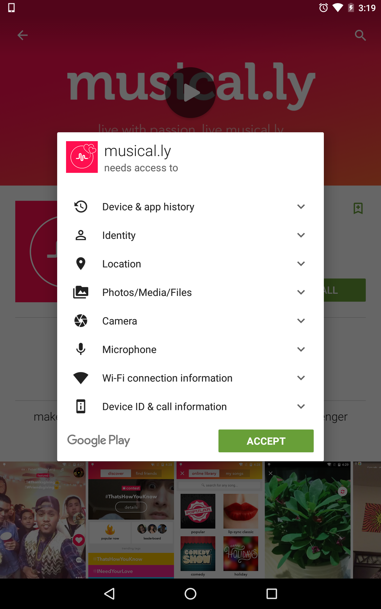

#  Alert dialog

> ***Note:*** _This can be a pair programming activity or done independently._

## Exercise

#### Requirements

- Recreate the permissions dialog as closely as possible using a custom layout and an alert dialog.

**Reference the [developer's guide](http://developer.android.com/guide/topics/ui/dialogs.html)**

**Bonus:**

- Include the expandable items from the permissions dialog in your layout

#### Deliverable

An app that shows the proper alert dialog.

  

Bonus: Include the expandable items.

  

