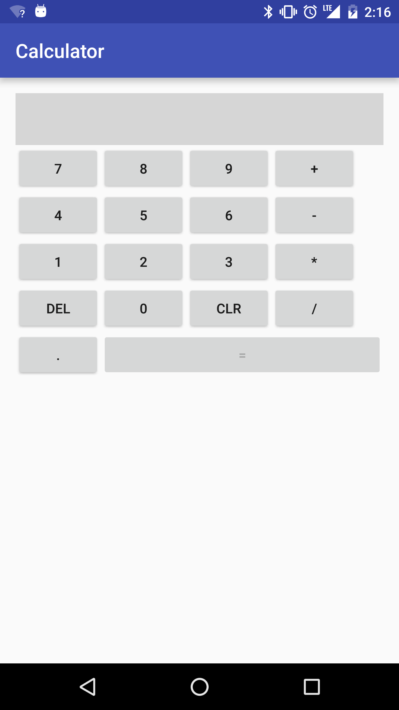
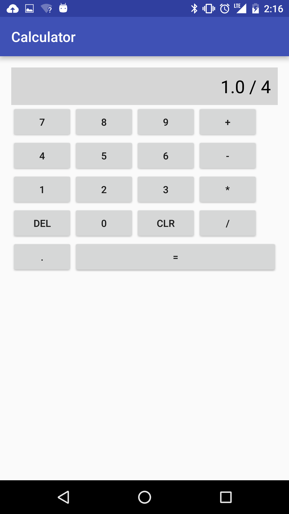
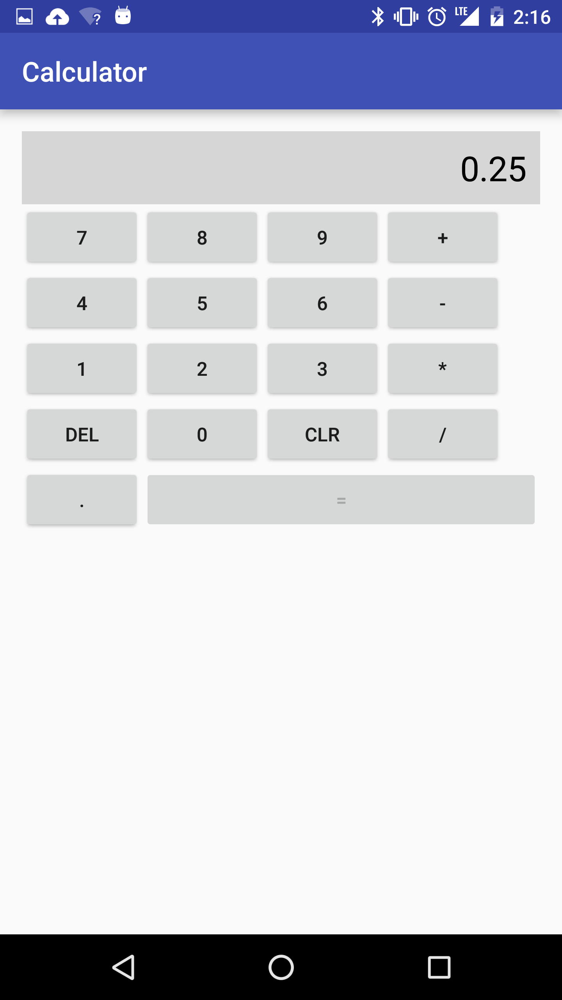

<!--  OUTSTANDING:

 - Consider making this might be done as a homework assignment for the night

 -->

#  Create a calculator with event handlers

## Introduction

> ***Note:*** _This can be a pair programming activity or done independently._

In this lab, you will be building a calculator using your knowledge of event handlers. Each button will have a listener and handler attached and will print the result of the calculation to a TextView. Your calculator doesn't need to look like the screenshot, but it needs to have the same functionality.

## Exercise

#### Requirements

- Contain 18 buttons: 0-9, period, /, *, +, -, Clear, Delete, execute (can be represented by a '=')
- Contain 1 TextView to display results and current input
- Allow the user to make calculations, including decimals
- Allow the user to clear the screen
- Prevent dividing by 0

**Bonus:**
- Add extra buttons (ie sin,cos,tan)
- Add an undo button

#### Starter code

The first two rows of buttons have been provided in a layout in the `starter-code` folder. You can continue adding buttons to follow this, or make your own design. **You must keep the ids for the Buttons and TextView listed below**

Two helper methods have been provided, but there are TODO items marked in one of them that you must complete. Using these helper methods are optional, you can complete the app your own way if you wish.

|  item | id  |
|---|---|
|TextView | calculation_text_view |
| 0 | zero_button |
| 1 | one_button |
| 2 | two_button |
| 3 | three_button |
| 4 | four_button |
| 5 | five_button |
| 6 | six_button |
| 7 | seven_button |
| 8 | eight_button |
| 9 | nine_button |
| + | add_button |
| - | subtract_button |
| * | mult_button |
| / | divide_button |
| = | execute_button |
| . | period_button |
| DEL | del_button |
| CLR | clear_button |

#### Deliverable

Here are three screenshots that show a simple division operation being performed.

### Test your code

Included in this lab is a test suite you can use to test you code. The starter-code already has all the tests set up and available to you. These test use AndroidJUnit4 and Espresso. Be sure your phone or emulator are unlocked when running these tests.

In order to run these tests, go to the Build Variants section of Android Studio (usually bottom left of screen) and be sure to set "Test Artifacts" to "Android Instrumentation Test". Right click on the `MainActivityTest.java` file and click "Run MainActivityTest".

If you have all the widgets needed and have your view ids named correctly, according to the [table](#id-table) above, you can test the following functionality of your application:

- If your calculator can add with proper output
- If your calculator can subtract with proper output
- If your calculator can multiply with proper output
- If your calculator can divide with proper output
- If your calculator can clear the TextView properly
- If dividing by zero will crash your app

## Additional Resources

- [Handling Input](http://developer.android.com/guide/topics/ui/ui-events.html)
