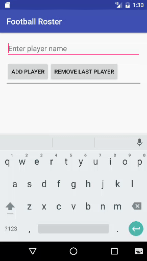
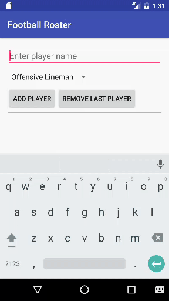

#  ListViews, List Adapters HW

## Introduction

Football season is underway! Now that we've learned about ArrayLists and ListViews, you're going to build your own fantasy football roster. You will be able to type in your player names, click an add button, and have the players appear on your list. You'll also have the ability to drop players from your list. (No knowledge of football is actually required to complete this lab.)

This lab will help you to practice creating and manipulating Java collections as well as creating and using ListViews/Adapters.

## Exercise

#### Requirements

- `EditText` that allows the user to type in a player's name
- `Button` that will add the name currently entered in the `EditText` to your roster (only if the `EditText` isn't blank, otherwise set an error message)
- `ArrayList` to store the players in your roster
- `Button` that will remove the most recent player added to your roster
- A `ListView` to display all players in your roster `ArrayList`
- An `Adapter` to tie together your `ListView` and your `ArrayList`

**Bonus:**
- Add football/player images or logos next to the player names (or just set a background color on an `ImageView` as a placeholder)
- Add player positions with the players (might help to create a custom `Player` class to hold all the info for each player)
- Don't allow duplicate players on the roster (combination of name and position)

#### Starter code

There is no starter code for this lab.

#### Deliverable

An Android app that follows the requirements above. There are no design requirements aside from having the EditText, ListView, and 2 Buttons; feel free to play around with color, font, backgrounds, etc.

Submit a pull request with your project on GitHub. Ensure that your project builds and runs successfully.

Here are screenshots of an app meeting the requirements, and one with the bonuses:

| Requirements | Bonuses |
| --- | --- |
|  |  |

## Additional Resources

- [Java ArrayList](https://docs.oracle.com/javase/8/docs/api/java/util/ArrayList.html)
- [ListView](http://developer.android.com/guide/topics/ui/layout/listview.html)
