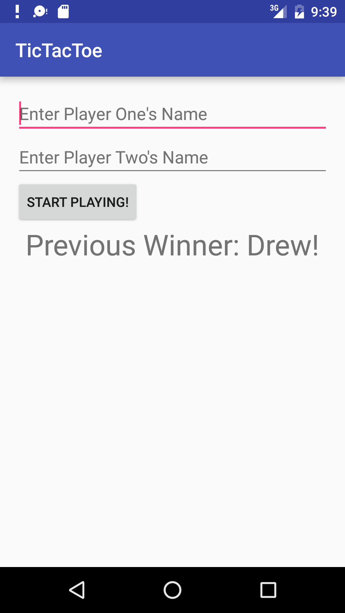
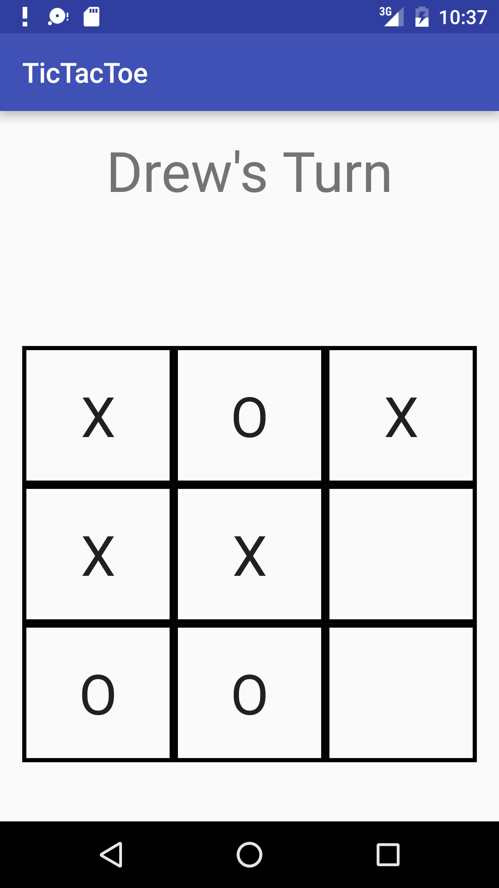
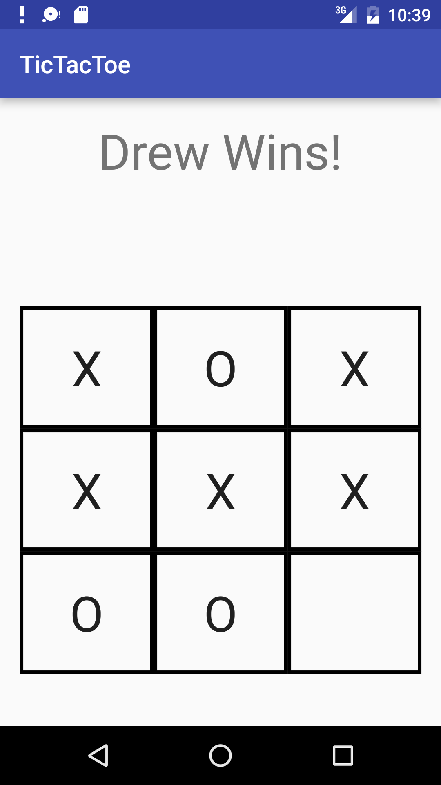

#  Tic-Tac-Toe

> ***Note:*** _This should be a pair programming activity._

## Exercise

In this exercise, you will be creating [tic-tac-toe](https://en.wikipedia.org/wiki/Tic-tac-toe)! The app will consist of two activities. The first is the main menu which takes in the player names and displays the winner of the most recent game.

The second activity is the game itself. It has text that displays whose turn it currently is, and who the winner is once the game is over. Below that is the game board, where each player touches a square to place their letter.

Pair up, and spend **at least** the first 20 minutes creating pseudocode before you start coding. You must do this as a pair programming activity, meaning there should only be one laptop open between each pair.

For a reminder on sending data in an Intent, review the Activities and Intents lesson notes.

For a reminder on SharedPreferences, review the View Lifecycle Part 2 lesson notes.

Each of those lessons has the exact code you need to pass data around your app.

#### Requirements

- Pass the player names from `MainActivity` to 1 in an Intent
- Save the winner of the game in SharedPreferences
- Display the winner of the previous game in MainActivity, which is stored in SharedPreferences
- Complete the Tic-Tac-Toe game

**Bonus:**
- Add a leaderboard

#### Starter code

[Starter code](starter-code) is provided which has the layouts for the two activities completed. The focus of this exercise is on the Java code.

#### Deliverable

Complete the tic-tac-toe game similar to the screenshots below:

