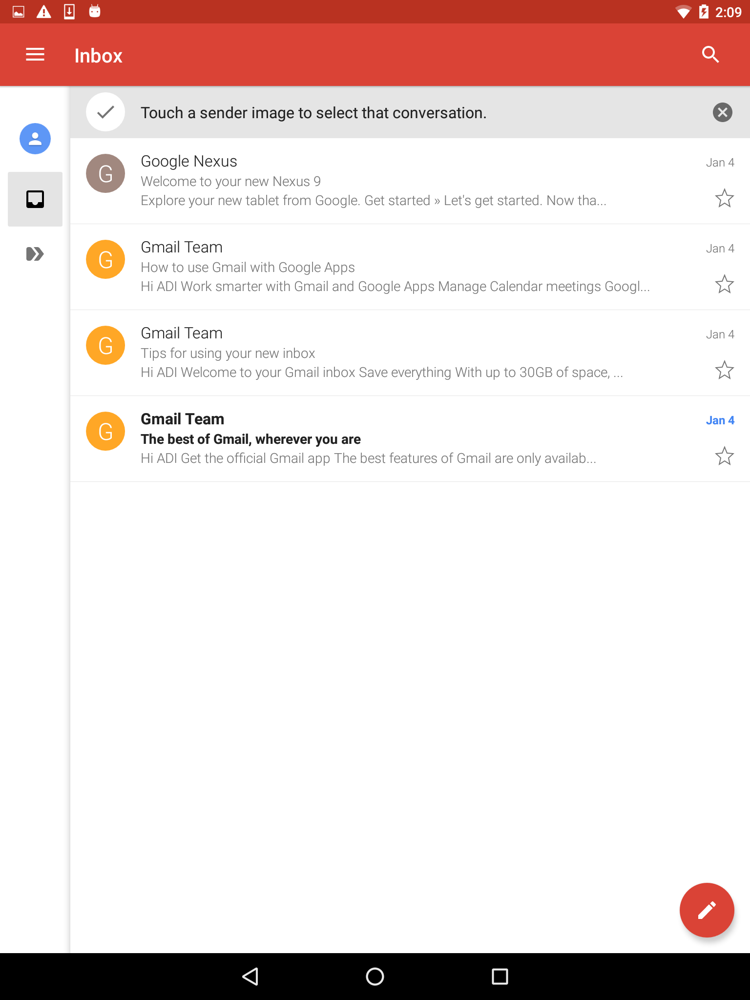
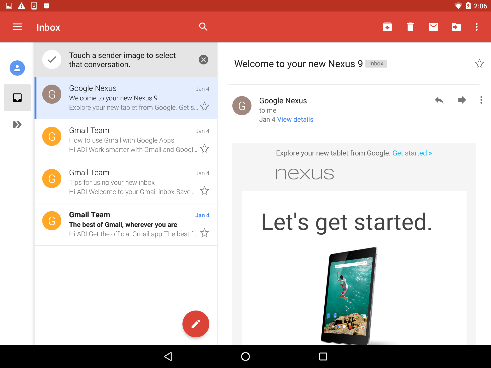
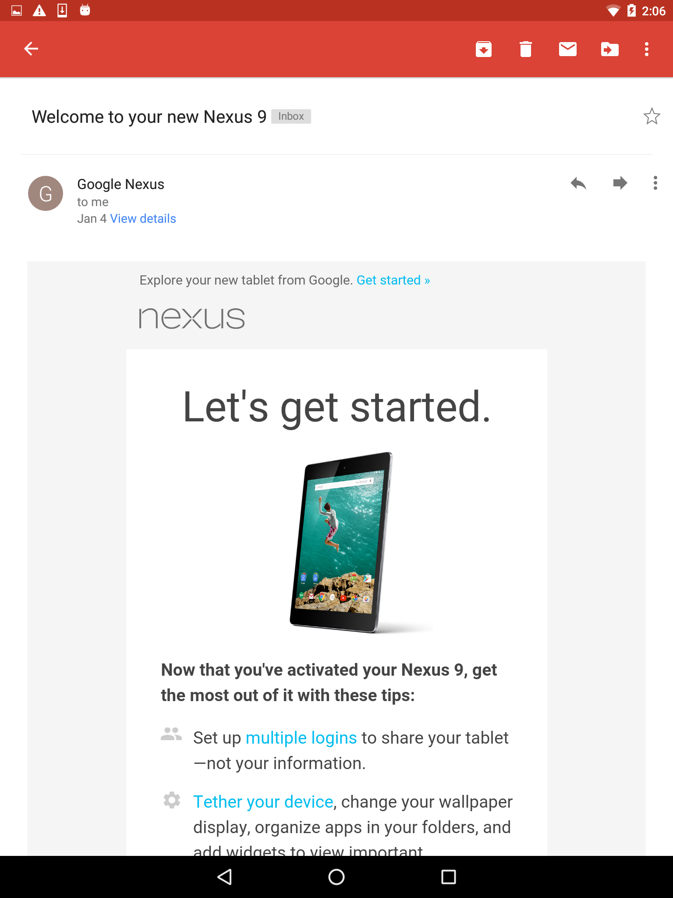

#  Build an Email Client Lab

> Instructor Note: This lab is meant to be *real* challenging - make sure students know this and that it's ok if they are not able to finish by the end of the day.  Frame this as a great opportunity for students to push themselves and get familiar working with tough documentation (Gmail).  Students that will finish will be *so excited* to see they made an actual email client!

## Exercise

In this lab, you will be using [Google's Gmail API](https://developers.google.com/gmail/api/) to create an email app!

The app should have an inbox and a way of viewing the email's contents. The app should also account for tablet devices.

Before you get started, definitely take a look at the [Android Quickstart Guide](https://developers.google.com/gmail/api/quickstart/android).

Although, the requirement is to "build an email client app," the design and functionality of the app is yours to choose! For instance, [Google's Inbox](https://www.google.com/inbox/) app is an email client, but they added one-click functionality that makes it easy to empty the inbox of unnecessary emails. As long as your app allows you to list a user's emails and view the contents of the emails, feel free to add-on to further challenge yourself.

*Note*: We suggest using Google's Gmail API. However, points will not be taken away if you use another API to access a user's email. So, if you find another API that you find easier to use, or more straight forward, then go ahead!

#### Requirements

Your email client must show/do the following:

* A list of emails in a user's inbox
* A screen for viewing the contents of an email that is seen when clicking an item in the list of emails
* On tablets, in landscape, both the master list of emails in the inbox and the details of a selected email should be visible
  * You should use a master/detail layout!
* Be able to compose and send emails
* Must use a class, like _Email.java_, that defines the email objects

**Bonus**:

Though not required, try to aim for the following goals:

* Use material design
* Add a way to save drafts of emails
* Add a way to search emails
* Add functionality where you can select different accounts and view their emails

#### Deliverable

An Android Studio application that meets the above requirements.

When making your pull requests, make sure the title contains your name. It makes it easier to search for us.

Here are a few screenshots of the Gmail app for inspiration:

  

  

  

#### Resources

* [Google's Gmail API - https://developers.google.com/gmail/api](https://developers.google.com/gmail/api/)
