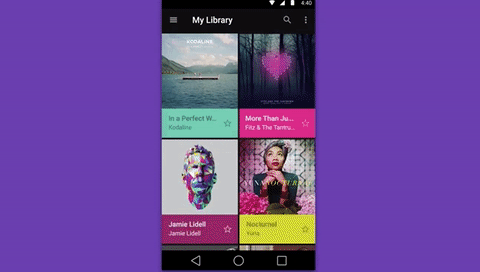

#  Activity Transitions

### LEARNING OBJECTIVES
*After this lesson, students will be able to:*

- Create more interesting user experiences by animating Activity transitions.
- Make elements of an Activity enter and leave the screen in different ways.
- Allow two Activities to share elements to give your applications a more visually consistent feel.


### STUDENT PRE-WORK
*Before this lesson, students should already be able to:*

- Understand how to navigate between Activities using Intents

### INSTRUCTOR PREP

_Before this lesson, instructors will need to:_

### INSTRUCTOR PREP
*Before this lesson, instructors will need to:*
- Read through the lesson
- Add additional instructor notes as needed
- Edit language or examples to fit your ideas and teaching style
- Open, read, run, and edit (optional) the starter and solution code to ensure it's working and that you agree with how the code was written


---

### LESSON GUIDE

| TIMING  | TYPE  | TOPIC  |
|:-:|---|---|
| 5 min  | [Opening](#opening)  | Discuss lesson objectives |
| 10 min |[Intro](#enter-exit-shared) | Enter, Exit and Shared Elements |
| 10 min | [Demo](#exit)| Exit Transitions |
| 15 min | [Demo](#shared)| Shared Elements |
| 10 min | [Guided Practice](#shared-toolbar)| Shared Elements |
| 20 min | [Independent Practice](#practice)| Shared Elements |
| 5 min | [Conclusion](#conclusion)| Conclusion |

<a id="opening"></a>
## Opening (5 mins)



Activity Transitions were introduced in Android 5.0 (API 21) as a way to create a more seamless user experience throughout entire apps. They provide visual connections between different states through motion and transformations between common elements. We can use this to achieve the result of our Activities morphing into each other, rather than just moving from one to the next.

**Important**
The Transitions API is only available for Android API 21 and up, so it's important to check for the version before trying to use it in your app. For the sake of keeping thing simple in the lesson, we're just going to set our minSdkVersion to 21, but here's an example of how to check the api version at run time to make your app backwards compatible...

```java
int currentapiVersion = android.os.Build.VERSION.SDK_INT;
if (currentapiVersion >= android.os.Build.VERSION_CODES.LOLLIPOP){
    // it's supported, so do your animation
} else{
    // skip the animation
}
```

---

<a id="enter-exit-shared"></a>
## Intro: Enter, Exit and Shared Elements (10 mins)

You can specify how views enter and exit the screen when we move between Activities, as well as allowing views to remain in the new Activity. Views that persist between one activity to the next are called shared elements and we can animate them to change size and position to assume their new place in the new Activity.

There are 3 main types of enter and Exit transitions:

- explode - Moves views in or out from the center of the scene.
- slide - Moves views in or out from one of the edges of the scene.
- fade - Adds or removes a view from the scene by changing its opacity.

And there are 4 main type of shared element transition:

- changeBounds - Animates the changes in layout bounds of target views.
- changeClipBounds - Animates the changes in clip bounds of target views.
- changeTransform - Animates the changes in scale and rotation of target views.
- changeImageTransform - Animates changes in size and scale of target images.

You can also create your own custom transitions, but for this lesson we'll be focusing on the transitions provided for us by Android.


---


<a id="exit"></a>
## Demo: Exit Transitions (10 mins)

> Instructor note: Using the `ActivityTransitionsDemo` starter code with 6 Android images in the MainActivity, follow these instructions to make the Androids explode out of view when the Activity changes.

- First, we need to request the content transitions feature.
- Then we set a our Activities exit transition.
- In this instance we're using the Explode class to determine the behavior of our transition.
- In onCreate of your Activity, above the call to the `setContentView()` method...

#####MainActivity.java
```java
getWindow().requestFeature(Window.FEATURE_CONTENT_TRANSITIONS);
getWindow().setExitTransition(new Explode());
```

- Create `SecondActivity` and set fab to start that Activity.
- We need create some options that specify that we're using a transition.
- Then pass those options to `startActivity()` in the form of a Bundle.

#####MainActivity.java
```java
public void onClick(View view) {
	Intent intent = new Intent(MainActivity.this, SecondActivity.class);
	ActivityOptions options = ActivityOptions.makeSceneTransitionAnimation(MainActivity.this);
   startActivity(intent, options.toBundle());
}
```


---


<a id="shared"></a>
## Demo: Shared Elements (15 mins)

- To make Elements persist between Activities and animate the transition of those elements we must declare that they are "Shared Elements".
- First, we must give our shared elements a `transitionName` in it's xml opening tag.
- We'll set the first two of our Android images to have names, so they'll both persist to the next Activity.

#####content_main.xml
```xml
<ImageView
	android:id="@+id/persistantImage1"
	android:transitionName="persistantImage1"

...

<ImageView
	android:id="@+id/persistantImage2"
	android:transitionName="persistantImage2"
```

- Create a new "Basic" Activity and add the same elements to our `SecondActivity`'s xml.

> Check: ask the students which xml attribute is necessary to tell our app which shared View in the first Activity corresponds with which shared View in the second Activity. Answer: `transitionName`.

- Make sure they have the same `transitionName` as the corresponding elements in the `MainActivity`
- Feel free to change their size and position to make the elements animate into the `SecondActivity`.

#####content_second.xml
```xml
<ImageView
    android:id="@+id/persistantImage1"
    android:layout_width="150dp"
    android:layout_height="150dp"
    android:scaleType="fitXY"
    android:transitionName="persistantImage1"
    android:layout_alignParentTop="true"
    android:layout_centerHorizontal="true"
    android:src="@mipmap/ic_launcher"></a>

<ImageView
    android:id="@+id/persistantImage2"
    android:layout_width="150dp"
    android:layout_height="150dp"
    android:scaleType="fitXY"
    android:transitionName="persistantImage2"
    android:layout_alignParentBottom="true"
    android:layout_centerHorizontal="true"
    android:src="@mipmap/ic_launcher"></a>
```

- In the `onCreate()` method of your `MainActivity`, set the shared element transition.

#####MainActivity.java
```java
TransitionSet transition = new TransitionSet();
transition.addTransition(new ChangeTransform());
getWindow().setSharedElementEnterTransition(transition);
getWindow().setSharedElementReturnTransition(transition);
```

- In the `onClick()` method of the `MainActivity`'s fab, reference the elements you wish to share in the next Activity.
- Then, create `Pair` objects to put in the `ActivityOptions`.

#####MainActivity.java
```java
ImageView persistantImage1 = (ImageView) findViewById(R.id.persistantImage1);
ImageView persistantImage2 = (ImageView) findViewById(R.id.persistantImage2);

Pair<View, String> pair1 = Pair.create((View)persistantImage1, "persistantImage1");
Pair<View, String> pair2 = Pair.create((View)persistantImage2, "persistantImage2");

ActivityOptions options = ActivityOptions.makeSceneTransitionAnimation(MainActivity.this, pair1, pair2);
```

> Check: what method can an Activity call to end itself and go back to the previous Activity?

- If we want to end our Acidity and go back, we could call the `finish()` method, but that would take us back without reversing the transition.
- So, to Animate out of the `SecondActivity` call the `finishAfterTransition()` method
- Let's do that in the `onClick()` of the fab.

#####SecondActivity.java
```java
fab.setOnClickListener(new View.OnClickListener() {
    @Override
    public void onClick(View view) {
        finishAfterTransition();
    }
});
```


---


<a id="shared-toolbar"></a>
## Guided Practice: Making the Toolbar a Shared Element (10 mins)

> Instructor note: have the students guide you towards setting up the Toolbar as a shared element, so it doesn't flash during the transition.

- Notice that the `Toolbar` at the top is flashing every time we move between Activities. 
- We can fix that by making it a shared element too.
- Add it as a new `Pair` in `MainActivity`.

#####MainActivity.java
```java
AppBarLayout appBar = (AppBarLayout) findViewById(R.id.appBar);
Pair<View, String> pair3 = Pair.create((View)appBar, "appBarTransition");
ActivityOptions options = ActivityOptions.makeSceneTransitionAnimation(MainActivity.this, pair1, pair2, pair3);
```

- Then set it's transition name in the `SecondActivity`...

#####SecondActivity.java
```java
AppBarLayout appBar = (AppBarLayout) findViewById(R.id.appBar);
appBar.setTransitionName("appBarTransition");
```

- Don't forget to give the `AppBarLayout` an `id` in both your Activities xml layouts...

#####activity_main.xml and activity\_second.xml
```xml
<android.support.design.widget.AppBarLayout
	android:id="@+id/appBar"
```


---


<a id="practice"></a>
## Independent practice (20 mins)

Using the `ActivityTransitionsIndependentPractise` starter code, add a details Activity that opens whenever a list item is clicked. Display whatever details you want here (hard-coded is fine), but include the same image that exists in the list items. Make that image a shared element so it animates from the list item to the new details Activity.
Feel free to use your project 2 instead of the starter code, to add transitions to your own application.

> Check: Were students able to create the desired deliverable(s)? Did it meet all necessary requirements / constraints?


---


<a id="conclusion"></a>
## Conclusion (5 mins)

Activity Transitions are a relatively easy way to drastically improve the user experience of your applications. They give the UI a more tactile feel by making our Views appear to be more responsive to the users touch. It's easy to neglect transitions because they're often seen as unnecessary extras, but never underestimate how much of an impression they make on the user.

### ADDITIONAL RESOURCES
- [Defining Custom Animations](http://developer.android.com/training/material/animations.html)

