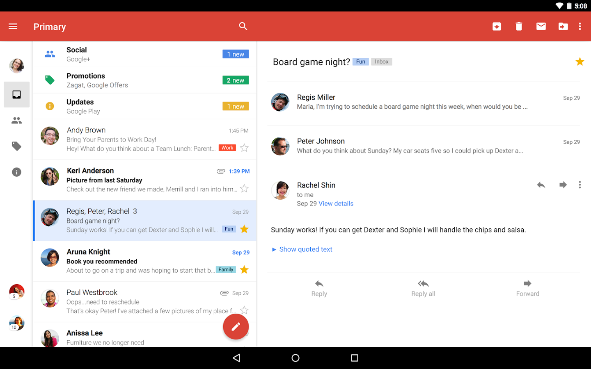

#  Email App Workshop

> ***Note:*** _This should be done in a group._

## Exercise

In this workshop, you will be preparing to write your email app. This can be a relatively large undertaking, so appropriate planning is necessary.

You will spend 30 minutes working with your table to identify all of the UI components that make up a basic email app, such as the one in the screenshots (Gmail), and how they interact with each other. Do this for both a dual-pane tablet layout, as well as a single-pane phone layout. After that, we will gather as a class to discuss the different approaches so you will be ready with your own ideas when you start your app.

Ignore the categories system for now (Social/Promotions/Updates).

  
  

#### Requirements

- Identify the UI components from the screenshot
- Be ready to explain any interaction between the components you identify
- Complete this for both tablet and phone layouts

#### Deliverable

Written notes and/or any diagrams you might draw.
