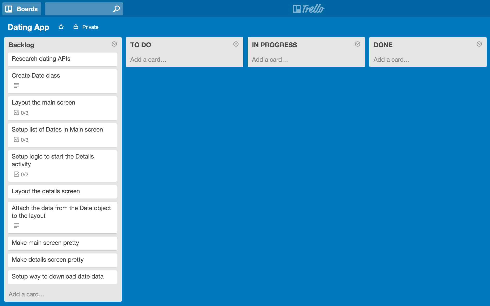
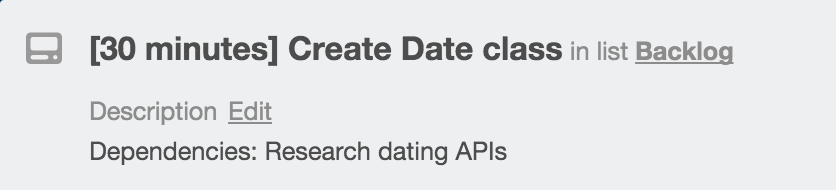
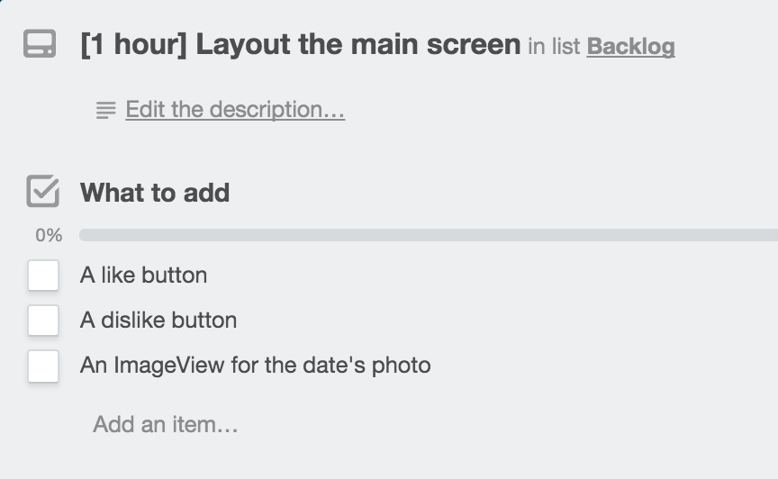
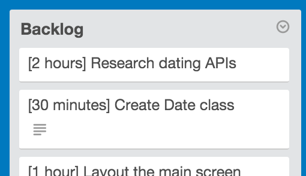

#  Planning Before Development Lesson

### LEARNING OBJECTIVES
*After this lesson, you will be able to:*
- Project plan for a group project

### STUDENT PRE-WORK
*Before this lesson, you should already be able to:*
- Define the elements of user experience design
- Develop basic skills in creative problem solving, innovation, and human­-centered design through a fast-­paced design thinking activity
- Conduct an effective user interview
- Draft a research plan and write a discussion guide for final project interviews

### LESSON GUIDE

| TIMING  | TYPE  | TOPIC  |
|:-:|---|---|
| 5 min  | [Opening](#opening-5-mins)  | Discuss lesson objectives |
| 5 min  | [Introduction](#introduction-intro-to-software-architecture-5-mins)  | Intro to Software Architecture |
| 10 min  | [Introduction](#introduction-requirement-analysis-10-mins)  | Requirement Analysis |
| 10 min  | [Guided Practice](#guided-practice-extract-key-words-and-phrases-10-minutes)  | Extract key words and phrases |
| 10 min  | [Guided Practice](#guided-practice-cheap-travel-trello-10-minutes)  | Cheap Travel Trello |
| 30 min  | [Independent Practice](#independent-practice-plan-an-app-30-minutes)  | Plan an app |
| 5 min  | [Conclusion](#conclusion-5-minutes)  | Review / Recap |

## Opening (5 mins)

Listen, I know that planning may not be the most exciting part of making an app; most developers just want to dive into the code and start hacking away at a solution. But take this next quote with you for the rest of your programming careers:

The best real life comparison that can be made is assembling IKEA furniture. You can build the complicated furniture without the instructions; you will figure it out eventually. However, it would probably go much faster and be much more efficient if you can refer to all the steps you want to take and know all the pieces you'll need beforehand.

In this lesson, you will get a guided plan on preparing before coding.

This lesson assumes that you have already gone through the UX process. You probably have either wireframes, or at least user stories.

## Introduction: Intro to Software Architecture (5 mins)

In software development, some teams have a dedicated [Software Architect](https://en.wikipedia.org/wiki/Software_architect). On a high level, this person is kind of a mix between software developer and project manager; they are software experts who makes high-level design choices and dictates technical standards.

They often lead development teams, and define what the team should be focusing on during a sprint or the entire project timeline.

I don't want to bring money into this, but I will. Companies are willing to pay big bucks for people who plan before they do. The average salary for a Software Architect is as follows:

* Microsoft, $179,535
* Oracle, $168,776
* IBM, $152,418
* Intel, $136,903
* Intuit, $192,382

Long story short, people want to hire planners. Planning makes *everyone's* lives easier.

## Introduction: Requirement Analysis (10 mins)

That is the question I've heard a lot: If I don't start in code, where do I start?

The answer is to figure out what you need. Please note that I said _need_ and not _want_.

#### User Stories

You will probably be given User Stories to define the features of the app (either from your project manager or yourself, depending on the company structure).

Quick reminder of the User story structure:

> As a _______, I can ________.

Let's say I wanted to make a dating app like Tinder. I would have a list of user stories like the following:

* As a user, I can see one potential date at a time, being able to quickly like or dislike someone's profile  and immediately see another date.
* As a user, I can click on a profile to get more detailed information about the potential date.
* As a user, I can show my Instagram photos on my profile.

** Guided Practice: User Stories for Cheap Flying app (4 minutes)

Alright, so let's say that I wanted to make an app that finds the cheapest flights and hotels for a trip.

Let's take the next 4 minutes coming up with the user stories for it. At the end, we'll identify the top 4 or 5 stories to prioritize for our first sprint.

Key points:

* Identify the essentials and distractions
* Don't be too ambitious.

> Check: Why am I only focusing on the top features and not all of them?

Examine what you have and what you have to make

For my dating app, I had three user stories. Let's look at the first one:

> As a user, I can see one potential date at a time, being able to quickly like or dislike someone's profile and immediately see another date.

> As a user, I can click on a profile to get more detailed information about the potential date.

**First, examine the key words and phrases of it**; the things that define the objects or actions. In this case, the things that pop out are:

* _"date"_ - I will need an object, Date, that has the attributes.
	* Also, where are these objects coming from? What APIs will I need?
* _"I can see one potential date at a time_" - I will need some way of seeing the Date, maybe an ImageView with their photo
* _"quickly like", "quickly dislike"_ - I will need buttons that allow me to like/dislike someone
* _"immediately see another date"_ - I will need to have a list of Dates, where I can fetch the next Date from the list once the buttons are clicked.
* _"I can click on a profile to get more detailed information about the potential date"_ - I will need to make a second screen that appears when I click on the ImageView. I will also have to pass the Date object from the first screen to the other.

These are your minimum requirements for the first 2 user stories. You want to come up with the *basics* needed to do something. Here's an example of something to avoid.

* _"quickly like", "quickly dislike"_ - I will need a way to swipe profiles left to dislike someone and right to like them

The action of swiping a view is more difficult to implement and test than the action of clicking a view.

## Guided Practice: Extract key words and phrases (10 minutes)

Let's try this for the cheap travel app. What are the keywords and actions that jump out at you in the user stories we've made?

> Check: What are some of the benefits of listing your actions like this?

##### Quick note about APIs

This is the ideal time to look up the APIs you need to achieve your goals, if any.

You want to find out _as early as possible_ what data set you're dealing with, and how difficult it is to use the API.

> Check: Why might doing API research later in the project be bad?

It would be really bad if you were making a podcast API and assumed that provided links to the mp3 files and worry about it later. If you develop many lines of code and find out you have no actual data to work with, then you have to backtrack and figure out other solutions (or find out there are no other solutions!).

#### Scoping

At this point, you have a list of things you have to make and APIs you have to research. The next and last step before coding anything should be defining the scope of things.

This is _painfully_ important if you are limited by time... you know, like a project due in a week or something like that.

You should use some tool, digital or otherwise, to track the things you need to do and the time it takes to do it. Scrum boards are used the most in most companies. In this case, we will be using Trello.

In Trello, you want to set up the backlog; a list of things to do for the project, _as a whole_. You make a card for every action you've defined.

Next, edit the descriptions to list a list of the important things to do for each task.

Next, evaluate each item and estimate the amount of time it would take to do each item. Make sure to add padding! If something takes 30 minutes to do, make the total time 1 hour! Give yourself some breathing room!

Finally, now that you have a sense of how long everything should take, drag the tasks you want to work on for the upcoming sprint. Most companies put about 35-hours worth of tickets here, because that's the average work week.

You should allocate the certain number of tasks depending on how much time you are willing to work on it.

## Guided Practice: Cheap Travel Trello (10 minutes)

Let's do the same thing for our travel app! We'll be making a Trello board and setting up the expected time to implement it.

## Independent Practice: Plan an app (30 minutes)

I would like you all to do all of the steps above. Make user stories, examine what you have and need, and develop a Trello board for *one* of the following apps:

* Grocery List app
* Take-out food ordering app
* Twitter
* Banking app
* Uber

## Conclusion (5 minutes)

At this point, you have enough to make an MVP app! The next step would be to create a skeleton of your app, implementing only the necessary components and maybe using mock data instead of including an API (for quick testing of your concept).

There is a lot more involved in being a Software Architect. However, this is the first steps in becoming one.

Planning might be the most important steps in developing anything, and you should get in the habit of doing so.
