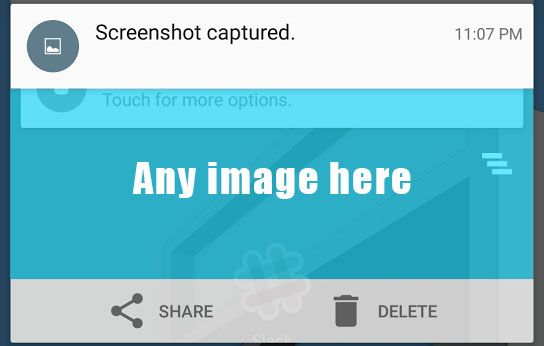
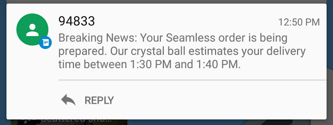
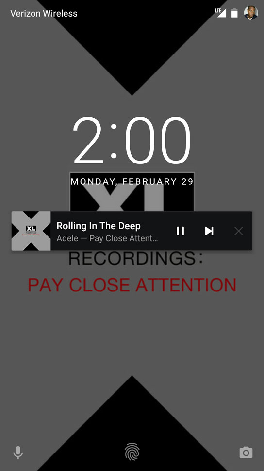

#  Notifications Homework

## Introduction

> ***Note:*** _This is a pair programming exercise._

You just learned how to show app notifications. For this homework, you are given a handful of notifications from professional apps. Split up into teams - your mission is to make these notifications, or at least try to re-create them as close as you can. You don't have to make the icons exactly the same, or have them all the same size.

## Exercise

Below, you should find 9 types of notifications. Many are very similar.

If you are on a team of two, you are expected to create **6** of the notifications. If you are on a team of three, you are expected to create all **9** notifications.

You will have to create an activity with 9 buttons. In the end, clicking on each button will show a new notification.

  
  
  
  
  
  
  
  
  

**Bonus:**

The bonus is to implement the final notification with a custom layout.

  

#### Requirements

- An activity that has 9 buttons, with each button showing the different notifications.

**Bonus:**
- For the notifications that have actions, have them open a *new* activity.
- Implement the music playing notification. The notification buttons do not have to do anything.

#### Deliverable

An Android Studio project of the described app, with at least one screen with at least 9 buttons that show different notifications.

## Additional Resources

- [Notifications Lesson](https://github.com/ga-adi/adi-nyc-cheesecake/tree/master/resources/07-android-technologies-and-services/notifications-lesson)
- [Notifications | Android Development Guide](http://developer.android.com/guide/topics/ui/notifiers/notifications.html)
