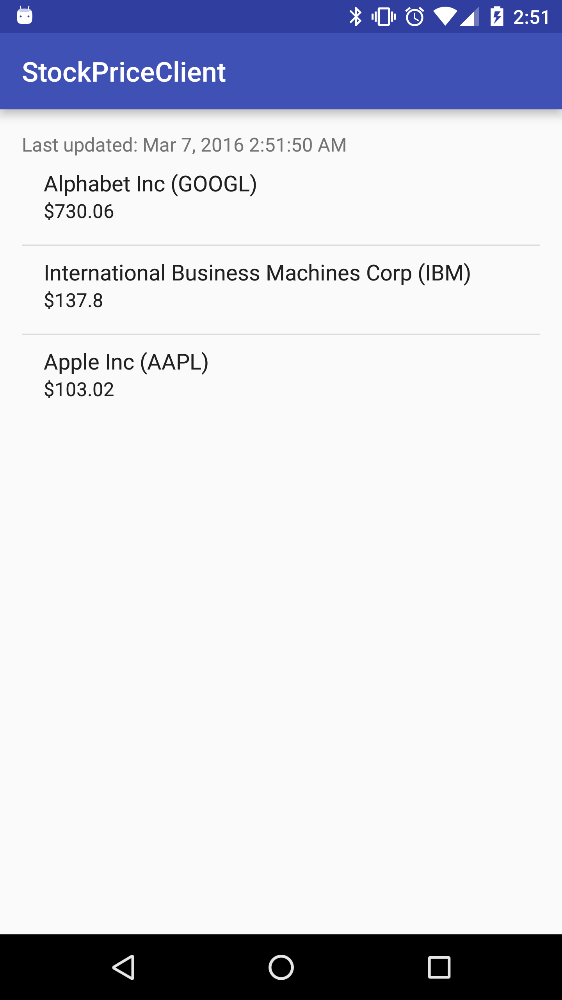

#  Stock Prices App

## Introduction

The purpose of today's lab is to provide a review of both ContentProviders and SyncAdapters. We will be working with the [Markit On Demand API](http://dev.markitondemand.com/MODApis/) once again.

This lab will follow along with the instructions given in the [Content Providers Lesson](https://github.com/ga-adi/adi-nyc-cheesecake/tree/master/resources/06-databases/content-provider-lesson) as well as the [Sync Adapters Lesson](https://github.com/ga-adi/adi-nyc-cheesecake/tree/master/resources/09-web-communication/sync-adapters-lesson). In addition to the previous lessons, we will be implementing a [Content Observer](http://developer.android.com/reference/android/database/ContentObserver.html).

Solution code has been provided for you to follow along.

## Exercise

#### Requirements

- Display current stock prices for selected companies
- Refresh prices every 60 seconds

**Bonus:**
- Add "pull down to refresh" functionality
- Add in the ability to delete stocks

#### Starter code

Line to add to Gradle to use GSON
```
compile 'com.google.code.gson:gson:2.6'
```

Code snippet to make an HTTP call (use with method below)
```java
String data ="";
        try {
            URL url = new URL("http://dev.markitondemand.com/MODApis/Api/v2/Quote/json?symbol="+symbol);
            HttpURLConnection connection = (HttpURLConnection) url.openConnection();
            connection.connect();
            InputStream inStream = connection.getInputStream();
            data = getInputData(inStream);
        } catch (Throwable e) {
            e.printStackTrace();
        }
```

Code snippet to help turn InputStream into a json string
```java
private String getInputData(InputStream inStream) throws IOException {
        StringBuilder builder = new StringBuilder();
        BufferedReader reader = new BufferedReader(new InputStreamReader(inStream));

        String data = null;

        while ((data = reader.readLine()) != null){
            builder.append(data);
        }

        reader.close();

        return builder.toString();
    }
```

#### Deliverable



## Additional Resources

- [Content Providers Lesson](https://github.com/ga-adi/adi-nyc-cheesecake/tree/master/resources/06-databases/content-provider-lesson)
- [Sync Adapters Lesson](https://github.com/ga-adi/adi-nyc-cheesecake/tree/master/resources/09-web-communication/sync-adapters-lesson)
- [Account Authenticator Stub Code](http://developer.android.com/training/sync-adapters/creating-authenticator.html)
- [Implementing a Content Observer](https://hprog99.wordpress.com/2015/01/22/how-to-use-content-observer-in-android/)
