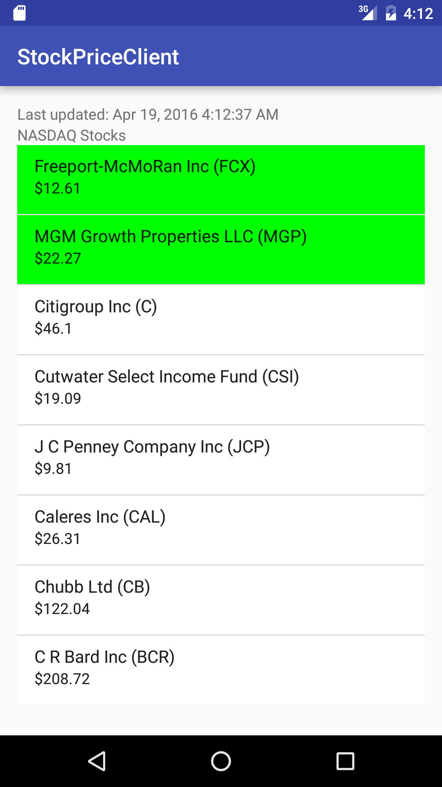

#  Sync Adapters Lab

## Introduction

> ***Note:*** _This should be done in pairs._

In this lab, you will be setting up a sync adapter to get the latest stock prices from a sample of companies on the [New York Stock Exchange](https://www.nyse.com/index) using the [MarkIt On Demand API](http://dev.markitondemand.com/MODApis/). The prices should update every minute.

In addition, you will be retrieving stocks from the Portfolio app's Content Provider that are in the NYSE and display those. Stocks that are in your portfolio should be shown differently than the other stocks (ie making the background green).

**Hint**
- Use the Company Lookup API to retrieve a listing of multiple companies

## Exercise

#### Requirements

- Display stocks of your choice from the NYSE, including the latest price
- Update the stock price every minute using a Sync adapter
- Store the data after each update in a local database
- Retrieve Portfolio stocks from the Portfolio app
- Display the Portfolio stocks in a unique manner

**Bonus:**
- Allow the user to set the sync period
- Allow the user to choose another exchange besides the NYSE (NYSE must be an option)

#### Deliverable

An app that meets the above requirements.

