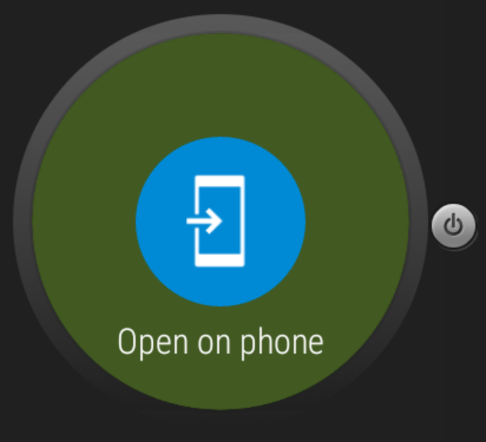

#  Android Wear

### LEARNING OBJECTIVES
*After this lesson, you will be able to:*
- Describe features of the Android Wear platform
- Write an app to run on Android Wear

### STUDENT PRE-WORK
*Before this lesson, you should already be able to:*
- Write an Android app
- Install Android Wear app through Google Play

### INSTRUCTOR PREP
*Before this lesson, instructors will need to:*
- Open and run the starter code and solution code
- Adapt exercises or talking points as needed

---

### LESSON GUIDE

| TIMING  | TYPE  | TOPIC  |
|:-:|---|---|
| 5 min  | [Opening](#opening-5-mins)  | Discuss lesson objectives |
| 10 min  | [Introduction](#introduction-android-wear-10-mins)  | Android Wear |
| 15 min  | [Guided Practice](#guided-practice-action-buttons-15-mins)  | Action Buttons |
| 10 min  | [Introduction](#introduction-wear-activities-10-mins)  | Wear Activities |
| 15 min  | [Demo](#demo-starting-a-new-android-studio-project-15-mins)  | Starting a new Android Studio Project |
| 20 min  | [Independent Practice](#independent-practice-emergency-contact-app-20-mins)  | Emergency Contact App |
| 5 min  | [Conclusion](#conclusion-5-mins)  | Review / Recap |
<a name="opening"></a>
## Opening (5 mins)

In the past few years, wearables have really taken off. They provide us with new and interesting ways to interact with our devices. This trend first picked up action with devices such as the Fitbit and Pebble, but Android Wear provides a much tighter integration with our phones and tablets also running Android. We can use it to make phone calls, text people, look at maps, control our music, and much much more. Android Wear is a large system, so we're only going to get a taste of it today.

> Check: Make sure everyone got the Android Wear emulator set up correctly. Direct them to install the Android Wear app through Google Play if they haven't.

***

<a name="introduction"></a>
## Introduction: Android Wear (10 mins)

The experience of using a smart watch is fundamentally different than using our phones. We spend less time looking at our watches, and the display is much smaller, so we need to rethink what information we show the user, and how they should interact with that information.

Let's watch a video from Google about Android Wear: [Video Link](http://developer.android.com/wear/index.html)

> Check: Students should take 3 minutes to work in groups to come up with ideas for how to extend apps you use to have a presence on a Wear device. What new features or changes would you make?

***

<a name="guided-practice"></a>
## Guided Practice: Action Buttons (15 mins)

To practice with Android wear, open up the [starter code](starter-code) (take from the Notifications lab solution code).

As we heard in the video, our normal notifications that show up on our phone automatically show on Android Wear as well.

If we scroll one screen to the right, we see the "Open on phone option":

<p align="center">
  
</p>

> Check: Ask the students to take 1 minute to discuss amongst themselves and guess what Android code will run when they press that button.

Luckily, we aren't stuck with just this option - we can add other options very easily with **Action Buttons**. Action Buttons are simply an extra button option that appear when we use the `addAction` method on our NotificationBuilder.

```java
mBuilder.addAction(R.drawable.your_drawable, "Your Text", pendingIntent);
```

That's it!

Let's try adding an action to the inbox style notification that would launch the activity and delete the emails when the button is pressed on the watch. Since we don't really have an email app, we will have a toast appear instead:

> Instructor Note: If you are having a problem getting the notification to show on the watch, use the `NotificationManagerCompat` instead of the NotificationManager

First, we need to create our Intent and PendingIntent:

> Instructor Note: Give the students 5 minutes to write the Pending Intent. Refer back to the Services lesson if they can't remember how to add actions.

```java
Intent deleteIntent = new Intent(this,SecondActivity.class);
    deleteIntent.setAction("delete");
    PendingIntent deletePendingIntent = PendingIntent.getActivity(this,(int)System.currentTimeMillis(),deleteIntent,0);
```

Then we need to add the action to the builder.

> Give the students 3 minutes to do this

```java
mBuilder.addAction(android.R.drawable.ic_delete, "Delete", deletePendingIntent);
```

Finally, we need to handle the intent when it is passed in. Again, refer to the services lesson if you need help.

> Give the students 3 minutes to do this

```java
if(getIntent().getAction() != null && getIntent().getAction().equals("delete")){
      Toast.makeText(this,"Deleting emails!",Toast.LENGTH_LONG).show();
    }
```

> Check: Ask the students to discuss how we could modify this to handle deleting actual emails (2 minutes)

***

<a name="introduction"></a>
## Introduction: Wear Activities (10 mins)

A majority of apps currently interact with the watch in the way we just did, purely with notifications. While this is easy to implement, it lacks a lot of functionality.

We can actually run normal Activities on the watch!

> Instructor Note: Show the Foursquare app.

You can actually package a wear app inside of your regular app, and it is automatically installed on a wear device when the main app is installed.

> Check: Discuss with the person next to you some advantages and disadvantages of running full apps on your device. (5 minutes)

***
<a name="demo"></a>
## Demo: Starting a new Android Studio Project (15 mins)

Before we move on the next section, we need to briefly look at how to create a new project in Android Studio that includes a Wear app. Start a new project like normal, but where you select the API level for Android, check the Wear box. Additionally, you can also choose a starting template activity for the Wear app just like a normal app.

#### Wear Activities

Let's start by opening the WearActivityExample project. You can see that both the Wear module and Mobile module show up in the project view, complete with their own java files and resource directories.

Since these are still Android Activities, we can still use our normal Android Views, like a ListView. Let's see what that looks like.

> Instructor Note: Show first activity to students

That's extremely hard to read! Luckily, Google provides us with some helpful Wear-specific Views such as the `WearableListView` to give better styling, and the `BoxInset` to make Views fit correctly, regardless of the screen shape.

> Check: What do we need to be careful of when writing apps that will run on a wear device? (discuss 2 minutes)

***

<a name="ind-practice"></a>
## Independent Practice: Emergency Contact App (20 mins)

Write a Wear app that shows your contact information in a list that is easy to read.  It should include:

 - name
 - phone
 - address
 - emergency contact name
 - emergency contact number

 The app should allow you to call the emergency contact by pressing on their name or number.

**Hint: Use Intent.ACTION_DIAL**

> Check: Were students able to create the desired deliverable(s)? Did it meet all necessary requirements / constraints?

***

<a name="conclusion"></a>
## Conclusion (5 mins)

Android Wear has some great features that make interacting with our other devices much more streamlined and efficient. Every year, Google continues to improve on the platform. While it still has some issues to figure out, it will definitely be worth keeping an eye on to see what new exciting things will be added next.

***

### ADDITIONAL RESOURCES
- [Android Wear Developer Site](http://developer.android.com/wear/index.html)
