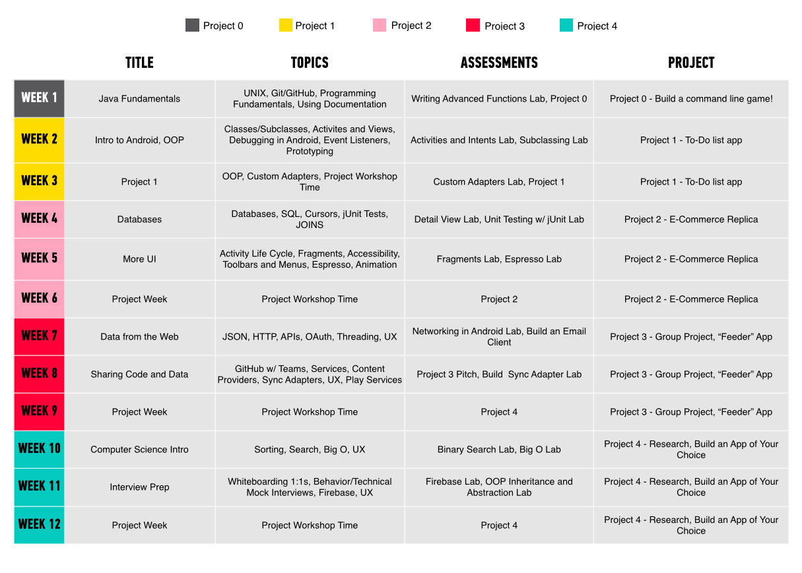

# Global Curriculum

Our curriculum contains objectives, prerequisites, suggested materials, starter and solution code, and other instructional resources, tying into the [overall standards](../../resources/syllabus/standards-and-learning-goals) for each unit. Click into each week's folder for a complete description of all the lesson planning material we provide, as well as daily materials. Anyone is welcome to submit new lessons in the appropriate folders, or suggest changes to existing ones.

> Instructors should review our [preparatory instructions](../resources/instructor-resources/instructor-prep.md) or read up on our [feedback guidelines](../resources/guidelines/project-feedback.md) for debriefing student assignments.

## Unit Breakdown

  

> Note: Flex sessions are provided as buffers for content review or additional topics that instructors may want to cover; holidays are immersive-specific and because each immersive course typically has two national holidays that fall within the course timeline, we point out where we accounted for those holidays - feel free to move those free days as needed for your particular cohort.
