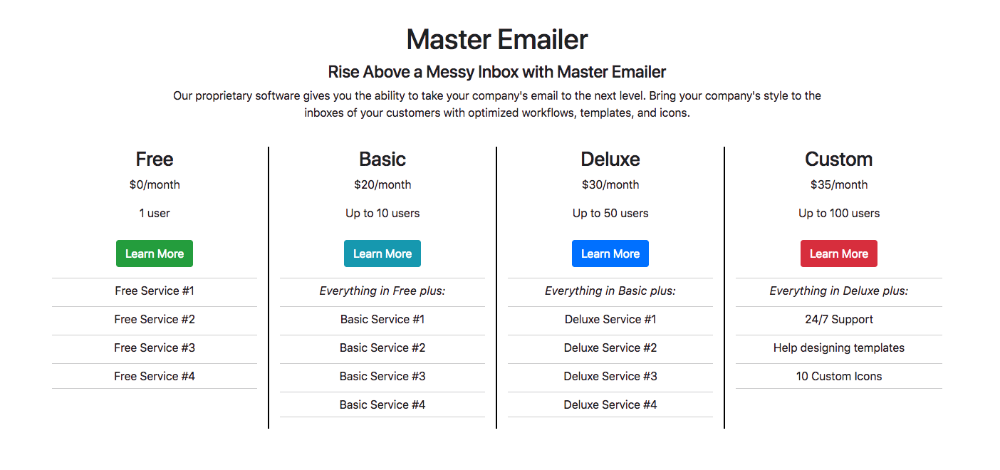
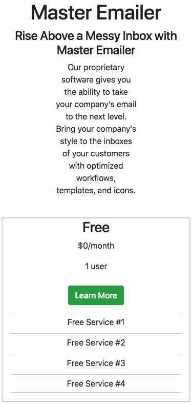

## Bootstrap Practice - Building a Pricing Page

### Description

For this exercise, you will build a pricing page for a fictional email client that has 4 pricing options. 

I have provided you with the HTML and CSS but you will need to organize the layout using Bootstrap's Grid and Grid Utility classes to recreate the layout shown in the reference images. 

**Reminder**: To open the Chrome Developer Tools, press command + option + i. To enter the mobile device preview section, press command + shift + m and then select iPhone X from the dropdown menu at the top. 

### Helpful Hints
* YOU DO NOT NEED TO EDIT THE HTML OR CSS I PROVIDED. You only need to ***replace*** the ??? you find in the code. 
* You will not need to add more than 2 classes to any element. 
* **You will only need 1 container and 2 rows**
	* This container should span the entire viewport 
* Use the media query (`@media`) at the bottom of the CSS file to help determine which column breakpoint I want you to use
* All content should be centered (think DRY)
* To "center" the pricing columns, you will need to use the "offset-" column utility 
* To center the content in the `<ul>`, you will need to find a Bootstrap utility that centers block-level content. You will only need to use 1 class on each  `<ul>`
* Each button already has the **btn** class but you need to add a second class to style the button from Bootstrap's list of [Button Components](https://getbootstrap.com/docs/4.0/components/buttons/)

### Reference Images

<h3 align="center">Desktop Layout</h3>

	

<h3 align="center">iPhoneX Layout</h3>

	

