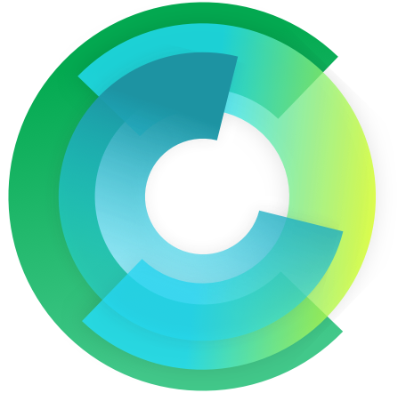
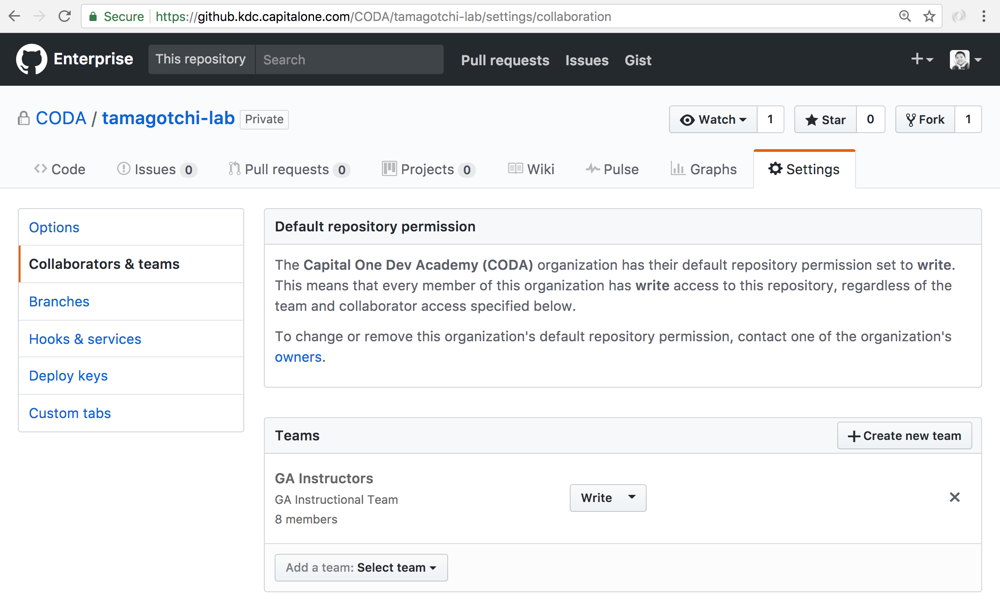
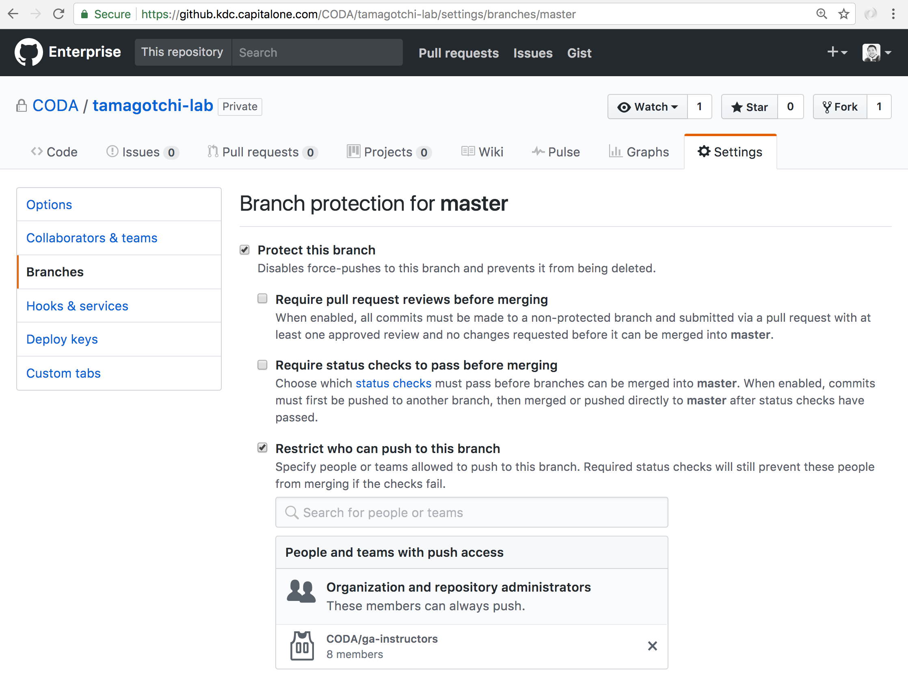
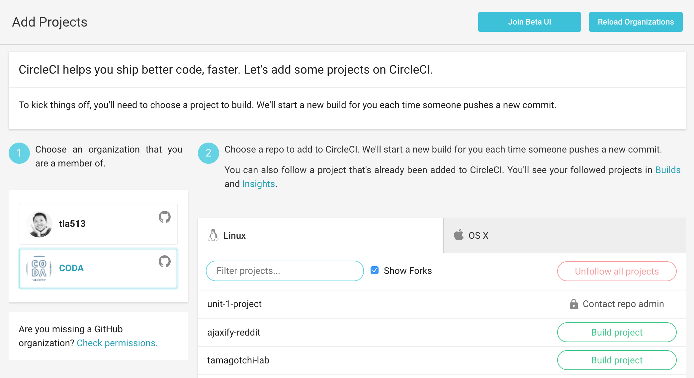
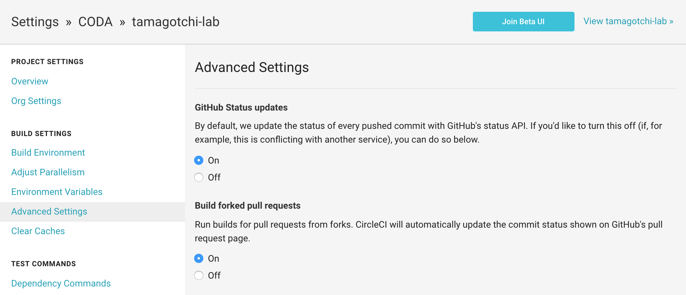
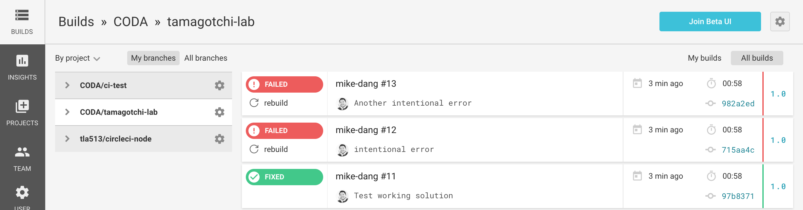
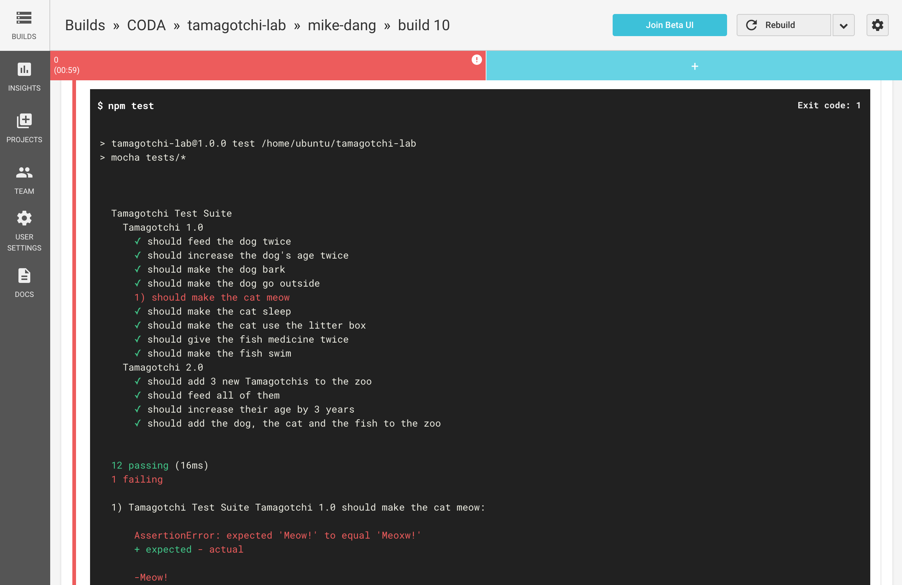
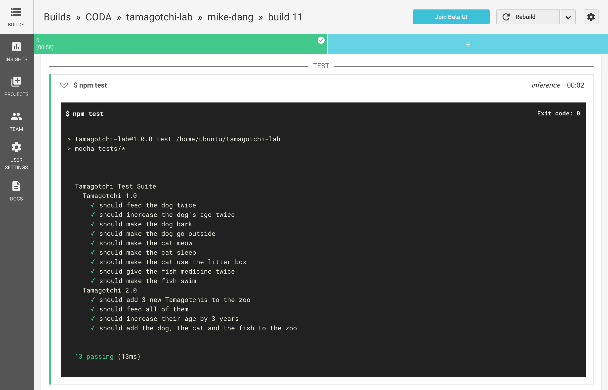

#  CircleCI Testing

This document details how to set up automated CircleCI testing with Capital One's infrastructure. 

## Why Automated Testing?

Using [CircleCI](https://circleci.com/), we can set up automated testing for any labs,  homeworks and mini-projects. 

Benefits:

- Instantly know which students did or did not submit a lab or homework.
- Instantly know how students performed on an assignment.
- Instructors and IA's get to hold on to their sanity for a little while longer. 

Capital One has their [own internal version](http://circle-poc.cloud.capitalone.com/) of CircleCI running. It's still relatively new and doesn't allow access outside the Capital One network by default. 

## Prerequisites

Read through the documentation for [CircleCI Enterprise at Capital One](https://pulse.kdc.capitalone.com/docs/DOC-159051) on Pulse. I realistically know you're not going to read it, but it's helpful. 

## Set Up the Repo

1. Create the project repo on the internal [Capital One Enterprise GitHub](https://github.kdc.capitalone.com/CODA).
2. Protect the master branch, set it to only allow instructor team members write access to keep students from pushing to master accidentally. 





## Configure CircleCI

In the root of the project, create a `circle.yml` configuration file and include the following proxy settings:

```
machine:
  environment:
    https_proxy: http://proxy.kdc.capitalone.com:8099
    HTTP_PROXY: http://proxy.kdc.capitalone.com:8099
    HTTPS_PROXY: http://proxy.kdc.capitalone.com:8099
    REGION: us-east-1
    http_proxy: http://proxy.kdc.capitalone.com:8099
    STAGE: $CIRCLE_BRANCH
```

## Set Up the Test Runner

1. Install Mocha and Chai and save for local development (e.g. `npm install mocha chai --save-dev`)
2. Create a **tests** folder at the root of the project.
3. Modify **package.json** to include what to run for `npm test`: 

```js
{
  "name": "tamagotchi-lab",
  "version": "1.0.0",
  "description": "",
  "directories": {
    "test": "tests"
  },
  "devDependencies": {
    "chai": "^4.1.0",
    "mocha": "^3.4.2"
  },
  "scripts": {
    "test": "mocha tests/*"
  },
  "repository": {
    "type": "git",
    "url": "git@github.kdc.capitalone.com:tla513/tamagotchi-lab.git"
  },
  "keywords": [],
  "author": "",
  "license": "ISC"
}
```

## Write the Tests

Create one or more test files inside the **tests** directory. Your directory structure should look something like this now: 

```
.
|____.git
|____circle.yml
|____node_modules
|____package.json
|____README.md
|____solution
  |____es5
    |____tamagotchi.js
  |____es6
    |____tamagotchi.js
|____starter
  |____tamagotchi.js
|____tests
  |____tamagachi-tests.js
```

Below are some example tests for the Tamagotchi Lab. 

```js
var chai = require('chai');
var assert = chai.assert;

var Tamagotchi = require('../starter/tamagotchi').tamagotchi;
var Dog = require('../starter/tamagotchi').dog;
var Cat = require('../starter/tamagotchi').cat;
var Fish = require('../starter/tamagotchi').fish;
var Zoo = require('../starter/tamagotchi').zoo;

describe('Tamagotchi Test Suite', function() {
  var tamagotchi, dog, cat, fish, zoo;

  before(function() {
    tamagotchi = new Tamagotchi();
    dog = new Dog();
    cat = new Cat();
    fish = new Fish();
    zoo = new Zoo();
  });

  describe('Tamagotchi 1.0', function() {
    it('should feed the dog twice', function() {
      assert.equal(dog.feed(), "That was yummy!");
      assert.equal(dog.feed(), "No thanks, I'm full.");
    });

    it('should increase the dog\'s age twice', function() {
      assert.equal(dog.increaseAge(), 'Happy Birthday to me! I am 1 years old!');
      assert.equal(dog.increaseAge(), 'Happy Birthday to me! I am 2 years old!');
    });

    it('should make the dog bark', function() {
      assert.equal(dog.bark(), 'ruff ruff');
    });

    it('should make the dog go outside', function() {
      assert.equal(dog.goOutside(), 'I own that tree now!');
    });

    it('should make the cat meow', function() {
      assert.equal(cat.meow(), 'Meow!');
    });

    it('should make the cat sleep', function() {
      assert.equal(cat.sleep(), 'zzzzzzz');
    });

    it('should make the cat use the litter box', function() {
      assert.equal(cat.useLitterBox(), 'Buried treasure!');
    });

    it('should give the fish medicine twice', function() {
      assert.equal(fish.medicate(), 'No thanks, I feel fine.');
      assert.equal(fish.medicate(), 'I feel much better!');
    });

    it('should make the fish swim', function() {
      assert.equal(fish.swim(), 'Just keep swimming...');
    });
  });

  describe('Tamagotchi 2.0', function() {
    it('should add 3 new Tamagotchis to the zoo', function() {
      zoo.createTamagotchi();
      zoo.createTamagotchi();
      zoo.createTamagotchi();

      assert.equal(zoo.animals.length, 3);
    });

    it('should feed all of them', function() {
      zoo.feed();

      zoo.animals.forEach(function(t) {
        assert.isFalse(t.hungry);
      });
    });

    it('should increase their age by 3 years', function() {
      zoo.increaseAges();
      zoo.increaseAges();
      zoo.increaseAges();

      zoo.animals.forEach(function(t) {
        assert.equal(t.age, 3);
      });
    });

    it('should add the dog, the cat and the fish to the zoo', function() {
      zoo.addTamagotchi(dog);
      zoo.addTamagotchi(cat);
      zoo.addTamagotchi(fish);

      assert.equal(zoo.animals.length, 6);
    });
  });
});

```

## Add the Project to CircleCI

### Start Watching the Repo

1. Go to the [Capital One CircleCI dashboard](http://circle-poc.cloud.capitalone.com/).
2. On the main menu, click [Projects](http://circle-poc.cloud.capitalone.com/add-projects) to add a new project.
3. Choose the organization with the project, in our case it's CODA. Find the project in the list and click on **Build project**.



### Allow Forked Pull Requests to Trigger a Build

By default, forked pull requests will not trigger a build in CircleCI. We don't want students committing directly to our repository, so we need to enable it. 

1. In the project details page, click the gear icon to go to settings for the project. 
2. Under **Build Settings**, click on **Advanced Settings**.
3. Under **Build forked pull requests**, select **On**. 



## Student Workflow 

1. Students fork the original repo and then clone from the newly forked version. 
2. Every student creates a branch with their name and switches to it to do their work (`git checkout -b mike-dang`)
3. Run `npm install` to get the Mocha and Chai packages.
4. While developing, periodically test code by running `npm test` to ensure code is passing tests before submitting the work.
5. When ready to submit, add a remote reference to the original repo that was forked (`git remote add coda git@github.kdc.capitalone.com:CODA/tamagotchi-lab.git`)
6. Push the **remote** branch to the original repo which will automatically trigger a CircleCI build (`git push coda mike-dang`)

## Viewing the Results

On our side we'll quickly be able to see who submitted their lab/homework and also see who  completed it successfully!







## Resources 

- [Lab Example - Tamagotchi](https://github.kdc.capitalone.com/CODA/tamagotchi-lab)
- [CircleCI](https://circleci.com/)
- [CircleCI PoC Update](https://pulse.kdc.capitalone.com/docs/DOC-187241)


