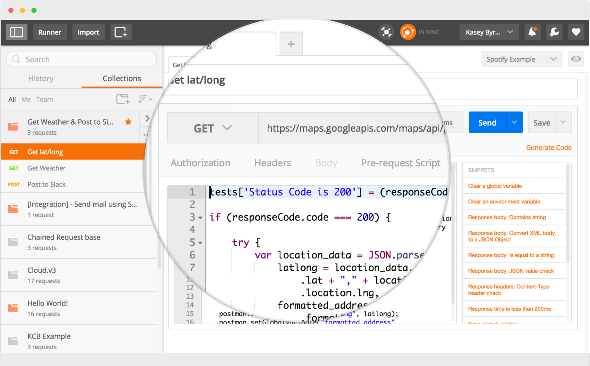

#  Overview of Web Application Security (90 min)

| Timing | Type | Topic |
| --- | --- | --- |
| 5 min | [Opening](#opening) | Web Application Security Risks |
| 15 min | [Instruction](#history) | The History of Cyber Security, In a Nutshell |
| 20 min | [Instruction](#overview) | Web Application Security |
| 20 min | [Instruction](#owasp-top-ten) | OWASP Top Ten |
| 20 min | [Instruction](#tools) | Tools of the Trade |
| 10 min | [Conclusion](#conclusion) | Conclusion |

### LEARNING OBJECTIVES
**After this lesson, you will:**  

- Become familiar with the concept of cyber security.
- Understand the origin and evolution of security topics.
- Know the risks that a web application faces.
- Have a toolset available to test for and help defend against web attacks.

---

## Web Application Security Risks (5 min)

There are many paths, or vectors, that attackers can potentially use throughout your application to impact your business or organization in a harmful manner. Each vector is a risk that may or may not require immediate attention.

It is a web of interconnected and disconnected services, libraries and code snippets that make up your application and together, they make finding the risk vectors either easy to find, or extremely difficult. And once found, exploitation is also not guaranteed or the harm that could be caused may be of no consequence, or could completely destroy your organization's reputation. Determining your application's overall "risk" is a critical point of security which should be done before the application is developed, when it's ready to go live, and routinely as per standard maintenance.

To understand not only the risks involved in web application security, it's important that one not only be familiar with the types of risks that apply to your application, but also understand how an attacker can approach finding them. Additionally, knowing the history of Cyber Security, even outside of the realm of "web application" security, is important to get a grasp on how technology and the attack surface has changed (and remained the same) throughout the years.

---

## The History of Cyber Security, In a Nutshell (15 min)

To be able to properly defend an application, you should not only be familiar with the risks posed to your application but also realize that there can and will be future threats to it as well. This concept is best demonstrated with a recap of the history of Cyber Security.

#### The Beginning

Computer networks weren't even necessary to the original wave of hackers, known as "phreakers." Phreaking was a popular technique used in the early days of phone networks, more or less it was the act of hacking phone lines to make free calls. Sending special signals over the lines, physically breaking into phone boxes, anything that could let you call another country without paying a dime was on the list.

Shortly after, before the full introduction of the world wide web, there was ARPANET, a packet-switched network which laid the foundation for what we know of as the internet today. The system wasn't around for long before reports were disclosed that individuals were hacking the system, piggybacking on connections. Some hacks were seen as small pranks and others as full government espionage. For example, the first computer worm, a self-replicating program, named Creeper was created for ARPANET as a simple prank.

#### Spread the Love

Once the internet began getting more and more popular, so did the creation of worms and viruses. As far back as 1989 we see the first, most famous, computer worm - the Morris worm. Its purpose was to gauge the size of the internet, possibly a completely academic endeavour. However, its execution was far to aggressive and the result actually almost took down the entire internet

In the 1990s, viruses exploded and a very definitive change was visible. They were no longer simple pranks or academic tests - they took a malicious turn. Famous viruses that made headlines such as the Melissa virus, ILOVEYOU or the CodeRed virus were enough to shut down mail servers and had the potential of taking Microsoft's web presence offline. There were even reports of viruses causing internet outages, among other services.

#### Online Everything

While viruses and worms are still a threat, the threat landscape itself has shifted a bit over the years. As the internet hit its first prime well over a decade ago, personal information such as credit cards began making their way into more and more databases. It didn't take long before these were targeted, obtained and sold to the highest bidder. SQL Injection or server compromises have, and still lead, to massive amounts of data stolen each year.

Drive-by attacks that malicious, or compromised websites, host can also lead to the spread of viruses, trojans or other malicious payloads to the unlucky web browsing user.

Several topics in this category fall into the realm of "Web Application Security", which is what this overview, and the entire course, will focus on.

#### Smartphones and more

Attackers have found an easier way to obtain credit card information, directly from the cards themselves. Credit Card Skimmers have been known to have been setup directly on ATMs, gas pumps and even in retail stores right on the machine you would swipe your card on. Each swipe sends the card's info, and your pin if you type it in, back to the attacker for their benefit.

And with the explosion of smartphones over the past 10 or so years, attacks have began focusing on these mini personal computers that are always on, and always with you. Malicious messages that can crash, or take over, your phone. Rogue applications that can eavesdrop on your calls or exfiltrate your photos, the list goes on.

The ubiquitous "internet of things", the idea that a house can also be "smart", is also the world's largest distributed-denial-of-service vector to date. Everything from light switches to thermostats to refrigerators and toasters, more and more items are being connected "to the web". They also have so little in terms of security that attackers have found it trivial to connect to them and leverage them to do things to their bidding - often unbeknownst to the owner.

---

## Web Application Security (20 min)

Over the past almost two decades, longer even, the internet business has exploded. E-commerce websites are a way to access goods 24/7 when retail stores are long closed, banks offer full services without the need to stand in line, and online profiles place your personal or business's reputation in a very public light. With that small list of benefits the web offers, there should be no doubt that criminals lurk in every corner.

#### State of the Web

Websites today are indistinguishable from those of yesteryear. With each passing year, new technologies are introduced to aid in the development and experience of websites. We went from HTML without `<table>` tags to HTML5 that has native-to-the-browser video playing capabilities. In between, there have been significant advances in JavaScript, plugins such as Flash and Shockwave, server shifts from Apache to nginx to node.js and back again, and we don't even need to touch on the different databases available to use.

With the vast field of new tools available and their incredible capabilities, the risks that they introduce has only grown over time.

Websites are not only vast in the technologies, but as mentioned above they also have a wide range of applications including, but not limited to:

- Banking
- Forums
- Gambling
- Shopping
- Social Networking
- Web Mail

With so many possibilities, a hacker need only know a small number of possible types of vulnerabilities to wage a huge war against the web whereas a security engineer, e.g. a defender of the web, must have a far greater knowledge base and skillset.

#### Arbitrary Input

The most fundamental problem that web applications face, similar to most other distributed applications, is that they allow the user to submit arbitrary input to the server-side application. This input is either used in some way server-side, sent back to the client, or ignored entirely. In all cases, **both** the server-side and client-side pieces of the web application must assume that the input is malicious.

A breakdown of how user input manifests itself:

- Data sent between the client and server such as headers, cookies or the request body can be manipulated by users, easily bypassing any client-side security controls.
- Requests to the application can be sent in any sequence, repeatedly or even not at all, contrary to how the application expects. It cannot assume that users will follow the workflow simply because that's how it's presented client-side.
- Web browsers are not the only way to access web applications. There are dozens of tools available, _including_ extensions for web browsers, that aid an attacker in finding and exploiting problems.

Keeping these topics in mind can help you develop a more secure application by thinking of possible attack vectors _before_ you create your application, but also aid in the detection and prevention of issues after it's complete as well.

---

## OWASP Top Ten (20 min)

[OWASP](https://www.owasp.org), the Open Web Application Security Project, is an online resource that drives visibility and evolution in the safety and security of the world's software. It has proved to be invaluable to security researchers everywhere by providing information, meetings and even event information.

In 2013, OWASP published a [Top Ten](https://www.owasp.org/index.php/Category:OWASP_Top_Ten_Project#OWASP_Top_10_for_2013) list of web application risks. In 2017, they set out to update it to meet today's threat vectors. Per the [**OWASP Top Ten**](https://www.owasp.org/index.php/Category:OWASP_Top_Ten_Project), the current 2017 list of top-ten risks for web applications can be broken down as:

- **Injection**
    - Injection flaws, such as SQL, OS, XXE, and LDAP injection occur when untrusted data is sent to an interpreter as part of a command or query. The attacker's hostile data can trick the interpreter into executing unintended commands or accessing data without proper authorization.
- **Broken Authentication and Session Management**
    - Application functions related to authentication and session management are often implemented incorrectly, allowing attackers to compromise passwords, keys or session tokens, or to exploit other implementation flaws to assume other users' identities (temporarily or permanently).
- **Cross-Site Scripting (XSS)**
    - XSS flaws occur whenever an application includes untrusted data in a new web page without proper validation or escaping, or updates an existing web page with user supplied data using a browser API that can create JavaScript. XSS allows attackers to execute scripts in the victim's browser which can hijack user sessions, deface web sites, or redirect the user to malicious sites.
- **Broken Access Control**
    - Restrictions on what authenticated users are allowed to do are not properly enforced. Attackers can exploit these flaws to access unauthorized functionality and/or data, such as access other users' accounts, view sensitive files, modify other users' data, change access rights, etc.
- **Security Misconfiguration**
    - Good security requires having a secure configuration defined and deployed for the application, frameworks, application server, web server, database server, platform, etc. Secure settings should be defined, implemented, and maintained, as defaults are often insecure. Additionally, software should be kept up to date.
- **Sensitive Data Exposure**
    - Many web applications and APIs do not properly protect sensitive data, such as financial, healthcare, and PII. Attackers may steal or modify such weakly protected data to conduct credit card fraud, identity theft, or other crimes. Sensitive data deserves extra protection such as encryption at rest or in transit, as well as special precautions when exchanged with the browser.
- **Insufficient Attack Protection**
    - The majority of applications and APIs lack the basic ability to detect, prevent, and respond to both manual and automated attacks. Attack protection goes far beyond basic input validation and involves automatically detecting, logging, responding, and even blocking exploit attempts. Application owners also need to be able to deploy patches quickly to protect against attacks.
- **Cross-Site Request Forgery (CSRF)**
    - A CSRF attack forces a logged-on victim's browser to send a forged HTTP request, including the victim's session cookie and any other automatically included authentication information, to a vulnerable web application. Such an attack allows the attacker to force a victim's browser to generate requests the vulnerable application thinks are legitimate requests from the victim.
- **Using Components with Known Vulnerabilities**
    - Components, such as libraries, frameworks, and other software modules, run with the same privileges as the application. If a vulnerable component is exploited, such an attack can facilitate serious data loss or server takeover. Applications and APIs using components with known vulnerabilities may undermine application defenses and enable various attacks and impacts.
- **Underprotected APIs**
    - Modern applications often involve rich client applications and APIs, such as JavaScript in the browser and mobile apps, that connect to an API of some kind (SOAP/XML, REST/JSON, RPC, GWT, etc.). These APIs are often unprotected and contain numerous vulnerabilities.

Throughout the Cyber Security lessons, we will touch on most of the above either at a glance, or in great detail.

---

## Tools of the Trade (20 min)

There are so many tools and resources available, it's hard to pick the best. Often the same tools and attacker uses a developer uses too which makes sense - what better way to test your application for vulnerabilities than by using vulnerability-discovery tools!

When attempting to secure, or find weaknesses in, a web application, the following tools and resources will come in handy. Please note, there are dozens and dozens more tools available. Some aim directly to finding vulnerabilities in your application, others aim to defend against them. Also note the region you're located in, some or all of these tools may be forbidden.

- **Browsers**
    Several years ago, relying on browser extensions and plugins was essential to perform any type of manipulation. While that's still true today for a few types, most modern browsers have built in tools that allow you to view all of the headers of a request and response, manipulate cookies, modify the page's DOM and even execution flow. Things that you you may still need plugins for though:

    * Modifying Headers
        - Headers are tricky, but these extensions help you modify either request or response headers, or both right from your browser
        - **CDN Headers & Cookies**, **EditThisCookie**, **ModHeader**, **Modify Headers for Google Chrome**

    * Automated Injection Testing
        - There are several tools which automate the scanning and discovery of common injection points
        - **CSRF Discoverer**, **HackBar**, **Hack Tab Web Security Tests**, **XssSniper**

    * Defense
        - Additional extensions exist to help protect yourself against attacks such as SSL snooping or CSRF
        - **CSRF Defense**, **Hotspot Shield VPN Free Proxy**, **HTTPS Everywhere**, **Proxy SwitchySharp**, **uMatrix**, **Vanilla Cookie Manager**

- **Intercepting Proxies**
    If you want full control over the request and response between the client and server, unhindered by your browser, you'll need a proxy. No, you don't need to setup a server to use, there are several very robust intercepting proxy tools built for this exact purpose!

    * Burp Suite
        - https://portswigger.net/burp/
        - Offers both a free and professional version thats featuresets differ between simple request/response modification to full automated analysis

        

    * Charles Proxy
        - https://www.charlesproxy.com/
        - > Charles is an HTTP proxy / HTTP monitor / Reverse Proxy that enables a developer to view all of the HTTP and SSL / HTTPS traffic between their machine and the Internet. This includes requests, responses and the HTTP headers (which contain the cookies and caching information).

        

    * Postman
        - https://www.getpostman.com
        - > A powerful GUI platform to make your API development faster & easier, from building API requests through testing, documentation and sharing.

        

- nmap
    * https://nmap.org/
    * nmap is a Network Security Scanner, often called simply a "port scanner".
    * Why would this be included as a tool for Web Application security? Easy - your server is part of your application! Finding open ports or verbose information that your server supplies is a risk factor that an attacker can use when targeting your application. Knowing these details first are quite important.

- OWASP
    - https://www.owasp.org/
    - > the free and open software security community

    OWASP offers a full community of information and resources to help both security researchers and practitioners alike to discover new and old vulnerabilities, risks and management techniques.

- Wireshark
    - https://www.wireshark.org/
    - > Wireshark is the world’s foremost and widely-used network protocol analyzer. It lets you see what’s happening on your network at a microscopic level and is the de facto (and often de jure) standard across many commercial and non-profit enterprises, government agencies, and educational institutions.

    Need to see the requests going back-and-forth between the server on a more granular level? Need to verify that SSL is in fact encrypting the data, or maybe you want even _more_ access than an intercepting proxy gives you? Wireshark's the tool for you!

- **Eratocode**
    - https://pulse.kdc.capitalone.com/docs/DOC-176707
    - https://appsec.kdc.capitalone.com/
    
    Capital One's Eratocode is an application security repository where engineers can obtain security scanning tools that can be integrated into your applications through the Continuous Integration and Continuous Deployment cycles. Currently, these tools implement static analysis for their tests - dynamic analysis is in the works!
    
---

## Conclusion (10 min)

Security has grown significantly over the years, from simply connecting to a network to completely taking over servers. Worms that spread between systems now also spread between users on a single website ("XSS Worm"), and data is the name of the game when it comes to target #1.

Questions:
* At what point in app development or maintenance would you use an intercepting proxy? Why?
* If your website uses JavaScript to verify that a text comment doesn't contain invalid characters, will that protect it from attacks such as XSS? If so, how? If not, why not?
* Of the OWASP Top 10, which attack vectors would you classify as "Front End", and which as "Back End"?

Thought question, with no _one_ answer:
* What do you think the next decade holds for us in the way of security risks?
