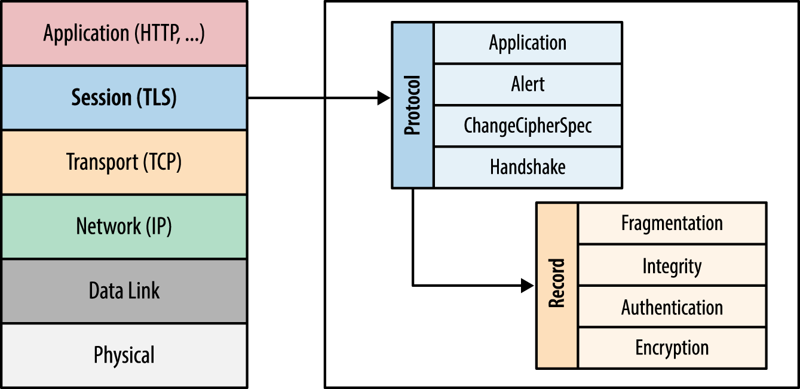
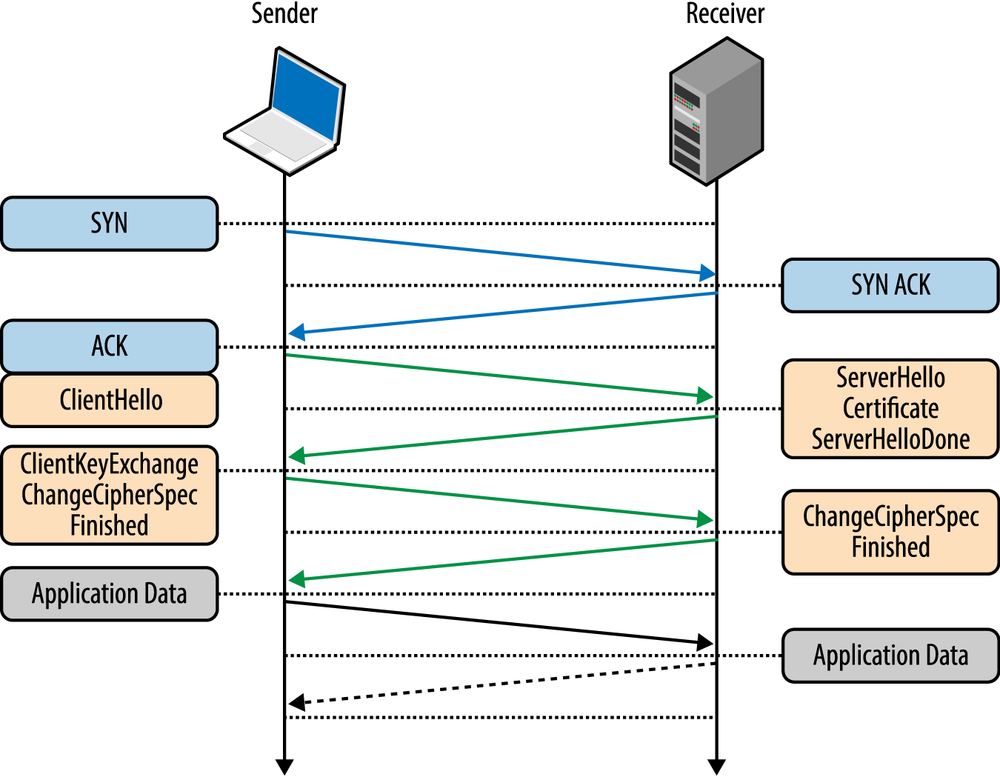

#  Encryption via SSL/TLS (50 min)

| Timing | Type | Topic |
| --- | --- | --- |
| 15 min | [Introduction](#introduction) | SSL / TLS |
| 10 min | [Instruction](#implementation) | Implementation Overview |
| 5 min | [Demo](#demo-node) | SSL in Your App |
| 5 min | [Conclusion](#conclusion) | Conclusion |

# Encryption via SSL/TLS

### LEARNING OBJECTIVES
*After this lesson, students will be able to:*

- Understand how SSL is used on the web
- Understand the components of SSL Certificates
- Be able to generate a Self-Signed Certificate
- Setup a Node + Express project to use SSL

---
<a name="introduction"></a>
## Intro to New Concepts: SSL / TLS (15 min)

#### What is SSL?

Secure Sockets Layer (SSL) is a standard security technology that's used to establish an encrypted connection between a server and a client. Most frequently, this can be seen with a web server (Apache, nginx, IIS, etc) and a browser such as Chrome or Firefox. Another example would be a mail server and a desktop mail client, such as Inbox or Outlook.

By using SSL, we create a way to securely transmit sensitive information like login credentials, credit card numbers or other personal information. Without it, your data is sent over the internet in plaintext and anyone monitoring the network can see it and use it. With it, they only see garbled (e.g. encrypted) data.

It's important to note that SSL itself is not the encryption algorithm, it is a security _protocol_. Protocols describe how algorithms should be used. In this case, the SSL protocol determines the different encryption variables used for both the connection and the data being sent.

As technology has changed over the years, so has SSL. It has seen several new versions, the latest and more recommended version is referred to as "TLS".

#### What is TLS:

[Transport Layer Security](https://en.wikipedia.org/wiki/Transport_Layer_Security) (TLS) is a security protocol that is, just like SSL, used to establish an encrypted connection between two endpoints. It's the most widely deployed security protocol that's in use today, and can be seen in everything from web browsers to VPNs to instant messaging and even Voice-Over-IP communications.

A common misperception between SSL and TLS is that they are two completely separate technologies. In fact, TLS evolved _from_ SSL and has successfully superseded it. When the [Internet Engineering Task Force (IETF)](https://www.ietf.org/) standardized SSL, it renamed the protocol to Transport Layer Security. TLS, to-date, is a more secure security protocol as it supports more cipher suites (e.g. algorithms) than SSL can, and subsequently can generate more efficient key material (e.g. the variables used in the encryption algorithms). With all said, they _are_ two separate versions and therefore are different; however, you'll still hear the terms (SSL and TLS) used interchangeably.

#### Encryption, Authentication and Integrity

The TLS protocol is designed to, when properly implemented, offer encryption, authentication and data integrity.

[Encryption](https://en.wikipedia.org/wiki/Encryption) is a mechanism to obfuscate the data being sent between endpoints.  It turns plaintext into ciphertext (data that can only be read if decrypted). Until the 1970s, it was only used by the government and the military, but in a report done in 2007, 70% of companies used it.  I'm sure that number is much higher today.

[Authentication](https://en.wikipedia.org/wiki/Authentication) is a mechanism to verify and validate any given identification data/confirm their identity (such as a TLS certificate, see below)- which allows access to confidential data or systems. There are 3 types of authentication. The first type is proof of identity by a verifiable person- like in the [web of trust](https://en.wikipedia.org/wiki/Web_of_trust)- the binding between a public key and its owner.  The second type of authentication is when you compare the attributes of the object to what is known about its origin- like Matt Bomer's character in White Collar or the Antique Roadshow.  It is also often seen in currency as certain marks, texture or designs are difficult to fake.  The third type relies on documentation or external records.  A user might be given access to a secured site based on their credentials.

The factors of authentication- something the user knows, something the user has and something the user is.  You'll see this in [Two-factor authentication (2FA)](https://en.wikipedia.org/wiki/Two-factor_authentication).

<details>

<summary>What is the difference between authorization and authentication?</summary>

Authentication means that you are who you say you are.

Authorization is the process of verifying that you are allowed to do what you are asking to do.

</details>

<br />

[Data integrity](https://en.wikipedia.org/wiki/Data_integrity) is a mechanism to detect the tampering and/or forgery of data.  It is the accuracy and consistency of data over its entire life cycle.

TLS uses [public key cryptography](https://en.wikipedia.org/wiki/Public-key_cryptography) (also known as asymmetrical cryptogrpahy) to establish which type of encryption algorithm to use for the connection. Public key cryptography allows the protocol to securely transmit the encryption key(s) between endpoints. To do so, at least one endpoint will require a certificate (both a private certificate, and a public certificate).

During the [TLS handshake](https://en.wikipedia.org/wiki/Transport_Layer_Security#TLS_handshake), the negotiation of the connection, a [Certificate Authority](https://en.wikipedia.org/wiki/Certificate_authority) (which acts as a trusted third party) can be used to authenticate that the endpoint matches the given certificate. This can be done for both the server and the client, depending upon the application type.

Once the connection is established, TLS provides it's own data message framing mechanism that allows it to sign each message with a checksum. It does so via the [MAC algorithm](https://en.wikipedia.org/wiki/Message_authentication_code), a one-way cryptographic hash function, that is then verified by the recipient for each message to ensure data integrity and authenticity.

---
<a name="implementation"></a>
## Implementation Overview (15 min)

SSL and TLS are implemented on the Application Layer of the networking stack:



This enables applications to securely communicate with other endpoints without a third party observer, including ones on the computer establishing the connection, having access to the data being sent.

<br />

The [TLS handshake](https://en.wikipedia.org/wiki/Transport_Layer_Security#TLS_handshake), as seen below, is a negotiation between a client and server (e.g. "sender and receiver"). During this negotiation, the details of the connection are established, such as which encryption cipher to use, whether to send a session id and the encryption key(s) to be used with it.



The sender (Alice), sends the receiver a synchronize message (SYN). The receiver (Bob) replies with a synchronize-acknowledgement (SYN-ACK). Alice replies with an acknowledgement (ACK).  The synchronize message acts as a service request from one server to another.  The acknowledgement messages return to the requesting server to let it know that the message was received.

This negotiation itself is also protected by encryption, in this case public key cryptography. One or both sides of the connection have keys (a public key and private key) to establish secure communications with the other and to authenticate that the other side is really who they say they are.

When browsing the web, clients (e.g. web browsers) authenticate the web servers they connect to. Your browser makes a TLS request to a web server, denoted via `https://` (note the **s**) in the URL. We refer to this simply as HTTPS in conversation. In doing so, the server will provide its public key and via public key cryptography, the connection will then be negotiated (more below).

#### Certificates & Negotiation

To repeat from above, when a web browser wants to initiate an HTTPS session it asks for the server's certificate. This is checked to ensure that it was issued by a trusted authority, that it covers the URL being requested, and that it hasn't expired or been revoked (this stage is where most browser warnings are generated, because this is where the web browser decides whether or not it's going to accept the certificate as valid).


A certificate, as mentioned above, includes the server's public key as well as a list of other identification pieces, such as the company's name and even location details.

The client then chooses a cryptographic item called a pre-master secret, encrypts it with the server's public key, and transmits it to the server. Because of the nature of public key cryptography, something encrypted with a public key can only be decrypted with the corresponding private key. The web server's ability to decrypt the pre-master secret verifies that it's in possession of the correct private key, and is therefore the entity described in the certificate.

For testing purposes, or sometimes for internal tools, it's possible to generate what is called a "self signed certification." These certificates are called only when the same entity that identifies the certificate is the one that signs it. If this is encountered on the web for general websites, they should not be trusted. For internal tools or personal testing purposes though, they should be safe.

In practice, when making a legitimate service or setting up a website, you should avoid the use of self-signed certificates and opt for a "proper" one instead. These often cost money, but if they're for tools for your company, generally they will spot the bill. For Capital One, for instance, there is a [defined procedure](https://pulse.kdc.capitalone.com/docs/DOC-70917) for requesting certificates. Externally, there are many services that provide this as well such as [digicert](https://www.digicert.com) and [Let's Encrypt](https://letsencrypt.org/) (a free alternative).

---
<a name="demo"></a>
## A Reverse Proxy (5 min)

#### What is a reverse proxy?

> A reverse proxy is a type of [proxy server](https://en.wikipedia.org/wiki/Proxy_server) that retrieves resources on behalf of a client from one or more servers...  It is internal-facing proxy used as a front-end to control and protect access to a server on a private network.


Large web servers often use reverse proxy technologies to provide SSL termination at the proxy layer and non-SSL communications within the data centers themselves. The tradeoff is faster in-network communications while still providing secure client communications.

Additionally, reverse proxies are also used to provide [load balancing](https://en.wikipedia.org/wiki/Load_balancing_(computing)).

Capital One uses reverse proxies to make sure that your requests are secure before you are allowed to see them.

You can read more about reverse proxies in the [nginx](#nginx) section below.

<a name="#part-1"></a>

## In the meantime...

#### Part 1: Generating a self-signed certificate

In this demo, we're going to show how to setup a node.js application (with Express.js) that accepts incoming SSL connections.

The following command will generate a private key and a certificate:

From your desktop, run:

```
$ openssl req -x509 -sha256 -nodes -newkey rsa:2048 -keyout server.key -out cert.pem -days 90
```

When you execute the above, it will prompt you for several things such as your location and the "common name". The common name is the hostname, such as `example.com` or `www.capitalone.com`, that your certificate will be used for.

The `-nodes` option, "no DES", specifies that the private key is not to require a passphrase. This is important when using a certificate in a web server, otherwise you will need to manually type the key's passphrase every time you start or restart the server.

The two output files this produces:

- **server.key** is your private key. Protect this with your life and do not share it.
- **cert.pem** is your certificate. The whole world can see this one =]

Place both of these files in the following directory: `/usr/local/node.js/conf`

<!-- ```
/usr/local/nginx/conf/
```

#### Part 2: Basic Reverse Proxy

Web servers such as nginx come with the tools and features to easily setup proxy configurations.

In your nginx `server` config, add the following:

```
server {
    # ... existing settings

    location / {
        # reverse proxy settings
        proxy_pass http://localhost:8000; # the listening web server
    }
}
```

That's it. After restarting nginx, requests coming in will be proxied through to `localhost` on port `8000`. Both values can easily be changed to match your settings, and the hostname can also be substituted with an IP address if needed (such as `127.0.0.1`, for instance).

Note: if it's not already configured, you may also be required to add `include proxy_params;` to the definition above.

#### Part 3: Adding SSL to the Reverse Proxy

As mentioned above, a reverse proxy is often used for SSL termination, meaning that requests _from_ the client are over HTTPS, whereas the proxy to your application are over HTTP.

This is accomplished by modifying the above config in the following way:

```
server {
    # ... existing settings

    # ssl config
    listen 443 default_server;

    ssl on;
    ssl_certificate /usr/local/nginx/conf/cert.pem;
    ssl_certificate_key /usr/local/nginx/conf/server.key;
    ssl_session_cache shared:SSL:10m;

    location / {
        # reverse proxy settings
        proxy_pass http://localhost:8000; # the listening web server
        proxy_set_header Host $host;

        # rewrite HTTP redirects to HTTPS
        proxy_redirect http:// https://;
    }
}
```

That was a bit more than one or two lines, but the above will give your entire reverse proxy SSL support while still maintaining a non-SSL connection to your internal applications.

Restart nginx on your server, and then visit it in a browser to see it in action!

> :information_source: For more information on configuring SSL in nginx, please see the [**SSL in nginx**](#nginx) section below.

* Why is the `proxy_redirect` important?
* What is the significance of the `listen 443` line?

---
<a name="demo-node"></a>
## Demo: SSL in Your App (5 min)

While reverse proxies are great for large, high trafficked web servers, sometimes it's simpler to have your application itself manage its own SSL.

In this demo, we're going to show how to setup a node.js application (with Express.js) that accepts incoming SSL connections.

#### Part 4: Generating a self-signed certificate

Follow the steps in [**Part 1: Generating a self-signed certificate**](#part-1) above, except place the files in the following directory instead: -->

```
open /usr/local
ls
mkdir node.js
cd node.js
mkdir conf
cd conf
```

Copy + paste the server.key + the cert.pem inside of the `conf` folder.

#### Part 5: Basic Web App

``` bash
mkdir security-starter
cd into it.
npm init -y
npm install express --save
touch app.js
```

<!-- Add the following contents:

```
var express = require('express');
var app = express();
var http = require('http');

app.get('/', (request, response) => {
  response.send('hi, :wave: =]');
});

http.createServer(options, app).listen(80, (err) => {
  if (err) {
    return console.log('error', err);
  }
});
```

This is a basic web server with a single route. To start the server, run the following:

```
$ sudo node app.js
```

Then visit `http://localhost/` in a web browser.  

Note: we're not over SSL yet! -->

#### Part 6: Setting up SSL

Add the following contents to your `app.js`:

```
var express = require('express');
var app = express();
var https = require('https');
var fs = require('fs');

var options = {
  key: fs.readFileSync('/usr/local/node.js/conf/server.key'),
  cert: fs.readFileSync('/usr/local/node.js/conf/cert.pem')
};

app.get('/', (request, response) => {
  response.send('hi, :wave: =]');
});

https.createServer(options, app).listen(443, (err) => {
  if (err) {
    return console.log('error', err);
  }
});
```

```
$ sudo node app.js
provide it with your admin password
open https://localhost/
```

Here you'll notice, that we didn't really change much. Instead of `require('http')`, it's now `require('https')`. Then, instead of our server listening on port `80`, it's now `443`.

What we did add here was add the `options` object which includes the contents of our private key and certificate. These are passed into the server when it's launching.

You may also notice that our application will _only_ accept HTTPS connections as we've removed non-HTTPS support. Technically, your application could support _both_ if you placed the previous example's `http.createServer()` block in this one as well - but if you're going to make the effort to support HTTPS, it's a much better idea to _only_ support HTTPS.

* Why is it beneficial to support only HTTPS opposed to both HTTP and HTTPS?

---
<a name="conclusion"></a>
## Conclusion (5 min)

SSL and TLS are beautiful things, they are what give us what little assurance we have to know that something done online can be secure\*.

* Terminology:
    - Secure Sockets Layer (SSL)
    - Transport Security Layer (TLS)
    - Public Key Cryptography
    - Certificate
    - Certificate Authority
    - Encryption
    - Authentication
    - Data Integrity
    - Reverse Proxy
    - Self Signed Certificate
* Questions to ponder...
    - How would an application such as VPN implement SSL?
    - Why would a web server use a proxy to terminate client SSL opposed to using SSL internally too?
    - If there is a vulnerability in the SSL/TLS protocol, who's at risk?

\* Like any technology, even SSL + TLS have had their share of security vulnerabilities. For more information, reference things such as [Heartbleed](http://heartbleed.com/) and [POODLE](https://www.openssl.org/~bodo/ssl-poodle.pdf) among many others.

<br />

---

## Further Study- nginx with a self signed certificate

<a name="nginx"></a>

Once you create a self signed certificate, place the server.key + cert.pem of these files in the following directory: `/usr/local/nginx/conf/`

### Basic Reverse Proxy

Web servers such as nginx come with the tools and features to easily setup proxy configurations.

In your nginx `server` config, add the following:

```
server {
    # ... existing settings

    location / {
        # reverse proxy settings
        proxy_pass http://localhost:8000; # the listening web server
    }
}
```

That's it. After restarting nginx, requests coming in will be proxied through to `localhost` on port `8000`. Both values can easily be changed to match your settings, and the hostname can also be substituted with an IP address if needed (such as `127.0.0.1`, for instance).

Note: if it's not already configured, you may also be required to add `include proxy_params;` to the definition above.

#### Part 3: Adding SSL to the Reverse Proxy

As mentioned above, a reverse proxy is often used for SSL termination, meaning that requests _from_ the client are over HTTPS, whereas the proxy to your application are over HTTP.

This is accomplished by modifying the above config in the following way:

```
server {
    # ... existing settings

    # ssl config
    listen 443 default_server;

    ssl on;
    ssl_certificate /usr/local/nginx/conf/cert.pem;
    ssl_certificate_key /usr/local/nginx/conf/server.key;
    ssl_session_cache shared:SSL:10m;

    location / {
        # reverse proxy settings
        proxy_pass http://localhost:8000; # the listening web server
        proxy_set_header Host $host;

        # rewrite HTTP redirects to HTTPS
        proxy_redirect http:// https://;
    }
}
```

That was a bit more than one or two lines, but the above will give your entire reverse proxy SSL support while still maintaining a non-SSL connection to your internal applications.

Restart nginx on your server, and then visit it in a browser to see it in action!

> :information_source: For more information on configuring SSL in nginx, please see the [**SSL in nginx**](#nginx) section below.

## SSL in nginx

If you're standing up an actual server and not just a single application, it's critical that you have things secured properly from the beginning. SSL is no different, but there are actually more options when configuring it in nginx than simply pointing to the certificates.

Remember [up above](#implementation) when we discussed the TLS Handshake? During the handshake, the cipher and encryption algorithm is chosen - this choice comes from a list supplied by both the client _and_ server. If you, the server, provide weak options, then it's very possible the client will use them - so let's not even give them the choice.

First things first - _update_ OpenSSL and keep it updated. Monitor the [mailing lists](https://www.openssl.org/community/mailinglists.html) for updates and patch when a security concern comes out. This is important to stop current attacks such as [BEAST](https://en.wikipedia.org/wiki/Transport_Layer_Security#BEAST_attack), [CRIME](https://en.wikipedia.org/wiki/CRIME_%28security_exploit%29), [FREAK](https://en.wikipedia.org/wiki/FREAK), [Heartbleed](http://heartbleed.com/), [Logjam](https://weakdh.org/) and several others.

Okay, now the fun part - actual configuration choices. As mentioned above, TLS is not "different" from SSL - it's just a later version, but a much more secure later version. SSL v1, v2 and even v3 are considered insecure, so we only want to use TLS; using nginx's `ssl_protocols` config:

    ssl_protocols TLSv1 TLSv1.1 TLSv1.2;

The best part about public key cryptography is that, if the underlying exchange is properly chosen, even if the private key is compromised _past_ traffic cannot be decrypted. The discussion of this, referred to as [Perfect Forward Secrecy](https://en.wikipedia.org/wiki/Forward_secrecy), is out of scope of today's lesson, but you're highly encouraged to research the topic more on your own.  However, by using nginx's `ssl_ciphers` option we can specify the list of ciphers that allow for Perfect Foward Secrecy in the exchange:

    ssl_ciphers 'EECDH+AESGCM:EDH+AESGCM:AES256+EECDH:AES256+EDH';

It's important to note here that the order of the ciphers dictates their priority, so always put the most secure _first_.

There are many other configuration options for nginx; To learn more about this, we recommend that you check out the official [Configuring HTTPS Servers](http://nginx.org/en/docs/http/configuring_https_servers.html) documentation. Other recommended topics are [HTTP Strict Transport Security (HSTS)](https://developer.mozilla.org/en-US/docs/Web/HTTP/Headers/Strict-Transport-Security) and [HTTP Public Key Pinning (HPKP)](https://developer.mozilla.org/en-US/docs/Web/HTTP/Public_Key_Pinning).

While reverse proxies are great for large, high trafficked web servers, sometimes it's simpler to have your application manage its own SSL.

<br />

### Hungry for More?

#### References
- [What is an SSL Certificate and How Does it Work?](https://www.digicert.com/ssl/)
- [Transport Layer Security (TLS)](https://hpbn.co/transport-layer-security-tls/)
- [Encryption](https://en.wikipedia.org/wiki/Encryption)
- [Authentication](https://en.wikipedia.org/wiki/Authentication)
- [Data integrity](https://en.wikipedia.org/wiki/Data_integrity)
- [Public Key Cryptography](https://en.wikipedia.org/wiki/Public-key_cryptography)
- [Certificate Authority](https://en.wikipedia.org/wiki/Certificate_authority)
- [MAC Algorithm](https://en.wikipedia.org/wiki/Message_authentication_code)
- [Reverse Proxy](https://en.wikipedia.org/wiki/Reverse_proxy)
- [Load Balancing](https://en.wikipedia.org/wiki/Load_balancing_(computing))

#### Readings
- [SSL Cryptography](https://www.digicert.com/ssl-cryptography.htm)
- [Transport Layer Security (TLS)](https://hpbn.co/transport-layer-security-tls/)
- [Proxy Server](https://en.wikipedia.org/wiki/Proxy_server)
- [Capital One - Requesting a Digital Certificate](https://pulse.kdc.capitalone.com/docs/DOC-70917)
- [nginx Reverse Proxy](https://www.nginx.com/resources/admin-guide/reverse-proxy/)
- [Server Side TLS](https://wiki.mozilla.org/Security/Server_Side_TLS)
- [Heartbleed](http://heartbleed.com/)
- [POODLE](https://www.openssl.org/~bodo/ssl-poodle.pdf)
- [Forward Secrecy](https://en.wikipedia.org/wiki/Forward_secrecy)
- [Configuring HTTPS Servers](http://nginx.org/en/docs/http/configuring_https_servers.html)
- [Strong SSL Security On nginx](https://raymii.org/s/tutorials/Strong_SSL_Security_On_nginx.html)
- [HTTP Strict Transport Security (HSTS)](https://developer.mozilla.org/en-US/docs/Web/HTTP/Headers/Strict-Transport-Security)
- [HTTP Public Key Pinning (HPKP)](https://developer.mozilla.org/en-US/docs/Web/HTTP/Public_Key_Pinning)
