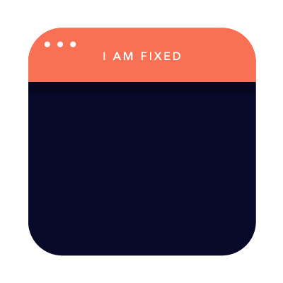

[](https://generalassemb.ly/education/web-development-immersive)

# HTML & CSS Layout

## Prerequisites

- Basic knowledge of HTML
- Basic knowledge of CSS

## Objectives

By the end of this talk, developers should be able to:

- Explain the box model.
- Contrast `px`, `%`, and `em` measurements.
- Use Flexbox to create rich layouts.
- Use media queries to change CSS rules based on screen size.
- Explain the difference between 'static' and 'fixed' positioning.

## Preparation

1. Fork and clone this repository.
    [FAQ](https://git.generalassemb.ly/ga-wdi-boston/meta/wiki/ForkAndClone)
1. Create three new branches, `training`, `flex-site`, and `lookalike-site`.
1. Install dependencies with `npm install`.

## CSS Layout

So far, we've mostly talked about using CSS for styling our page - adding
colors, fonts, etc. In this talk, we'll be examining how CSS can be used to
control a webpage's layout.

Back in the day, web layout was achieved with just HTML, let's look at an
example of that, just for fun:
[# 90's CSS Example](https://www.spacejam.com/1996/)

Today, layout is specified with CSS. It's easier, more modular, and it looks
much better too!

## Box Model

In addition to setting an element's `height` and `width`, elements have three
other properties that explicitly control spacing:

1. 'Border' sets a perimeter around an element. In addition to specifying a
   color and a particular type of border, you can also specify a thickness.
2. 'Margin' specifies spacing between the outside of an element's border and any
   adjacent elements.
3. 'Padding' specifies spacing between the inside of an element's border and the
   contents of that element (which includes `height` and `width`!)

Together, these attributes form _the box model_, a way of describing the space
taken up by an element.


Every one of these attributes, including `height` and `width`, can be specified
in the following terms:

- `px` : fixed number of pixels.
- `%`  : size is relative to element that contains it ("parent"). As a value of
  `height`, `%` is relative to the parent's `height`, but for every other
  dimension, `%` is relative to the parent's `width` value.
- `em` : ties dimensions to *font size* - one `em` is the width of the letter
  'm'. For all dimensions except `font-size`, `em` will refer to the font size
  of the element; as a value for `font-size`, `em` refers to the font size of
  the *parent*.

### Demo: Box Sizing

The Box Model explains how CSS `width` and `height` is Calculated.

By default, the size of an element's height or width can be calculated with:

> `width` = `width` + `padding` + `border`
> and
> `height` = `height` + `padding` + `border`

This can be problematic when trying to create a layout or position things logically on the page, as it does not include the margin of the element.

To fix this, we can set the element's CSS [`box-sizing`](https://developer.mozilla.org/en-US/docs/Web/CSS/box-sizing) property to `border-box`
instead of the default `content-box`.

> In the developer tools' "Elements" tab, you can find all of the styles applied
> to elements on the page, including an interactive display of the box model
> and a listing of all calculated values, such as `height` and `width`. We
> can use these tools to help us understand how our elements are being rendered.

## Positioning

All of the rules that we'll learn about CSS layout are based on one paradigm of
positioning, called 'static' positioning. Static positioning is the default
positioning model for elements. They are displayed in the page where they
rendered as part of normal HTML flow.


Though there are others, the most significant type of positioning besides
`static` positioning is `fixed` positioning. `fixed` positioning defines the
position of an element with respect to the _view window_, essentially 'fixing'
its position on the screen. Fixed positioning is frequently used in parallax
scrolling, or for holding a navigation bar at the top/side/bottom of the screen.



### Code-Along: Static and Fixed Positioning

Open the `positioning.html` and `app/styles/positioning.css` files in your
text editor, and follow along as we play around with static and fixed
positioning.

### Lab: Relative and Absolute Positioning

[Research](https://developer.mozilla.org/en-US/docs/Web/CSS/position) relative
and absolute positioning in CSS. How are they used? A helpful reference for
understanding is [this CSS-tricks blog post](https://css-tricks.com/absolute-positioning-inside-relative-positioning/).

## Flexbox

Block elements, as a rule, always stack vertically - never side by side. Each
block element effectively has a 'new-line' built into it, forcing the next piece
of content down.

This can be circumvented using a system called [Flexbox](https://css-tricks.com/snippets/css/a-guide-to-flexbox/). Officially called the
"Flexible Box Model", Flexbox is a relatively recent addition to CSS that makes
creating rich, responsive layouts much easier. Flexbox allows us to specify
whether the children of a given element should be arranged horizontally or
vertically, how they should be positioned along that axis, and how much space
they should take up.

### The Container and the Children

A Flexbox layout therefore consists of two layers: the container element, which
we give the CSS properties `display: flex;` and `flex-direction: <direction>;`,
and the child elements, which will be arranged in that direction.

The most common choices for that `<direction>` will either be `row` or `column`.

If we choose, `flex-direction: row;` on the container element, its children will
be layed out like this:


If we choose `flex-direction: column;` we'll get this instead:


There's also a concept of a "cross axis", which is the axis perpendicular to
the one chosen by `flex-direction`:


We can use various other Flexbox properties to determine how elements are
positioned along both axes.

Children of a `display: flex` container element can be given different
properties to affect how they display within the container.

### Lab: Flex Properties

Let's take a look at some actual code to get a sense of the different layouts we
can achieve with various flex properties.

In the tree view in Atom, find `flex.html`, right click, and select "Open in Browser". You can also right-click on the file from your file explorer
and open with your browser application.

Once open, resize your browser so that it takes up about half the screen,
and resize Atom to take up the other half. In Atom, open up two panels, one with
`flex.html` and another with `assets/styles/flex.css`.

Compare the CSS properties with the resulting layout for each element. Discuss
in your teams what you think each property does and how it achieves the layout
that you see here. Use [the MDN Flexbox property reference](https://developer.mozilla.org/en-US/docs/Glossary/Flexbox) as a guide.

### Code Along: Basic Layout

Working on our `training` branch, let's use the example HTML code to
demonstrate Flexbox.

First, we'll spin up our server using `grunt serve`, and see how things look
currently.
There's nothing there! We'll need to create this layout from scratch.

We've definitely got some work to do. Here's what we want our site to look
like:


To get there, we'll need to use some of the flex properties we just researched,
as well as our knowledge of the box model. Once we've achieved the desired
layout, lets commit our changes.

Add your markup between the `<body>` tags in `index.html`, and your styling in
`assets/styles/styles.css`.

## Media Queries

Using `%` dimensions allows you, to a certain degree, to account for a variety
of screen sizes by scaling up linearly. Sometimes, however, you don't want to
scale linearly; instead you want size to be fixed sometimes, to scale linearly
at others, or even to disappear entirely at a certain size.

Fortunately, CSS has a tool called a **media query** designed for this specific
use case.

```css
@media (max-width: 700px) {
  div {
    width: 300px;
    height: 300px;
  }
}
```

A media query acts a little like an `if` statement for your CSS; it will
_selectively hide or show_ the CSS it contains based on whether or not the
condition in the query comes back as `true`.

Media queries can often be thought of as blocks of CSS that override existing
styles from your stylesheet (although they can do much more than this). They,
therefore, are always placed at the bottom of your stylesheet.

Here are some properties that can be used to build media queries:

- min-width: CSS is visible at all screen widths **larger** than the given value.
- max-width: CSS is visible at all screen widths **smaller** than the given value.
- min/max-resolution: CSS is visible above/below a given resolution.

### Code-along: Media Queries

Let's modify the `flex.css` file so that our `.column` class elements
are hidden on screens smaller than 800px wide.

## Lab: Putting It All Together

Working with your squads on the `lookalike-site` branch, use
[index.html](index.html) to apply what you've learned about so far about CSS
positioning and layout.

Try to implement at least one example of:

- `fixed` element
- `flex` layout
- media query breakpoint

Choose one of the following sites to create your lookalike site, focusing on
the layout (**not content**):

- [Boston Globe](http://bostonglobe.com)
- [Wikipedia](http://en.wikipedia.org/wiki/Main_Page)
- [Reddit](http://reddit.com)

### Hints

1. Don't be afraid to 'cheat' by looking at the source code of the site you're
   mimicking.
2. Keep your sites simple - don't add details like text, images, etc. Use
   colors to help distinguish sections, nothing more.
3. When drawing boxes, try not to draw them flush against each other - adding a
   little bit of space helps to make it clear when boxes should be nested inside
   other boxes.
4. Don't got more than 4 levels deep in your nesting.
5. Bright colors for your divs help to make layout mistakes obvious.

## Additional Resources

- [Getting Started With CSS Layout](https://www.smashingmagazine.com/2018/05/guide-css-layout/)
- [4 Types of CSS Positioning, Explained](http://www.nigelbuckner.com/downloads/handouts/web/pos-explained/index.html)
- [flexplorer](http://bennettfeely.com/flexplorer/)
- [Interactive CSS Intro](https://rupl.github.io/unfold/)
- [Interactive Box Model Demo](http://guyroutledge.github.io/box-model/)
- [CSS Floats](https://css-tricks.com/all-about-floats/)
- [Visual Guide to Flexbox](https://scotch.io/tutorials/a-visual-guide-to-css3-flexbox-properties)
- [Flexbox Cheatsheet](https://yoksel.github.io/flex-cheatsheet/)
- [Flexbox Demos](https://demos.scotch.io/visual-guide-to-css3-flexbox-flexbox-playground/demos/)
- [Media Queries for Standard Devices](https://css-tricks.com/snippets/css/media-queries-for-standard-devices/)

## [License](LICENSE)

1. All content is licensed under a CC­BY­NC­SA 4.0 license.
1. All software code is licensed under GNU GPLv3. For commercial use or
   alternative licensing, please contact legal@ga.co.
