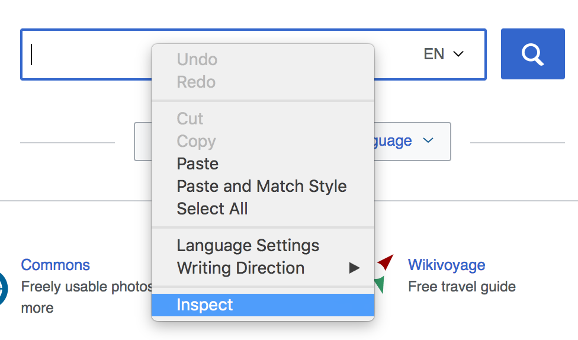
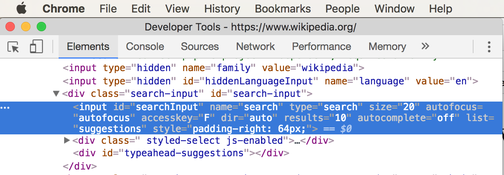

# Intro to Selenium

**Selenium** is a library that allows us to interact programmatically with the
browser. It's like being able to write programs for a remote control. We'll be
able to write code that loads webpages, finds HTML elements, enters text, clicks
on things and verifies the state of elements on the page. **Selenium** is very
useful for writing UI tests, like making sure a login form displays error
messages properly when users enter incorrect information.

## Objectives

* Install Selenium
* Control browsers remotely with JavaScript using Selenium
  * Load webpages
  * Find HTML elements on the page
  * Click on HTML elements
  * Insert text to HTML input elements
  * Verify text content of HTML elements

# Installing Selenium

**Selenium** is a library that allows us to interact with many different web
browsers. **Selenium** relies on custom drivers being installed for different
web browsers. In order to get **Selenium** working with Chrome, we will need to
first install `chromedriver` (globally so we never have to install it again)
and then install the **Selenium** library itself.

Install `chromedriver` with npm and save it as a global module.

```
npm install -g chromedriver
```

Make a new directory called `selenium-intro` and cd into it.
Install **selenium** as a dev dependency in the directory. The `--save-dev`
flag means that this module will only be installed when you're
developing on your local machine. This saves us from installing it on a
production server.

```
mkdir selenium-intro
cd selenium-intro
npm init -y
npm install --save-dev selenium-webdriver
```

We're installed and ready to go! Let's write some code that uses **Selenium**.

# Using Selenium

**Selenium** requires importing a few things and a bit of configuration before
it's up and ready to go. Each time you use **Selenium** make sure to require
the `selenium-webdriver`, grab the `By` and `until` shortcut methods off the
module, and build a `driver` variable specifically configured for Chrome.

Once you've got it imported and configured you can use the `driver` to load
web pages, find HTML elements, enter text and click on things in the page.

This example loads `http://wikipedia.org`, locates the search box on the
home page, enters "javascript" in the input field, submits the search form and allows the browser
to be taken to the JavaScript article.

Create a file called `search-wikipedia.js` in your selenium-intro folder, and
run it with `node search-wikipedia.js`. You should see a Chrome window pop up,
load Wikipedia, enter JavaScript into the search bar, and go to the JavaScript wikipedia page. It's
like watching a ghost in your machine!

**search-wikipedia.js**
```js
var webdriver = require('selenium-webdriver'),
  By = webdriver.By,
  until = webdriver.until;

var driver = new webdriver.Builder()
  .forBrowser('chrome')
  .build();

driver.get('https://www.wikipedia.org/');

driver.findElement(By.id('searchInput')).sendKeys('javascript');
driver.findElement(By.id('search-form')).submit();
```

# Targeting HTML Elements

In order for **Selenium** to interact with websites it needs to know what HTML
elements we're interacting with. **Selenium** finds elements in the DOM very
much like we do in Vanilla JavaScript or jQuery: we use the DOM. **Selenium**
provides us with the `By` property which defines how we look elements up.

We're able to get access to HTML elements in many ways. Refer to the
[Static Functions](http://seleniumhq.github.io/selenium/docs/api/javascript/module/selenium-webdriver/index_exports_By.html)
attached to the `By` class to see what's all available.

Here are some of the most popular ways elements can be found/used. Each of these
can be passed into the `driver.findElement()` function.

* `By.id( id )` - the most common.
* `By.className( name )` - Not very common. Remember that classes appear many times,
  so looking for something by a class name is ambiguous. It likely returns
  multiple results.
* `By.css( selector )` - use a complex CSS selector like `#left-nav .section button`
* `By.name( name )` - find an element with a name attribute like `<input name="email" />`
* `By.linkText( text )` - find a link that has text matching *exactly*.
* `By.partialLinkText( text )` - find a link with text that's a partial match.

Here's a useful PDF cheatsheet showing you how to do common things with Selenium:

[Download Selenium Cheatsheet](assets/selenium-cheatsheet.pdf)

## Know Thy Website

If you want to use **Selenium** to interact with a website effectively then
you'll need to know the underlying structure of the website. It's easy for us
as humans to tell something, "click on the login button." **Selenium** lacks
our human understanding. **Selenium** requires us to be ultra-specific and
use the DOM when we tell it to find something on the page.

Before you use **Selenium** to interact with a webpage you'll need to perform
some initial manual reconnaissance. Load the webpage and use your developer
tools to find out the `id` of an element you want to interact with. See if
form inputs have `name` attributes you can search for. If there's a link that you
want to click on, you can take note of the link text and use the `By.linkText()`
and `By.partialLinkText()` methods to obtain a reference to it.

The Wikipedia code we used earlier relied on prior knowledge. Someone else did
the initial manual reconnaissance. The wikipedia **Selenium** code relied on
knowing the id of the search box and the id of the search form. If you're lucky,
then every thing on a website that you want to interact with will have a clean,
sensible, easy-to-find id or another attribute that you can use.

The Chrome Developer Tools are extremely helpful when you're trying to find out
if something on the page has a useful easy-to-find id. Simply right click on
what you want to interact with and choose `Inspect`. Look at the HTML in the
`Elements` panel and see if thing has an id on it!

* Use Chrome to open the wikipedia homepage at http://wikipedia.org
* Right click on the main search box
* Select "Inspect"
* The Chrome Developer Tools will open
* Make sure you're on the "Elements" tab and see HTML
* Notice an `<input>` element is highlighted.
* Look to see what the `id` is on the `<input>` element
* The `id` should be "searchInput"





Now that we know the id of the search box. We can use Selenium to grab a reference
to the search by using `By.id("searchInput")` and type text into it.

If something doesn't have an id or another easy thing `By` is designed to search
for, then you'll end up having to write code that manually sifts through
possibilities to find what you're looking for.

If you're designing a website that you want to use **Selenium** with later, then
do yourself a favor and add handy ids, names and other identifiers to the element with which you
want to interact.

# Exercise: Log into Facebook with Selenium

Make a new file called `facebook-login.js` and write your own **Selenium**
code that logs into your Facebook account. You'll need to find a reference
to three things:

* The HTML element where you input your username
* The HTML element where you input your password
* The HTML element that you click to log in

Use what you know about using `Right Click -> Inspect` and the Chrome Developer
Tools to find IDs.

If you feel weird about typing your Facebook password into a file and saving it
then use this boilerplate code. Run `npm install --save prompt`. The [prompt](https://www.npmjs.com/package/prompt)
module will send you prompts in the console, where users can type in their username and password.

<details>
 <summary>facebook-login.js</summary>

```js
var webdriver = require('selenium-webdriver'),
  By = webdriver.By,
  until = webdriver.until;

var driver = new webdriver.Builder()
  .forBrowser('chrome')
  .build();

driver.get('http://facebook.com');

// require 'prompt' to avoid anyone mistakingly committing their facebook
// username or password.
var prompt = require('prompt');
var schema = [
  {name: 'email'},
  {name: 'password', hidden: true}
];
prompt.get(schema, function (err, result) {
  var email = result.email;
  var password = result.password;
  console.log("Email:", email);
  console.log("Your Selenium interactions here...");
});
```

</details>

<br />

# Lab Time

Here's several labs where you can practice your Selenium skills! They start easy
and get harder!  The only one that you are required to do is the selenium clicking lab. 

### The Selenium Clicking Lab

##### Please fork + clone these repos.  Git checkout and work on a dev branch.

* [Clicking Lab](https://github.kdc.capitalone.com/CODA3/selenium-clicking-lab)
* [Temperature Conversion Lab](https://github.kdc.capitalone.com/CODA3/selenium-temperature-conversion-lab)

### Requirements

##### When you are finished, create a pull request with:
- Your name in the title of the PR
- Make sure to work on a dev branch
- Push your dev branch to github
- Merge your dev branch into master
- Push your master to github

# Options after your pull request

### Security Test

If you have not finished your security test, finish that.

### Dojo Time

You are welcome to get together/work with your dojo team.

### More Selenium Practice

##### If you want more practice, here are 2 more selenium labs:

* [Test Driven Development Password Form Lab](https://github.kdc.capitalone.com/CODA3/selenium-password-form-lab)
* [Tic-Tac-Toe Lab](https://github.kdc.capitalone.com/CODA3/selenium-tic-tac-toe)
