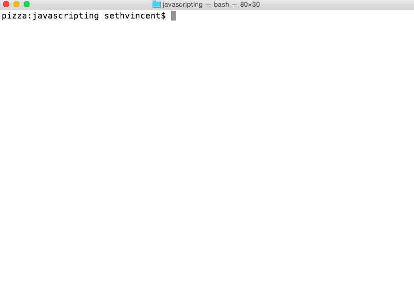

# JAVASCRIPTING

Cloned from: https://nodeschool.io/
Modified by GA.

> Learn JavaScript by adventuring around in the terminal.

> _Looking for more interactive tutorials like this? Go to [nodeschool.io](http://nodeschool.io)._

### Install dependencies with `npm`

Open your terminal and run this command:

```
npm install
```

## Run the workshop

Open your terminal and run the following command:

```
node bin/javascripting
```

You'll see the menu:


Navigate the menu with the up & down arrow keys.

Choose a challenge by hitting enter.

### Take a look at this gif that shows the first challenge:



In the gif I'm using the command line editor `nano` ([here are some basic usage tips for nano](https://github.com/sethvincent/dev-envs-book/blob/master/chapters/05-editors.md#nano)).

You can use any editor you like.

[atom](http://atom.io) or [brackets](http://brackets.io/) are both good options.

## Need help with an exercise?

Open an issue in the nodeschool/discussions repo: https://github.com/nodeschool/discussions

Include the name `javascripting` and the name of the challenge you're working on in the title of the issue.

## Get Involved

Code contributions welcome! Please check our [documentation on contributing](https://github.com/workshopper/javascripting/blob/master/CONTRIBUTING.md) to get started.

## TODOS:

Add these challenges:

- "OBJECT KEYS"
- "FUNCTION RETURN VALUES"
- "THIS"

## License

MIT
