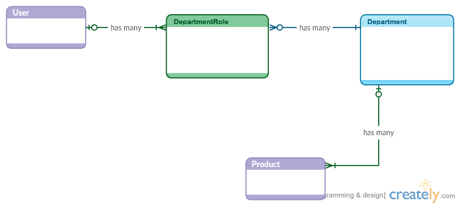

## Objectives
* Start a project using a proven methodology.
* Create User Stores for a project.
* Create a Domain Model, conceptual model, for a project.
* Implement the project. 

## Morts Hardware 

As we've seen, we are trying to create a software project that will help manage hardware stores. So far in this project we've only created a set of files that represent some business knowledge, inventory and employee data. Now we want to move on to create software to help manage these kinds of stores.

So, the **domain** that we're working in is the "Hardware Store Management" **domain**. We're going to need to learn quite a bit about this domain.

**The set of steps we are going to follow are:** 

1. Find User Roles or Personas.
2. Find Epics.
3. Break Epics into User Stories.
4. Create Design  
	4.1 Domain or Data Models.  
	4.2 Create Wireframes and Flow Diagrams.  
	4.3 Create "other" Design Artifacts.  
5. Add User Stories to a Iteration.
	1. Determine Dependencies between Stories. 
	2. Determine Priority.

5. Write Software guided by User Stories.

## Writing Stories

#### Find Roles

From the conversations we'd had with the ower of the store, and some of the work we've already done. We can see that we have a couple of roles that users can fall into. We know that the the store owner actively manages the store, so his role would be the **Store Manager**. 

The store consists of a number of departments where each department has a **Department Manager** and in these departments we have a number of employees that are **Associates**.

**Roles:**  

* **Store Manager**
* **Dept Manager**
* **Associate**

I'm going to, at least initially, assume that the Store Manager can do everything the Dept Manager can and that the Dept Manager can do everything that the Associate can. 

#### Find Personas (Optional)

A **Persona will be a real person or fictional person that performs a role**. I've worked with companies that had pictures of **personas** pasted along all of their hallways. When refering to the behavior of our application/system we usually talked about who performed this behavior and their role. And we gave each role a name or **persona**.

Let's create some **personas** for this application.

**Personas:**

* **Morty Sheppard - Store Manager**
* **Joy Gillis - Dept Manager**
* **Laura Haven - Associate**

#### Find Epics

Epics are very course grain or high level tasks needed by users. **They don't have many details** and most likely will be broken down into user stories.

**Epics:**

##### Store Manager (Morty Sheppard)

* View products.
* Manage store's orders.
* Manage store's employee schedule.
* Set all product pricing.
* View store profits.
* Message employees.

##### Department Manager (Joy Gillis) 

* Set pricing for department products.
* View products.
* Manage department's orders.
* Manage department's employee schedule.
* Message department employees.

##### Associate (Laura Haven)

* View products.
* View department's orders.
* View their work schedule.
* Message department employees.

#### Find Stories

Using the course grain epics above let's break a couple of our tasks down into smaller stories. 

Lets try to be guided by **INVEST** so that each story is:

* **I - Independent**   	
	 	The user story should be self-contained, in a way that there is no inherent dependency on another user story.
* **N - Negotiable**  
	  	User stories, up until they are part of an iteration, can always be changed and rewritten.
* **V - Valuable**  
	A user story must deliver value to the end user.
* **E - Estimable**  
	You must always be able to estimate the size of a user story.
* **S - Small**  
	User stories should not be so big as to become impossible to plan/task/prioritize with a certain level of certainty.
* **T - Testable**  
	The user story or its related description must provide the necessary information to test that the business goal is satisfied.

*These are NOT hard and fast rules! OK, if stories don't meet all of these!*

**Epics To Stories**

Epic - Set product pricing. *Probably part of manage inventory epic.*

**Story 1:**

As a Store Manager  
I can set the product wholesale price.  

(Conditions of Satifaction) The product must be placed in a department, can be uniquely identified and have a name and description.

**Story 2:**

As a Store Manager  
I can set the product retail price.  

(Conditions of Satifaction) The product must be given a retail price only after having a wholesale price.

**Story 3:**

As a Store Manager  
I can set the product sale price.  

(Conditions of Satifaction) The product's sale price must be less than the product's retail price. The sale price can be lower than the wholesale price, *perhaps to draw in customers.*

**Story 4:**

As a Dept Manager  
I can set the product wholesale price.  

(Conditions of Satifaction) The product must be placed in *my* department, can be uniquely identified and have a name and description.

**Story 5**

As a Dept Manager  
I can set the product retail price.

(Acceptance Criteria) The product must be given a retail price only after having a wholesale price.

Epic: View products. 

**Story 6**

As an employee (all roles)  
I can view products.

(Acceptance Criteria) The products must be shown in alphabetically order showing only the product name and a brief description (no more than 20 characters).

**Story 7**

As an employee  
I can I can view products by department.

(Acceptance Criteria) The set of products can be filtered by department name. The products must be shown in alphabetically order showing only the product name and a brief description (no more than 20 characters).

**Story 8**

As an employee  
I can view a single product. 

(Acceptance Criteria) I can view the products current price, description, product identifier and whether it in stock.

References: 

* [User Stories for Agile Requirements](https://vimeo.com/43601248)  
* [INVEST Model for User Stories](https://www.industriallogic.com/blog/the-invest-model-for-user-stories/)  
* [User Stories Reference](http://www.virtual-genius.com/resources/Stories-for-design-and-delivery.pdf)  
* [From Personas to User Stories.](http://www.romanpichler.com/blog/personas-epics-user-stories/)  

## Create Domain/Data Model

"A domain model in software engineering is a conceptual model of the domain that incorporates both behavior and data" [Wikipedia](https://en.wikipedia.org/wiki/Domain_model)

#### Find Domain Entities: 

We're going to look at the above User Stories and to create a Domain/Data Model for this application. 

This is typically done after some stories have been completed. 

1. Make a list of **Entities**, aka **domain objects**.  
2. Find **Relationships** between Entities.
3. Find attributes or properties for each Entity.
4. Find behavior for each Entity.

*Note: There is a long and rich history of Data Modeling for many domains. You should look at the work of others for guidance. [Data Model Resource Book](http://www.amazon.com/Data-Model-Resource-Book-Vol/dp/0471380237)*

##### 1) Entities from above User Stories: 

* Product
* Department
* Store Manager.
* Department Manager.
* Associate.

The Department Manager and Associate are **Roles with respect to a specific Department**. I'm going to create an Entity that will represent this relationship named **DepartmentRole**.

Now the department managers and associates are just **Users** that are associated with a department only by a **DepartmentRole**.

And we can indicate whether a **User** is a Store Manager by adding a property to the User.

Entities now are:  

* Product
* Department
* DepartmentRole
* User

##### 2) Find Relationships between Entities.

It's important to identify and model the  **Relationships** between Entities. 

These relationships can have a descriptive name and cardinality.

A Department **has one or more** Products. 

A Department **has one or more** Department Roles.

A User **has one or more** Department Roles.

##### 3. Find attributes/properties for each Entity.

Department: 

* id - integer  
* name - string  

Product:

* id: integer (unique)  
* name: string  
* description: string  
* wholesalePrice: integer (dollars)  
* retailPrice: integer (dollars)  
* salePrice: integer (dollars)  

User:  

* id: integer (unique)  
* name: string  
* storeManager: boolean  

DepartmentRole:

* roleName: string ("manager", "associate")  
* userID: integer  

#### References
* [Domain Model](http://martinfowler.com/eaaCatalog/domainModel.html)  
* [How to create a good Domain Model](http://www.makinggoodsoftware.com/2010/05/17/how-to-create-a-good-domain-model-top-10-advices/)

## Plan Project Iterations

The work to complete a project is typically broken up into iterations. **Iterations typically take about 1 to 3 weeks and consist of a set of user stories.** 

As we've having a conversation about which stories are going to go into each iterations we would should be looking for **dependencies**, i.e. stories that depend on other stories. Stories that have dependecies will need to started after stories they depend on. 

Will will need to **estimate the difficulty** of each stories. Typically there difficulty is given a number such as **(1, 2, 4 and 8)**. Where 1 is the least difficult, 8 being the most difficult.

**Assign a iteration number and difficulty to each story:**

> Story 1, Difficulty - 2, Iteration - 1
> 
> Story 2, Difficulty - 1, Iteration - 2 *(depends on 1)*
> 
> Story 3, Difficulty - 1, Iteration - 3 *(depends on 2)*
> 
> Story 4, Difficulty - 2, Iteration - 1
> 
> Story 5, Difficulty - 1, Iteration - 2 *(depends on 4)*
> 
> Story 6, Difficulty - 2, Iteration 1
> 
> Story 7, Difficulty - 4, Iteration 3 *(more difficult, do later)*
> 
> Story 8, Difficulty - 2, Iteration 2

## Implement Software Application
