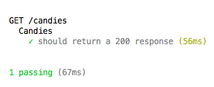

# Testing Node with Mocha/Chai

### Objectives
*After this lesson, students will be able to:*

- Describe the importance of testing your code programmatically
- Use describe and assertion functions to do basic testing
- Write integration tests that test our express server, it's routes, and implicitly the data coming from our database.

### Preparation
*Before this lesson, students should already be able to:*

- Describe TDD
- Explain basic file and folder structure in a simple RESTful node app

## Intro to Testing

## Framing

We've now created a number of applications.  All these apps cover a single topic, so most of the time, they are quite small.  But when you create a larger application, the codebase will become bigger and more complex every time you add some features. At some point, adding code in file A will break features in file B, and to avoid these "side-effects" or at least recognize immediately when they happen, we need to write tests our app and run them on each change. In a production-level application, providing a high level of [test coverage](http://www.softwaretestingclass.com/test-coverage-in-software-testing/) for an application is usually required in order to guarantee that code is bug-free and functions as intended.

## You Do (5 min)

[Types of Software Testing](http://www.softwaretestinghelp.com/types-of-software-testing/)

## Types of Testing

* How tests are executed:
  - __Manual__ - user runs test via the UI
  - __Automated__ - test scripts are executed. They call into the code and compare the results to the  expected values
* Granularity:
  - __Unit__: Focuses on testing individual "units" of code, usually individual functions or methods.
  - __Component__: class, library
  - __Integration__: set of components that are collaborating (interacting) to perform a task
  - __End-to-end (E2E)__: complete application running in an environment that mimics a real-world production environment
* Purpose
  - __Functional__
     * __Positive testing__ - does it work when it is supposed to work?
     * __Negative testing__ - does it fail when it is supposed to fail?
  - __Regression__: Did we break anything?
  - __Smoke__: Did the build work?
  - __Performance / Load__: How does the software behave under a heavy load?
     * Lots of users / traffic
     * Large data sets
  - __Usability__: How intuitive (easy to use) is the software?  Basically navigational testing.
  - __Security__: How secure is the application? Can the application be hacked?  Is it safe from external hacks?
  - __Compatibility__: How well does the software work with various hardware, O.S., network environments?
  - __Recovery__: How well does the system respond to hardware or software failures? Is it fault-tolerant?
  - __User Acceptance Testing (UAT)__ - Does the software do what the customers want it to do?
     * Actual software users test the software to make sure it can handle required tasks in real-world scenarios, according to specifications.

## You do (5 min)

- [Unit Testing TDD & BDD](http://codeutopia.net/blog/2015/03/01/unit-testing-tdd-and-bdd/)
- [TDD vs. BDD](http://joshldavis.com/2013/05/27/difference-between-tdd-and-bdd/)
- [TDD & BDD](http://www.joecolantonio.com/2014/07/29/unit-tdd-and-bdd-testing-whats-the-difference/)

## TDD and BDD

### TDD: Test-driven development

A development methodology of writing the tests first, then writing the code to make those tests pass. Thus the process is:

1. Define a test set for the unit
2. Implement the unit
3. Verify that the implementation of the unit makes the tests succeed.
4. Refactor
5. Repeat

### BDD: Behavior-driven development

A development methodology that was derived from `TDD` and [`DDD`](https://en.wikipedia.org/wiki/Domain-driven_design) (Domain-driven design) where tests are written in an English-like language (i.e. the `Gherkin` language) that specifies the external *behavior* (the specifications) of the unit without reference to how the unit was implemented (thus it is a form of *black box* testing). The purpose of BDD is to both describe and test the behavior of a unit of code in a single *specification* file.

## Mocha, Chai And Integration Testing - Intro (10 min)

To test our code in Node, we will use two primary libraries: one to run the tests and a second one to run the assertions.

Mocha will be our testing framework, but we're mostly just using it as a test runner. From the [Mocha Website](https://mochajs.org/)...

> "Mocha is a feature-rich JavaScript test framework running on Node.js and the browser, making asynchronous testing simple and fun. Mocha tests run serially, allowing for flexible and accurate reporting, while mapping (associating) uncaught exceptions to the correct test cases."


For assertions, we will use Chai. From the [Chai website](http://chaijs.com/)...

> "Chai is a BDD / TDD assertion library for node and the browser that can be delightfully paired with any javascript testing framework."


To be able to make HTTP requests inside tests, we will use [Supertest](https://github.com/visionmedia/supertest)...

> "The motivation with this module is to provide a high-level abstraction for testing HTTP"

Supertest allows easy assertions on top of those commands.

## Let's Start Testing! Codealong (35 mins)

Today we are going to create integration tests to test the outputs and behaviors of our API routes.

#### Setting up the app

Fork and clone this repo.  cd into it.  Then, cd into the starter-code provided - this is a basic Express app that we've created. Be sure to `npm install`.

In order to test this app, we need to install a couple of dependencies.

First, let's install mocha globally:

```bash
npm install mocha -g
```

Then, let's install mocha using --save-dev:

```bash
npm install mocha --save-dev
```

Then we will install chai using --save-dev:

```bash
npm install chai --save-dev
```

Last dependency we need to install is supertest:

```bash
npm install supertest --save-dev
```

Since we have mocha installed globally, in order to run our tests, we can just run `mocha` from the command line.  If we wanted to set up an npm script to run our tests, in our package.json we would add this line to the scripts object:

`"test": "mocha test/**/*.js"`

Then you can use `npm test` to run the tests.

#### Files and Folders

Now that we're configured, let's set up our file and folder structure. All of the tests will be written inside a folder `test` at the root of the app.  This folder needs to be named test so that mocha can find it.

```bash
mkdir test
```

Then we will write the tests inside a file called `candies_tests.js`:

```bash
touch test/candies_tests.js
```

> Note: Because our tests will request the application through HTTP, make sure that you are running the app while running the tests

#### Let's write some tests

Open the file `candies_tests.js`. We need to require some dependencies at the top of this file:

```javascript
var should    = require("chai").should(),
  expect      = require("chai").expect,
  supertest   = require("supertest"),
  api         = supertest("http://localhost:3000");
```

Make sure that you have set up the url correctly, as this will be used to request the app and analyze the response.

All of the tests need to be inside a `describe` block.  Describe blocks are high level groupings or **suites** for your tests.  They can be nested.  We will use one describe block per http route:

```javascript
describe("GET /candies", function() {
  //tests will be written inside this function
});
```

First, we will write a test to make sure that a request to the index path `/candies` returns an http status code of 200:

```javascript
describe("Candies", function() {
  it("should return a 200 response", function(done) {
    api.get("/candies")
    .set("Accept", "application/json")
    .expect(200)
    .done()
  });
});
```

> **Note:** Make sure that the done is in the 'it' block and not the 'describe' block!

- `it()`- tests a single test function
- `api`- is our express app, our webserver
- a request is initiated by invoking the correct method on the request object.  A new test is created for every `request.VERB()` call.
- `set()`- allows you to set header fields

We are simply sending a GET request to an endpoint, and expecting a 200 response.

To run this test, in the terminal, in one tab, start your server- `npm run start:dev`, as I have set this script up to run nodemon in your package.json.  In a second tab, type `mocha` or `npm test`.  You should get an output similar to this:



**This test is passing**!

Every block of code that starts with `it()` represents a single **test**.  Each test is performed in sequence, one after the other, in a queue.

The `callback` represents a function that Mocha will pass to the code so that the next test will be executed only when the current is finished and the `done` function is called - this allows tests to be executed one at a time.  It's almost like the resolve function of a `Promise`.


Now, let's verify the content of the response by looking at the data sent back by hitting the `/candies` endpoint.  Let's open [postman](https://www.getpostman.com/).  

Make sure that you are running a `GET` request, and in the URL, enter `http://localhost:3000/candies`.  

If you hit send, you should receive a response that looks similar to this:

```javascript
[
  {
    "id": 1,
    "name": "Chewing Gum",
    "color": "Red"
  }, 
  {
    "id": 2,
    "name": "Pez",
    "color": "Green"
  }, 
  {
    "id": 3,
    "name": "Marshmallow",
    "color": "Pink"
  }, 
  {
    "id": 4,
    "name": "Candy Stick",
    "color": "Blue"
  }
]
```

<br />

We can write a test that verifies that the response is an array. In your describe block, add:

```javascript
it("should return an array", function(done) {
  api
    .get("/candies")
    .set("Accept", "application/json")
    .end(function(error, response) {
      expect(response.body).to.be.an('array');
      done();
    });
});
```

In the first test, we were using the `.expect` method of `supertest`. Here we are using the expect function provided by `chai`.

If we run mocha again, we should see **2 passing tests**!

<br />

We can write another test that verifies the presence of a field in the response:

```javascript
it("should return an object that has a field called 'name' ", function(done) {
  api
    .get("/candies")
    .set("Accept", "application/json")
    .end(function(error, response){
      expect(response.body[0]).to.have.property('name');
      done();
  });
});
```

If we run mocha again, we should see **3 passing tests**!

<br />

We can also send data to the server and test the behavior - in our case, we want to make sure that when we post some JSON to `/candies`, a new object is added to the array candies.

Because we are going to test another route, lets add another describe block:

```javascript
describe("POST /candies", function() {

});
```

For this test, we need to:

1. create a new object by sending a `POST` request
2. verify that a new object has been "saved" by requesting the index route

For this, we will use `before` blocks. A `before` block will be executed for every `it` function that is called inside of a `describe` block.

Add this code block inside of the `POST describe` block:

```javascript
describe("Candies", function() {
  before(function(done) {
    api.post("/candies")
    .set("Accept", "application/json")
    .send({
      "id": 5,
      "name": "Lollipop",
      "color": "Red"
    })
    .end(done);
  });
}
```

This `before` code will be called **once** before **all** of the tests in the current `describe` block.  `beforeEach` runs once before **each and every test** in a test suite (a describe block).  There are also `after` and `afterEach` hooks.  Learn more by into [mocha](https://mochajs.org/#getting-started) hooks to learn more about the differences.

Now, we can verify that calling "POST" will add an object to `/candies`:

```javascript
it("should add a candy object to the collection candies and return it", function(done) {
  api.get("/candies")
  .set("Accept", "application/json")
  .end(function(error, response) {
    expect(response.body.length).to.equal(5);
    done();
  });
});
```

Run the `mocha` command in the terminal, you should now have **four passing tests**!


## Independent Practice (20 minutes)

> ***Note:*** _This can be a pair programming activity or done independently._

Add tests to the suite:

1. Write a test that makes sure that the object that is returned when you call the `show` route with a specific ID contains the correct fields.  What happens if that ID is not found?
2. Write a test that ensures that an object is deleted from the array candies when you call delete.
3. Write a test that ensures that a property is updated when you call `PUT /candies/:id`

How would you check for errors in your tests?


## Conclusion (10 mins)
> Review the answers to the tests specs above.

We've covered the principles of testing in JavaScript, but Chai offers a lot of different expectations syntaxes. Check the [Chai Documentation](http://chaijs.com/api/)

- How does Mocha work with Chai to write tests in your JavaScript application?
- Describe how to configure your app to use Mocha and Chai.


## Extra Resources

[BDD Cheatsheet](http://ricostacruz.com/cheatsheets/chai)

[https://www.codementor.io/olatundegaruba/integration-testing-supertest-mocha-chai-6zbh6sefz](https://www.codementor.io/olatundegaruba/integration-testing-supertest-mocha-chai-6zbh6sefz)


