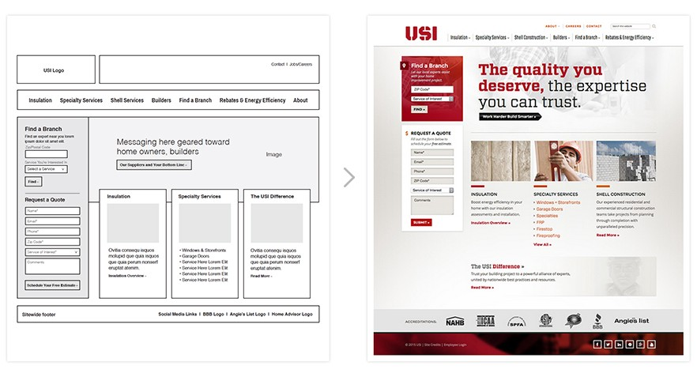

# Wireframing

## Sketching and Wireframing

### What Is a Wireframe?

A **wireframe** is an image that sketches out the layout of major pieces of
content within a page, without all of the fully-rendered detail that might be
present in an illustration.

Although making detailed, feature-rich wireframes is typically the province of
the UX/UI designer, even developers can produce basic layout sketches, and these
sketches are extremely useful in the planning process as a tool to clarify and
codify your vision. They also segue easily into mocking up a site with boxes, so
that you know how to actually build your layout.

### Wireframes vs Mockups

Wireframes and mockups are  ways to visualize an application.  They differ in
the the "degree" of fidelity.  Wireframes are lower fidelity, often using
placeholders for content, no colors, no fonts, and no assets.  Mockups are are
higher fidelity, often utilizing colors, typography, images, and other assets.

**Low-fidelity:**

- wireframes (paper or marker)
- wireframes (digital)

| Pros  |  Cons  |
| ------|----|
| speed | uninspiring |
| easy to change | vague |
| inexpensive | feel incomplete |
| skeleton of application | lack of guidance |

**High-fidelity:**

- mockups (no interactions)
- mockups (interactivity)

| Pros  |  Cons  |
| ------|----|
| stakeholder language | more time |
| more inspiring | harder to change  |
| user's perspective | more costly |

### Wireframing in SEI

Within the scope of this course, we will not be expecting you to produce
designer-level wireframes; however, we _will_ expect you to produce low-fidelity
sketches for your projects. A low-fidelity wireframe or sketch is simple -- just
complex enough to convey the gist of the page -- and may feature minimal text
placeholders for images, or skeletons of interactive features like drop-down
menus and pop-ups or modals.

It should usually not concern itself with things like:

- color scheme
- fonts
- specific content (images, written copy, etc)
- animations and timing

If you find yourself diving into those details, you may be going too deep. The
purpose of a sketch is to be light, flexible, and even disposable if necessary.

Below are some examples of sketches submitted in previous cohorts. Some are
higher fidelity and some are lower; some were drawn by hand and some were drawn
using design tools like Balsamiq; however, **any** of the following would be
considered acceptable wireframes for a project.

[Compact](images/compact.png)

[MBTA](images/mbta.png)

[CrossHatch](images/crosshatch.jpg)

[Timeline](images/timeline.png)

[Art City](https://github.com/breduffy/ArtCity_app/blob/master/z_Mockups/Project%202_Art_City_Mockups.pdf)

> The last one is the kind of wireframe you'd typically see from a designer;
that is not our expectation from you in WDI.

In general, since hand-drawn wireframes are easier to iterate on and maintain
than computer-drawn ones, we recommend that in the scope of this course, you do
all your wireframing by hand.

## 1.  Wireframe Practice

Pick one of the eight following sites and draw a basic sketch for
the site on a patch of whiteboard, piece of paper, or whatever you have handy.

Focus on capturing the key elements of layout for the page, but
**DO NOT INCLUDE ANY REAL TEXT**.

- [Wikipedia](https://en.wikipedia.org/)
- [NYtimes.com](http://www.nytimes.com/)
- [Reddit](https://www.reddit.com/)
- [Google](https://www.google.com/)
- [ESPN.com](http://espn.go.com/)
- [TripAdvisor](http://www.tripadvisor.com/)
- [City of Boston](http://www.cityofboston.gov/)
- [JCrew](https://www.jcrew.com/)

Upload the image to [imgur](https://imgur.com/) or [github](https://gist.github.com/vinkla/dca76249ba6b73c5dd66a4e986df4c8d) and
add it below using the dummy markdown image syntax.  

## 2.  Project 1 Wireframes

Now that you've learned how to do some basic wireframing, let's actually put those skills to work by getting a jump on the first project.

For your first project, you will be making an in-browser Tic Tac Toe game that can be played on a phone, tablet, or computer. Although you have a lot of freedom with what the UI looks like, it will need the following features in order to be used properly:

- a form (or two separate forms) for registering a new account and logging in
- a clickable game board that you can use to play the game
- something to display who won, once a game ends
- a way to start a new game (e.g. a button, or a model window)

On your own, draft up a set of sketches to start from as you begin to design your app's front end; you should have at least one sketch for what the site looks like on a mobile device and one for what the site looks like on a laptop. These sketches should be lightweight and rough so that you can easily iterate on them if you decide to add or remove features.

Add your wireframe files to the [project_1_wireframes](project_1_wireframes/) folder.

## Additional Resources

- [Moqups](https://moqups.com/), a mostly-free drag and drop wireframing web app
- [Balsamiq](https://balsamiq.com/), a sketching tool for making high-fidelity
  wireframes
- [Wirify](http://www.wirify.com/), a tool that draws up rudimentary wireframes
  for existing sites.
- [invision](https://www.invisionapp.com/), a workflow play form with
  high-fidelity prototyping tools.
- [Axure](https://www.axure.com/), a high fidelity prototyping platform (free
  for 30 days).
