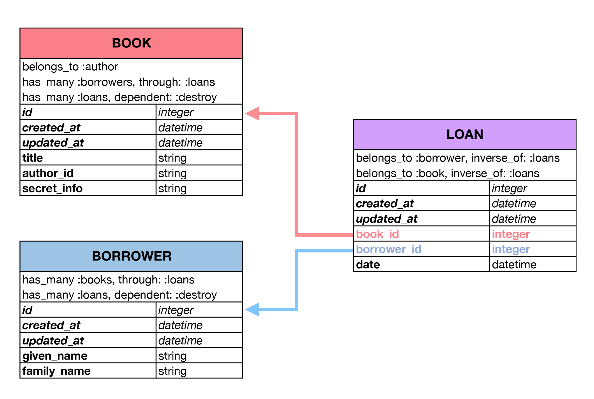

# Where We Left Off

Previously we created a single model, `Book`.

Then we created a second model `Author` and linked it to `Book`.

Now we are going to add a third model: `Borrower`, then we are going to create
a fourth model, `Loan`, which is going to act as a link between the
`Borrower`s and `Book`s.

This `Loan` model will connect `Borrower` and `Book` together. Earlier, when we
were working with a `one-to-many` relationship `books` belonged to an `author`.
When we created a migration:

```ruby
class AddAuthorToBooks < ActiveRecord::Migration
  def change
    add_reference :books, :author, index: true, foreign_key: true
  end
end
```

...we added an `author` reference column to the `books` table which is able to
store a reference to an author of a particular book.

With `Borrowers`, we know this is a two way street however: `Books` can have
many `Borrowers` and `Borrowers` can have many `Books`. In order to make this
a two way street we are going to need a `join table`.

## Join Tables

A `join table` is a special model which holds references to two or more models.

Let's see what this association might look like:



<!-- Image from Rails Docs -->

In the above example, the `loans` model is the `join table`. You can see
it has both a `book_id` attribute and a `borrower_id` attribute.  Both of these
attributes store references to their respective models.

You can also see an attribute called `date`. You are allowed to add
other attributes on to your `join table`, but you do not necessarily have to.
In this case it makes sense, in some cases it may not, use your judgement.

## Create Additional Resources

### Demo: Create Borrower Resource

Let's make a borrower resource with scaffolding:

`bin/rails generate scaffold borrower given_name:string family_name:string`

Let's check to see if our scaffolded code is correct.

Now let's migrate that in so we don't confuse ourselves if we have to
rollback:

`bin/rails db:migrate`
