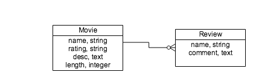
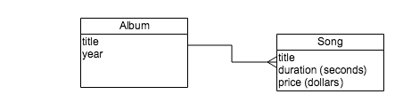
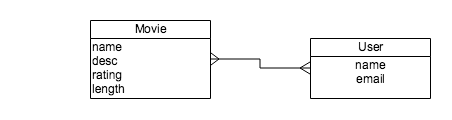
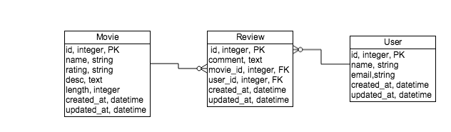

## Objectives
* Create a Join Model for a Many-To-Many Relationship.
* Use Rails has_many :through to implement a Many-To-Many Relationship.

## We Do: Setup

**Fork and clone. Then create the DB, migrate and seed the DB.**

```
rake db:create
rake db:migrate
rake db:seed
```

**Lets review what models and relationships we have at this point.**

Open up `db/schema.rb` and see that:  

*  We have a Movies, Reviews relationship. One Movie may have many Reviews. The Parent is Movie the child is Review. Movie has a collection of Songs.
	*  Which model holds the `belongs_to`? 
	*  Which model holds the `has_many`?



* We have a Albums to Songs relationship. One Album has many Songs. The Parent is Album the Child is Song. Album has a collection of Songs.
	*  Which model holds the `belongs_to`? 
	*  Which model holds the `has_many`?




**Run the server**

```
rails s
```

## Data Model

We are going to create a User model and create a **many to many** relationship between Users and Movies. Another words:

* Each User will have **reviewed** one or more Movies.
* Each Movie will have been **reviewed** by one or more Users.



**(NOTE: This is a conceptual or logical model. It's does NOT reflect the structure of the tables in the DB!!)**

In the DB we will implement this **many to many** relationship by using two **one to many** relationships.

* A **one to many** relationship between a Movies and its reviews.
* A **one to many** relationship between a User and their reviews.




We are going to create a **JOIN TABLE** out of the current **reviews** table. Notice this will have two foriegn keys. A foreign key for the User, `user_id`, and a foreign key for the Movie, `movie_id`.


## We Do: Create the Users-Movies Relationship.

1. First we'll create a User model, and it's users DB table. 
2. Then we'll remove the name column from the reviews table. 
3. Add the foreign key for the user's table, `user_id`, to the reviews table.
4. Add the `has_many` and `belongs_to` Rails/ActiveRecord methods to the User and Review models to create a one to many relationship.
5. Populate the DB by addding seed data for Users, Reviews and Movies.
6. Allow Users to find Movies they have reviewed.
7. Allow Movies to find which Users have created reviews.


#### 1. Create a User model

This will generate a User model and migration.

```bash
$ rails g model User name email
$ rake db:migrate
```
* Inspect the `schema.rb`.
* Inspect using the `rails console`
* Inspect the DB.

#### 2. Remove the name column from the reviews table

We don't need the `name` of the user that created the review because we'll have a relationship to the User that created the review.

```bash
$ rails g migration RemoveNameFromReviews name:string
$ rake db:migrate
```

* Inspect the `schema.rb`.
* Inspect the DB.


#### 3. Make reviews a JOIN model/table

Add the foreign key for the user's table, `user_id`, to the reviews table.

Each user may have many reviews. *This is a one to many relationship*.

Each movie may have many reviews. *We already had this one to many relationship.*

Now, we want to create a **many to many relationship** between Movies and Users. **A user may review many movies** and a **movie may have been reviewed by many users**.


(Figure: Conceptual/Logical Data Model of Movies and Users)

The reviews table will become a **JOIN** model. It will **JOIN** movies and users **because it has a foreign keys to both tables.**


(Figure: Physical DB Model of movies, reviews and users table.)


**Create a migration that will add a foreign key, user_id, to the reviews table.**

```
$ rails g migration AddUserRefToReviews user:references 
$ rake db:migrate
```

**View the migration generated.**

```ruby
class AddUserRefToReviews < ActiveRecord::Migration
  def change
    add_reference :reviews, :user, index: true, foreign_key: true
  end
end

```

This will create a user_id column in the reviews table that will be used as a **foreign key** to the users table.

* Check the reviews table in the `db/schema.rb`.
* Check the reviews table in psql.

```bash
$ rails db
# \d reviews
...
Foreign-key constraints:                                                                                 
    "fk_rails_6ad75a4852" FOREIGN KEY (movie_id) REFERENCES movies(id)                                   
    "fk_rails_74a66bd6c5" FOREIGN KEY (user_id) REFERENCES users(id)
```

See the foreign keys in the reviews table for movies and users. Yes, this reviews table now **JOINS** users to movies.

The database is setup to **JOIN** Movies and Users. Next, we need to add the appropriate Rails macros/methods to each Model to implement this relationship.

#### 4. Create Rails Associations from User to Review.


##### Create a has many relationship from the User to the Review model.

Add this to the User model.

```ruby
has_many :reviews
```

##### Create a belongs to relationship from the Review to the User model.

dd this to the Review model

```ruby
belongs_to :user

```


#### 5. Update the seed file

```ruby
User.destroy_all
Review.destroy_all
Movie.destroy_all

tom = User.create!(name: 'Tom')
joanne = User.create!(name: 'Joanne')
meg = User.create!(name: 'Meg')

movie = Movie.create!(name: 'Affliction', rating: 'R', desc: 'Little Dark', length: 123)
movie.reviews.create!(user: tom, comment: 'Dark, somber')
movie.reviews.create!(user: meg, comment: 'Slow, boring')

movie = Movie.create!(name: 'Mad Max', rating: 'R', desc: 'Fun, action', length: 154)
movie.reviews.create!(user: tom, comment: 'Explosions, silly')
movie.reviews.create!(user: joanne, comment: 'Brilliant, fun')

movie = Movie.create!(name: 'Rushmore', rating: 'PG-13', desc: 'Quirky humor', length: 105)
movie.reviews.create!(user: tom, comment: 'Crazy, humor')
movie.reviews.create!(user: joanne, comment: 'Waste of time, stupid')

puts "Created three Movies"
```

**Drop, Create, Migrate and Seed the DB.**

```
rake db:reset
```

### Check seed data in the Rails console

```ruby
tom = User.find_by_name('Tom')
tom.reviews

meg = User.find_by_name('Meg')
meg.reviews
```

## You Do

We will, **eventually, NOT YET** be creating a many to many association between SongWriters and Albums. 

But, first you must create a SongWriter model and relate it to a Song model. **Note: Each Song may ONLY have one SongWriter**.

* Create an SongWriter Model that has a name and gender.
* A SongWriter may have written many songs.
* Implement a one to many relationship between SongWriter and Song.
* Check that each SongWriter can have many songs in the rails console.
* Confirm this relationship in the Rails DB.
* Create seed data for each Song's writer.


#### 6. Allow Users to find Movies they have reviewed with `has_many through: ..`

Find the movies a user has reviewed.

Now that we have a JOIN table/model, reviews, we can go **through** it to get the movies a user has created a review for. 

```ruby
class User ...
 has_many :movies, through: :reviews
end
```

This will use the join model to get the movies a user has reviewed.

**In the rails console**

```ruby

tom = User.find_by_name("Tom")
tom.movies

...

joanne = User.find_by_name("Joanne")
joanne.movies
```

Notice the SQL that the `tom.movies` and `joanne.movies` generates and executes.

```sql
 SELECT "movies".* FROM "movies" INNER JOIN "reviews" ON "movies"."id" = "reviews"."movie_id" WHERE "reviews"."user_id" = $1
```

#### 7. Allow Movies to find which Users have created reviews.

Now, let's see who's reviewed a specific movie.

**Add this to the movie model.**

```ruby
class Movie < ActiveRecord::Base
  has_many :reviews
  has_many :users, through: :reviews
end
```

Here we've added `has_many :users, through: :reviews`. 

**In the rails console**

```ruby

m1 = Movie.first
m1.users

...
 m1.users.map(&:name)
```

The `m1.users` returns an array of all the users that have reviewed the movie.

> `m1.users.map(&:name)` just gets the names of all the users that have reviewed the movie. It uses the Ruby symbol to proc notation, `&:<attribute name>`.*

> The above is shorthand for this.

>```ruby
>movie_reviewers = m1.users
>movie_reviewers.map{ |reviewer| reviewer.name }
>```

## You Do
* Create a many to many relationship between SongWriter and Album.
 
Then check that we can view all an Album's song writers. 

AND

Check to see that we can view all a song writer's albums.


## References
* [Active Model Serializer (AMS) ](https://github.com/rails-api/active_model_serializers/tree/0-9-stable)

* [What is "has_many through" (Video)](http://blog.teamtreehouse.com/what-is-a-has_many-through-association-in-ruby-on-rails-treehouse-quick-tip)

* [ActiveModel Associations](http://guides.rubyonrails.org/association_basics.html)

* [Nested Associations and has_many through](http://ryandeussing.com/blog/2013/06/12/nested-associations-and-has-many-through/)

* [Setting a join model attribute](http://www.tweetegy.com/2011/02/setting-join-table-attribute-has_many-through-association-in-rails-activerecord/)

* [Query and access join model attributes](http://stackoverflow.com/questions/18799934/has-many-through-how-do-you-access-join-table-attributes)
* [Rails Documentation](http://api.rubyonrails.org/)


* [With So Much Rails to Learn, Where Do You Start?](http://www.justinweiss.com/blog/2015/05/25/with-so-much-rails-to-learn/?utm_source=rubyweekly&utm_medium=email)


