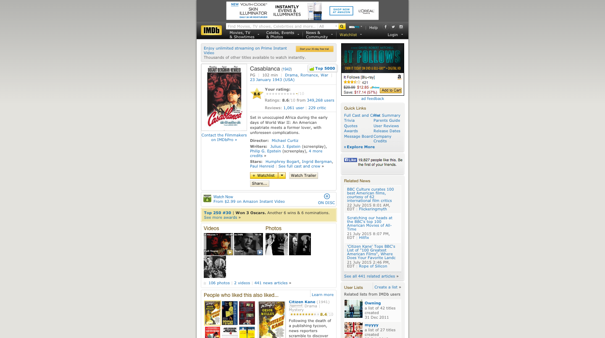
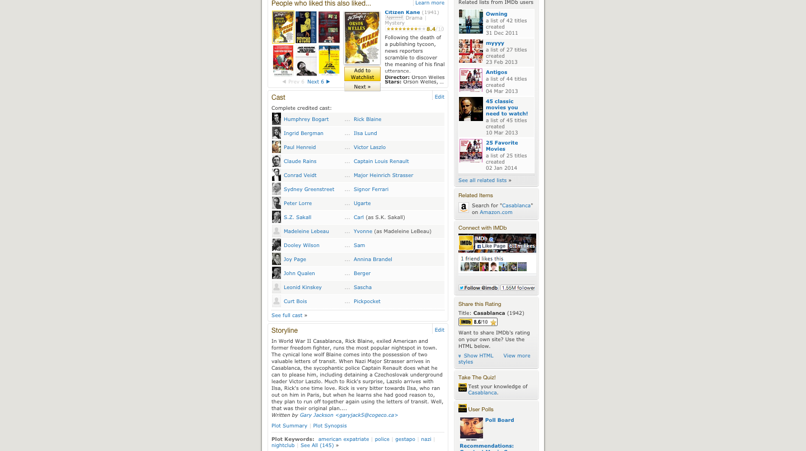
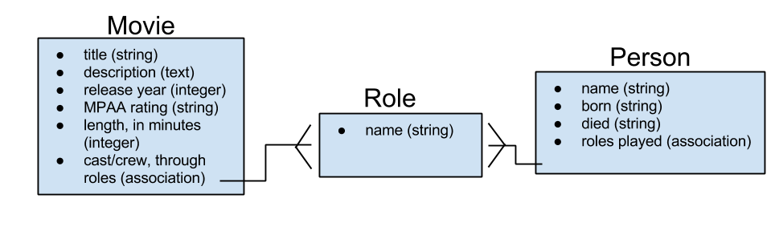

## Tying It All Together, Part 2 :: Building an Rails App (with relationships) From Scratch
Over the last few weeks, you've gotten to play around with many of the different components of Rails. Today, we'll tie everything that you've learned together, and make a brand new app from end-to-end.

### The Mission : Clone IMDB

Many of are probably familiar with IMDB, the "Internet Movie DataBase" - it's a website that lists out movies and all of the people involved in producing them (e.g. actors, directors, producers). We're going to produce a simplified version of the site together. Then, you will all go through a similar exercise to clone a different web service.

### Planning
Let's start off by taking a look at IMDB.com and seeing if we can extract out the important parts.



Ctd.


Each movie has its own page; this lists information about the film itself, and also includes lists of cast and crew. What's more, each cast member has their own page, which lists out all the roles they've played in different productions. Even roles have their own pages, which list out the various different productions that the roles have appeared in.

IMDB is a big site, and we shouldn't expect to be able to copy all of it. But it seems like the most essential elements is this relationship between cast/crew, roles, and productions. If we limit ourselves to that, we might be able to successfully duplicate how it works.

Let's construct a couple of crude, rudimentary user stories based on this description of the app:
- When a user clicks on a link to a movie, the page loads information about that movie, as well as a list of cast members and the roles they've played.
- When a user clicks on a link to a actor/actress, the page loads information about the roles that this actor/actress has played (and in what productions).
- When a user clicks on a link to a particular role, the page loads information about the various productions in which that character has appeared, and who has performed the role.

Now that we have some sense of what our app should do, let's first start thinking about the kind of data our app should use.

#### Your Turn :: Planning
Based on the different kinds of model relationships and associations hat you've learned about over the past few days, how might we structure our data for this type of problem? Break into groups of three and discuss at least two different approaches to how this problem could be structured. Be prepared to defend the approach your group ultimately decides on, as you'll be sharing your opinions with the class.

### Building The Back End
Suppose that we came out of our planning with the following ERD:



Now that we've mapped out how we want our data to be structured, let's start building our back-end.

#### Step 1 : Make a new Rails app.

  `rails new imdb_clone -T --database=postgresql`

  `rake db:create`
#### Step 2 : Create models + migrations.

  Our application calls for three models, `Movie`, `Role`, and `Person`.

  First, we'll need to make our initial migration files (`Create{X}s`) and models.

  Once that's done, we can add our associations. Since we're going to be using a `has many ..., through ...` association, this translates to adding two sets of foreign keys to our `roles` table : one for `movie_id` and one for `person_id`. We should generate two separate migrations for these two changes.

  `rails g migration AddMovieIdColumnToRoles movie_id:integer`

  `rails g migration AddPersonIdColumnToRoles person_id:integer`

  Once this is done, take a look at `schema.rb`. Does it look like we expect? What if we open up the database using `rails db`? Do those tables look tight?

  Let's finish this up by adding the appropriate methods to our models so that we can access related records.

  In `movie.rb`
  ```ruby
  class Movie < ActiveRecord::Base
    has_many :roles
    has_many :people, through: :roles
  end
  ```

  In `person.rb`
  ```ruby
  class Person < ActiveRecord::Base
    has_many :roles
    has_many :movies, through: :roles
  end
  ```

  In `role.rb`
  ```ruby
  class Role < ActiveRecord::Base
    belongs_to :movie
    belongs_to :person
  end
  ```

  Finally, let's try creating some examples of `Person`, `Role`, and `Movie` in your `seeds.rb` file; test them out in the Rails console, and make sure they work like you expect.

  ```ruby
  Movies.create!([
      {title: "Casablanca", decription: "Set in unoccupied Africa during the early days of World War II: An American expatriate meets a former lover, with unforeseen complications.", release_year: 1942, mpaa_rating: "PG", length: 102},
      {title: "The Maltese Falcon", description: "A private detective takes on a case that involves him with three eccentric criminals, a gorgeous liar, and their quest for a priceless statuette.", release_year: 1941, mpaa_rating: "Not Rated", length: 100},
      {title: "The Big Sleep", description: "Private detective Philip Marlowe is hired by a rich family. Before the complex case is over, he's seen murder, blackmail, and what might be love.", release_year: 1946, mpaa_rating: "Not Rated", length: 114},
      {title: "The Treasure of the Sierra Madre", description: "Fred Dobbs and Bob Curtin, two Americans searching for work in Mexico, convince an old prospector to help them mine for gold in the Sierra Madre Mountains.", release_year: 1948, mpaa_rating: "Not Rated", length: 126}
  ])

  Person.create!([
      {name: "Humphrey Bogart", born: "1899-12-25", died: "1957-01-14"},
      {name: "Ingrid Bergman", born: "1915-08-29", died: "1982-08-29"},
      {name: "Paul Henreid", born: "1908-01-10", died: "1992-03-29"},
      {name: "Claude Rains", born: "1889-11-10", died: "1967-05-30"},
      {name: "Conrad Veidt", born: "1893-01-22", died: "1943-04-03"},
      {name: "Sydney Greenstreet", born: "1879-12-27", died: "1954-01-18"},
      {name: "Peter Lorre", born: "1904-06-26", died: "1964-03-23"},
      {name: "Mary Astor", born: "1906-05-03", died: "1987-09-25"},
      {name: "Jerome Cowan", born: "1897-10-06", died: "1972-01-24"},
      {name: "Gladys George", born: "1900-09-13", died: "1954-12-08"},
      {name: "Lee Patrick", born: "1901-11-22", died: "1982-11-21"}
      {name: "Lauren Bacall", born: "1924-09-16", died: "2014-09-16"},
      {name: "John Ridgely", born: "1909-09-06", died: "1968-01-18"},
      {name: "Martha Vickers", born: "1925-05-28", died: "1971-11-02"},
      {name: "Walter Huston", born: "1883-04-05", died: "1950-04-07"},
      {name: "Tim Holt", born: "1919-02-05", died: "1973-02-15"},
      {name: "Bruce Bennett", born: "1906-05-19", died: "2007-02-24"},
      {name: "Barton McLane", born: "1902-12-25", died: "1969-01-01"}
  ])

  Role.create([
      {name: "Rick Blaine", movie_id: 1, person_id: 1},
      {name: "Ilsa Lund", movie_id: 1, person_id: 2},
      {name: "Victor Laszlo", movie_id: 1, person_id: 3},
      {name: "Cpt. Louis Renault", movie_id: 1, person_id: 4},
      {name: "Maj. Heinrich Strasser", movie_id: 1, person_id: 5},
      {name: "Signor Ferrari", movie_id: 1, person_id: 6},
      {name: "Ugarte", movie_id: 1, person_id: 7},
      {name: "Samuel Spade", movie_id: 2, person_id: 2, person_id: 1},
      {name: "Brigid O'Shaughnessy", movie_id: 2, person_id: 8},
      {name: "Iva Archer", movie_id: 2, person_id: 10},
      {name: "Joel Cairo", movie_id: 2, person_id: 7},
      {name: "Lt. Detective Dundy", movie_id: 2, person_id: 18},
      {name: "Effie Perrine", movie_id: 2, person_id: 11},
      {name: "Kasper Gutman", movie_id: 2, person_id: 6},
      {name: "Miles Archer", movie_id: 2, person_id: 9},
      {name: "Philip Marlowe", movie_id: 3, person_id: 1},
      {name: "Vivian Rutledge", movie_id: 3, person_id: 12},
      {name: "Eddie Mars", movie_id: 3, person_id: 13},
      {name: "Carmen Sternwood", movie_id: 3, person_id: 14},
      {name: "Dobbs", movie_id: 4, person_id: 1},
      {name: "Howard", movie_id: 4, person_id: 15},
      {name: "Curtin", movie_id: 4, person_id: 16},
      {name: "Cody", movie_id: 4, person_id: 17},
      {name: "McCormick", movie_id: 4, person_id: 18}
  ])
  ```
#### Step 3 : Create controllers and routes.

  We now have some resources, and it's reasonable (based on our user stories) that we'd want to be able to handle requests related to each of them, so let's create some controllers.

##### **Movies and People**
  `MoviesController` and `PeopleController` should be the easiest to figure out, since neither of these resources has foreign keys and it's reasonable that we might want CRUD capability. Let's give both of these controllers the standard CRUD actions.

  e.g.
  ```ruby
  class MoviesController < ApplicationController

    def index
      render json: Movie.all
    end

    def show
      render json: Movie.find(params[:id])
    end

    def create
      puts movie_params
      movie = Movie.create(movie_params)
      if movie.save
        head :created, location: movie
      else
        render json: movie.errors, status: :unprocessable_entity
      end
    end

    def update
      movie = Movie.find(params[:id])
      if movie.update(movie_params)
        movie.save
        render json: movie
      else
        render json: movie.errors, status: :unprocessable_entity
      end
    end

    def destroy
      movie = Movie.find(params[:id])
      movie.destroy
    end

    private
    def movie_params
      params.require(:movie).permit(:title, :description, :release_year, :mpaa_rating, :length)
    end
  end
  ```

  Let's also make them some routes, using our `config/routes.rb`.

  `resources :movies, :people`

  By creating a simple HTML page with some JavaScript and jQuery inside our `public` directory, we can write some AJAX requests and test if our routes and controllers are working.

##### **Roles**
  Once Movies and People have been taken care of, the only thing that's left is to handle Roles. We can probably start out in the same way as with Movies and People - by making a controller and some routes.

  In `roles_controller.rb`
  ```ruby
  class RolesController < ApplicationController

    def index
      render json: Role.all
    end

    def show
      render json: Role.find(params[:id])
    end

    def create
      puts role_params
      person = Role.create(role_params)
      if person.save
        head :created, location: role
      else
        render json: role.errors, status: :unprocessable_entity
      end
    end

    def update
      role = Role.find(params[:id])
      if role.update(role_params)
        role.save
        render json: role
      else
        render json: role.errors, status: :unprocessable_entity
      end
    end

    def destroy
      role = Role.find(params[:id])
      role.destroy
    end

    private
    def role_params
      params.require(:role).permit(:name, :movie_id, :person_id)
    end
  end
  ```

  In `routes.rb`
  ```ruby
  resources :movies, :people, :roles
  ```

  If we go to the test page we created earlier, we can use it to poke and prod our 'Roles' resource just like we did with Movies and People.

  Incidentally, did you know that there are _two_ movies named "The Maltese Falcon"? The first was released in 1931, just before the 'Motion Picture Production Code' was adopted. Since both films derive directly from a novel (of the same name) by Dashiell Hammett, they naturally have the same set of characters, more or less; however, since one version was made ten years later, the cast is different.

  Suppose we wanted to add this prior version of "The Maltese Falcon" to our database, along with _that_ film's Sam Spade, Ricardo Cortez. We can easily create a new Movie or a new Person, but what happens when we want to have a role linking the two? Here's where our abstraction breaks down a bit. Each Role only has space for one `movie_id` and one `person_id`; in other words, a Role isn't really a role, it's a connection linking a Person to a Movie. So, if we want to link together the 1931 "Maltese Falcon" to Ricardo Cortez, we need to create a new Role (even though it's also "Sam Spade").

  HOWEVER... If we go to the IMDB page for "The Maltese Falcon" and click on the page for "Samuel Spade", we see something odd.
  What actually shows up is a list of _all_ films which have a character named "Samuel Spade" (or "Sam Spade", but let's not get into that right now) along with the various actors who've played that character. Clearly, something different is happening here. How might we implement this difference?

  One possibility might be to create a special controller action for the RolesController - let's call it `find_by_name` - that allows us to retrieve a list of all roles with the same name.

  ```ruby
  def find_by_name
    roles = Role.where(name: params[:name])
    render json: roles
  end
  ```

  We'll also need to create a special route for this action in our `routes.rb` file.

  ```ruby
  get 'roles/:name' => 'roles#find_by_name'
  ```

  Ta da! Now we can see each role with a matching name.

#### Step 4 : Create serializers.
  The JSON that we're getting back from our API has a fair amount of data - maybe more than we need. Does our front-end really need to see the `created_at` and `updated_at` properties? On top of that, one neat feature of IMDB's 'role' page is that when it lists each role, it also shows both the movie that the role appears in and the person who plays the role. Wouldn't it be nice to have that in our Role JSON?

  Fortunately, we have a tool that we can use for this : Active Model Serializers. Serializers will allow us to manipulate our JSONs before they get sent back.

  Let's add the Active Model Serializers gem to our Gemfile

  ```ruby
  gem "active_model_serializers", github: "rails-api/active_model_serializers"``
  ```

  and run `bundle install`. Then we can call `rails g` and spin up some serializers.

  `rails g serializer Movie`

  `rails g serializer Person`

  `rails g serializer Role`

  Let's assume that we don't want to add any properties to either the Movie or Person JSONs - we just want to hide `created_at` and `updated_at`. In that case, setting up the serializers for Movies and People is pretty easy.

  In `movie_serializer.rb`
  ```ruby
  class MovieSerializer < ActiveModel::Serializer
    attributes :id, :title, :description, :release_year, :mpaa_rating, :length
  end
  ```

  In `person_serializer.rb`
  ```ruby
  class PersonSerializer < ActiveModel::Serializer
    attributes :id, :name, :born, :died
  end
  ```

  For the Role serializer, we only need to expose one additional property, `:name`

  In `role_serializer.rb`
  ```ruby
  class RoleSerializer < ActiveModel::Serializer
    attributes :id, :name
  end
  ```

  In addition, we want to see the _names_ of the Person and Movie that the Role relates to, not just their IDs. In fact, based on the IMDB page, we might want to also see the Movie's release year.

  ```ruby
  class RoleSerializer < ActiveModel::Serializer
    attributes :id, :name, :person_name, :movie_title, :movie_year
  end
  ```

  Of course, `person_name`, `movie_title`, and `movie_year` are not actually properties of a Role; we'll need to define what these are inside the RoleSerializer.


  ```ruby
  class RoleSerializer < ActiveModel::Serializer
    attributes :id, :name, :person_name, :movie_title, :movie_year

    def person_name
      object.person.name
    end

    def movie_title
      object.movie.title
    end

    def movie_year
      object.movie.release_year
    end

  end
  ```

  And given that these names are totally up to our discretion, let's rename `person_name` to something more semantic for this context.

  ```ruby
  class RoleSerializer < ActiveModel::Serializer
    attributes :id, :name, :played_by, :movie_title, :movie_year

    def played_by
      object.person.name
    end

    def movie_title
      object.movie.title
    end

    def movie_year
      object.movie.release_year
    end

  end
  ```

  Now when we go to `localhost:3000/roles`, we should see something like this:

  ```json
  [
    {
    "id": 1,
    "name": "Rick Blaine",
    "played_by": "Humphrey Bogart",
    "movie_title": "Casablanca",
    "movie_year": 1942
    },
    ...
  ]
  ```

  Awesome! Look out, IMDB - here we come!

### Your Turn :: Add More Features
Now that our app is functional, we can start thinking about additional features. Here are a couple that come to mind:
- Leaving ratings for movies.
- Authentication.

In your groups, add both of these features in your IMDB clone.

#### Movie Ratings
Let's try implementing a rating system, so that users can leave reviews on movies they've seen.

Users should have the following properties:
- email : an email address
- username : a user-generated identifier
- token : for auth - you'll use this later

Reviews should have the following properties:
- score : a whole number between 0 and 5
- content : the content of the review

In addition, any given rating is created by a user and associated with a movie. Sound familiar? Yep! This is another great opportunity to use `has_many ..., through ...` - in this case, Users have many Movies, through Reviews, and vice versa. How can we set that up?

We already have User and Movie tables built in our database, but we need to build a new table for Reviews. Since it's a `has_many ..., through ...`, our Reviews table will need `movie_id` and `user_id` columns.

Once you've made a migration file and run it, create a new model for Reviews.

Then, create a controller for Reviews and give it all the standard CRUD actions.

Next, create some routes for your controller. Given how tightly Reviews are tied to Movies, it might make sense to use a nested route (e.g. `/movies/23/reviews/3`)

Finally, let's edit our serializers. With Reviews, we may actually want to keep `created_at` and/or `updated_at`, and it may not be necessary to show `movie_id` at all if it's part of our path (thanks to the nested route). However, we will still probably want extra information about the user who left the review - for instance, their username, or even the total number of reviews they've left. All of this can be configured in ReviewSerializer. We might also want to add a new 'virtual property' to Movies via the MovieSerializer - average score from Reviews of that Movie. See if you can make that work!

#### Authentication
We should be able, more or less, to drop in our authentication solution from last week. What did that involve?
- a User model (and table, obviously)
- an 'AuthController' to handle authentication
- a 'ProtectedController' to prevent the user from doing things if they haven't authenticated
- the `bcrypt` gem
- a front end where users can input their usernames and passwords and communicate with the API via AJAX

> If you're feeling a little fuzzy on authentication, look to [this repo](https://github.com/ga-wdi-boston/wdi_6_rails_api_auth_example/tree/master/auth_example) as a reference.

If you use a separate front-end (i.e. not inside the `public` directory) for this, **you must enable CORS** - otherwise, the app will not work.

## Additional Learning
- Here are some cool gems you can use in development mode to make your life easier.
  * 'pry-rails'
  * 'hirb'
  * 'rename'
