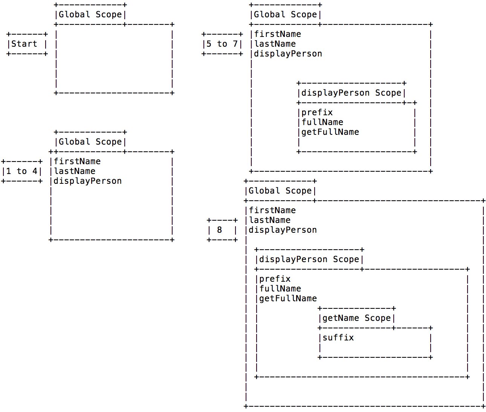
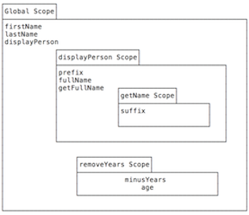

# Javascript Scope

## Objectives

By the end of this, students should be able to:

- Draw a diagram representing variable scope.
- Create a list of operations that explain runtime behavior. 
- Create a program that hoists variables.


## Compilation

The code that you write **MUST** be translated into a form that the computer can understand.

Source code is human readable, *we hope*. This source code may be translated into a set of 1's and 0's that a computer's CPU can understand. Yep, the CPU is a chip on the computer that does all the processing, hey there is a reason it's called the Central Processing Unit(CPU).

`Source Code`  ==>  `1's and 0's`

Or, the source code may be translated into a another type of langauge, byte code, that can be understood by a Virtual Machine(VM).

`Source Code` ==> `byte code`

### Compiled Languages

Some languages are *explicitly* compiled. Another words,the programmer must run command to invoke compilation. 

For example, the **C** and **C++** languages are explicity compiled. The programmer must run a command like:

`gcc -o hello_world -c hello_world.c` 

To translate the C code in the hello_world.c file into an *executable* or *binary* file that contains the 1's and 0's understood by the CPU. 

*gcc* is a **C** compiler.

`Source Code`  ==>  `1's and 0's`

`hello_world.c`  ==>  `hello_world`

### Interpreted Languages
Some languages do **not** require the programmer to explicitly run a compiler. **Javascript**, **Java**, **Ruby** are a couple of intepreted languages. 

Don't get me wrong, there is still compilation being down but it's done automatically. 

`Source Code` ==> `byte code`

## From Source to Running Code.
There are two basic phases to go through when going from code in a file to a program running.

- Compile Time.  
 is a phase when the source code is translated to another form. 
 
 For example, when we run a javascript program we will compile javascript to an intermediate language/bytecode that the Javscript Virtual Machine(VM) understands.
- Runtime.  
	is the phase when the computer actually runs each statement in the program.  
	For example, this is when the computer runs the javascript program bytecode.

### Variable Scope
Is where in a program a variable can be seen. In other words, where it can be used. *We'll see more later*, but you've seen that variables declared within a function can *not* be seen or used in the Global Scope.


### Lexical Analysis

Part of the Compilation phase is Lexical Analysis. In general, Lexical Analysis scans through the source code, one character at a time, looking for language constructs like variables, functions, built-in keywords, etc.

It's during this time that the compiler builds variable scope and **declares** variable inside a variable scope.

### Summary
	
	1. Read the Source Code in a javascript file into memory.
	2. Compile the source code.  
		a. Lexical Analysis.
		b. Build Scope.
		c. Turn source code into a form understood by VM, bytecode.
	3. Execute bytecode.

## Building Scope.

Scope is built during the Lexical Analysis part of the Compilation phase. When scope is built during this phase it's called **Lexical Scope**. This is very common in many programming languages.

Let's see how it works, eh. Heres the code we'll work with.  

```javascript
var firstName = 'John'; // 1
var lastName = 'Dowd'; // 2
var age = 19; // 3

function displayPerson(fname, lname){ //4, 5
  var prefix = 'Mr'; // 6
  var fullName = null; // 6

  function getFullName(){ // 7
    var suffix = "Esq.";  // Everybody's a lawyer, eh.
    return  fullName = prefix + " " + fname + " " + lname + " " + suffix;
  };

  return getFullName();
};

function removeYears(){ // 8
  var minusYears = 10, age = 49;
  return age - minusYears;
};

console.log(displayPerson(firstName, lastName));
console.log(removeYears());

```

* Node will load this file and pass the source code on to it's Javascript VM.

* The VM will run do a Lexical Analysis of this source and build Variable Scope as follows:

    1) Found 'var firstName' variable declaration.  
    Put firstName variable in Global Scope.  
    2) Found 'var lastName' variable declaration.  
    Put lastName in Global Scope.  
    3) Found 'var age' variable declaration.  
    Put age in Global Scope.  
    4) Found 'var displayPerson' declaration.  
    Put age in displayPerson in Global Scope. 
    
    **Notice that displayPerson's value is a function. So, create a inner scope and process this function.**
    
    5) Found the fname and lname declarations.
    *Note: functions arguments behave just like local variables.*    
    Put them in the displayPerson function scope.  
    6) Found prefix, fullName variable declarations.  
    Put them in the displayPerson function scope.  
    7) Found getFullName declaration.  
    Put getFullName in the displayPerson function scope.
    
    **Notice that getFullName is a function. So, create an inner scope and  process this function.**
    **All done with getFullName function, no more variable declarations.**
    **All done with displayPerson function, no more variable declarations.**

    

    8) Found removeYears variable declaration.
    Put removeYears in Global scope.  

    **Notice that removeYears value is a function. So, create a inner scope and process this function.**

    9) Found age and minusYears variable declarations.  
    Put these in the function's scope.
    
    

## Lab.
For the following code enumerate how scope is built and draw a diagram of this scope. *As I have done above*

Work in teams.

Compare the above with another team's deliverable.

```javascript

var autoMake = "Ford";
var autoModel = "LTD";

function showAuto(year){
  function autoInfo(){
    var price = 124;
    console.log("Auto is a " + year + " " + autoMake + " " + autoModel + ", it's price is " + price + "$");
  }

  autoInfo();
};

showAuto(1969);
```

## Lab

### Execute Code

```
var firstName = 'John'; // 1
var lastName = 'Dowd'; // 2
var age = 19; // 3

function displayPerson(fname, lname){ // 6, 7
  var prefix = 'Mr'; //6, 7
  var fullName = null;  //6, 7

  function getFullName(){ 
   return  fullName = prefix + " " + fname + " " + lname + " " + suffix; //
  };

  return getFullName(); // 8, 9
};

function removeYears(){ 
  var minusYears = 10, age = 49;
  return age - minusYears;
};

console.log(displayPerson(firstName, lastName)); // 4, 5
console.log(removeYears());

```
**Now we'll look up variables in the inner Global scope.**

1) Lookup firstName in GlobalScope. Set it's value to 'John'.  
2) Lookup lastName in GlobalScope. Set it's value.  
3) Lookup age in GlobalScope. Set it's value.  
4) Lookup displayPerson, firstName and lastName in GlobalScope.  
5) Execute displayPerson function.  

**Now we'll look up variables in the inner displayPerson scope.**  

6) Lookup fname, lname, prefix, fullName in displayPerson scope.  
7) Set there values.  
8) Lookup getFullName in displayPerson scope.  
9) Execute getFullName function.  

**Now we'll look up variables in the inner getFullName scope.**  
  
10) Lookup fullName, prefix, fname and lname variables in getFullName scope. NOT FOUND.  
10.1) Lookup fullName, prefix, fname, lname variables in displayPerson scope. FOUND. Get their values.  


11) Lookup suffix in getFullName scope. NOT FOUND.  
11.1) Lookup suffix in displayPerson scope. NOT FOUND.  
11.2) Lookup suffix in outer, Global, scope. NOT FOUND.   
11.3) Cause a reference error.  


