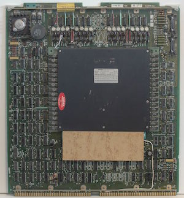

# Ruby Symbol Demo

## Objectives

By the end of this, students should be able to:

- Understand what a Ruby Symbol is.
- How Ruby symbols increase efficiency.
- When to use symbols.

## Instructions

Ruby Symbols are a Data Type. Take a look [Symbol Class](http://ruby-doc.org/core-2.2.0/Symbol.html)

You can think of a Ruby Symbol as a immutable String. A String that cannot be changed.

Why would we need a String that one could not change? We'll a couple of reasons. 

### Symbols Save Memory

Each instance of a String class, i.e. a string, is actually a new object that takes up space in memory. 

The amount of space it takes up will be determined by the number of characters in the string. 

It's really not a lot of memory for most strings but it can add up for all of the strings in your increasing large code base. 

Typically, strings take up a large percentage of a running program's allocated memory.

In the *old* days, memory was at a premium. 4K of memory was expensive and took up lots of physical space. 

** 4K Core Memory Board, about twice as large as a Macbook Pro**



If you create two strings with the same value they will each take up space in memory. 

```
 # Each of these strings will take memory space
 # Even if they have the same value!!
 "current_user"
 "current_user"

 # Lets use a symbol 
 :current_user
 
 # Now, whenever you reference a :current_user
 # in your code base you will ALWAYS reference
 # the same memory.
 :current_user
 
 # Each object in Ruby has an object_id that
 # See how two strings with the same value 
 # have different object_id
 "dog_food".object_id
 "dog_food".object_id
 
 # Each string above is it's own object and it takes up
 # memory. Even tho the strings have the sam
 # value, boohoo.
 
 :dog_food.object_id
 :dog_food.object_id
 
 # There is only ONE :dog_food symbol object in memory.
 # Yep, we're saving memory here.
 
```

### Symbols are quick to compare

Each symbol in a program is unique, it has a unique object_id. So, it's easy and quick to compare. 

*Unlike strings where the compare must check each character in the string*


### Symbols make great Hash keys.

We'll see more of how Ruby Hashes work. 

But, suffice to say that keys in Hashes should be immutable so that the Hashing function used to implement this data structure works well.

### Symbols are used for keyword arguments in function/methods.

```
# controller, action and id are symbols
url_for :controller => 'bug',
        :action => 'show',
        :id => bug.id
```
### Symbols work well with multiple threads

Since Ruby symbols are immutable they work well with threads. *We won't be using threads in this course, almost all Ruby programs are single threaded*

## Additional Resources

List additional related resources such as videos, blog posts and official documentation.

- [Ruby Symbols Explained](https://www.youtube.com/watch?v=mBXGBbEbXZY)
- [Official Ruby Symbol documentation](http://ruby-doc.org/core-2.2.0/Symbol.html)
- [13 Ways to look at a Ruby Symbol](http://www.randomhacks.net/2007/01/20/13-ways-of-looking-at-a-ruby-symbol/)
- [Ruby Quick Reference](http://www.zenspider.com/Languages/Ruby/QuickRef.html#symbols)
