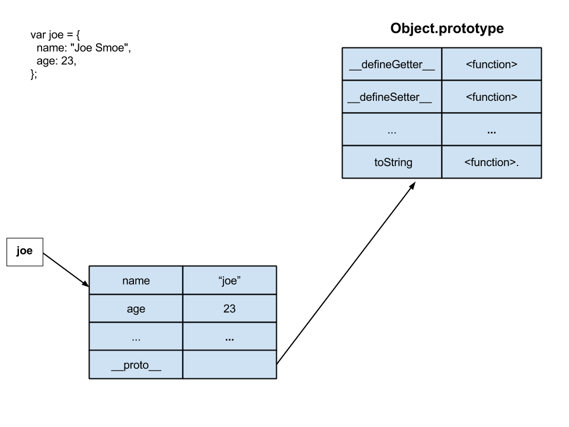
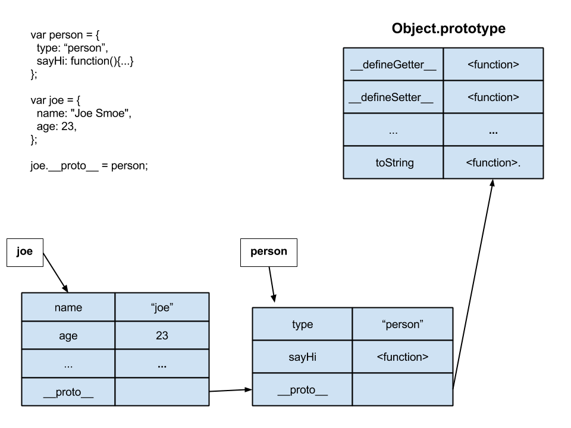
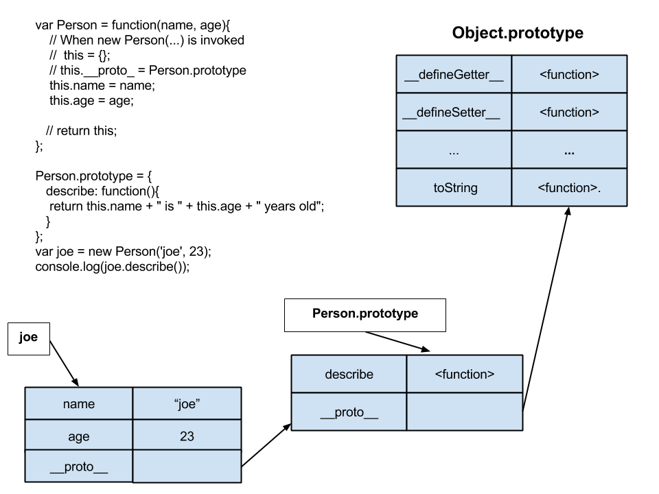

## Object Oriented Javascript 

[Javascript Background](Background.md)
## Objectives

* Learn about the most common ways to create Javascript Objects.
	* Object Literal.  
	* Factory Pattern.  
	* Constructor Function.  
	* ECMAScript 5 Object.create  
* Use Javascript Namespaces.
* Learn about Prototypes and Prototypical Inheritence.
* How Object property lookup works.
* How Object method lookup works.


## No Classes in Javascript.

Javascript does not have classes. _At least not yet, they are coming in ECMAScript 6_. 

But, it does provide a way to create structures that behave like classes. We'll see the few ways that we can create a _"class"_ in javacript. 


#### Two Ways to create a new Object

Create a file __js/sponge_bob.js__ 

```
// Create a new JS object to represent Sam.

// Using a Object constructor
var sam = new Object();
  
// Using a Object Literal. Preferred
var sam = {};
```

#### Four ways that properties can be added.

Create a file _js/sam.js_ . This will contain an Object literal for the person, sam.

**The most common way to create properties.**

```
// Create an object for Sam.
var sam = {
  name: 'sam'
};

// Setting the message property
sam.message = "Hello World";
console.log(sam.message);

// Setting the "first car" property
// Use the bracket notation only if the property
// name MUST be a value thats not allowed in the dot
// notation. Rare!
sam["first car"] = "1999 Ford Focus";
console.log(sam["first car"]);

```

**ECMAScript 5, ES5, added some features that give one more control over object properties.**

```

// Object#defineProperty method
Object.defineProperty(sam, "age", {
  value: 27,
  enumerable: true,
  writable: true,
  configurable: true
});
console.log("sam is " + sam.age + " yrs old");

// Lets delete sam's age property
delete sam.age;
console.log(sam.age);
// set configurable to false and run again.
// configurable will prevent property deletion.

// Lets change sam's age.
sam.age += 1;
console.log("sam is " + sam.age + " yrs old");
// set writeable to false.
// writeable prevents one from changing the the property value

// show sam again
console.log("\nShow all sam's properties");
// let enumerate over sam's properties.
for(var p in sam){
  // show sam's properties
  console.log("sam." + p + " is " + p);
}
// set enumerable to false
// enumerable set to false will remove the property
// from the set of properties that can be enumerated.

// Object#defineProperties.
// Change multiple properties at once.
Object.defineProperties(sam,
                        {
                          gender: {value: 'male'},
                          employed: {value: false}
                        }
                       );

// show sam again
console.log("\nsam after properties added");
for(var p in sam){
  // show sam's properties
  console.log("sam." + p + " is " + p);
};
```

**ES5 also allow one to create accessor functions for objects**

```
// Accessor properties.
// Does sam hate snow
Object.defineProperty(sam, "_hateSnow", {
  get: function(){ return this._hateSnow; },
  set: function(hate){
    this._hateSnow;
  }
});

sam.hateSnow = false;
console.log("Does sam hate snow? " + sam.hateSnow);

sam.hateSnow = true;
console.log("Does sam hate snow? " + sam.hateSnow);


```
### Lab

Create a file __js/sponge_bob.js__ 

I've only watched SpongeBob a couple of times. And it's been fun. But, I don't know many characters, or much about them.

Can each of you pick a couple of characters and create objects for them? Create simple properties for them, *no methods*. And use all four of the ways to create properties shown above.

Each character should have a name, age, description and isLikable properties.

Let's make Patrick's age property immutable.
SpongeBob's likable property can NOT be enumerated.
Nobody's name property can be deleted.

At the end of the file display each character's properties.


## Object Literals.

And Object literal is the simplest way to create an object in javacript. It may look like a Hash. It is not a Hash.


__Create a file js/simple.js with the below code and reference it from index.html.__

```
// Create an Object literal representing one person.
var joe = {
  name: "Joe Smoe",
  age: 23,
  // Property value is a function
  describe: function(){
	return this.name + " is " + this.age + " years old";
  }
};

// OR 
var jill = {};
jill.name = "Jill Smill";
jill.age = 32;

// Property value is a function
jill.describe = function(){
  return this.name + " is " + this.age + " years old";
}

console.log("Hey " + jill.name +  " where you going with that gun in your hand");
console.log("Hey " + joe.name + " are you really " + joe['age'] + " years old?");

```

An Object Literal:

* Has properties.
* Each property has a name and a value, name/value pairs.
* A property is typically a string, but can be it can be a number _(rare)_.
* A value can be a __Primitive__ or an __Object__, aka reference type.
* A value can be a __function__. We call these properties methods.
* A value can be based on the built-in Object, see above, or a user defined object.  
* By default is based on the build in Javascript [Object](https://developer.mozilla.org/en-US/docs/Web/JavaScript/Reference/Global_Objects/Object).  


__Inspect joe and jill in Chrome.__

## Lab

Let's give the Sponge Bob's characters some behavior. Add methods to these characters and display their behavior.  

### Object Literals with properties that are objects.

Object literals can have properties that are objects.

__Create a file js/simple_address.js with the below code and reference it from index.html.__

```
var jill = {
  name: "Jill Smill",
  age: 32
};
var fred = {
  name: "Fred Smoe",
  age: 27
};

// Objects can have objects.
// The siblings property's value is an Array
// The address property's value is a Object literal.
// The describe property's value is a Function, which is also an object.
var joe = {
  name: "Joe Smoe",
  age: 23,
  occupation: "Software Developer", 
  siblings: [
	jill,
	fred,
  ], 
  address: {
	street: '44 Warren St.',
	city: 'Stoneham',
	state: 'MA',
	zip: 01345,
	display: function(){
	   return this.street + " " + this.city + ", " + this.state;
	}
  },
  describe: function(){
	return this.name + " is " + this.age + " years old";
  }
};

console.log(joe.name + "'s address is: " + joe.address.display());

// Show all the properties and their value.
for(var prop in joe){
  console.log(joe.name + " property = " + prop + ", value is " + joe[prop]);

}

```

__Inspect joe and jill in Chrome.__

## Lab

Let's give the Sponge Bob's characters a location property that is a object with an address, city and state. _Ya, I know, they don't really have addresses_. 

### Objects properties and methods can change anytime.

Here we are pointing the the joe object literal's describe property at another function.


__Append the below code to js/simple_address.js.__

```
// Can change the describe function later, at runtime.
// by setting the describe property
joe.describe = function(showDetail){
  var info;
  if(showDetail){
    info = this.name + " age is " + this.age + ", address is: " + this.address.display();
  }else{
    info = this.name + " is " + this.age + " years old";
  }
  return info
};

// describe joe.
console.log(joe.describe(true));

// describe joe in detail
console.log(joe.describe(false));

```

### Prototypical Inheritence

Each object will have an internal ``__proto__`` property that can point to another object. Each object also has a prototype property. **These are NOT the same**.  

The ``__proto__`` is a often hidden internal property on an object. *Most browsers will let you see it tho*. An Object Literal's ``__proto_`` property will point to the [Object.prototype](http://goo.gl/C568wU) property by default when the object is created.  

This Object 'class' prototype object has a bunch of attributes and methods.

An object's ``__proto__`` pointer will be used to lookup properties, _(values and methods)_. 

  

For the example above:  
* When one calls joe.toString().  
* js will look for the property toString in the joe object literal.  
* It will __not__ be found.  
* js will look for the property toString in the object pointed to by ``joe.__proto__``. _This is the Object.prototype._    
* js will find the toString method on Object.prototype and execute it.  


__By setting this ``__proto_`` property we can _simulate_ object inheritance.__  

___Create a file js/simple_prototype.js with the below code and reference it from index.html.__

```
var person = {
    type: 'person',
    sayHi: function(msg){
      return this.name + " says " + msg;
    }
};

debugger;
// Check the __proto__ property of person
// It should point to the Object.prototype

// In the console enter person.toString()
// The method will be found by following the object pointed to by the __proto__ property.

// Create an Object literal representing one person.
var joe = {
  name: "Joe Smoe",
  age: 23,
  // Property value is a function
  describe: function(){
    return this.name + " is " + this.age + " years old";
  }
};

console.log("Hey " + joe.name + " are you really " + joe['age'] + " years old?");

debugger
joe.__proto__ = person;

// The sayHi property for joe will be found by following joe's 
// __proto___ property. 
console.log(joe.sayHi("hey there"));
```


 

For the example above:  
* When one calls joe.sayHi("hey there").  
* js will look for the property sayHi in the joe object literal.  
* It will not be found.  
* js will look for the property sayHi in the object pointed to by ``joe.__proto__``. This is the person object.  
* js will find the sayHi method on the person object and execute it. 

### Use Object Literals for objects that are only created once.

What if we want to create a lot of people? 

We will have to create lots of object literals and each time a property or method changes we'll have to change each object literal in the program. _Makes maintainence very difficult and the code not DRY_

For example, we want to change each person to have an occupation
that is shown in the describe function?

Use Object literals for instances that will exist only once, Singletons, in your application. For example,if you have only one  Company or Team in you app then create only one instance of it. 

Later, we will see how to emulate a class in Javascript that will be used to creates instances, objects, of something.

### Using Object Literals to create a Namespace.

Javascript namespaces are used to disambiguate names in an application. This is so that names in an application do not conflict.

Typically, name conflict may happen when using a third-party library or plug-in.

_We will use namespaces later when we create objects._

__Note:__  
_The var PersonApp = PersonApp || {}; will be set in each file that uses the namespace._ 

_Only the first file will actually set the PersonApp to {}. The other files will just assign PersonApp to itself._

```
// create a namespace for this PersonApp 
// If PersonApp object already exist than set it to itself.
// Otherwise set it to an empty object literal.
var PersonApp = PersonApp || {};

// Namespace an object literal
PersonApp.joe = { name: 'joe', age: 23 };

// Namespace a Factory 
PersonApp.createPerson = function(){ ... };
var joe = PersonApp.createPerson('joe', 23);

// Namespace a Constructor Function
PersonApp.Person = function Person(){ .. };
var jill = new PersonApp('jill', 33);

```

## Object Creation Patterns.

The problem with Object Literals is that they can get very tedious. For example, if we have to create a new object literal for each Person and there are many people. 

Or I may want to add a property or change a method for a person then I MUST do this for every single person in the app!

__Use Object Literals for objects that are only created once.__

Let's look at some ways we can create Objects.

* Factory Pattern
* Constructor Function
* ECMAScript 5 Object.create


### The Factory Pattern (optional).

The Factory Pattern will use a function to create object literals. The arguments to the factory function will be used to initialize and set the object being created. 
 
[Factory Pattern](FactoryPattern.md)


## LAB

Redo the Sponge Bob code using the Factory pattern. 

## Demo

### The Constructor Function Pattern.

This is the most common way to create objects in Javascript. It's the most common way to implement Classes. This pattern is used with the javascript _new_ keyword to create objects.

Many environments, including browsers, are optimized to use this kind of constructor. The *convention* is to uppercase the first name of a function that will be used as a constructor.


__Create a file js/constructor_function.js with the below code and reference it from index.html.__


```
debugger;

// Constructor Function object creation
// Constructor function is camel cased by convention. 
var Person = function(name, age){
  // When new Person(...) is invoked
  // this = {};
  // this.__proto_ = Person.prototype
  debugger;

  this.name = name;
  this.age = age;
  
  // return the this pointer
  // return this;
};

Person.prototype = {
   describe: function(){
    return this.name + " is " + this.age + " years old";
   }
};

var joe = new Person('joe', 23), 
  jill = new Person('jill', 32);

console.log(joe.describe());
console.log(jill.describe());
```

__BIG NOTE:__ The _``__proto__``_ property is NOT the same as the _``prototype``_ property.   
The ``__proto__ `` property is __ONLY__ used for object property lookup.  
The ``Function.prototype`` property will only exist for functions.  

##### Property Lookup and the Prototype.  

Whats happening when we call joe.describe().  

For the example above:  
* When one calls joe.describe();  
* js will look for the property describe in the joe object literal.  
* It will not be found.  
* js will look for the property describe in the object pointed to by ``joe.__proto__``. This is the Person.prototype object.  
* js will find the describe method on the Person.prototype object and execute it. 


 


__Run the above code and look at the Person.prototype and object ``__proto__``  properties.__


## LAB
Redo the Car Lot Lab above using Constructor Functions. __Do all your work in the cars_constructor_function branch.__

## Demo
### Object.create (optional)

ECMAScript 5 defined a new way to create an object. Object.create(...).

You will be seeing this more as time goes on and developers make use of this. For now, we will be using the Constructor Function to create objects.

[Object.create](ObjectCreate.md)

### References
* [MDN Object Oriented Javascript](https://developer.mozilla.org/en-US/docs/Web/JavaScript/Introduction_to_Object-Oriented_JavaScript)

* __Zakas, Nicholas C. (2011-12-20). Professional JavaScript for Web Developers__  
Chapter 6.  
	* The Factory Pattern.  
	* The Constructor Pattern  
	* Constructors as Functions  
	* The Prototype Pattern  
	* How Prototypes Work  
	* Alternative Prototype Syntax  
	* Dynamic Nature of Prototypes 
	* Problems with Prototypes  
	* Combination Constructor/ Prototype Pattern  

* [Object Playground](http://www.objectplayground.com/)
* [The Four Layers of Javascript OOP](https://www.youtube.com/watch?v=VJOTcUsD2kA&app=desktop)

## Summary.

* Javascript is standardized by ECMAScript. Currently we are using ECMA 5, but ECMA 6 is right around the corner with new functionality.
* Primitves Types are built-in and atomic.
* Some Primitves Types have object wrappers.
* Primitive Types are assigned to variables and properites by value.
* Reference Types, Objects, are assigned to variables and properties by reference.
* Object Literals are somewhat like Maps or Hashes in other languages.
* Object Literals should only be used when you ONLY need one instance of an object.
* Creating Objects with the Factory Pattern, or Factory method.
* Creating Objects with the new keyword and Constructor functions. __USE THIS METHOD__
* Creating Objects with Object.create(...).
* Most prevalant way to create objects is with the 'new' keyword and Constructor Functions.
* Learn about Prototypes and Prototypical Inheritance.
* Learn about property and method lookup.


