## Objectives
- Create branches on a Git repository and make commits on those branches.
- Combine changes from one branch with another using `git merge`.
- Combine changes from one branch with another using `git rebase`.

## Prerequisites
- Basic Git workflow
- Pre-reading:
  1. https://www.atlassian.com/git/tutorials/using-branches
  2. https://www.atlassian.com/git/tutorials/comparing-workflows
  3. https://www.atlassian.com/git/tutorials/merging-vs-rebasing ('Conceptual Overiew' section)

## REVIEW :: Basic Git Workflow

Although you've all been using Git and Github for over a month, it's still worthwhile to take a look at some of the core ideas of Git.

#### Q: Why Use Version Control?
When you're working on a project, you sometimes want to be able to retrace your steps, or even revert your project to a previous state.  And often (particularly in the workplace) you need a way to effectively collaborate on a single project without stepping on each others' toes. Version control tools address all of these needs.

#### Q: Why Git?
Git, apart from being free and open source, is also in many ways a superior system to many older version control tools (such as Subversion) because it is a "distributed" version control tool. This means that there is no centralized approval structure for making changes to the project; instead, every person who clones the repository has their own complete copy, which they can then edit and change. This makes it much easier to use when working in groups.

>In addition, Git is much better at handling branching and merging, two big topics we'll be covering today.

#### Q: How Does Git Work?
Git works by creating ['snapshots'](https://git-scm.com/book/en/v1/Getting-Started-Git-Basics), which record the current state of a repo. Each snapshot represents the state of the project at some moment in time.

To create a new snapshot, we use `git add` to select (or "stage") a file or files that have changed since our last snapshot, and `git commit` to actually create a new snapshot which includes those changes.

As a rule of thumb, when working full-time on a project you should make at least three commits a day, and probably closer to five or ten. Yes, really!

## Structure of a Git Repo

A Git repository can be imagined as a tree of interconnected nodes, each representing a commit/snapshot. Each of these nodes refers back to one (usually) previous node, which represents the state of the repository before that commit was made.

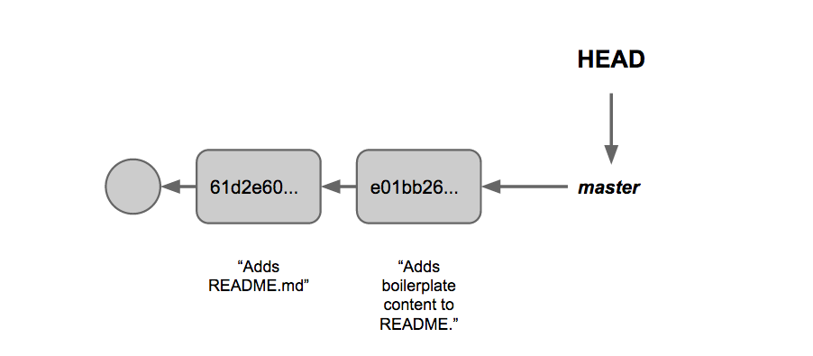

Each commit also has a unique name (which allows us to identify it) and a commit message (which tells us what changes the commit makes). `master`, above, is a __branch__ : a reference pointing to some commit in the 'tree' of our repository. New commits can only be made at the end of a branch.

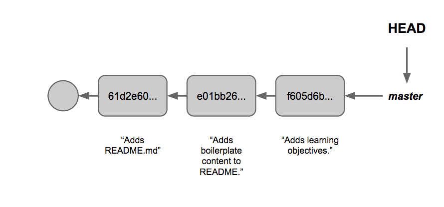

## Branching

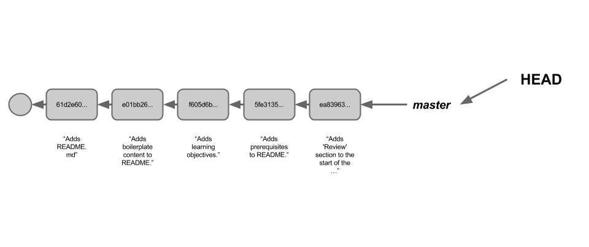

In the diagram above, alongside `master` there's another reference called `HEAD`. `HEAD` indicates the point on the repository that we're reading from. When we run `git branch`, new branches get added at wherever `HEAD` points. For instance, if we were to run `git branch structure` on the repo above, here's what would happen.

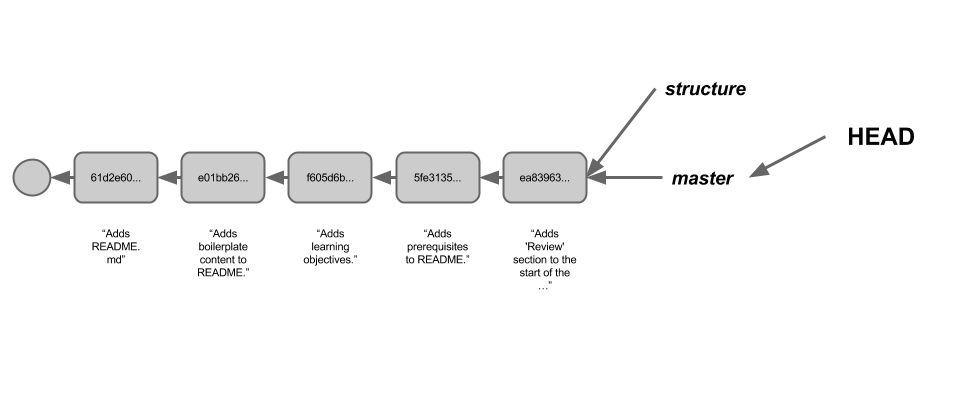

In addition to specifying where new branches go, if HEAD is pointing at the end of a branch, it also means that new commits will be added to that branch. If we want to start adding commits to our new `structure` branch instead of our `master` branch, we have to move `HEAD`; this is done using the command `git checkout`. In particular, we want to checkout the `structure` branch, so we would run `git checkout structure`.

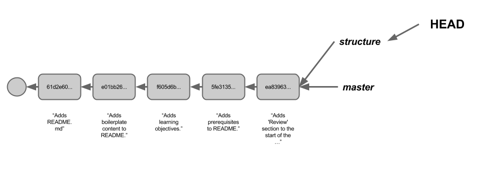

New commits would then be placed onto the `structure` branch.

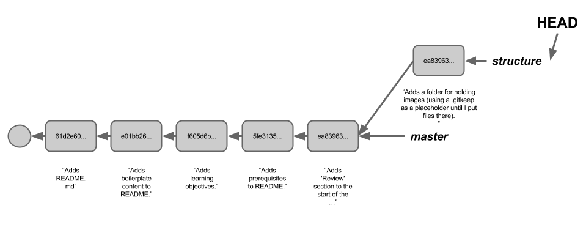

### Lab : Part 1

Over the course of the day, we're going to work on a project together - building a simple front-end app. Pick one person in your group to make a new repo.

In the master branch of your repo, you should start out by
  - Creating a template HTML file (`index.html`), a blank CSS file (`styles/main.css`), and a blank JS file (`js/main.js`), and link them all together.
  - Creating a `.gitignore` file inside your repo with the following contents:

    ```
      .DS_Store
      .tmp
      node_modules/
      npm-debug.log
      bower_components/
    ```

  - Making a blank README.md file.
  - Running `npm init`, `npm install bower`, and `bower init` to download and set up NPM and Bower for your project.

Make commits as appropriate.

Once that's done, make two new branches - one called `ui` and one called `ajax`.

1. Check out the `ui` branch. Add a `<div>` element with a `<ul>` inside it to your HTML file, and give these elements some styling.
2. Check out the `ajax` branch, install jQuery using Bower, and link to it from your HTML page. Then, write the following AJAX request into your `main.js` file.

```javascript
  $(document).ready(function(){
    var root = 'http://jsonplaceholder.typicode.com';
    $.ajax({
      url: root + '/posts',
      method: 'GET'
    }).done(function(data) {
      console.log(data);
    });
  });
```

When your group is finished, tip your laptop screens down.

## Merging

Once you've created all your different branches, you need a way to bring them all back together again. One way that Git allows us to do this is by __merging__ branches.

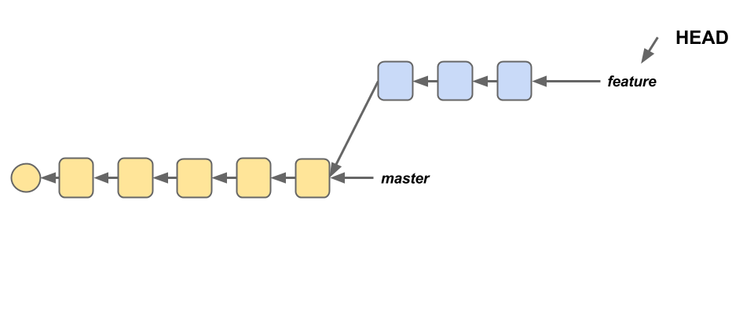

Merging creates a **new commit on your current branch** (on top of existing commits) that includes all of the changes made by another branch. The syntax for doing this is `git merge some_branch`, where `some_branch` is the branch that you're pulling into your current branch.

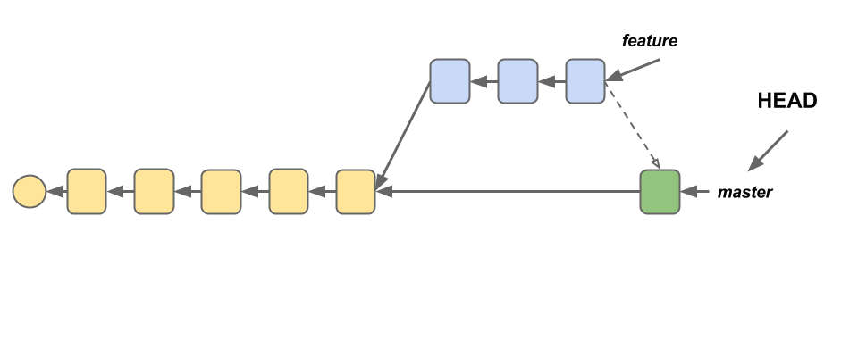

This doesn't destroy your original branch; all those commits are still there. However, they're not carried over to the current branch, only their data is.

What if someone got overzealous and made a change to `master` before we merged in `structure`? Well, if the change doesn't conflict with anything in `structure`, probably nothing! Git tries very hard to merge automatically. However, sometimes there are conflicts that Git can't resolve on its own.

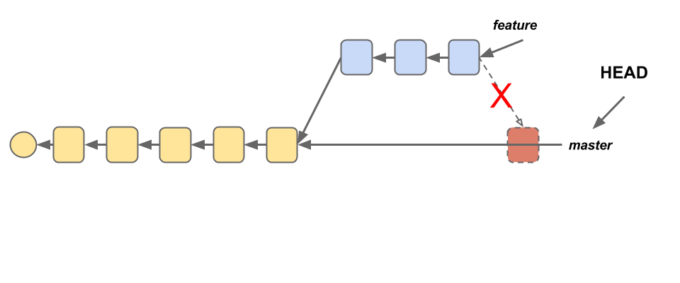

In those cases, instead of directly merging, Git asks the user to manually resolve the conflicts. That usually looks something like this:

```javascript
  <<<<<<< HEAD
  var x = 1,
      y = 2;
  =======
  var x;
  >>>>>>> other_branch
```

The first section is the version that exists on the current branch; the second section is the version that exists on the branch you're trying to pull in. Figure out which one is right, delete all the extra stuff that Git adds (`<<<<<<<`, `=======`, etc.) and run `git commit` to finalize the merge.

### Lab : Part 2

Now that you've created some branches in your team's project, you're going to try merging them.

1. Check out the `ui` branch.
  - Add a button to your page with the id "magic-button".
  - Make some further changes to the style - however you like.
  - Merge the `ui` branch back into `master`.
  - Delete the `ui` branch using the command `git branch -d ui`.
2. Check out the `ajax` branch.
  - Swap out the `console.log` code in the `done` handler for some code that will (a) clear out the contents of the `<ul>` on our page, and (b) for each object in the response, append a new `<li>` element that contains the object's title.
  - Rename `main.js` to `app.js` using a special git command for renaming/moving files within a repo, and update the HTML file to match.
  - Merge the `ajax` branch back into `master`. Do you hit any merge conflicts? If so, resolve them and make a new commit to finalize the merge.
  - Make a new `ui` branch from the current location and check it out. Then, go to app.js and put the AJAX GET request inside a click handler for the button.

When your group is finished, tip your laptop screens down.

## Rebasing

While merging represents one path for combining different branches, there is another common path called `rebase`. Rebasing works differently than merging. Rather than combining the finished data from two different branches via a single commit, it combines the two branches _themselves_, rearranging them and, effectively, re-writing history.

Here's what a rebase looks like. Suppose we have two branches, like this.

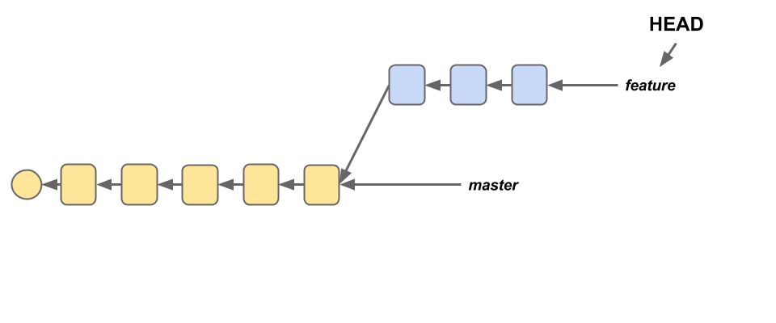

One day, someone makes a commit onto the `master` branch. We want to include those changes into our feature branch, so that our code doesn't conflict with theirs.

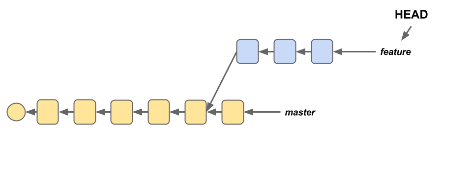

From our feature branch, if we run the command `git rebase master`, we can tell git to rewrite the history of our feature branch as if the new commit on `master` had __always been there__.

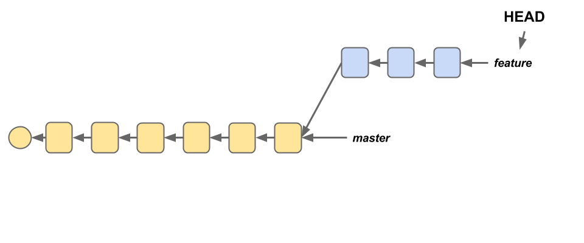

Rebase is extremely useful for cleaning up your commit history, but it also carries risk; when you rebase, you are in fact discarding your old commits and replacing them with new (though admittedly, similar) commits, and this can seriously screw up a collaborator if you're working in a shared repo.The golden rule for `git rebase` is "Only rebase **before** sharing your code, **never** after."

Like `git merge`, `git rebase` also sometimes runs into merge conflicts that need to be resolved. The procedure for doing this is almost the same; once you fix the conflicts, run `git rebase --continue` to complete the rebase.

### Lab : Part 3

Go back to your project and check out the master branch. After implementing each of the following changes, check out your `ui` branch and try to rebase. If and when you run into conflicts, do your best to resolve them.

- Use Bower to install Handlebars, and add a link to it from your HTML file.
- Change the color scheme of your page in your CSS.
- Change the `<ul>` in your HTML to an `<ol>` (ordered list) and update your JavaScript accordingly.

When your group is finished, tip your laptop screens down.

## Team Workflows

So far, we've only talked about Merge and Rebase in the context of working alone. Here are a few examples of workflows that might get used in the field.

### Single-Remote Workflows
One thing all of these approaches have in common is the necessity of staying on top of changes to a single shared repository. This is usually accomplished by running `git fetch`, which pulls updates from origin, and merging those updates; alternatively, you could use `git pull` to do both at once.

#### Centralized Workflow
**How It Works**: The remote repo has one single branch on it, `master`. All collaborators have separate clones of this repo. They can each work independently on separate things. However, before they push, they need to run `git fetch`/`git pull` (with the `--rebase` flag) to make sure that their master branch isn't out of date.

(+) Very simple

(-) Collaboration is kind of clunky.

#### Feature Branch Workflow
**How It Works**: This workflow is very similar to the 'Centralized' workflow. The biggest difference is that there are branches (which helps to keep feature-related commits isolated), and that instead of pushing changes up directly, collaborators (a) push up changes to a new remote branch rather than master, and (b) submit a pull request to ask for them to be added to the remote repo's `master` branch.

(+) Better isolation than Centralized model, but sharing is still easy. Very flexible.

(-) Sometimes it's too flexible - it doesn't distinguish in any meaningful way between different branches, and that lack of structure can be problematic for larger projects.

#### 'Gitflow' Workflow
**How It Works**: Similar to the Feature Branch workflows, but with more rigidly-defined branches. For example:
- Historical Branches : `master` stores official releases, while `develop` serves as a living 'integration branch' that ties togther all the standalone features.
- Release Branches : 'release' branches might exist for any given release, to keep all of those materials together.
- Feature Branches : pretty much the same as in the prior model.
- Maintenance/'Hotfix' Branches : branches used to quickly patch issues with production code.

(+) Highly structured - works well for large projects.

(-) Sometimes overkill for something small.

### Distributed Workflows
These approaches all use multiple remote repos; typically, everyone has their own fork of the 'original' project (the version of the repo that's publicly visible and is managed by the project maintainer), and changes are submitted via pull request.

#### Integration Manager Workflow
**How It Works**: One collaborator plays the role of 'Integration Manager'. This means that they are responsible for managing the official repository and either accepting or rejecting pull requests as they come in.

(+) One person integrates all changes, so there's consistency.

(-) Could get overwhelming for large projects.

#### Dictator/Lieutenants Workflow
**How It Works**: This workflow is very similar to the Integration Manager Workflow. The biggest difference is that rather than submitting all pull requests to a single integration manager, PRs are funneled through 'Lieutentants', who all report to the 'Dictator'. Only the Dictator has write access to the official repo.

(This workflow basically has the opposite tradeoff of the previous one).

### Lab : Part 4

Now that you've practiced doing branching, merging and rebasing on a single machine, your next challenge will be to use these tools in the context of a larger Git workflow, spanning your entire team.

As a team of four, create a simple front-end app of your own choosing by following one of the Git workflow patterns described above. Make commits regularly, in case you need to undo a mistake. If you finish, and there's still time, try putting together a back-end for your front-end.

## Further Reading
- http://git-scm.com/book/en/v2/Git-Branching-Branches-in-a-Nutshell
- http://git-scm.com/book/en/v2/Distributed-Git-Distributed-Workflows
