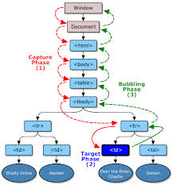
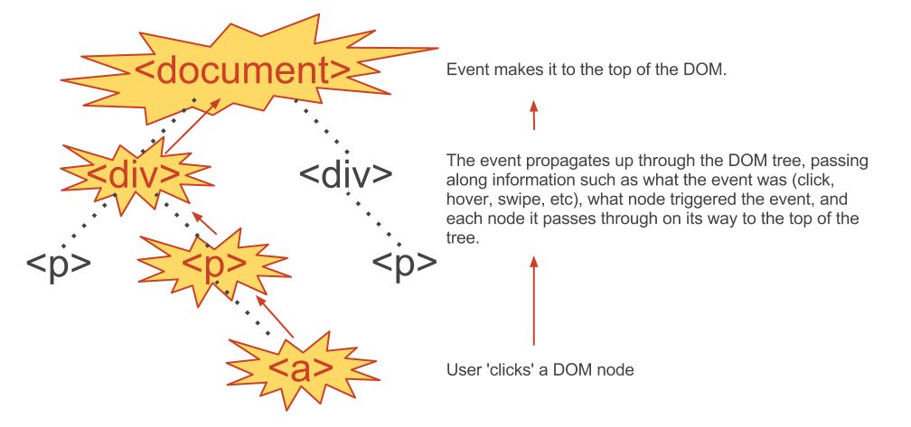

# Javascript Events

Events are _fired_ or _triggered_ in response to some action in the browser. Typical events are.  

* Click Events  
* Page Load Events
* Form Events
* Mouse Over Events.

## [DOM Events](http://en.wikipedia.org/wiki/DOM_events)
Take a  look at these [Events](http://en.wikipedia.org/wiki/DOM_events#Common.2FW3C_events).

### Events can have.
* Type  
	What kind of event it is. For example, mousemove, keydown, click, doubleclick are all event types.

* Target  
	Object where the event happened. For example, an element, a window can be event targets.
	
* Handler  
	Function that gets invoked when an Event is fired.
	
	
	
Each Event has an event object that has a set of properties associated with it. This object is created when the Event is fired. Some properties are the event type and target.

### Event Handlers.
For most browsers, not IE, use the addEventListener function to create a event handler.  

[EventTarget.addEventListener](https://developer.mozilla.org/en-US/docs/Web/API/EventTarget.addEventListener)  

<code>
	document.getElementById('some-id').addEventListener(<event>, <event-handler>, <use_capture>);
</code>

We are __not__ going to go over IE functions for event handling. We'll use a library, like jQuery, that will provide event handler functions for IE and standards compliant browsers like Chrome, Firefox and Safari.

### Demo Steps
1. simple_button.html
2. simple_button2.html
3. simple_button3.html (Level 2 DOM Events)

### DOM Simple Event Lab.
Fork, clone and complete this. [Lab repo](https://github.com/ga-wdi-boston/wdi_7_js_lab_simple_events)

## Event propagation.
How the events travel through the DOM. 

1. The capture phase: The event object must propagate through the target's ancestors from the defaultView to the target's parent. This phase is also known as the capturing phase. Event listeners registered for this phase must handle the event before it reaches its target.

2. The target phase: The event object must arrive at the event object's event target. This phase is also known as the at-target phase. Event listeners registered for this phase must handle the event once it has reached its target. If the event type indicates that the event must not bubble, the event object must halt after completion of this phase.

3. The bubble phase: The event object propagates through the target's ancestors in reverse order, starting with the target's parent and ending with the defaultView. This phase is also known as the bubbling phase. Event listeners registered for this phase must handle the event after it has reached its target.

[W3C Event Flow](http://www.w3.org/TR/DOM-Level-2-Events/events.html#Events-flow)

### Event Capturing.
The first phase of propagation is __capturing__. Each ancestor of the element that is the target of the event __may__ intercept the event and either ignore the event of do some processing.  
__IE does NOT implement Event Capturing, it only implements Event Bubbling__

 _Each event handler may stop capturing by calling event.stopPropagation();_

### Event Bubbling.
The last phase of propagation is __bubbling__. The event can __bubble__ up the DOM tree. Each ancestor of the element generating the event will recieve the event after the target element This event is __bubbling up__ the DOM tree.   

_Each event handler may stop capturing by calling event.stopPropagation();_

### Handling Events on _future_ DOM elements.
Sometimes you will want to set handlers for DOM elements that will be inserted in the future. You can leverage event bubbling to handle this case. An ancestor DOM element may hold a handler for all, of some subset, of it's children. The way to do this is to :

1. Add an event handler to an ancestor of this future element.
2. In this ancestor event handler check the event.target, this is the __source__
	 of event.
3. If the event.target is the correct element then respond, do something.
	* You can check the event.target id or class in this handler to determine how to respond to events fired on specific child elements.

This is a general techinque that is used when dynamically, at runtime, inserting nodes into the DOM. __ Ajax requests may insert DOM elements__.

### Reducing Event Handlers.
If you have an element, like a list, with many children. It's not efficient to set handlers on each child element. __In this case set the handler once on an ancestor element__.

### Demo Steps
1. Show how events can be captured and bubble up to ancestor elements. We'll create a parent div around the button. Then set a handler on this parent div. We'll show the event's target and current target. And what these two properties change. simple_button4.html 
2. dynamic_list.html

### DOM Event Propagation Lab
Fork, clone and complete this. [Lab](https://github.com/ga-wdi-boston/wdi_7_js_lab_record_company).

## This pointer in Event Handler.
The problem is that the _'this'_ pointer in an event handler points to the element that fired the event. 

If we want the _'this'_ pointer in the event handler to point to the same object that defined the handler we can use the javascript _bind_ function. 

### Demo Steps
1. this_pointer.html 
2. this_callback.html

