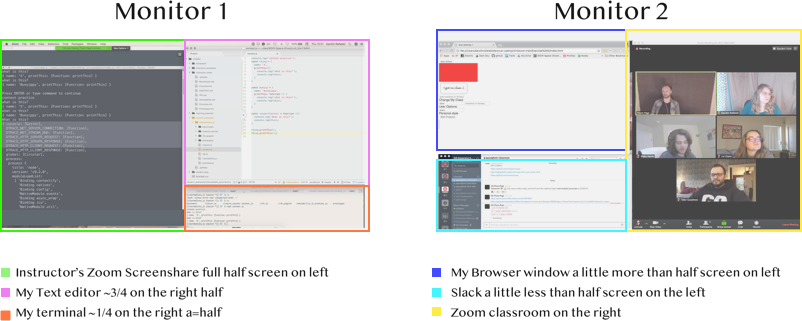

**Title:** Developer Habits & Setting Up for Success  
**Creator:** Kristyn Bryan 
**Adapted by:** Cathleen Wright, Karolin Rafalski, Grant Knief, Kenny Cruz, Esin Saribudak 
**Competencies:** Productivity Hacks, VS Code Extensions & Shortcuts, Command Line & Keyboard shortcuts  
**Prerequisites:** VS Code, CLI 

## Objectives

- Students will download and use VS Code extensions that enrich and improve the coding experience
- Students will be able to utilize shortcuts on the keyboard, Rectangle, terminal, and VS Code
- Students will start building good habits and gain an understanding of how to be a more efficient coder

## Agenda

- Preface: The importance of starting good habits today
- Part 1: Productivity Tools with Toby and Rectangle
- Part 2: VS Code Extensions, Settings and Shortcuts
- Part 3: Mac Shortcuts\*
- Part 4: Terminal Shortcuts\*
- Part 5: Typing\*
- Further Reading & Resources

## Preface: Start Good Habits Today

As an aspiring software developer, you have a lot to learn. One really critical thing to focus on is starting good habits as early as possible. If you teach yourself the most efficient ways to do things now, you won't have to go back and correct yourself later. You'll also learn to code faster and have a better workflow, where you won't lose minutes switching between applications and windows, and resizing windows to maximize efficiency. Utilizing keyboard shortcuts will also help you type faster and let you focus on the task at hand.

A lot of these steps will feel awkward at first, but the more you use them, the sooner they'll become second nature and be engraved into your muscle memory. Part of succeeding is just taking a deep breath and taking a moment to practice the better way, then it'll get easier and easier.

There are hundreds, if not thousands, of little things you can do to make you a more effective coder. Here we're going to focus on a small group of things that will have the biggest impact on maximizing your efficiency as a developer.

:closed_lock_with_key: We will be downloading applications to your computer. Make sure you have the password for your Mac in order to proceed.

## Part 1 - Productivity: Toby & Rectangle

### Toby

This free Chrome [extension](https://chrome.google.com/webstore/detail/toby-for-chrome/hddnkoipeenegfoeaoibdmnaalmgkpip?hl=en) helps you keep track of all your important websites. You can see all your options at once, which is much more user-friendly than having a bunch of bookmarks hidden away in tabs.

1. Click on the link above and install.
2. Customize your tabs and add the links that you want to have at your disposal every time you open a new Chrome tab!

### Rectangle

- Rectangle helps you handle window management and screen real estate efficiently. The app allows you to move and resize your screens with the a few clicks on your keypad. You no longer have to waste time using your mouse to rearrange the size of the screen.
- Not only will this help to save you time, but it will help to add to the illusion that you are a sup3r c00L h4ck3r. 🤓
- Note: If you already have a window management tool that you use and enjoy, feel free to disregard this installation and continue to the next part.

### :computer: Click on this link https://rectangleapp.com/ and download and install Rectangle.

Once the download is finished, follow the install instructions provided on screen. Double-click the app from your Applications folder to launch it. 

### Allow Rectangle

- Rectangle needs to change your computer's privacy settings to allow this application. To do this, in your Spotlight (open with `cmd` + `space`), type **Security & Privacy** or open **Security & Privacy** from the **System Preferences** icon in the dock. 
- Click on the **Privacy** tab and scroll down to **Accessibility**. 
- Click on the lock in the bottom left. You will be prompted to enter your computer password. 🔐
- Click on Rectangle to give it permission. 🔏

- Click on the lock again to save the changes.🔒

### Update Rectangle Preferences

The default keyboard shortcuts are great, but you can customize your shortcuts with your own key sequences by going to the Rectangle icon in your menu, Preferences, and entering in your preferred shortcuts for given screen layouts.

#### :hourglass: Activity 

- Try to organize your windows using Rectangle (and then adjusting as needed) like so:

Monitors

## Part 2 - VS Code Bonus Extensions, Shortcuts & Settings

As part of Installfest, you should have already installed VS Code and the recommended extensions. We also set up the `code` command in your PATH and updated `settings.json` so that your code editor formats automatically!

There are many ways you can continue to customize and refine your VS Code setup. You can always access the Extensions tab on your VS Code interface by pressing `shift` + `command` + `x` or select the four-square icon with one square coming out (see screenshot below). You can install extensions by searching for them manually and selecting the green `Install` button. The correct extension is generally the first one to return in search results and with the most downloads and reviews.

**Here are a few more helpful extensions to consider adding to your VS Code setup**:

- **Auto Rename Tag**: automatically renames tags
- **Auto Close Tag**: automatically closes tags
- **VS Code Icons**: custom file icons
- **GitLink**: allows you to quickly find GitHub links to your files
- **Git Lens**: shows status and owner of changes to Git-tracked files
- **Live Share**: Allows you to simultaneously work in VS code files with other developers in real-time (like Google docs), which will be very useful for pair-programming in future assignments 👩‍💻👩‍💻
- **Peacock**: Allows you to select different background colors for multiple code editors 🎨 (useful if you're working on two different projects, like a frontend and a backend, to quickly tell the two apart):

## VS Code Shortcuts & Hacks

### HTML Boilerplate

Every HTML document needs the same basic skeleton. There's an easy way to do this with the Emmet tool built into VS Code:

- Go into the `index.html` file in this directory. Type `!` and hit the `tab` key (above caps lock). The boilerplate should autocomplete (this saves us a lot of time).
- File types matter when using extensions. Notice that we're using these extensions in an `.html` file!

### Selecting Code

- To select the same word or values in multiple places in your document, use `command` + `d`
- To move a line of code up or down, move your cursor to the line, press `option` and use the `up` or `down` arrows.
- To quickly move through lines of code horizontally, use `option` + `left` or `right` arrows to move by word, and `command` + `left` or `right` arrows to move to the beginning or end of the line.
  > Try these out yourself in this directory's `index.html` file.

### Commenting Code

Whether you're in an HTML, CSS, or JavaScript file, if you want to comment out your code (have the program ignore some lines of code), you can highlight your code and use one command: `command` + `/`.

> Try these out yourself in this directory's `index.html` file.

:eyes: Commented out code looks different depending on the file type, so you'll use this shortcut frequently!

### Split Screen

- If you have more than one file that you'd like to look at in VS Code, you can go up to `View` --> `Editor Layout`and then choose how you would like your panes to be displayed. Two or even three panes can help your workflow!  

Or you can click and drag the tab to where you'd like your new pane to be!

- You can also click and drag the tab, a 'shadow' window will appear of where the tab will go and split, if it is right, just let go, if you want it somewhere else, keep dragging it around.

### Emmet Shortcuts

Emmet is a developer toolkit that is built right into VS Code. There are a ton of amazing shortcuts that will come in handy when writing frontend code.

Check out the documentation on Emmet's integration into VS Code [here](https://code.visualstudio.com/docs/editor/emmet).

### VS Code Built-in Terminal

Anytime you need to access the terminal from your project directory, go to the VS Code Menu -> `Terminal` -> `New Terminal`. You can also use the keyboard shortcut `control` + `~` (to get the tilde, press `shift` + backtick). This is a convenient place to access terminal for use with Git, folder and file creation/movement/deletion, and much more!

## Part 3 - Mac Keyboard Shortcuts

> For students with previous Mac experience who feel comfortable navigating their machine quickly and effectively, Parts 3, 4 and 5 are optional but still strongly suggested -- you might learn a new shortcut or two that could help you become a more efficient coder!

### Shortcuts for any occasion!

- Here are the shortcuts that you will use most often:

|     Shortcut     |                                                  Description                                                  |
| :--------------: | :-----------------------------------------------------------------------------------------------------------: |
|    Command-A     |                                             Select **All** Items                                              |
|    Command-C     |               **Copy** the selected item to the Clipboard. This also works for files in Finder                |
|    Command-S     |                                                 **Save** file                                                 |
|    Command-V     | **Paste** the contents of the Clipboard into the current document or app. This also works for files in Finder |
|    Command-X     |                        **Cut** (remove) the selected item and copy it to the Clipboard                        |
|    Command-Y     |                       **Redo** - redo something you undid (when you've used Command-Z)                        |
|    Command-Z     |                                     **Undo** the previous command/typing                                      |
|   Command-Tab    |                                       Toggle between open applications                                        |
| Command-Shift-3  |                                     Take a screenshot of the whole screen                                     |
| Command-Shift-4  |                                    Take a screenshot of a selectable area                                     |
| Command-Spacebar |                                                Open Spotlight                                                 |
| Option-Command-J |                                    In Chrome, opens **Dev Tools/Console**                                     |

#### :hourglass: Optional Self-Guided Activity

- Open this repository in VS Code if you have not yet done so.
- Make a file called `script2.js` from the terminal built into VS Code.
- Copy ALL (command A) the text from this file (you can copy from the browser)
- Paste (command V) the text into your new file
- Save (command S) - there is a blue dot on the top tab of your file that should disappear once your file has successfully saved
- Undo (command Z) - your text should go away
- Redo (command Y) - your text should come back
- Cut (Command X) - the title of your copy of this document
- Paste (Command V) - to the bottom of your copy the document
- Save (Command S) - one final time
- take a screenshot of something

:computer: [Additional Mac Keyboard Shortcuts](https://support.apple.com/en-us/HT201236)

## Part 4 - Terminal Shortcuts

- You will find yourself having to re-run applications when testing your app or you will find yourself needing to retype certain lines over and over again. Be lazy! It will give you more energy for the important stuff.

#### Command Line Shortcuts

##### The two most handy ones for you right now are the up arrow and tab:

If you would learn any two - learn these!

:arrow_up: Are you running the same command over and over again? Use the **up arrow** to show your previous commands. Hit **enter** to run them.

:star: Use **tab** to autocomplete a file or folder name by beginning to type it out. If it's not autocompleting, you may be in the wrong directory - be mindful of case sensitivity as well!

| Shortcut  |                      Description                       |
| :-------: | :----------------------------------------------------: |
| Control-A |             Go to the start of the prompt              |
| Control-E |              Go to the end of the prompt               |
| Control-U |                 Clear the current line                 |
| Control-C | Stop the running process (works for many, but not all) |
| Command-K |                    Clear the window                    |

> Whenever you quit terminal, including VS Code's built-in terminal, a REALLY good habit is to ALWAYS type `exit` as the command to shut down all terminal processes, then close the terminal window with (`cmd` + `q`). This will prevent extraneous processes from running in the background of your machine and taking up much needed memory!

:computer: Additional Command Line Shortcuts for Terminal can be found [here](https://www.makeuseof.com/tag/mac-terminal-commands-cheat-sheet/).

#### :hourglass: Optional CLI Activity

- Open your terminal and let's try out a few terminal shortcut commands while completing the steps below.
- You can open terminal via the dock, or by using Spotlight Search (`cmd` + `space`) and typing `terminal`.

1. Create a folder on your desktop called `deleteme`.
   - `cd Desktop` **Tab it** only type `cd De` and then press tab
   - :eyes: `Desktop` is spelled by your computer with a capital `D`! The terminal is case sensitive.
   - `mkdir deleteme`
2. Inside `deleteme`, create a file `test.html`.
   - `cd deleteme` **Tab it** only type `cd de` and then press tab
   - `touch test.html`
   - You can name your file whatever you want, but it must end with `.html`!
   - press the up arrow `touch test.html` should reappear
   - `control-u` clear the line of text
   - `command k` clear the window
   - `ls` - make sure you're still in the right directory
   - `code .` to open your file in VS Code and try out your new extensions and shortcuts!

## Part 5: Typing & Miscellaneous

### Getting Better Faster

- Coding often means reaching for keys that you're not used to. Take 2-5 minutes every day to practice if you're rusty!
- Try `typing.io` that specifically lets you practice typing code (letters and other characters!).
- You can also google `learn to type free` to find the right typing practice for you, even going back and practicing touch typing regular characters can help you speed up.

### Workflow Suggestions

- Download the repo for every lecture/lab/exercise, and place it in the appropriate directory within your `/sei` folder to stay organized.
- Only fork and clone homework assignments that you will need to turn in via pull request.
- I strongly recommend using [Dark Mode](https://support.apple.com/en-us/HT208976) on your Mac, a darker color palette in [Visual Studio Code](https://code.visualstudio.com/docs/getstarted/themes), and wherever else possible to reduce eye strain and blue light exposure over the next three months.

## Summary

- We covered a lot of different shortcuts and tools today. Come back to this markdown as a reference and look up the things we did and keep practicing!
- These shortcuts will help you spend less time and energy managing your screen and workflow, and more time and energy thinking about writing GOOD CODE.
- As you learn more about what it means to be a developer, find the tools and extensions that work for YOU and make you HAPPY when you code. 🥰
- This course is intense, but it should never get in the way of self-care. A gentle reminder to make sure you are eating well, getting out of the house, stretching, sleeping enough, and finding ways to unwind that aren't in front of a screen. You will find that you work better and faster if you are taking the time to take care of yourself.
- There is an expression: "If you don't have time to do it right the first time, when will you have time to do it right a second time?" So take those extra moments to do it right and build good habits NOW - your future self will thank you. 🙏

## Further Reading & Resources

Productivity & Efficiency 📝:

- [Bullet Journaling](https://bulletjournal.com/pages/learn): a really cool productivity habit that I highly recommend
- [Coding Journals](https://www.makeuseof.com/tag/become-better-coder-keeping-programming-journal/): an awesome way to keep track of your growth as a coder and synthesize the different concepts you learn
- [Trello Boards](https://trello.com): a great free service for people who love interactive, visual to-do lists, and widely-used in development for project planning

VS Code 💻:

- [More information on using Prettier](https://www.codereadability.com/automated-code-formatting-with-prettier/)
- [A developer's guide to VS Code settings you should customize](https://dev.to/thegeoffstevens/vs-code-settings-you-should-customize-5e75): we already did some of these today
- [VS Code Can Do That?!](https://vscodecandothat.com/)

Fun 🎉:

- [Rocket](https://matthewpalmer.net/rocket/): integrates emojis into your other applications 🚀 (after downloading, be sure to click the Rocket icon in your upper right menu bar, then in preferences allow it to open on login)
- [Top Ten Programming Memes](https://dev.to/teamxenox/top-10-programming-memes-pemes-4php): self explanatory 😄
