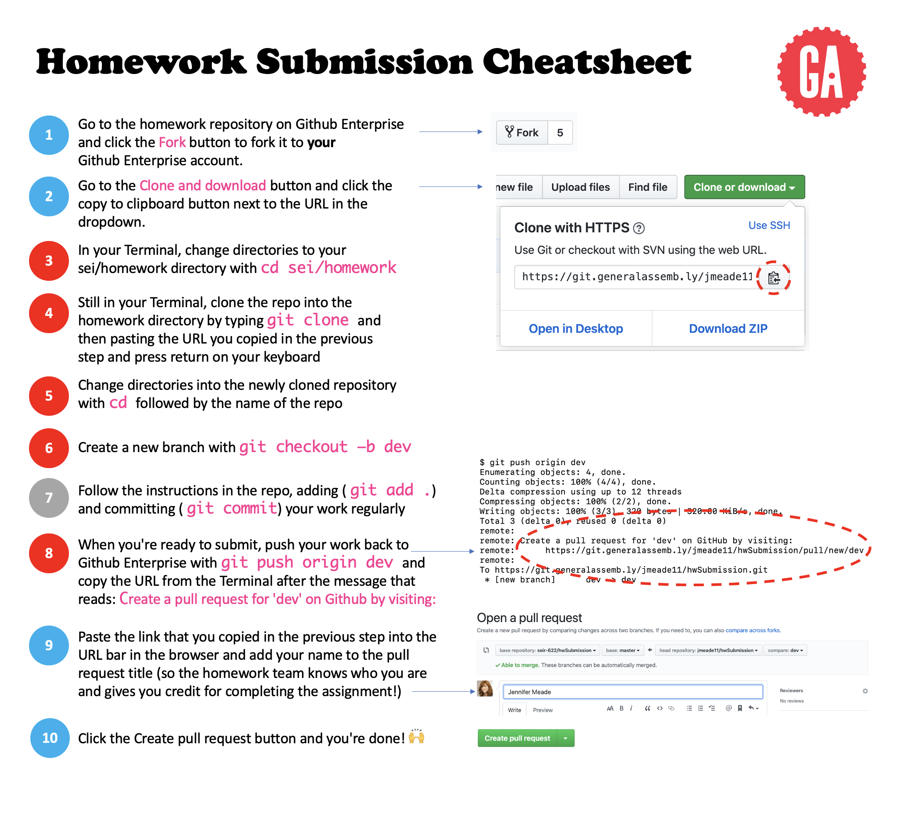

# 

Practice the homework submission process using our new skills with Git! 😤

# Visualize the Process



## Homework Submission Instructions

1. Go to the assignment repository.

2. Fork and Clone that repository.

3. Once cloned, change directory(cd) into that directory on your computer.

### Creating a git branch

1. First check the current branch that you are working in. You can do this by writing the command: `git branch`

2. Now make a new branch where you can work on your assignment with the command `git checkout -b <name-of-your-branch>`. This command is creating a new branch for you as well as 'checking out' the branch like a library book. We are now in that newly created branch. The 'name-of-your-branch' part literally means the name you give your branch. That is up to you!

3. Now use the `git branch` command again to verify that you are on the new branch you created.(You can change branches at any time by writing `git branch <name-of-your-branch>`).

4. Now you are ready to make changes to your repo! When you are finished you can run your commands to `add` and `commit` as you normally would.

5. To push up to your forked repo, you use the command `git push origin <name-of-your-branch>`. We are pushing the work that we completed on the other branch up to the remote branch on Github Enterprise.

6. Now navigate to the original repository that your forked from.

7. Once there, click on the `Pull Requests` button.

8. Now click on `New Pull Request`.

9. At the top you see the two dropdowns that allow you to pick what repo you want to use to make a pull request as well as which repo to make that request to.
   You need to click on `compare across forks` to show your forked copy.

10. Switch to the appropriate repos. (On the left, the original repo. On the right, your forked branch).

11. In the 'title' field simply write your name.

12. In the description area, fill this out to let us know how it went for you:

```
Comfort score: (1-5)
Completeness score: (1-5)

Questions? Comments? Add them here:


```

13. Then hit `Create pull requests` and you are done!

### Oh no! I cloned down the repository before forking it!! 😱

No worries! This happens all the time, and if you try to push to one of our organization's repositories, you'll probably get a message that says something along the lines of "Fatal: Access to `url` denied." If you need to change the remote repository associated with your local git repository, just use the following steps:

1. Fork the repo to your own account and copy the SSH URL. It should have your username instead of your cohort's organization name in the URL.
2. In your local repository's folder, use the following command: `git remote set-url origin <paste SSH URL>` .
3. Add, commit, and push your code to your remote repo. You should see the changes on your forked branch!
