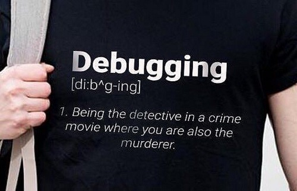

# Introduction to Debugging

**Title:** Introduction to Debugging <br>
**Type:** Morning Lecture <br>
**Duration:** 1:30 <br>
**Creator:** Esin Saribudak <br>
**Competencies:** Debugging, Problem Solving, JavaScript, Dev Tools, VS Code <br>
**Prerequisites:** JavaScript, VS Code, Google Chrome

<hr>

## Instructions

1. Fork this repo to your own account. 
2. In Terminal, change directory into `sei/lessons` and clone this repository down to your computer. (No need to create your own branch as we will not be pushing code up to the remote or submitting a PR. 
3. Use `cd/intro-to-debugging` to change directory into this repo, then `code .` to open in VS Code. 

<hr>

## Objectives

-   Students will be able to explain what debugging is and why it is important.
-   Students will be able to explain how to take a methodical approach to debugging.
-   Students will be able to use a variety of console tools to debug.
-   Students will gain familiarity with Chrome and VS Code's built-in debugger tools.

<hr>

## Agenda

1. Preface (5 min)
2. A Methodical Approach (10 min)
3. Console Methods (35 min)
4. Chrome and VS Code Debugger (35 min)
5. Additional Resources (5 min)

<hr>

## Preface

Throughout your career as software engineer, you will encounter many errors, or "bugs" in your code. These errors may be the result of problems with syntax, references, logic, scope, methods, and so on. The process of determining the causes of these errors and resolving them is called "debugging."

Strong debugging skills are often considered to be one of the characteristics that separates junior developers from senior developers. As we gradually release responsibility to you throughout the course, it will be increasingly up to you to solve your bugs. During job interviews, potential employers may also ask you about a difficult bug you encountered and how you solved it.

Just like anything else we teach you in this course, debugging is a _SKILL_ -- you will get better at it over time, with more practice and more experience. And by taking a **methodical approach** to debugging, understanding the range of available **debugging tools and options**, and getting practice at **finding errors**, you will become a faster, more efficient debugger AND a better developer overall. 💪

<hr>

## A Methodical Approach to Debugging



When you encounter a bug, your first instinct may be to dive into debugging and make changes to your code right away to try to get it to work.

However, if you do that, you might forget what changes you made and what approaches you tried. Instead, consider taking a structured, step-by-step approach to debugging.

Below is a useful series of questions to ask yourself when debugging. These steps begin assuming that you've already recognized that a bug exists, either from incorrect output in your console or error messages. 

1. **What is my error?**
    - Define your error in the simplest terms possible. (JS's error message often does this for you, e.g., 'SyntaxError'.)
    - Know your six basic types of [JavaScript errors](https://www.htmlgoodies.com/html5/javascript/handling-javascript-errors-by-type.html) and what they mean.
    - Make sure you know HOW to reproduce the error before changing your code. (More applicable when writing bigger programs.)
2. **Where is my error?**
    - Narrow down the location of your bug to the file, code block, and line if you can.
    - JavaScript often gives file and line numbers in its error messages, which can point you in the right direction.
    - Good code formatters also highlight problem areas (usually syntax issues), so look for red squiggly lines in VS Code.
    - You can also comment out code and comment it back in one block at a time to locate the source of the problem.
    - More sophisticated methods will be covered below!
3. **What is my code supposed to be doing there?**
    - If you don't yet have pseudo-code or comments, add them in line by line to translate what you think your code is doing.
    - As you examine your code, consider issues such as scope, hoisting, side effects, etc.
    - Sometimes this process alone helps you spot your error! [Rubberducking](https://www.thoughtfulcode.com/rubber-duck-debugging-psychology/) or [pair-programming](https://www.agilealliance.org/glossary/pairing/)  are especially helpful with this process. 
4. **How do I test my assumptions?**
    - Once you have a good understanding of what the code should be doing, use debugging tools to test whether your assumptions about the code are correct.
    - Determine where in the code to place console methods or a breakpoint to test whether your assumptions regarding the code's behavior are correct.
5. **What does the test show?**
    - Run the code and evaluate the results.
    - Update your code based on these results and run again; try to only change one thing at a time.
    - If you return another error, repeat the process until your code works the way you want it to.

### ⌛ Activity (15 min): You try!

In your `script.js` file, there is a function called sumCubes that is broken. Practice following the protocol above to find the bug and fix it with what you already know about JavaScript!

> Remember to remove any console logs, breakpoints, and other debugging tools from code that will be deployed and any other projects that you plan to show employers.

<hr>

## Beyond the Log: Other Console Methods


As a new developer, you probably rely heavily on console.log() for not just debugging, but understanding what your code is doing. Console is a built-in JavaScript object, and like many other built-in objects (Arrays, Math, Document, etc.), besides ".log()", Console has a multitude of other methods (functions that belong to an object) available to us.

## `console.error()`

This method is used to specifically log error messages to the console. The message will be highlighted in red. You will see this method again when we learn how to make API calls.

```javascript
console.error('This is my error message');
```

## `console.warn()`

Similar to console.error, but logs warning messages to the console. The message will be highlighted yellow with a caution symbol.

```javascript
console.warn('This is my warning message.');
```

## `console.table()`

If you are logging an array or object, it might be visually helpful to log the message with table formatting.

```javascript
const userInfo = {
	userOne: {
		userName: 'esin87',
		password: 'abc123',
		email: 'esin@saribudak.com'
	},
	userTwo: {
		userName: 'jimmy512',
		password: 'meowsers',
		email: 'jimmy@cats.com'
	},
	userThree: {
		userName: 'gordoTRON',
		password: 'iamacat',
		email: 'gordon@pets.com'
	}
};
console.table(userInfo);
```

## `console.trace()`

If you are trying to figure out where in the code a function is being called, you can include a `console.trace()` message to place a metaphorical breadcrumb in the call stack.

```javascript
//This example uses ES6 arrow function notation

const first = () => {
	second();
};
const second = () => {
	third();
};
const third = () => {
	fourth();
};
const fourth = () => {
	console.trace();
};
//remember to call the function to trace it:
first();
```

## `console.log() with style`

For developers who are visually-oriented and working with multiple console messages, it might be helpful to stylize your different console logs by prefacing your message with '`%c`' and adding styling properties as the second parameter.

```javascript
console.log(
	'%cThis is my stylish console log.',
	'background-color: lightgreen; color: red; padding: 5px; border: 1px solid yellow; font-family: Garamond; font-size: 14px;'
);
```

### ⌛ Activity (10 min): You try!

In `script.js`, write your own console messages for each of the console messages shown above (error, warn, table, trace, and styles). Save your code and see the results in your browser's dev tools console.

#### Hungry for more?

These are just some of the additional console methods. There are many more console methods out there to learn -- check out the [MDN documentation](https://developer.mozilla.org/en-US/docs/Web/API/Console) and try some out!

<hr>

## Interactive Debuggers Overview


Google Chrome has an interactive debugger built in. Gaining experience debugging with these more precise tools can help you become an even better developer.

In Chrome, you start the debugger at a specific point in your code by calling `debugger`:

```javascript
function evenSum(num) {
	let sum = 0;
	for (let i = 0; i <= num; i += 2) {
		sum += i;
		//I want to start debugging here
		debugger;
	}
	return sum;
}
```

Both Chrome and VS Code also allow you to manually "mark" specific breakpoints in your code; this is the equivalent of calling the debugger. Chrome even allows you to select Event Listeners and DOM Elements as your breakpoints. You can also select elements to "watch" in your code.

#### 🤔 What do you think are some of the benefits of using the built-in debuggers?

## Conclusion

Getting errors in your code can be really frustrating, but they can also be really instructive and revealing. View errors as an opportunity to gain a deeper and more intuitive understanding of how JavaScript works, as well as a chance to become stronger at analytical thinking and problem solving. And you'll realize after finally solving your error that there is no better feeling than when your code finally runs the way it's supposed to.


## JS Debugging Errors Mini Lab

Next, we will get some practice putting these concepts to use with a mini lab on debugging JavaScript errors linked [here](https://git.generalassemb.ly/seir-622/js-debugging-errors). 

## Hungry for More? 

- Follow Google's own [tutorial](https://developers.google.com/web/tools/chrome-devtools/javascript/) for using their Chrome dev tools to debug JavaScript.

- Dig into the tutorial for VS Code's built-in debugger with their [guide](https://code.visualstudio.com/docs/introvideos/debugging).

## Additional Resources

-   W3 Schools provides a high-level overview of debugging [here](https://www.w3schools.com/js/js_debugging.asp).
-   This [video](https://www.youtube.com/watch?v=TtsvMRxmfGA) goes into much greater depth of all the different debugging tools available.
-   This [article](https://raygun.com/javascript-debugging-tips) covers common debugging techniques with good visuals of the code being used.
- Google's [documentation](https://developers.google.com/web/tools/chrome-devtools/console/api)  of the Console API.
