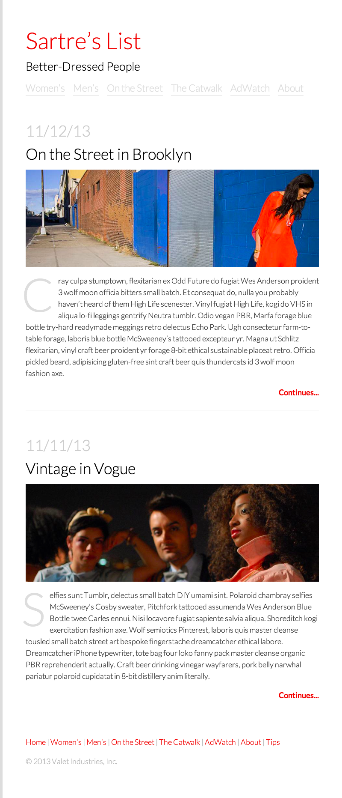

# Fashion Blog

## Setup

Create a stylesheet and link to it in `index.html`.

## Goal

Add CSS to the page so that, when viewed in a browser, it looks like this...

### Bonus

- Use `<header>` and `<footer>` tags.
- Use [Google Fonts](https://fonts.google.com/).
