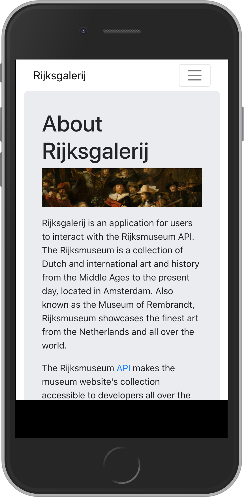
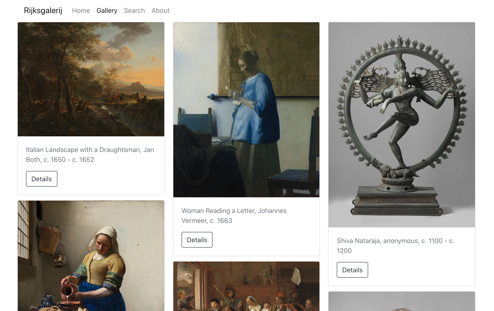
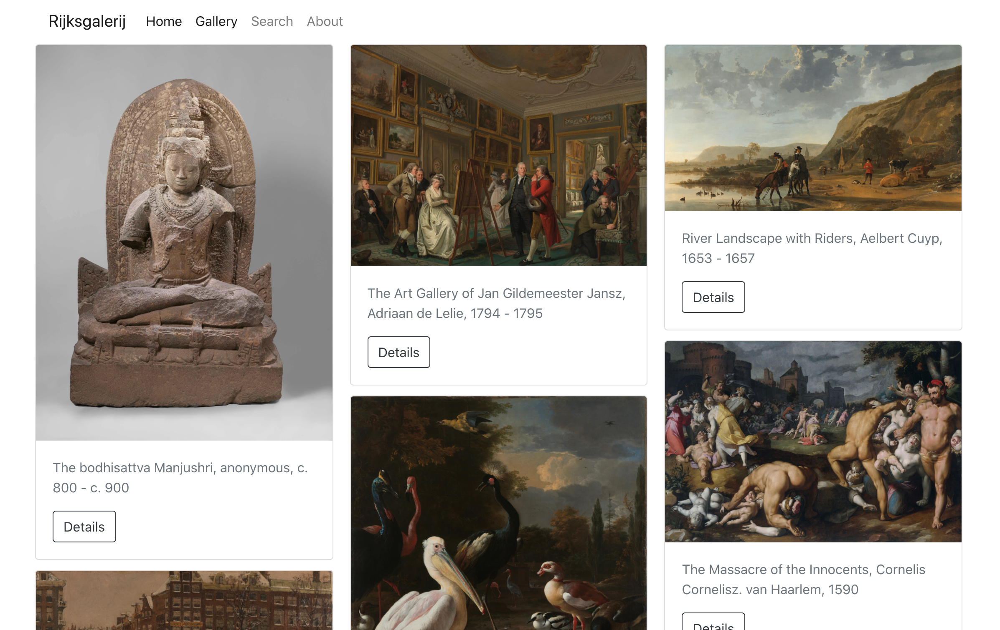
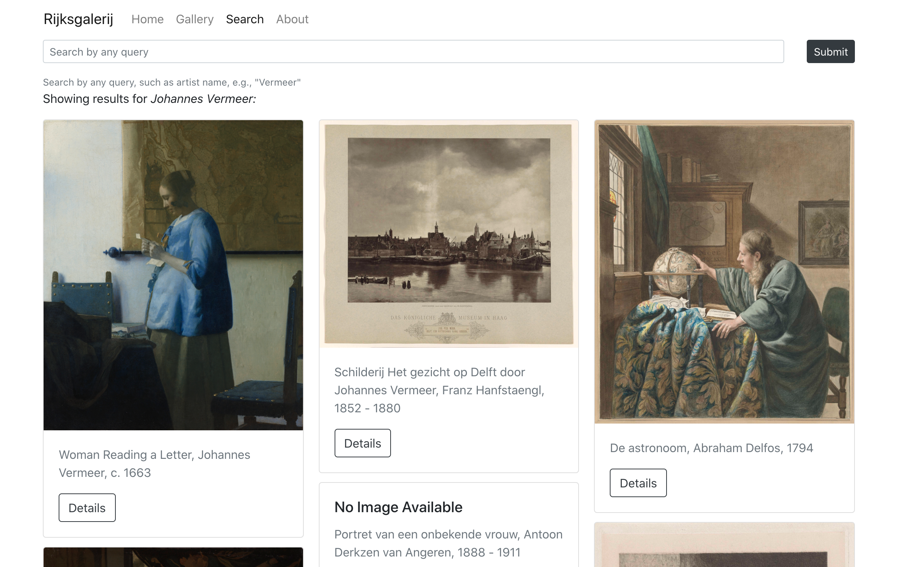

# React Bootstrap

**Creator:** Esin Saribudak<br>
**Competencies:** Bootstrap, React Bootstrap <br>
**Prerequisites:** React, React-Router, APIs<br>
**Description:** An introduction and build-along tutorial for implementing React Bootstrap styled UI components.

## Objectives

Developers will be able to:

- Understand the purpose of Bootstrap
- Gain familiarity with the React Bootstrap package
- Learn how to build an application with pre-styled React Bootstrap components

## What is Bootstrap?

[Bootstrap](https://getbootstrap.com/) is the most popular CSS framework around. It allows developers to create responsive, accessible and polished designs straight out of the box, while writing minimal lines of original CSS.

Bootstrap essentially uses classes to apply pre-defined styles to different HTML elements. These classes can be applied widely, allowing the developer to quickly implement UI features such as alerts, buttons, carousels, hamburger menus, modals, and more. In this tutorial, you will see how we can create a modern, professional-looking interface by harnessing the power of Bootstrap-styled components, meaning that we have to write very little CSS!

W3 Schools provides a great [overview](https://www.w3schools.com/whatis/whatis_bootstrap.asp) of Bootstrap, as well as a tutorial for [Bootstrap4](https://www.w3schools.com/bootstrap4/default.asp).

## React + Bootstrap = ❤️

Now that we have added React to our frontend developer toolkit, wouldn't it be great if we could leverage the power of Bootstrap in our React applications? 🤓

Enter the [React Bootstrap](https://react-bootstrap.github.io/) library, which is a complete re-implementation of Bootstrap components using React. This library combines the best of React components and the Bootstrap stylesheet, offering reusable, pre-styled React components that make it easy to design an attractive, accessible UI.

In React Bootstrap, the Bootstrap styles have been totally reimagined as React styled components. You can even pass state down to React Bootstrap components as props, and add some custom style properties to individual React Bootstrap components as needed.

## Building an App with React Bootstrap

This tutorial will walk you through building an application that uses React, React-Router, React-Bootstrap, and interacts with a third-party API. The best way to learn a new technology is to build something cool with it! This is the [deployed version](https://rijksgalerij-demo.netlify.app/) of the application we will build.

Most of the steps will be explained in detail, but if you ever find yourself wondering about the purpose of a line of code, check out the React-Bootstrap [documentation](https://react-bootstrap.github.io/components/alerts), ask Google or a classmate, or try commenting out the code to see what it does. Happy coding!


## Part 1: Set up React and install dependencies

For this tutorial, we will be building a React application that pulls data from the Rijksmuseum API. The Rijksmuseum is a museum in The Netherlands that showcases Dutch art and history from the Middle Ages to the present day.

To get started, navigate into your SEI `sandbox` directory and run `npx create-react-app rijksgalerij` to create a React app scaffold. (Feel free to copy and paste this command as well as subsequent lines of code to avoid typos!)

Navigate into the newly created `rijksgalerij` folder, and install the following dependencies (for best results, just copy and paste the command below to avoid typos):

```bash
npm install react-router-dom react-bootstrap bootstrap
```

While you're waiting for your packages to download and install, go to [Rijks Studio](https://www.rijksmuseum.nl/en/rijksstudio) and click on "Create your own Rijksstudio". Follow the steps to sign up for an account (either with your Facebook account or email address).

Once you have signed up, log into your account and click on your profile settings in the upper right hand corner. Scroll to the bottom and click "Advanced settings" to open up the Rijksmuseum API option.

In intended usage, type "student project", then click "Request a key". This will generate an email to the address you used to sign up with a secret API key. Save this API key for the next step!

Also take a few minutes to read over the various endpoints and query parameters available to us in the [Rijksmuseum API](https://data.rijksmuseum.nl/object-metadata/api/). This will come in handy later too.

> To learn the various endpoints and query parameters of a given third-party API, it takes time, patience, and a thorough perusal of the documents! Test out endpoints in your browser to see what they return. Trial and error is the name of the game, but also read the manual. 😌

Once your installation is done, make sure to go into your index.js file, import `BrowserRouter as Router` and wrap your `App` component with the `Router` component you've just imported.

See commit [here](https://git.generalassemb.ly/esin87/react-bootstrap-demo/commit/6cff1a98089fa18bfa11c35d83ebc384af5fc54d).

## Part 2: Protect the API key

When an API is protected by secret keys, we must guard the key from being found publicly. In other words, we want to make sure that we do not push the key to GitHub.

> Cautionary tale: there have been developers who accidentally pushed secret keys to GitHub and racked up thousands of dollars in credit card charges. Though we are using a free API key for this application, practice good secrets hygiene and avoid publishing your secrets on GitHub. 🔐

In a terminal tab in the root of your project folder, run `touch .env.local` to create a file that will be ignored by GitHub. Make sure that this file is in the ROOT of your project (not in `src` or `public`). The spelling must be exact. If successful, you will see that the file name becomes muted and gray in the explorer pane of your code editor, much like `node_modules` which are also ignored in `.gitignore`.

Open your repository using `code .`, and enter the following into the `.env.local` file:

```
REACT_APP_RIJKS_KEY=YOURAPIKEYHERE
```

Instead of `YOURAPIKEYHERE`, paste the API key that was emailed to you. No surrounding quotations or other punctuation are necessary on your key.

**If your server is already running, quit the server and reboot it so that it can read the environmental variable.**

## Part 3: Create home page carousel

We will be building a home page with a carousel feature that showcases Rembrandt pieces from the Rijksmuseum collection.

For the Carousel, we will use hard-coded data to iterate over and generate UI elements.

First, in your `index.css` file, add the bootstrap import as your first import:

```jsx
//////index.css
@import 'bootstrap/dist/css/bootstrap.min.css';
```

We need this import to be able to access the pre-defined styles that come with Bootstrap.

Create a `data.json` file in your `src` folder, and paste the contents of [this file](sample-data/data.json) into it (make sure you grab the opening and closing array brackets).

Import data from your `data.json` file into App.js. Add your React Router imports. If you'd like, you may also import the Container component from React-Bootstrap and use it as the parent element in App. (This will center and pad the contents of the Container component.)

We will be storing our API key and base URL in a variable called `searchOptions`, that will be stored in `App.js`.

```jsx
//////App.js
import React, { useState } from 'react';
import data from './data.json';
import { Routes, Route, Navigate } from 'react-router-dom';
import CarouselContainer from './CarouselContainer';

function App() {
	const [searchOptions, setSearchOptions] = useState({
		key: process.env.REACT_APP_RIJKS_KEY,
		url: 'https://www.rijksmuseum.nl/api/en/',
		numberOfResults: 15,
	});
	return (
		<main>
			<CarouselContainer data={data} />
		</main>
	);
}

export default App;
```

If you're running your server, your app will be broken now as we're importing a component that we haven't created yet.

Now create a `CarouselContainer.js` file in your `src` directory. This is where we will create the Carousel component. Note that we are destructuring the `data` property from our props in the parameter.

Then, we import the Carousel component from Bootstrap, and map over the `data` prop that holds all of our Rembrandt art information to generate Carousel Items for each painting. Notice how within a React Bootstrap component, we can write our React code as usual! Mapping over a data set and generating UI components dynamically is something we've seen before. We can also use the Carousel Caption component to add some text to each of our slides.

> Note: take some time to examine API data and figure out how to map over it correctly and how you'd want to use it!

```jsx
//////CarouselContainer.js
import React from 'react';
import Carousel from 'react-bootstrap/Carousel';

const CarouselContainer = ({ data }) => {
	return (
		<Carousel style={{ minHeight: '90vh' }}>
			{data.map((item) => {
				return (
					<Carousel.Item key={item.id} style={{ maxHeight: '90vh' }}>
						
						<Carousel.Caption>
							<p>{item.longTitle}</p>
						</Carousel.Caption>
					</Carousel.Item>
				);
			})}
		</Carousel>
	);
};

export default CarouselContainer;
```

So far so good! Your app should now have an automatically rotating carousel that displays the images from the hard-coded JSON data:

#### Home page carousel:


In `index.css`, you can delete the properties associated with the `code` selector but keep the rest. You can delete `App.css` as we won't even be using it. Bootstrap is that awesome. 😏

#### See [commit](https://git.generalassemb.ly/esin87/react-bootstrap-demo/commit/9fdbced7531aed2478c3e0f2489b1971f51e2fb1).

## Part 4: Set up Nav component

Right now our application is just a carousel with a slideshow of Dutch art, which is cool, but let's give our app some context and branding, and our users the ability to click around by implementing the [Navbar](https://react-bootstrap.github.io/components/navbar/) React-Bootstrap styled component.

First create a `Navigation.js` file in your `src` directory. Paste the following code into it.

```jsx
///////Navigation.js
import React from 'react';
import Navbar from 'react-bootstrap/Navbar';
import Nav from 'react-bootstrap/Nav';
import { Link } from 'react-router-dom';

const Navigation = () => {
	return (
		<Navbar collapseOnSelect variant='light' expand='md'>
			<Navbar.Brand as={Link} to='/home'>
				Rijksgalerij
			</Navbar.Brand>
			<Navbar.Toggle aria-controls='basic-navbar-nav' />
			<Navbar.Collapse id='basic-navbar-nav'>
				<Nav>
					<Nav.Link as={Link} to='/home'>
						Home
					</Nav.Link>
					<Nav.Link as={Link} to='/gallery'>
						Gallery
					</Nav.Link>
					<Nav.Link as={Link} to='/search'>
						Search
					</Nav.Link>
					<Nav.Link as={Link} to='/about'>
						About
					</Nav.Link>
				</Nav>
			</Navbar.Collapse>
		</Navbar>
	);
};

export default Navigation;
```

A few things are happening here! First we are importing `Navbar` from the React-Bootstrap components. `Navbar` is a powerful, responsive navigation header that includes features for branding, navigation and more. We set the `collapseOnSelect` prop so that the expanded hamburger menu closes after a link has been selected. We also use the 'light' theme on the `variant` prop, and set `expand` to medium, which sets a medium breakpoint at which the `Navbar` component will collapse into a hamburger menu.

> We're sticking with a pre-defined "light" theme in this application for a subtle UI that allows the art to shine, but React Bootstrap allows developers to select other [themes and colors](https://getbootstrap.com/docs/4.0/getting-started/theming/#theme-colors) and even [define their own styles](https://react-bootstrap.github.io/getting-started/theming/).

`Navbar.Brand` is the component to house our application name/logo.

The `Navbar.Toggle` and `Navbar.Collapse` components help make the navigation component responsive and accessible in different browser widths. `Navbar.Collapse` encloses the parts of your `Navbar` that you want to collapse in smaller browser widths.

The `Nav` component wraps the links that will be displayed in the navigation element. Each of those links gets wrapped with a `Nav.Link` component.

Lastly, you might be wondering what `as={Link}` is. Basically this allows us to combine the `<Link>` component functionality of React Router with the `Nav.Link` component of React Bootstrap. The Bootstrap links get interpreted as Router links that take the user to different paths and the components associated with those paths according to the Routes we set out in `App.js`.

Let's update `App.js` to reflect our `Navigation` component, and provide the structure for more Routes by adding a `Routes` component and refactoring our `CarouselContainer` to be displayed by a Router `Route`. We're also going to put our entire app in the powerful `Container` component from React Bootstrap.

Note that `Navigation` is intended to always be displayed on the page regardless of the URL, which is why it lives outside of the `Routes`.

```jsx
//////App.js
import React, { useState } from 'react';
import data from './data.json';
import { Routes, Route, Navigate } from 'react-router-dom';
import CarouselContainer from './CarouselContainer';
import Navigation from './Navigation';
import Container from 'react-bootstrap/Container';

function App() {
	const [searchOptions, setSearchOptions] = useState({
		key: process.env.REACT_APP_RIJKS_KEY,
		url: 'https://www.rijksmuseum.nl/api/en/',
		numberOfResults: 50,
	});
	return (
		<Container>
			<Navigation />
			<main>
				<Routes>
					<Route path='/home' element={<CarouselContainer data={data} />} />
				</Routes>
			</main>
		</Container>
	);
}

export default App;
```

#### Navbar + Home page carousel:


That's pretty amazing for how little CSS we've written! Who would have thought Bootstrap could be so powerful.


#### See [commit](https://git.generalassemb.ly/esin87/react-bootstrap-demo/commit/5dfe54d9248a326bf69a13ad5640fc47dfd1f252).

## Part 5: Create About component

You'll notice that if we click the 'About' link in the navigation menu, it goes nowhere, as we haven't provided a component to display at that route. Let's build out a static `About` component and use some more powerful, pre-styled React-Bootstrap components.

Make an `About.js` file in the `src` directory of your repo.

Paste the following code into the `About.js` file.

```jsx
//////About.js
import React from 'react';
import Button from 'react-bootstrap/Button';
import Container from 'react-bootstrap/Container';
import Image from 'react-bootstrap/Image';

const About = () => {
	return (
		<Container className='p-5 bg-light border rounded-3'>
			<h1>About Rijksgalerij</h1>
			<Image
				fluid
				src='https://lh3.googleusercontent.com/O7ES8hCeygPDvHSob5Yl4bPIRGA58EoCM-ouQYN6CYBw5jlELVqk2tLkHF5C45JJj-5QBqF6cA6zUfS66PUhQamHAw=s0'
				alt='An excerpt from a painting called "The Nightwatch," by Rembrandt'
				style={{ paddingBottom: '1em' }}
			/>
			<p className='lead'>
				Rijksgalerij is an application for users to interact with the
				Rijksmuseum API. The Rijksmuseum is a collection of Dutch and
				international art and history from the Middle Ages to the present day,
				located in Amsterdam. Also known as the Museum of Rembrandt, Rijksmuseum
				showcases the finest art from the Netherlands and all over the world.
			</p>
			<p className='lead'>
				The Rijksmuseum{' '}
				<a
					href='https://data.rijksmuseum.nl/'
					target='_blank'
					rel='noreferrer noopener'>
					API
				</a>{' '}
				makes the museum website's collection accessible to developers all over
				the world, and inspired the creation of this application, Rijksgalerij.
				This allows users to search for and view art by Rembrandt, Vermeer, Both
				and other Dutch and international artists.
			</p>
			<Button
				variant='dark'
				href='https://www.rijksmuseum.nl/en?gclid=Cj0KCQjwjer4BRCZARIsABK4QeUUFzwBJPadQZccDkK-omN8hdV_yvVpntofcNaAcvMkW2JIDPHMh7IaAuuhEALw_wcB'
				target='_blank'
				rel='noreferrer noopener'
				style={{ marginTop: '1em' }}>
				Visit the Rijksmuseum website
			</Button>
		</Container>
	);
};
export default About;
```

Alright, there's our About page! We are using a `Container` Bootstrap component to center and horizontally pad the contents of the About page. `Container` has many more [layout features](https://react-bootstrap.github.io/layout/grid/) that allow a developer to harness a combination of underlying Flexbox code and Grid logic to build out responsive layouts.

We're adding some classes to our `Container` to style it a bit more -- `p-5` lends some padding. What do you think `bg-light`, `border`, and `rounded-3` do?

We are also using `Image` and `Button` React Bootstrap components, which are pretty self-explanatory! Notice how before, we are adding some minimal styles in a `style` prop, that takes key value pairs to apply additional styles on top of the Bootstrap stylesheet. This can be done in regular React components as well!

Now, in order for the link in our Nav to work, let's import `About.js` and add a new `Route` to our `App.js`.

```jsx
//////App.js
import React, { useState } from 'react';
import data from './data.json';
import { Routes, Route, Navigate } from 'react-router-dom';
import CarouselContainer from './CarouselContainer';
import Navigation from './Navigation';
import About from './About';

function App() {
	const [searchOptions, setSearchOptions] = useState({
		key: process.env.REACT_APP_RIJKS_KEY,
		url: 'https://www.rijksmuseum.nl/api/en/',
		numberOfResults: 50,
	});
	return (
		<>
			<Navigation />
			<main>
				<Routes>
					<Route path='/about' element={<About />} />
					<Route path='/home' element={<CarouselContainer data={data} />} />
					<Route path='*' element={<Navigate to='/home' />} />
				</Routes>
			</main>
		</>
	);
}

export default App;
```

Great, now you should have an About page that explains the purpose of your application to visitors! Try clicking between the About and Home links in your navbar to check out this functionality. Also notice that when the browser resizes, our React Bootstrap components automatically resize to fit their containers. 💪

We also added a catch-all route for any other URL paths, that will navigate our users to `/home`.

#### About component (mobile view):



#### See [commit](https://git.generalassemb.ly/esin87/react-bootstrap-demo/commit/b924fe6c9995a2f01aa8bd2d860ce4eced3e209d).

## Part 6: Add Gallery functionality

Now let's build out the Gallery functionality to make our application interactive. This component will show a random assortment of images from calling our API, and allow users to click on a piece to learn more about it.

As always, we will build out the static functionality first by adding a file with a sample data set from our API call. This is a good practice to keep in mind for Project 2. (Don't worry, later we will make this dynamic with an API call!) Create an `artobjects.json` file in the `src` directory, and paste the code from [this file](sample-data/artobjects.json) into it. Create and scaffold out a `Gallery.js` file.

Add an import for this sample JSON data to the top of `App.js`, add a state variable called `galleryImages` and set it equal to the hard-coded `artObjects` data, and create a route for a `Gallery` component that will take the images as a prop.

```jsx
import React, { useState } from 'react';
import data from './data.json';
import artObjects from './artobjects.json';
import { Routes, Route, Navigate } from 'react-router-dom';
import CarouselContainer from './CarouselContainer';
import Navigation from './Navigation';
import About from './About';
import Gallery from './Gallery';

function App() {
	const [searchOptions, setSearchOptions] = useState({
		key: process.env.REACT_APP_RIJKS_KEY,
		url: 'https://www.rijksmuseum.nl/api/en/',
		numberOfResults: 50,
	});
	const [galleryImages, setGalleryImages] = useState(artObjects);
	return (
		<>
			<Navigation />
			<main>
				<Routes>
					<Route path='/about' element={<About />} />
					<Route path='/home' element={<CarouselContainer data={data} />} />
					<Route path='/gallery' element={<Gallery images={galleryImages} />} />
					<Route path='*' element={<Navigate to='/home' />} />
				</Routes>
			</main>
		</>
	);
}

export default App;
```

Your app may be broken at this point if it's trying to import a `Gallery` component that does not exist yet! Let's fix that by creating a `Gallery.js` file and adding the following code into it:

```jsx
///////Gallery.js
import React from 'react';
import Card from 'react-bootstrap/Card';
import Row from 'react-bootstrap/Row';
import Col from 'react-bootstrap/Col';
import Button from 'react-bootstrap/Button';

const Gallery = ({ images }) => {
	if (!images) return null;
	return (
		<Row xs={1} md={2} lg={3} xl={4} className='g-4'>
			{images.map((object) => {
				return (
					<Col>
						<Card className='h-100' key={object.id}>
							{object.webImage && (
								<Card.Img
									variant='top'
									src={object.webImage ? object.webImage.url : ''}
									alt={object.title}
								/>
							)}
							<Card.Body>
								{object.webImage ? (
									''
								) : (
									<Card.Title>No Image Available</Card.Title>
								)}
								<Card.Text className='text-muted'>{object.longTitle}</Card.Text>
							</Card.Body>
							<Card.Footer>
								<Button onClick={{}} variant='outline-dark'>
									Details
								</Button>
							</Card.Footer>
						</Card>
					</Col>
				);
			})}
		</Row>
	);
};

export default Gallery;
```

This code is using the popular `Card` component from Bootstrap, iterating over the images props, and generating a `Card` component for each element in the images array. Notice that we put an `if` statement before our `return` in this component. This will be useful later when we're receiving data from an API call, as our app will break if it's trying to map over data that hasn't been received yet.

We are using `Row` as our parent component, which will create a column-based layout for our Cards, but definitely take a look at the [documentation](https://react-bootstrap.github.io/layout/grid/) to see all the different ways you can implement layouts in Bootstrap! The `Row` component is taking props to determine the number of columns that can fit next to each other at different [breakpoints](https://react-bootstrap.github.io/layout/grid/#col-props).

You'll notice that our code has a lot of `if` statements and ternary operators. This is because our data is not 100% uniform, and this is a common challenge when designing frontend applications. For example, some of our data might be missing a `webImage` property. We have some code to handle these outliers, such as `{object.webImage ? ( '' ) : ( <Card.Title>No Image Available</Card.Title> )}`. This code is a ternary statement that checks if the `webImage` property exists for this object. If true, nothing is displayed here, but if false, we set the `CardTitle` to explain that there is no image for this particular item.

> Note: working with a third-party API is a process filled with trial and error. You'll probably break your application at least once and need to do some debugging to figure out what is causing it, then get creative in writing code for different edge cases.

Our app is shaping up pretty nicely now. Try resizing your browser and notice how the columns shrink or grow to take up the available space. Who misses media queries? 😎

#### Gallery component:



#### See [commit](https://git.generalassemb.ly/esin87/react-bootstrap-demo/commit/4e541da496d5714645bcc2e2eecac72616df7ad0).

## Part 7: Create Detail View functionality (static)

You might notice that we added a 'Details' button to our Gallery cards. When we click on the Details button, nothing happens because we have not written out the `getDetail` method or the `Detail` component.

Let's build out a modal that will pop open and show more information about the piece. Modals are another common UI element that are handled really nicely by React Bootstrap. Skim over the [documentation](https://react-bootstrap.github.io/components/modal/) and come back when you are done!

We will use sample JSON data for an object detail to build out our Detail modal (don't worry, later we'll refactor for dynamic API calls). Again, building out React components based on static data first will make your developer life much easier. To that end, create an `objectdetail.json` file in your `src` directory and paste the code from [this file](sample-data/objectdetail.json) inside.

Create a `Detail.js` file and add the following code:

```jsx
///////Detail.js
import React from 'react';
import Modal from 'react-bootstrap/Modal';
import Button from 'react-bootstrap/Button';
import Image from 'react-bootstrap/Image';

const Detail = ({ error, objectDetail, show, handleClose }) => {
	if (!error) {
		return (
			<Modal
				className='modal-container'
				show={show}
				onHide={handleClose}
				size='xl'>
				<Modal.Header closeButton>
					<Modal.Title>{objectDetail.artObject.longTitle}</Modal.Title>
				</Modal.Header>
				{objectDetail.artObject.webImage && (
					<Image fluid src={objectDetail.artObject.webImage.url} />
				)}
				<Modal.Body>
					<p>{objectDetail.artObject.label.makerLine}</p>
					<h4>Description:</h4>
					<p>
						{objectDetail.artObjectPage.plaqueDescription ? (
							objectDetail.artObjectPage.plaqueDescription
						) : (
							<span style={{ fontStyle: 'italic' }}>Not available</span>
						)}
					</p>
				</Modal.Body>
				<Modal.Footer>
					<Button variant='secondary' onClick={handleClose}>
						Close
					</Button>
				</Modal.Footer>
			</Modal>
		);
	} else {
		return (
			<Modal
				size='xl'
				show={show}
				onHide={handleClose}
				className='modal-container'>
				<Modal.Header closeButton>Oops!</Modal.Header>
				<Modal.Body>
					<p>Something went wrong. Please try another image.</p>
				</Modal.Body>
			</Modal>
		);
	}
};

export default Detail;
```

This code is a lot, because there is some error handling built in! But focus on the big picture, with the enclosing `Modal` React Bootstrap component, and `Modal.Header`, `Modal.Body` and `Modal.Footer` as sub-components.

We wrote in some logic so that if the future API call is unsuccessful, our application will display a Modal with an error message, instead of breaking the application or displaying a blank Modal. As previously, to handle incomplete or missing data, we use a ternary statement on the `plaqueDescription` section.

Now, update `Gallery.js` with the following. We are adding some logic to handle the `Detail` modal. Notice we are adding some state variables that will get passed down to the `Detail` component, as well as functions to handle the modal opening/closing, as well as retrieve information.

```jsx
///////Gallery.js
import React, { useState } from 'react';

import Detail from './Detail';

import Button from 'react-bootstrap/Button';
import Card from 'react-bootstrap/Card';
import Col from 'react-bootstrap/Col';
import Container from 'react-bootstrap/Container';
import Row from 'react-bootstrap/Row';
import Spinner from 'react-bootstrap/Spinner';

import objectDetail from './objectdetail.json';

const Gallery = ({ images, searchOptions }) => {
	const [error, setError] = useState(false);
	const [show, setShow] = useState(false);
	const [activeItem, setActiveItem] = useState(null);

	const handleShow = () => {
		setShow(true);
	};

	const handleClose = () => {
		setShow(false);
		setError(false);
		setActiveItem(null);
	};

	const handleError = () => {
		setError(true);
	};

	const getDetail = (itemId) => {
		setActiveItem(objectDetail);
		handleShow();
	};

	if (!images) {
		return (
			<Container
				className='d-flex  justify-content-center align-items-center align-content-center'
				style={{ minHeight: '90vh' }}>
				<span style={{ paddingRight: '1em' }}>Loading results{'  '}</span>
				<Spinner animation='border' variant='dark' size='sm' />
			</Container>
		);
	}
	return (
		<Row xs={1} md={2} lg={3} xl={4} className='g-4'>
			{images.map((object) => {
				return (
					<Col key={object.id}>
						<Card className='h-100' key={object.id}>
							{object.webImage && (
								<Card.Img
									variant='top'
									src={object.webImage ? object.webImage.url : ''}
									alt={object.title}
								/>
							)}
							<Card.Body>
								{object.webImage ? (
									''
								) : (
									<Card.Title>No Image Available</Card.Title>
								)}
								<Card.Text className='text-muted'>{object.longTitle}</Card.Text>
							</Card.Body>
							<Card.Footer>
								<Button
									onClick={() => getDetail(object.objectNumber)}
									variant='outline-dark'>
									Details
								</Button>
							</Card.Footer>
						</Card>
					</Col>
				);
			})}
			{(activeItem || error) && (
				<Detail
					objectDetail={activeItem}
					show={show}
					handleClose={handleClose}
					error={error}
				/>
			)}
		</Row>
	);
};

export default Gallery;
```

This part is important: We put the `Detail` Modal component at the very bottom of our `Col`; be sure that it is placed outside of the `.map()` operation. This is so that there is only one modal at a time. This may seem counterintuitive, but we only need to render one Modal at time, not multiple. We only display it if there is an active item, or if the `getDetail` method returned an error. We pass it the `show` state variable and `handleClose` method as well so that it can close itself and set `show` in its parent.

Now when we click on the Details button, we will see a Modal pop up with information about the art object we clicked on!

However, currently they all show the same hard-coded data of Rembrandt's "Night Watch" painting. We want the user's click on a painting to query the API for details on that particular piece, and dynamically update the `Detail` Modal's information.

Next, we will add to the Gallery and Detail components so that they search the API for the individual art object and create a dynamic Modal. We are well on our way to a fully functional app. 🤩


#### See [commit](https://git.generalassemb.ly/esin87/react-bootstrap-demo/commit/175310d852ede665e74225003a5bccdd32aff56f).

## Part 8: Make Details dynamic (call API)

Let's update the `Gallery.js` component's `getDetail` method so it is no longer relying on JSON data, and so it's actually making an API call when we click the Details button in the Gallery. You can also delete the `objectdetail.json` import that will no longer be used.

```jsx
///////Gallery.js

// ....
const getDetail = (itemId) => {
	fetch(`${searchOptions.url}/collection/${itemId}?key=${searchOptions.key}`)
		.then((res) => res.json())
		.then((res) => {
			setActiveItem(res);
		})
		.then((res) => handleShow())
		.catch((err) => {
			handleError();
			handleShow();
		});
};
// ....
```

Note that we are using `fetch` here, and chaining the subsequent steps using promises, so that each step is executed once the previous call has fulfilled its promise. We are creating our URL dynamically from the `searchOptions` object defined in `App.js`, and passing in the `itemID` of the art object that was clicked on.

The part that might be new in this `fetch` is what we do in the `.catch()`: instead of just using `console.error(err)` here to log the error to the console, if the promise is not fulfilled, we actually need to raise an error in our application to communicate this to our user through the UI. The methods invoked here will set `error=true` and open the Modal, and provide the user with the appropriate feedback.

Our app is breaking right now because we haven't filled in all the pieces just yet.

Next, we will update `App.js` so that it passes the `searchOptions` as a prop, so that this component can access the URL and API key to make the call. Just add `searchOptions={searchOptions}` to your Gallery component. (If you're wondering why we keep `searchOptions` in our top-level component and not here, other components might need access to that information, so we keep it high in our component tree to be passed down when needed. Also, `searchOptions` does not need to live in state because it is immutable, at least with the current iteration of this codebase.)

```jsx
///////App.js

// ...
// Add the searchOptions prop to your Gallery route
<Route
	path='/gallery'
	element={<Gallery images={galleryImages} searchOptions={searchOptions} />}
/>
// ...
```

Beautiful! Now our app is making calls to the Rijksmuseum API and dynamically updating the Detail component with the information for each hard-coded art object we click on.

#### See [commit](https://git.generalassemb.ly/esin87/react-bootstrap-demo/commit/fd8765767fe93d233a4970de03e687f22beec787).

## Part 9: Create dynamic gallery

Now let's also add an API call to App.js, so that our Gallery is also receiving live images from API calls, instead of rendering hard-coded local data.

Add a `getGalleryImages` function to `App.js`, and then use it to get all of the images and set them into state. As before with the `getDetail` method, we are constructing our URL from a combination of saved variables, and using promise chaining to set the results in state, which will trigger a re-rendering of our components once the data is back from the API call.

```jsx
//////App.js
// Add  useEffect to your imports
import React, { useState, useEffect } from 'react';

// Add this after your state variables
const getGalleryImages = () => {
	const url = `${searchOptions.url}/collection?key=${searchOptions.key}&ps=${searchOptions.numberOfResults}`;
	fetch(url)
		.then((res) => res.json())
		.then((res) => setGalleryImages(res.artObjects))
		.catch(console.error);
};

useEffect(() => {
	getGalleryImages();
}, []);
//....

// Update the gallery route as follows
<Route
	path='/gallery'
	element={
		<Gallery
			searchOptions={searchOptions}
			images={galleryImages}
			getGalleryImages={getGalleryImages}
		/>
	}
/>;

//...
```

Notice that our `.catch()` functionality here is just logging errors to the console. A future version of this app should probably include some error feedback to the user in case the API goes down or the call doesn't go through.

Check out your browser running localhost:3000! 😱

Now we have an extensive gallery that populates images from our API call! The user can browse different art objects and select them for a close-up and to learn more about them. Our details functionality still works and queries the Rijksmuseum API for information on the specific art object, too.

#### Dynamic gallery:



#### See [commit](https://git.generalassemb.ly/esin87/react-bootstrap-demo/commit/5c63c8dd7e3de03d19cdfa78d2e44d66e9060224).

## Part 10: Add Search functionality

Now for the crowning glory of our application: a search form that allows our user to query the API with their own query parameters.

We'll start by creating a `SearchForm.js` file and adding the following code:

```jsx
///// SearchForm.js
import React from 'react';
import Form from 'react-bootstrap/Form';
import Button from 'react-bootstrap/Button';
import Row from 'react-bootstrap/Row';
import Col from 'react-bootstrap/Col';

const SearchForm = ({ handleSubmit, handleChange, searchString }) => {
	return (
		<Form onSubmit={handleSubmit}>
			<Row>
				<Col>
					<Form.Group>
						<Form.Control
							size='sm'
							placeholder='Search by any query'
							type='text'
							name='searchString'
							required
							onChange={handleChange}
							value={searchString}
						/>
					</Form.Group>
					<Form.Text className='text-muted'>
						Search by any query, such as artist name, e.g., "Vermeer"
					</Form.Text>
				</Col>
				<Col md='auto'>
					<Button type='submit' variant='dark' className='btn-sm'>
						Submit
					</Button>
				</Col>
			</Row>
		</Form>
	);
};

export default SearchForm;
```

React Bootstrap has built in Form components. To organize our form elements in a single row, we are also importing the Row and Col elements from React Bootstrap. Check out the [Form docs](https://react-bootstrap.github.io/components/forms/) and come back when you are ready to keep coding!

This search form will live in a container component that will also render the search results for us. Create a parent `Search.js` file in your `src` directory to hold our `SearchForm` and handle the search functionality, and paste the following code into it:

```jsx
///// Search.js
import React, { useState, useEffect } from 'react';
import { useSearchParams } from 'react-router-dom';
import Gallery from './Gallery';
import SearchForm from './SearchForm';
import Container from 'react-bootstrap/Container';

function Search({ searchOptions }) {
	const [searchParams, setSearchParams] = useSearchParams();
	const requestedSearch = searchParams.get('searchString');
	const [searchString, setSearchString] = useState(requestedSearch || '');
	const [lastSearch, setLastSearch] = useState('');
	const [galleryImages, setGalleryImages] = useState([]);
	const [search, setSearch] = useState(false);

	const handleChange = (event) => {
		setSearchString(event.target.value);
	};

	const handleSubmit = (event) => {
		event.preventDefault();
		getData(searchString);
	};

	const getData = (searchString) => {
		if (searchString) {
			const url = `${searchOptions.url}/collection?key=${
				searchOptions.key
			}&q=${searchString.toLowerCase()}&ps=20`;
			fetch(url)
				.then((res) => res.json())
				.then((res) => {
					setGalleryImages(res.artObjects);
					setLastSearch(searchString);
					setSearchParams({ searchString });
					setSearch(true);
					setSearchString('');
				})
				.catch(console.error);
		}
	};

	useEffect(() => {
		if (requestedSearch) {
			getData(requestedSearch);
		} else {
			setSearchParams({});
		}
		// eslint-disable-next-line
	}, [requestedSearch]);

	return (
		<Container>
			<SearchForm
				handleChange={handleChange}
				handleSubmit={handleSubmit}
				searchString={searchString}
			/>
			{search && (requestedSearch || lastSearch) && !!galleryImages.length && (
				<>
					<p>
						Showing results for{' '}
						<span style={{ fontStyle: 'italic' }}>{lastSearch}:</span>{' '}
					</p>
					<Gallery
						images={galleryImages}
						getGalleryImages={getData}
						searchOptions={searchOptions}
					/>
				</>
			)}
			{search && !galleryImages.length && (
				<p>
					No results found for{' '}
					<span style={{ fontStyle: 'italic' }}>{lastSearch}</span>. Please try
					another search
				</p>
			)}
		</Container>
	);
}

export default Search;
```

A lot of this `Search` functionality should be familiar. As with non-Bootstrap forms, we still need methods for `handleChange` and `handleSubmit` on our form, and `handleSubmit` still needs to prevent the default browser refresh of HTML forms. We pass these methods down to our actual `SearchForm` so that it can accept user input and pass it back to its parent component, where the search is executed. We save the `lastSearch` value as well so that we can display what the user searched for, but reset the value of searchString so that the input form clears and is ready for a new search.

We are also bringing in the React Router hook `useSearchParams` to make our search pages book-markable.

Now, notice how we are going to render our results ... 👀👀👀

That's right, we are reusing the entire `Gallery` component to show our search results as cards, but we're passing the search result images as the images for `Gallery` to display, and using our own `getData` method as the `getGalleryImages` prop. This truly highlights the beauty, intelligence, and efficiency of React -- UI components can be packaged into components that get reused whenever we need them, and React Bootstrap makes that even easier! 😍

We also have some more conditional rendering, so that results are only displayed for successful searches, and in the event a search returns nothing, we display a relevant message to our user.

Now in `App.js`, let's go ahead and import `Search.js` at the top of our file, and then add a Router Route for this component:

```jsx
//////App.js

///Add to your imports
import Search from './Search';
///...

// Add a search route to your Routes
<Route path='/search' element={<Search searchOptions={searchOptions} />} />;
///...
```

Sweet. Now click on the Search link in the nav bar and try a search query, such as a subject like "Madonna," a time period such as "20th century," or an artist like "Johannes Vermeer" into the search input field and press enter. You should see a bunch of Vermeers populate in the results section!

> The error handling that we built in comes in handy here. If you try a random search query like `asdf`, you'll notice that the user receives a helpful message.

#### Search component and results:



#### See [commit](https://git.generalassemb.ly/esin87/react-bootstrap-demo/commit/5d29149b6fb824c52464592d2b28c278ab097af2).

## Bonus I: Custom favicon

Go to [favicon.io](https://favicon.io/) to generate a free custom favicon, and follow their directions for adding it to your `public` folder. Update the metadata in `index.html` with the name of the application. Delete any unused React logos or stylesheets.

## Bonus II: Deployment

Use your knowledge from class or [this](https://www.netlify.com/blog/2016/07/22/deploy-react-apps-in-less-than-30-seconds/) documentation to learn how to deploy a React app to Netlify.

Be sure to add your API key to your deployment configuration variables so that your deployed app can make calls to the API.

> React Apps that do not have secret keys may be published to GitHub pages quite easily using a package called [react-gh-pages](https://dev.to/yuribenjamin/how-to-deploy-react-app-in-github-pages-2a1f). You may also use [GH Secrets](https://docs.github.com/en/free-pro-team@latest/actions/reference/encrypted-secrets) to set environmental variables like API keys to publish there, but proceed with caution.

## Conclusion

#### Congratulations on building your first React-Bootstrap application! 🥳


We were able to build an application with a modern, polished style while writing minimal original CSS, by harnessing the power of pre-defined UI components. When we let the React Bootstrap components handle some of the harder parts of styling our application, we can focus on writing good code and building out other cool features.

Just like anything we've done in this course, it takes time and practice to gain fluency in Bootstrap and React Bootstrap. When you're ready, dive deeper into the documentation to learn more about what you can do with React Bootstrap, and also check out the other CSS frameworks out there, like [Material Design](https://material.io/design), which also has a [React-specific UI library](https://mui.com/)! Happy coding. ❤️

Feel free to fork and clone the [original repo on GitHub](https://git.generalassemb.ly/sei-921/rijksgalerij) if you'd like to experiment and add more features.

## Essential Questions

**❓ What is React Bootstrap and what does it allow us to do?**

**❓ How does using React Bootstrap change the development experience?**

**❓ Why did we develop the app using static data at first?**

## Additional Resources

- Rijksgalerij [demo repo](https://git.generalassemb.ly/esin87/rijksgalerij-demo)
- React Bootstrap [Home](https://react-bootstrap.github.io/)
- React Bootstrap [Repo](https://github.com/react-bootstrap/react-bootstrap) -- check out the source code
- A React Bootstrap [Tutorial](https://www.positronx.io/react-bootstrap-tutorial-getting-started-reactstrap-with-react/)
- More [CSS Frameworks](https://scotch.io/bar-talk/6-popular-css-frameworks-to-use-in-2019) to explore
- [Material UI](https://material-ui.com/), and [MD Bootstrap](https://mdbootstrap.com/docs/react/), two alternative UI kits for React

---

_Copyright 2020, 2021: General Assembly Space. Licensed under [CC-BY-NC-SA, 4.0](https://creativecommons.org/licenses/by-nc-sa/4.0/)_
