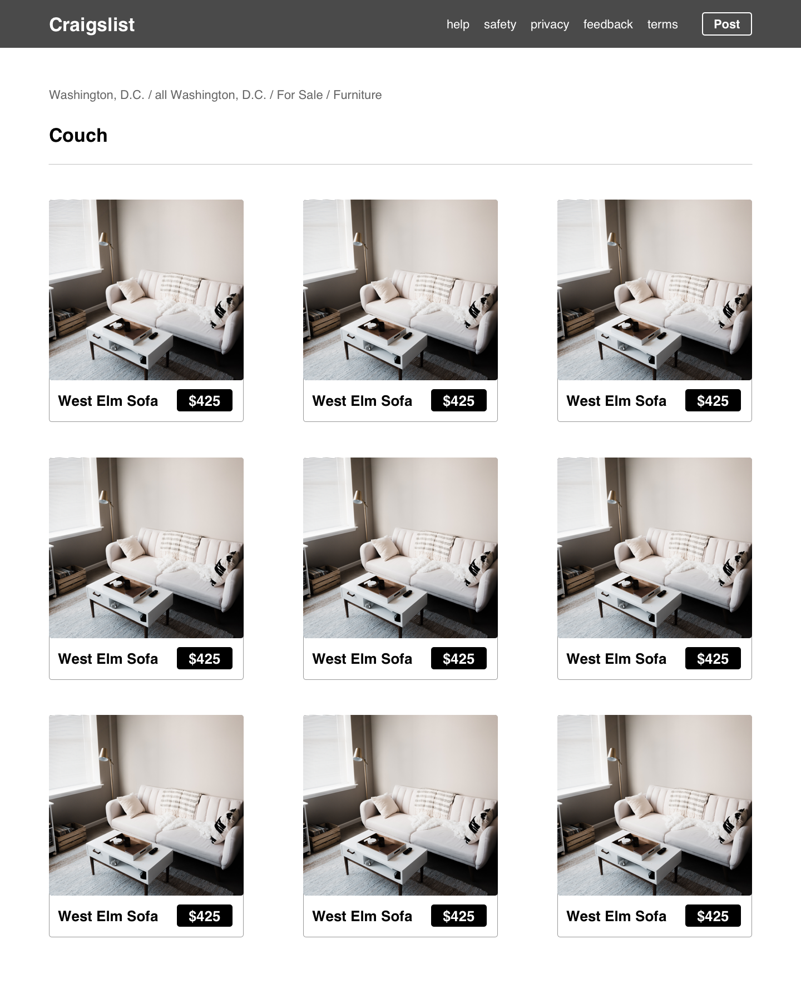

# React Craigslist

Recreate the results page of Craigslist using the data provided.

## Prerequisites

- React, State, Props, Components
- Create-react-app
- useEffect

## Instructions

Create a react app in this directory (`lib/craigslist`) using
`npx create-react-app .`. Note the period at the end! Then follow the requirements below.

## Requirements

Using the data provided at this Couches [API](https://tranquil-oasis-57351.herokuapp.com/), recreate the craigslist
results page in the provided [`mock.png`](mock.png):

Create a `useEffect` to fetch data from the API. This can occur in the `ResultsList` component in the component tree below. Then pass
the data through as props to `Result` as you need to.

Don't worry about adding functionality! Just write the JSX necessary to render
a page as close to this as you can.

You should have the following components:

- App - highest level component, renders all others and passes any props down.
  Should just render Header and Results
  - Header - the header navigation bar with the title and navigation
    - Nav - the list of navigation links in the header
  - Results - The main component on this page
    - ResultsHeader - the section of the Results with the breadcrumbs and title
      - Breadcrumbs - the breadcrumbs on the page
    - ResultsList - container component for the list of results
      - Result - component for an individual search result (commonly called a "Card"
        component)

## Plagiarism

Take a moment to refamiliarize yourself with the [Plagiarism policy](https://git.generalassemb.ly/DC-WDI/Administrative/blob/master/plagiarism.md). Plagiarized work will not be accepted.

## [License](LICENSE)

1.  All content is licensed under a CC­BY­NC­SA 4.0 license.
1.  All software code is licensed under GNU GPLv3. For commercial use or
    alternative licensing, please contact legal@ga.co.
