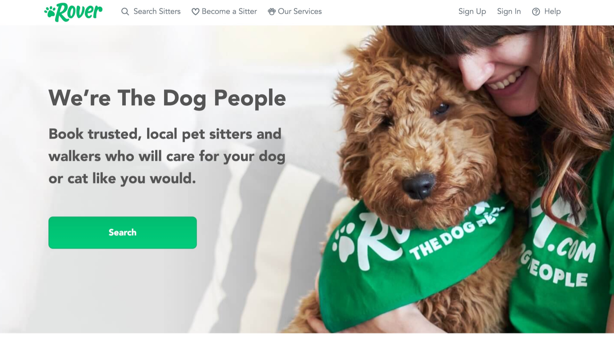

# Rover HTML & CSS Practice

## Prerequisites:

- HTML basics
- CSS basics

## Setup:

1. Fork this repo and clone it to your `sei/sandbox` folder.
1. Open it in VS Code.
1. Scaffold out some boilerplate in your HTML file and connect it to your `style.css`.
1. Open the `index.html` in your browser.

## Directions

Follow along to use your HTML and CSS skills to faithfully reproduce this mockup:

