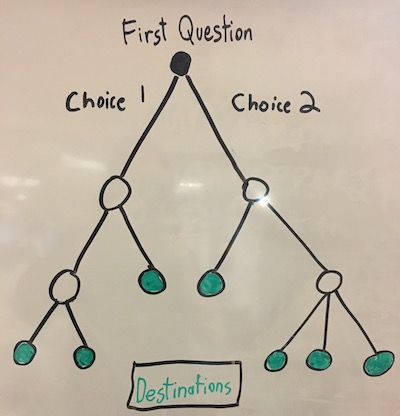

# Choose Your Own Adventure!

For this lab, we'll be using most everything we've learned on JavaScript so far. Your task will to be create a Choose-Your-Own-Adventure-style game. Choose Your Own Adventure, for those who have never heard of it, was a genre of books that would address the reader in the second person and prompt them to make different choices.

> **Example**
> *You are walking down the road and a hungry-looking dog comes up to you, sniffing for treats. You have a cracker wrapped in plastic in your pocket. Do you feed the dog?*
> *If you feed the dog, **turn to page 67**, otherwise **turn to page 23**.

### How to Get User Input

We can use the `prompt()` function to capture user input via a dialog box.

> *Try this code out in your browser console...*
```js
// prompts user and stores value in the variable
let valueOfPrompt = prompt('*You are walking down the road and a hungry-looking dog comes up to you, sniffing for treats. You have a cracker wrapped in plastic in your pocket. Do you feed the cracker to the dog? (choose y or n)*')
// logs value stored
alert(`You choose ${valueOfPrompt}`)
```

`prompt()` will `return` whatever the user types into the dialog box.


## Requirements


1. Any that path the user takes must ask them at least **three** questions.
2. There must be a minimum of **seven** total destinations the user could arrive at based on their responses.
3. For **at least one** of the questions asked, there must be **more than two possible user responses**.

> This might be visualized in the following way...




### Additional Requirements

Each of the circles (or nodes) above represents a question asked to the user.

1. Each decision should be in a function. Example below...
     > This is the essential pattern you would follow in this lab...
     ```js
     firstQuestion() /* don't forget to run the function defined below! */
     function firstQuestion () {
        let response = prompt('You are walking down the road and a hungry-looking dog comes up to you, sniffing for treats. You have a cracker wrapped in plastic in your pocket. Do you feed the cracker to the dog? (choose y or n)')

        if (response === 'y') {
          /*call secondQuestion function*/
        } else {
          /*call thirdQuestion function*/
        }
     }

     function secondQuestion () {
         let response = prompt('You fed the dog! That was super nice. The dog offers you a gift of a watch or a pony? (choose watch or pony)')
         // if statement here, like above
     }
     ```

2. Use **at least one loop**: you may use a `for` loop or use the array iteration method, `.forEach()`.
3. Your code must make use of **both string and number user inputs**.
     > **Hint:** You may need to use `parseInt()` for converting a string to a number, and `toString()` or ``${nameOfVariable}`` to convert a number into a string.


### Need Some Inspiration?

How about...
* Kim Kardashian starts a crossover reality TV show about going offroad with pickup trucks and muddin'.
* A "Top Chef" style cooking adventure where the player is the chef, trying to make dinner for an elite group of judges. Possible obstacles include overcooking the meal, running out of time or mean judges.
* A Harry Potter themed adventure where the user is Harry and he must find all the horcruxes. Possible obstacles include He-who-must-not-be-named, Professor Snape or Ron being completely useless.
