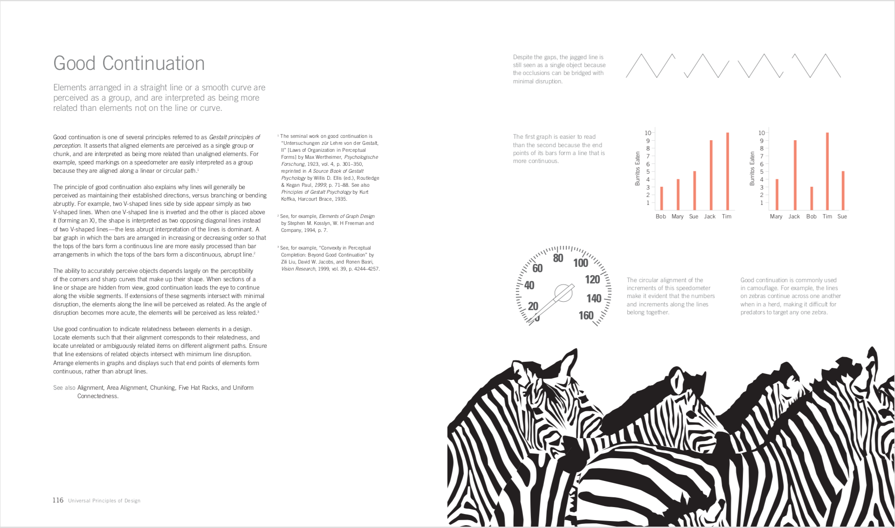
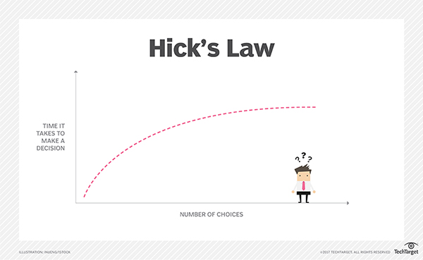
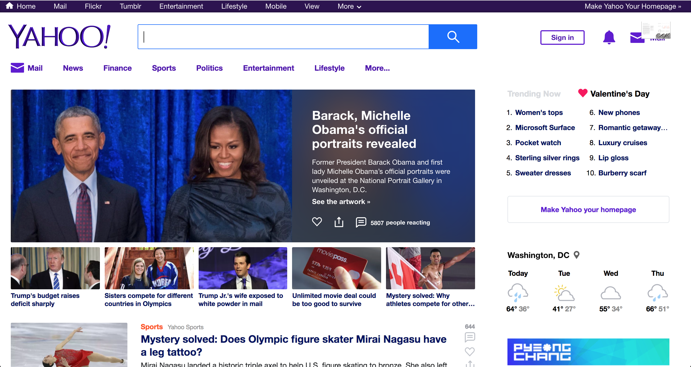
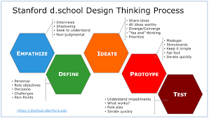
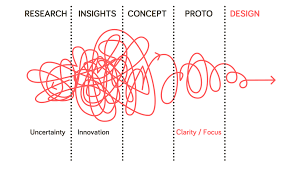
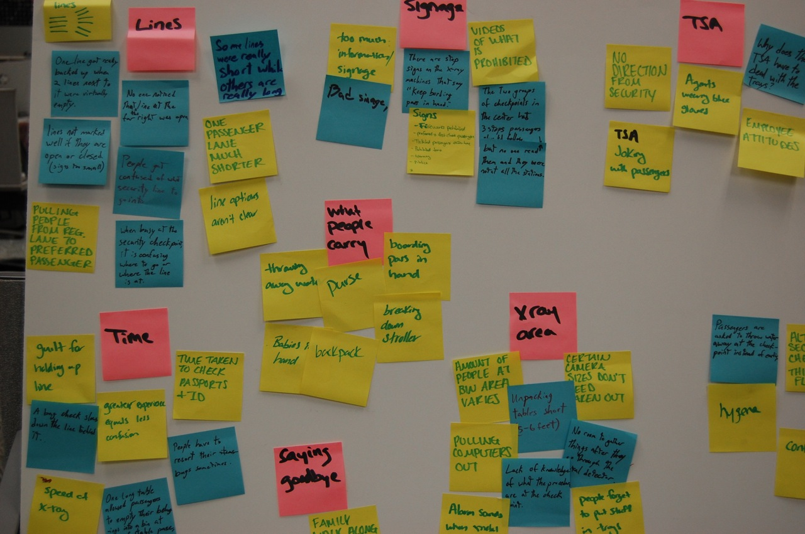
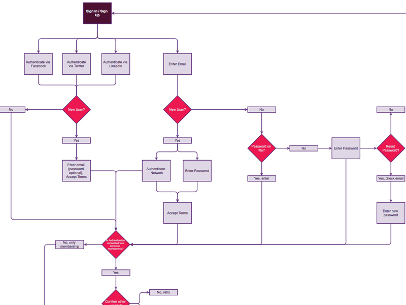
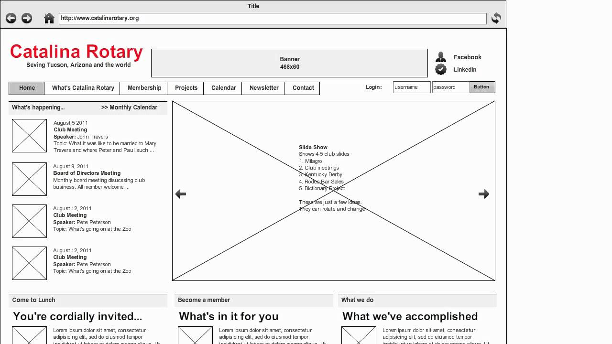
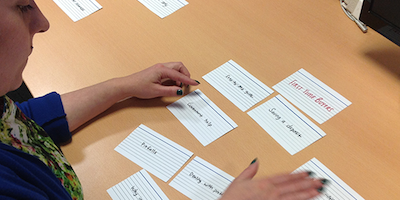

# Interface Design

As web developers it is our job to build products. Whether your applications are built for consumers or internal use, it is important to remember that you are building a product for real people. People who have experience, knowledge, bias, and preference that is uniquely different from yours. **Identify your target user and learn from them.**

## Learning Objectives

- Discuss several general principals of design
- Introduce user experience design (UX)

## Universal Principals of Design

The content in this section is inspired by a book I highly recommend for anyone working in product design. You! *Universal Principles of Design* is exactly what it seems. It is a huge repository of design considerations that can and should be applied to the design of tea kettles, elevators, propaganda, space shuttles, and everything in between.

Today we will touch on a few important considerations when building the interface of a website or application.

### Cost vs Benefit

Closely consider the benefits of using your application. What is the app designed to do? How might it make a user's life easy, happy, healthy, knowledgeable, productive, or fun? While it is fun and easy to imagine our applications' positive impact on users, it is important to remember that there is always an associated cost. Costs come in many forms: money, time, ...decisions?

  
<strong>What aspects of an application may create a cost for users?</strong>

   

- **loading:** People are impatient. The longer a user has to wait, the more likely they are to use an alternative product.
- **sign up:** Forms are annoying and nobody enjoys sharing unnecessary personal information. Unless signing up is critical to an app's benefit, it will be perceived as a cost.
- **onboarding:** It takes time and energy to learn a new skill or tool. Simplify onboarding as much as possible and focus on features that are critical to the core functionality of the app.
- **complexity:** People become overwhelmed by complexity and can become paralyzed if given too many options. Give your app a KISS (Keep it Simple, Stupid!)

#### Hick's Law

Hick's law states that the time it takes to make a decision increases with the number of present choices. Users feel confident, empowered, and happy when they are able to easily navigate an application and they are frustrated when they can't find what they're looking for. Consider Hick's law when designing navigation and menu options. Group related navigation links together. Present the most used functions and hide advanced features for users to learn with time.

  
<strong>How does Netflix utilize Hick's Law to make choosing a show or movie easier for users?</strong>

   

  By presenting rows of related items, Netflix encourages users to first narrow their decision by genre.

  

#### Occam's Razor

Occam's razor is a principle that states that when presented with competing solutions to a problem, choose the one that makes the fewest assumptions (i.e. the simplest one). Favor simplicity over complexity. Superfluous elements decrease an applications efficiency and introduce possibilities for error. Carefully evaluate each piece of your application and determine whether each element contributes to the application's larger function or goal.

Consumers typically choose products that are simple and focused on solving a specific problem.

  
<strong>What is your go to search engine?</strong>

   

 

Minimizing cost is as important as maximizing benefit. Users will never appreciate the value of your application if the investment of time and energy is too great.

### Consistency

The concept of consistency is not new to this course and has been encouraged throughout in reference to writing code.

  
<strong>What are the benefits of writing consistent code?</strong>

   

- visually pleasing
- improves readability
- improves understanding and communication between team members
- removes the need to make frequent style decisions

 

Consistency in interface design is similarly important. Consistent style improves a user's ability to learn and use an application. When links, headers, buttons, font, color, or even page margins are visually and functionally consistent, our application creates reliable expectations for users. This builds trust, comfort, and recognition.

Let's check out [Airbnb](https://www.airbnb.com). What's consistent?

Create constraints when planning the interface of an application. Limit yourself to a few complementary colors, one or two fonts-styles, and a handful of distinct font-size/weight combinations. Organizing page content within a grid creates visual consistency through alignment and whitespace.

Inconsistency can be a powerful tool too, but it should be used sparingly and minimally. Elements that are visually unique can be used to direct users' attention. To direct attention to your app's most important feature, link, or button, consider altering the element's size, shape, color, or font but NEVER all four. Ensure that any break in consistency still fits naturally within the app's style as a whole.

#### Mimicry

User expectations extend across applications.

 

Mimicry is borrowing *aspects* of a familiar design in order to utilize users' preexisting knowledge or expectations. **Dont reinvent the wheel.**

When building an interface, look to similar applications for direction. Is navigation intuitive? Does the choice of color palette elicit a particular feeling or emotion? Is content organized simply? Take aspects you like and modify them to fit the overall style of your application.

Play to user expectations whenever possible. If you make a bold decision about your application's layout, flow, or style, which is contrary to the norm, ask yourself why. If you can't identify a concrete benefit, you're only creating a cost to your user.

## User Experience Design

User experience (UX) design prioritizes testing and iteration. UX puts the user first. It is a process which leads to products that meet the explicit needs of users. The UX process is fluid and non-linear. It requires validation through user testing at each step.

Ultimately, we are not building products for ourselves, meaning our opinions and preferences may not match those who we are designing for. A responsible UX designer tests their assumptions --better yet, they design based on user feedback.

### Empathize

The UX design process always begins with empathy. Understanding your target user is critical to building a product that will improve their experience. Interviews with users (not your colleagues) gives meaningful insight into the challenges they face, their problem solving strategies, and the tools they use.

### Define

With enough research a common problem becomes present. With a clear problem or goal, you can be more targeted in your research. Identify specific pain-points associated with a common task and clearly define what demographic experiences this particular challenge. Creating a persona or a representation of your target user helps foster empathy through the entire design process.

### Ideate

After you've clearly identified a problem and the demographic that experiences it, you can begin to ideate about potential solutions. Brainstorm with colleagues and verify your thinking with users.

### Prototype

Once a rough solution forms, begin prototyping. Start with a pencil and paper. A simple sketch can identify flaws early on and prevent wasteful investment of time and resources. After validating a paper sketch, create more robust prototypes and test with users often. This stage allows for quick iteration.

### Test

Once you're comfortable with a design, build it, deploy it, and test it. The experience of using a deployed product is inherently different from using a high-fidelity prototype. It won't be perfect the first time. Use the knowledge gained through testing to improve the next iteration of the product.

### UX in Reality

### Common UX Tools and Strategies

#### User Interviews

- Don't ask people what they want. People understand their problems but not necessarily the solution.
- Ask about past experiences. What could have been better?
- Ask open-ended questions. Get people talking!
- Follow up with 'Why?'

#### Affinity Mapping

- Use sticky notes to organize trends across user interviews.
- Write in ALL-CAPS with a bold marker
- Color code by interviewee

#### Competitive Analysis

- Look to services that target the same demographic. What are they doing well? Where is there room to improve?
- Analyze which features user actually use and appreciate

#### User Flows

- User flows help you organize a users path through an aplication.
- User flows may identify long or difficult taskes that need streamlining
- User flows create a great framework to build wireframes from.

#### Wireframing

- Wireframes visualize an idea. They are void of visual design elements and focus on layout and organization.
- It's very easy to compare designs

#### Usability Testing

- Put a prototype in front of a user to observe their interaction.
- Ask users to complete concrete tasks.
- Test assumptions about how a user will interact with a design.

#### Card Sorting

- Ask users to group and organize a stack of cards that represent navigation items.
- Card sorting gives insight into how people expect items to be grouped.
- Card sorting is really helpful when organizing navigation and options menus intuitively.

#### Prototyping

- UX designers use apps like (sketch)[https://www.sketchapp.com/] and (inVision)[https://www.invisionapp.com/] to create usable prototypes without writing code.
- prototyping saves time as it's fast and easy to iterate upon.

## Additional readings

If you google 'universal principles of design pdf', the first two hits are downloadable pdfs of the full book. I'm not saying you should download it but.. someone.. hypothetically.. could read it for free.