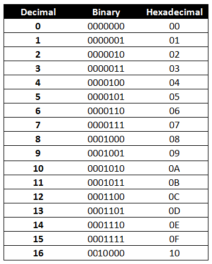
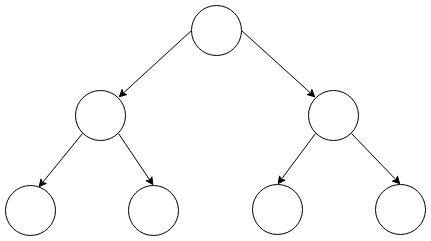
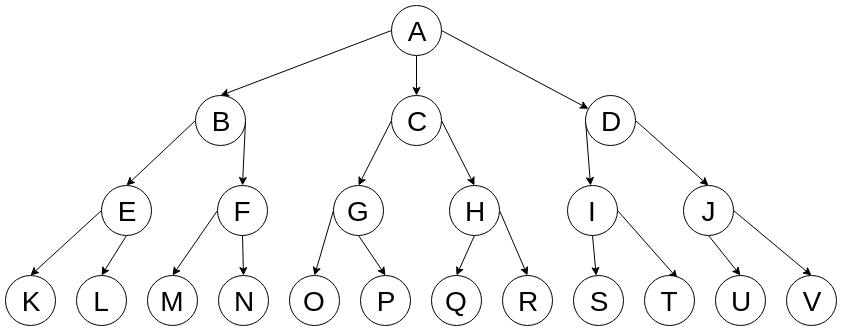

# Computer Science Fundamentals

## Learning Objectives
* Define computer science and discuss how it is useful for web developers.
* Define the word `algorithm`.
* Use Big-O notation to analyze the complexity of different algorithms.
* Implement multiple sorting algorithms.
* Understand a few commonly used number systems in computer science.
* Understand basic data structures and why they are useful.

## Framing (10 min / 10:10)

> "Computer science is a discipline that involves the understanding and design of computers and computational processes. In its most general form it is concerned with the understanding of information transfer and transformation. Particular interest is placed on making processes efficient and endowing them with some form of intelligence. The discipline ranges from theoretical studies of algorithms to practical problems of implementation in terms of computational hardware and software."

> ([Source](https://www.cs.mtu.edu/~john/whatiscs.html))

Computer Science fields include but are not limited to...
- Algorithms
- Data structures
- Mathematical logic
- Networking
- Computer Architecture
- Theory (Coding, Game, Graph)
- Artificial intelligence

> [This Wikipedia article](https://en.wikipedia.org/wiki/Outline_of_computer_science#Subfields) has a nice summary of CS subfields.

Many think of computer science as a necessary prerequisite to do anything programming-related with a computer and *really know what you are doing*, or that knowing a certain amount of computer science is some kind of litmus test for a *true programmer*. This attitude perhaps unnecessarily mystifies an already difficult subject and field of study and, at worst, makes the learning curve seem so steep that it is like a learning barrier.

What do you already know about computer science?

Decades ago, it was absolutely necessary to have an understanding of computer science to do anything with a computer. In the beginning of consumer computing, home computers were essentially electronics projects for enthusiasts and hardcore hobbyists. The types of things you could do with a computer were very limited, and of interest to people with specific interests. Computers have come a long way since then, and are equipped with operating systems that attempt to make it as easy as possible for anyone to use a computer.

Something similar is true for programming, namely that not knowing any computer science is no longer a barrier to entry.

> An aside...
The field of computer science can sometimes feel like an elitist club.  This field has at times been discriminatory towards groups of people who may not have come from backgrounds where computers and computer programming was available to them.  Computer science classes often assumed hidden prerequisite knowledge that only some people had been exposed to. Take a minute to read this article. [When Women stopped coding](https://www.npr.org/sections/money/2014/10/21/357629765/when-women-stopped-coding)

You probably know more computer science than you even realize!
> **110F,S Introduction to Computer Science.**
The first course in computer science is an introduction to algorithmic problem-solving using the Python programming language. Topics include primitive data types, mathematical operations, structured programming with conditional and iterative idioms, functional abstraction, objects, classes and aggregate data types. Students apply these skills in writing programs to solve problems in a variety of application areas. No previous programming experience necessary. (Quantitative and Symbolic Reasoning.) Maximum enrollment, 26. The Department. [Hamilton College Intro to Computer Science](https://www.hamilton.edu/academics/departments/Courses-and-Requirements?dept=Computer%20Science).

Today we are going to go through an abbreviated version of a "Data Structures and Algorithms" course since that is usually one of the most important classes computer science students take.

### How Can We Use Computer Science? (5min / 10:15)

**Computer science provides methods and concepts for evaluating what we are doing as programmers.** At the very least, understanding some computer science can simply deepen our appreciation for our discipline and our craft. Overtime we can learn to become more efficient with our code and start to think more like computer scientists.  (Maybe I don't need to 3 nested for loops?)

What does computer science have to do with modern web development? Not much, on the surface. As application developers, we can do our job well by following best practices, guided by our experience. It probably will not be often that you are interested in the time-complexity of a method you write.

Complexity and data structures are something **engineers** worry about, not developers, right?

Well, no. While it is true that we don't usually care much about optimization,
there are a few reasons why developers should care a bit about classic topics in
introductory computer science (CS).

1. Classic problems allow us to practice our problem solving skills; in fact, most of our lesson today can be completed without coding.
2.  Being familiar with the tradeoffs inherent in choosing an algorithm or a data structure have direct parallels in choices you make writing your application code.
3. Some of our colleagues will have CS degrees, and being able to understand the jargon and figures of speech they use helps us communicate with them. Perhaps most importantly, these colleagues will probably have some say in hiring you, since they're your prospective team. Nearly every technical interview touches on these topics to some extent.  

### What is an algorithm? (15 min / 10:25)

Take 10 minutes and read [this](https://www.economist.com/blogs/economist-explains/2017/08/economist-explains-24) article. Write an issue on this repository with a definition in your own words of what an algorithm is.

> An algorithm is, essentially, a brainless way of doing clever things. It is a set of precise steps that need no great mental effort to follow but which, if obeyed exactly and mechanically, will lead to some desirable outcome.

from [here](https://www.economist.com/blogs/economist-explains/2017/08/economist-explains-24).

In other words...

> An algorithm is just fancy term for a set of instructions of what a program should do, and how it should do it. In other words: it’s nothing more than a manual for your code.
[Vaidehi Joshi](https://medium.com/basecs/sorting-out-the-basics-behind-sorting-algorithms-b0a032873add)


Algorithms help solve a problem. When we have a problem, we take a **series
of steps to solve that problem**. Say I want a peanut butter and jelly sandwich,
and Andy has agreed to make it for me. The problem is, he doesn't know how.
Assuming an otherwise-adult set of knowledge, how might we tell Andy to make me
a sandwich?

> 1.  Go to the kitchen
> 1.  Find the bread, toaster, utensils, peanut butter, and jelly
> 1.  Toast the bread
> 1.  Using a knife or spoon, spread one slice of toast with peanut butter
> 1.  Spread the other slice of toast with jelly
> 1.  Place the two pieces of bread together
> 1.  Return to me with the sandwich (most important step)

If Andy needed to make sandwiches for all of us, how would he do that? What's
the "easy" way to obtain many sandwiches? What is a more efficient way?

### Think-Pair-Share: Outline an Algorithm (5 minutes / 10:30)

Take 3 minutes to write down your day-initialization algorithm (i.e., your morning routine). Share it with a neighbor. How many steps are there? How do you or could you save time if you're in a rush?

### What makes a good algorithm?

When we work with relatively small inputs, like we have for the most part in this class, using an efficient algorithm to solve a problem is not crucial. Instead, it is more important to have clean code, good interfaces, and bug-less applications. However, once we are working with huge inputs our code will get a lot slower. At that point, building efficient algorithms becomes really important.

When we write code, one of our main goals is to make that code execute quickly. If our code is inefficient, our sites will load slowly and users may leave. We also want to use as little memory as possible when we execute our code so that it is less expensive to host our sites. These are usually the two best measures of the effectiveness of an algorithm, their speed and their memory use.

## Run Time and Big-O Analysis (30min / 11:00)

We can look at a program and say -- "Oh that took two seconds to run". But that two seconds is dependent on a lot of factors. That two seconds is for a very specific input - your computer on your network with a certain version of your programming language. Instead, we should generalize the algorithm's complexity.

We do so using a notation that mathematicians and computer scientists use, called Big-O notation. This notation standardizes how we discuss the efficiency of algorithms. ***Big-O really tells us how quickly the runtime grows as the input becomes arbitrarily large***.  Most of the time, we use Big-O notation to describe time complexity, but we can also use it to describe memory efficiency.

Big-O notation is not an exact metric for benchmarking algorithms. Rather, it gives us an abstract idea about how costly or efficient an algorithm is, with respect to how much computing power it takes. With Big-O notation, we are comparing orders of magnitude.

A few notes on Big-O notation:
* When we calculate the Big-O of the function, we are calculating the **worst** possible runtime for a given function.
* Sometimes, Big-O notation is referred to as [asymptotic analysis](http://www.cs.cornell.edu/courses/cs3110/2013sp/supplemental/lectures/lec19-asymp/review.html).

For time complexity, we want to count how many times the code is run in context of how large the input to the code is. For example, O(1) is a very efficient piece of code, O(N!) is very inefficient. Let's break this down into categories of Big-O.

### O(1) Complexity (aka Constant Complexity)

O(1) means that an algorithm's runtime is static or constant. *The complexity stays the same no matter the input*.

```javascript
function helloWorld (arr) {
	console.log('hello world')
}

function returnFirstItem (arr) {
	return arr[0]
}
```

In both of the above examples, no matter what size the `arr` argument is, the function will run once.

### O(N) Complexity (aka Linear Complexity)

O(N) complexity means that, as the input sizes increase, the processing time increases linearly. Or, more simply, the code runs once for each input.

```javascript
function iterate (arr) {
	arr.forEach(item => console.log(item))
}

function iterateLoop (arr) {
	for (let i = 0; i < arr.length; i++) {
		console.log(arr[i])
	}
}

function addOne (arr) {
	return arr.map(item => item + 1)
}
```

In each of the above examples, we go through the array and perform an action with each item in it. If we have the array `[1]`, each will execute once. If we have the array `[3, 5, 1000]` the code will run 3 times. If our array has 1000 items, the code will execute 1000 times!

### O(N^2) Complexity (aka Quadratic Complexity)

For an input with the size n, quadratically complex algorithms execute n*n times.

```javascript
function consoleLogLots (arr) {
	for (let i = 0; i < arr.length; i++) {
		for (let j = 0; j < arr.length; j++) {
			console.log(arr[i], arr[j])
		}
	}
}
```
For the array `[1, 3]`, this function will print:
```js
[1, 1]
[1, 3]
[3, 1]
[3, 3]
```
For a 2 item array, the code executes 4 times. This scales pretty fast -- for an array with 100 items this code will `console.log` 10,000 times!

### O(log n) and O(n log n) Complexity

O(log n) refers to algorithms which cut the problem in half each time. These have significantly lower complexity than O(n). We don't actually have to calculate logarithms or anything like that! Technically, a logarithm is a "quantity representing the power to which a fixed number (the base) must be raised to produce a given number." [source](https://en.wikipedia.org/wiki/Logarithm)
>Examples...

- the base 10 logarithm of 1000 is 3 since 10^3 is 1000.
- log<sub>2</sub> 32 = 5

One example of an O(log n) algorithm is a binary search. In an *unsorted* array, if we want to find the index of an item with a given value, we have to iterate through it and check if each item is equal to the item we are searching for. However, if we know that we have a **sorted** array, we can do this a lot easier!

For the array `[1, 3, 5, 7, 9, 11, 13]`, if we want to find the index of the 5, we can do so like this:
* Find the item at the midpoint of the array. This ends up being `7`.
* Our item is below 7, so then, since our array is sorted, we only have to search the half of the array before the 7.
* The midpoint of the sub array from 1-7 or `[1, 3, 5]` is `3`.
* This time, 5 is larger than 3, so we search the sub-array `[5]`. Since the midpoint of that array `5` is equal to the number we are searching for, we just return that number.

Let's checkout a ***[visualization](https://www.cs.usfca.edu/~galles/visualization/Search.html)***

An implementation of that algorithm is below:
```javascript
function binarySearch(arr, item, first = 0, last = null) {
	if (!last) last = arr.length

	let midpoint = Math.floor((last - first) / 2) + first

	if (arr[midpoint] === item) return midpoint
	if (arr[midpoint] > item) return binarySearch(arr, item, first, midpoint)
	if (arr[midpoint] < item) return binarySearch(arr, item, midpoint, last)
}
```

The above function ran 3 times instead of the 7 that we would need if we iterated through the entire array! This algorithm is super efficient -- even if we have a million items in our array, on average we will only need to execute the binary search 20 times.

O(n log n) algorithms are ones that are faster than O(n^2) but slower than O(n). Let's come back to O(n log n) in a minute -- a lot of sorting algorithms fall under this category.

### O(n!) and O(2^n)

O(n!) and O(2^n) complexities should make you very nervous! These should be avoided at all costs. One example of an O(n!) algorithm is the Bogosort - aka the slowsort. This sort is when an array is randomly ordered over and over again until it is in the correctly sorted order. For an array with the length 10, this sort may have to run up to 3,628,800 times! Sometimes you will have to look at all the available combinations and writing code that are in these complexity categories can't be avoided, but they should bring up some red flags!

### Drop the Coefficients, Constants, and less Significant Terms

Again, having an efficient algorithm is much more important when we have large inputs. By convention, we drop the coefficients and constants during Big-O analysis since they are usually negligible for those inputs.

For example:
```javascript
function iter (arr) {
	// Big-O: N
	arr.forEach(item => console.log(item))
	arr.forEach(item => console.log(item))
	console.log('hello world')
}

function helloWorld () {
	// Big-O: 1
	console.log('hello world')
	console.log('hello world')
}
```
The above examples, at first look would have complexities of O(2N + 1) and O(2) respectively; however, in order to keep things simple, we can drop the coefficients. The time complexities are still linear and constant respectively. We take the least efficient operation within the block of code to measure its efficiency.

Here are some more examples where you want to drop the less significant terms...

<code>O(n​<sup>3</sup> ​​+ 50n<sup>​2</sup>​​ + 10000) = O(n​<sup>3</sup>​​)</code>

<code>O(n+30) x O(n+5) = O(n​<sup>2</sup>​​)</code>

The most significant term always wins out in the end!

### Big-O Summary


The following table shows how algorithms with different complexities scale when given different numbers of inputs. Note: some values are rounded.

|Complexity |1|10      |100  |
|-----------|-|--------|-----|
|O(1)       |1| 1      |1    |
|O(log N)   |0| 2      |5    |
|O(N)       |1|10      |100                            |
|O(N log N) |0|20      |461                            |
|O(N^2)     |1|100     |10000                          |
|O(2^N)     |1|1024    |1267650600228229401496703205376|       
|O(N!)      |1|3628800 |doesn't fit on screen! |


Let's look at this demo in javascript...
- Code: [JS](https://git.generalassemb.ly/ga-wdi-lessons/cs-algorithms/blob/master/js-example/script.js), [HTML](https://git.generalassemb.ly/ga-wdi-lessons/cs-algorithms/blob/master/js-example/index.html)
- [Deployed](http://aboard-thought.surge.sh)

## Break (10 min / 11:10)

### You Do: Study Big-O Families (15 min / 11:25)

[Write down the complexities of these functions](https://gist.github.com/amaseda/c4283f5c58b9b68be9318259098f0298).

### Brief Aside: Recursion (5 min / 11:30)

Recursion is when a function calls itself. A lot of the times, this will make writing out code for our algorithm a bit easier and at times clearer. Any time you write a recursive function, though, keep in mind that it can be rewritten iteratively (or with a loop). In most cases, recursive functions are less efficient than iterative ones because we are adding a bunch of calls to the call stack. If we add too many function calls to the call stack we can have a stack overflow (this is usually around 20-40,000 calls)! Some languages do optimize [tail recursion](http://2ality.com/2015/06/tail-call-optimization.html) which essentially makes a recursive function into a while loop during interpreting or compiling.

> Easter Egg: search recursion on Google!

## Sorting Algorithms (20 min / 11:50)

One of the most important subsets of algorithms is sorting algorithms. A lot of the time, we will have a collection of items that we want to order in some way for our analyses or for display purposes.


There are **tons** of sorting algorithms with various pros and cons to them -- some are more efficient with some types of inputs and less with others. Again, having an efficient sorting algorithm isn't super important with a collection of ten items, but when there are a million or a billion efficiency becomes very important!

With different sorting algorithms, there are a couple things we need to keep in mind. The first is the time complexity - which we just went over. The second is whether or not they are **in place**. Some sorting algorithms can just re-order the collection, others need an additional data structure in order to work.

### Bubble Sort

The bubble sort algorithm goes like this: pass through the array a bunch of times, and each time if one element is higher than its neighbor, swap them. [Here](https://www.toptal.com/developers/sorting-algorithms/) is a visualization of it.

```javascript
Array.prototype.swap = function (idxA, idxB) {
	let temp = this[idxA]
	this[idxA] = this[idxB]
	this[idxB] = temp
}

function bubbleSort (a) {
	let keepGoing = true

	while (keepGoing) {
		keepGoing = false
		for (let i=0; i < a.length - 1; i++) {
			if (a[i] > a[i+1]) {
				keepGoing = true
				a.swap(i, i+1)
			}
		}
	}
}
```

The bubble sort algorithm has an O(n^2) complexity. It works really well if an array is close to sorted -- in that case the algorithm could be closer to O(n log n), but in the case that an array is not close to sorted, it will be a lot less efficient.

### Quicksort

With the person next to you, describe what the below function is doing. [Hint](https://www.toptal.com/developers/sorting-algorithms/quick-sort).

```js
function quickSort (a) {
	if (a.length <= 1) return a

	let below = [], above = []

	let pivot = a.length - 1

	let pivotValue = a[pivot]

	a = a.slice(0, pivot).concat(a.slice(pivot + 1))

	for (let i = 0; i < a.length; i ++) {
		a[i] < pivotValue ? above.push(a[i]) : below.push(a[i])
	}

	return quickSort(above).concat([pivotValue], quickSort(below))
}
```

## Break (10 min / 12:00)

## You Do: Researching Common Sorting Algorithms (20 min / 12:20)
> 10 min research, 10 min presentations

In groups of three, research the following sorting algorithms:
* Selection sort
* Merge sort
* Radix sort
* Counting sort

You will be presenting your findings to the rest of the class! Make sure you include the benefits, drawbacks, complexity, and a code sample of your algorithm. If you want to send any materials for your presentation to me feel free to do so!

> Aside: writing sorting algorithms is important for understanding the "behind the scenes" of a programming language, but each language we have used in this class has a `.sort()` method built in. Ruby's uses a [merge sort](https://en.wikipedia.org/wiki/Merge_sort), Python uses a [tim sort](https://en.wikipedia.org/wiki/Timsort), and JavaScript uses [quick sort](https://stackoverflow.com/questions/234683/javascript-array-sort-implementation) (depending on the browser). In practice, you should usually use these since they are highly optimized. Many companies like you to know some sorting algorithms (usually have two on hand).

## Number Systems (10 min / 12:30)

Number Systems are simply a way to represent numbers.  We commonly use **Base-10**, also called **Decimal**, most likely because we have 10 fingers.  If we were crabs with claws, we very likely would have ended up using 'Base-4'.  If we were octopi, we could have ended up using 'Base-8'.  At the most basic level, computers use what's called **Binary**, or **Base-2**.  Why might this be?

Computer processors contain millions or billions of tiny 'transistors', which is a switch that can either be 'on' or 'off'.  We represent on and off as either 1 or 0, for a total of two possibilities, also known as one bit of information.  8 bits together is known as a byte, which can represent up to 256 different numbers or characters.  

**Hexadecimal**, or **Base-16** is used a lot in programming languages because it converts easily into binary.  Hexadecimal uses digits 0-9 and A-F to represent digits.  


>http://www.wirebiters.com/wp-content/uploads/2014/01/binary-hexadecimal-decimal-chart-1.png

Let's look at some examples of how base-10 numbers can be stored as binary, but first let's think back to the decimal system stores numbers.  

`138` in decimal is really the same as...
<br>
<code>(1 x 10<sup>2</sup>) + (3 x 10<sup>1</sup>) + (8 x 10<sup>0</sup>)</code>

`255` in decimal is really...
<br>
<code>(2 x 10<sup>2</sup>) + (5 x 10<sup>1</sup>) + (5 x 10<sup>0</sup>)</code>

Now let's look at ***binary***...

`101` in binary is really
<br>
<code>(1 x 2<sup>2</sup>) + (0 x 2<sup>1</sup>) + (1 x 2<sup>0</sup>)</code>
<br>or ...
<br>
<code>4 + 0 + 1 = 5</code>

`1000 0000` in binary is really
<br>
<code>(1 x 2<sup>7</sup>)</code>
<br>or ...
<br>
<code>128</code>

### You do

Convert the following numbers from binary to decimal

1. `11`

2. `1000`

3. `1111`

4. `1000 1001`

5. `1111 1111`

<details>
	<summary>Answers</summary>

	1. 3

	2. 8

	3. 15

	4. 137

	5. 255
</details>


## Data Structures

Throughout this class, we've used some of the builtin data structures that our programming languages give us. Let's review what a data structure is: data structures define how a collection of data should be organized. We have used arrays, objects, hashes, and ranges in our code.  There are reasons why we choose one over the other -- if we want ordered data we use an array, if we want key value pairs we use an object. There are also other data structures out there. Some are built in to the programming language, some are not.

These data structures are programming language agnostic -- they can be implemented in any language. Therefore, they fall into the category of "abstract data types" -- or theoretical data types described by their values and actions. For example, an integer is a whole number which can be added, subtracted, multiplied etc. These can be implemented across programming languages -- or even outside of programming. Data structures fall into this same category!

Similar to the sorting algorithms from before, we use different data structures for different reasons. Usually, they have some operation optimized -- like sorting, searching, adding or removing items, or iterating through them. Let's first start looking more in depth at the data structures we've seen in class and then look at some new ones!

### Arrays

Arrays are ordered data structures that allow us to access pieces of data at a given index.

Traditionally, arrays have a set size, so you can't add or remove data from them. This makes them really efficient because array items can be stored together in a block of memory on your computer. The indexes of the items are then calculated based on the address in memory that the item is located at.

The high level programming languages that we have seen in this class abstract away the memory allocation dynamic in arrays, so we can easily add and remove items from them. Most programming languages implement this process by allocating more memory than needed for an array at initialization and then resizing dynamically at certain indexes. In a lot of cases, arrays wil store a pointer to the item rather than the item itself in memory. This makes them less efficient from a computational perspective, but makes them much more programmer friendly!

|Operation|Complexity|
|---------|----------|
|Access   |O(1)      |
|Search   |O(n)      |
|Insert   |O(n)      |
|Delete   |O(n)      |

* Accessing can be done using the formula start + (cellsize * index)
* Searching is done by iterating through the array and seeing if the value equals the item you are searching for.
* Insertion is done by recreating the array, which means that each item must be recreated.
* Deletion is done by recreating the array, which means that each item must be recreated.


### Hash Tables

Hash tables are another name for objects, hashes, maps, associative arrays, and dictionaries depending on the language. They store data in key value pairs.

Hash tables allow us to easily insert, delete, search, and access data.

|Operation|Complexity|
|---------|----------|
|Access   |O(1) -> O(n)|
|Search   |O(1) -> O(n)|
|Insert   |O(1) -> O(n)|
|Delete   |O(1) -> O(n)|

The implementation details of hash tables are outside the scope of this class, but the efficiency of each of their operations is usually very close to O(1). [Here](https://github.com/aspittel/coding-cheat-sheets/blob/master/data_structures/hash_tables.md) and [here](https://github.com/SF-WDI-LABS/hash-map-lab) have more details on how hash tables are implemented if you are interested.


### Linked Lists

Linked lists are linear collections of data that consist of nodes with data and pointers. Singly linked lists have nodes that store the value of the node and a pointer to the next node. Doubly linked lists additionally store a pointer to the previous node.

Linked lists do not need to be stored contiguously in memory like an array, so insertion and deletion is relatively simple. They do not natively support accessing one data node or indexing through operations. These operations are normally performed just by looping through the nodes. They use more memory than arrays since they store pointers to the next link(s).

#### Singly Linked List


#### Doubly Linked List


|Operation|Complexity|
|---------|----------|
|Access   |O(n)      |
|Search   |O(n)      |
|Insert   |O(1)      |
|Delete   |O(1)      |

Items in linked lists are unindexed, so you must traverse the list to find an element. In order to insert or delete, you only have to change the "next" property of one cell.

```javascript
class Node {
  constructor (data, next = null) {
    this.data = data
    this.next = next
  }
}

class SinglyLinkedList {
  constructor () {
    this.head = null
    this.length = 0
  }

  insert (item) {
    this.head = new Node(item, this.head)
    this.length++
  }

  search (item) {
    let idx = 0
    let node = this.head

    while (node) {
      if (node.data === item) return idx
      node = node.next
      idx++
    }

    return -1
  }
}
```

#### You Do: Implement Delete and Access
* Add methods to the `SinglyLinkedList` that allow you to delete a node and that allow you to access an item at a certain index.

```javascript
class Node {
	constructor (data, next = null, prev = null) {
		this.data = data
		this.next = next
		this.prev = prev
	}
}


class DoublyLinkedList {
	constructor () {
		this.head = null
		this.tail = null
		this.length = 0
	}

	insert (item) {
		new_node = new Node(item, null, this.head)

		if (!this.head) {
			this.head = new_node
		} else {
			this.tail.next = new_node
			new_node.prev = this.tail
		}

		this.tail = new_node
		this.length ++
	}

	search (item) {
		let idx = 0
		let node = this.head

		while (node) {
			if (node.data == data) return idx
			node = node.next
			idx += 1
		}

		return -1
	}
}
```

#### You Do: Implement Delete and Access
* Add methods to the `DoublyLinkedList` that allow you to traverse the doubly linked list backwards.


### Stacks

Stacks as a data structure are a lot like stacks as a physical structure. Think of stacks of dishes or books. Stacks operate in a last in first out nature. Newer items are at the top of the stack and will be accessed first whereas older items are near the bottom and will be accessed last. Back buttons, undo buttons, and the function call stack are common uses of stacks. Common methods include:
* Push - add an item to the top of the stack.
* Pop - remove the top item from the stack.
* Peek - check to see the top item of the stack.


Stacks are usually implemented either using a linked list or an array.

#### Linked List Implementation
```javascript
class Node {
	constructor (data, next = null) {
		this.data = data
		this.next = next
	}
}

class Stack {
	constructor () {
		this.head = null
	}

	push (data) {
		this.head = new Node(data, this.head)
	}

	pop () {
		let data = this.head.data
		this.head = this.head.next
		return data
	}

	peek () {
		return this.head.data
	}
}
```

|Operation|Complexity|
|---------|----------|
|Access   |O(1)      |
|Insert   |O(1)      |
|Delete   |O(1)      |

Stacks are very efficient, but they are also limited in what we can do with them.

#### You Do: Implement a Stack Using an Array
Create a stack using an array. Make sure you have the methods push, pop, and peek!

### Queues

A queue is a data structure that operates on a first in first out basis, similar to a line for a movie. These are often used for breadth-first searching where nodes are stored in order for processing. These are usually implemented using either a singly linked list or an array. Common methods include:

* Enqueue: add an item to the queue
* Dequeue: remove item from the queue
* Peek: return the next item in the queue

Software queues are used in a lot of cases like real life queues -- they give service to the task that asked for it first. A printer, for example, usually prints the first job given to it and then queues up the others until it is their turn.


```javascript
class Node {
	constructor (data, next = null, prev = null) {
		this.data = data
		this.next = next
		this.prev = prev
	}
}

class Queue {
	constructor () {
		this.head = null
		this.tail = null
	}

	enqueue (data) {
		let newNode = new Node (data, null, this.head)

		if (!this.head) {
			this.head = newNode
		} else {
			this.tail.next = newNode
			newNode.prev = this.tail
		}

		this.tail = newNode
	}

	dequeue (data) {
		let data = this.head.data
		this.head = this.head.next
		return data
	}

	peek () {
		return this.head.data
	}
}
```

|Operation|Complexity|
|---------|----------|
|Access   |O(1)      |
|Insert   |O(1)      |
|Delete   |O(1)      |

#### You Do: Implement a Queue Using an Array
Create a queue using an array. Make sure you have the methods enqueue, dequeue, and peek!

### Graphs
In computer science, graphs are collections of **vertices** or **nodes**, which usually store or represent some data, and **edges**, which connect the nodes. Each edge connects two nodes together.  If you think of nodes as airports, edges would be the flight paths between them.  Here are some use cases for graphs:

* relationships among users in a social network
* links between pages on a website
* finding a route between two locations. Finding the shortest route is also known as the traveling salesman problem
* planning the order of classes to take based on prerequisites
* graph databases


The node holds the data and then the edges point to related nodes. There are two types of edges: directed and undirected. Directed edges point in a direction whereas undirected edges point both ways.

There are many ways to store a graph data structure. You can use pointers and nodes, or you could use an adjacency list or matrix.

Creating a graph is very simple and we can do so in many ways. For example:

```javascript
class Node {
  constructor (data) {
    this.data = data
    this.edges = [] // links to other nodes here
  }
}
```

Of course, how we traverse the graph structure is what makes it useful.

### Trees

Trees are graph data structures that are hierarchical and unidirectional. They have a root value, and then sub-trees of children that each have parents. They are represented as a series of linked nodes. Each node has a value and then pointers to its children.

The most common tree is a binary tree -- each node has at most two children.

```javascript
class BinaryTree {
	constructor (data, left = null, right = null) {
		this.data = data
		this.left = left
		this.right = right
	}
}
```




|Operation|Complexity|
|---------|----------|
|Access   |O(log n)  |
|Search   |O(log n)  |
|Insert   |O(log n)  |
|Delete   |O(log n)  |

Here are a few examples of trees in computing:

* **the DOM tree**
* The file system, where directories contain other directories and/or files. The `/` directory is called the "root" directory because it's the root of the computer's directory tree. Use the command `tree` to view the tree structure of any given directory. (You may need to install this capability with `brew install tree`)
* comment trees (where users can comment on comments like on reddit)
* data compression algorithm trees (Huffman coding)
* single-elimination tournaments (March madness brackets!)
* parser trees or syntax trees that help a computer interpret human-readable code (like [Abstract syntax trees](https://en.wikipedia.org/wiki/Abstract_syntax_tree)). This is how VSCode knows whether your code is formatted properly or not.
* the way calculators compute order of operations * indexes in databases usually utilize trees.

Usually, trees are extended so that they have more features than just two branches. Some common trees include AVL trees, red-black trees, splay trees, tries, Radix trees, ternary search trees, B trees, and B+ trees. Potentially the most used ones, though, are binary search trees.

#### Breadth vs Depth first search

##### Breadth first
* Useful to find "shortest path" in a graph
* If the tree is wide, will use more memory.
* If the tree is deep, may be slower.

##### Depth first
* Useful when you know how many levels down you need to look, or if the tree is deep.

What order will each of these execute on this tree?


<details>
<summary>Solution</summary>
Breadth first:
A,B,C,D,E,F,G,H,I,J...

Depth first:
A,B,E,K,L,F,M,N...

</details>

Search Order

#### Binary Search Trees

Binary search trees or BSTs are special types of trees that add extra restrictions to them.
In each node's left child subtree (if it has one), all nodes will will contain values less than (or equal to) the original node's value. In each node's right child subtree (if it has one), all nodes must have a greater value than the original node itself (or equal). Left is less!


```javascript
class Node {
  constructor (value, right = null, left = null) {
    this.value = value
    this.right = right
    this.left = left
  }
}

class BST {
  constructor () {
    this.root = null
  }

  insert (value) {
    let node = new Node(value)

    if (!this.root) {
      this.root = node
    } else {
      let currentNode = this.root

      while (currentNode) {
        if (currentNode.value > value) {
          if (currentNode.left) {
            currentNode = currentNode.left
          } else {
            currentNode.left = node
            return
          }
        } else {
          if (currentNode.right) {
            currentNode = currentNode.right
          } else {
            currentNode.right = node
            return
          }
        }
      }
    }
  }
}
```
#### You Do: Add getMinimum method to BST
Add a method that retrieves the minimum value in a Binary Search Tree.

<details>
<summary>Solution</summary>

```javascript

class Node {
  constructor (value, right = null, left = null) {
    this.value = value
    this.right = right
    this.left = left
  }
}

class BST {
  constructor () {
    this.root = null
    this.min = Number.MAX_SAFE_INTEGER
  }

  insert (value) {
    let node = new Node(value)

    if (!this.root) {
      this.root = node
    } else {
      let currentNode = this.root

      while (currentNode) {
        if (currentNode.value > value) {
          if (currentNode.left) {
            currentNode = currentNode.left
          } else {
            currentNode.left = node
            return
          }
        } else {
          if (currentNode.right) {
            currentNode = currentNode.right
          } else {
            currentNode.right = node
            return
          }
        }
      }
    }
  }

  findMin(currentNode = this.root) {
    if(currentNode) {
      if(currentNode.value <= this.min) {
        this.min = currentNode.value
        if(currentNode.left) {
          this.findMin(currentNode.left)
        }
        else if(currentNode.right) {
          this.findMin(currentNode.right)
        }
      }
    return this.min
    }
    else return this.min
  }
}

let tree = new BST();

tree.insert(18)
tree.insert(6)
tree.insert(20)
tree.insert(311)
tree.insert(8)
tree.insert(230)
tree.insert(11)

let min = tree.findMin()
console.log(min) // 6
```

</details>

## Additional resources:

#### Big-O Notation
* https://www.youtube.com/watch?v=V6mKVRU1evU
* http://www.cs.cmu.edu/afs/cs/academic/class/15451-s10/www/lectures/lect0203.pdf
* https://stackoverflow.com/questions/487258/what-is-a-plain-english-explanation-of-big-o-notation/487278

#### Algorithms
* http://bigocheatsheet.com/
* http://www.cs.usfca.edu/~galles/visualization/Algorithms.html
* https://github.com/WDI-SEA/python-binary-search/blob/master/binarysearch.py
* https://github.com/WDI-SEA/python-recursion
* https://discuss.codechef.com/questions/48877/data-structures-and-algorithms
* https://www.youtube.com/user/algorithmscourses
* https://github.com/keon/algorithms

#### Computer Science
* https://medium.com/basecs/
* https://aspittel.github.io/coding-cheat-sheets/
* http://science.slc.edu/~jmarshall/courses/2002/spring/cs50/BigO/
* https://www.youtube.com/watch?v=JPyuH4qXLZ0
* https://www.khanacademy.org/computing/computer-science/algorithms#intro-to-algorithms
