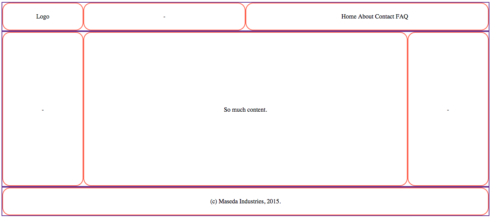
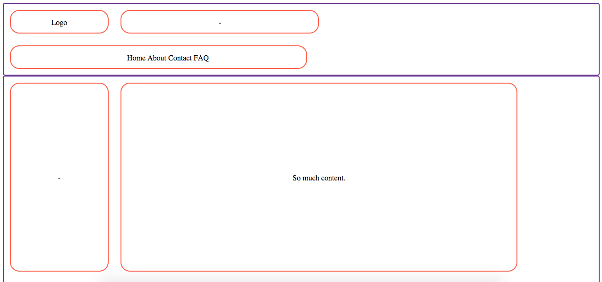
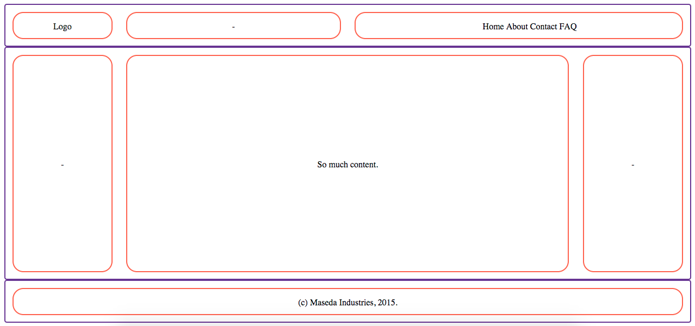
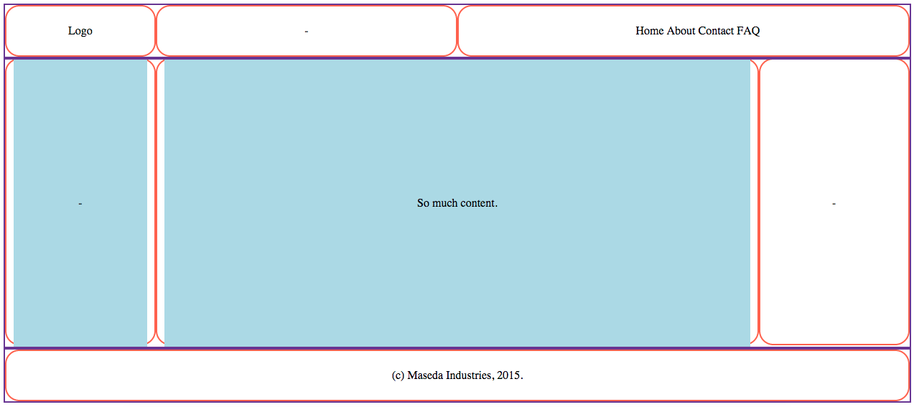
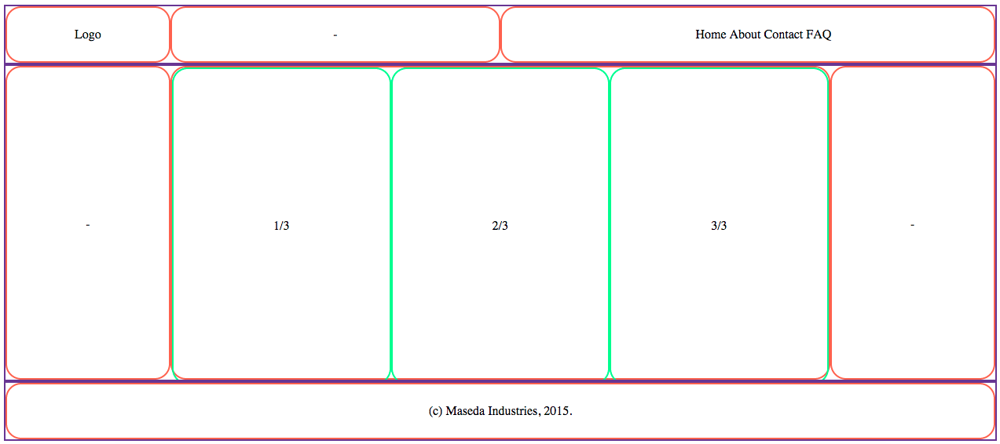

# CSS Grids

## Learning Objectives
* Explain why we use CSS grids.
* Identify the basic components of a grid.
* Review float, clearfix and other CSS properties.
* Build a grid from scratch.
* Use nested columns in a grid.

## Opening Exercise (10 / 10)

Whiteboard a wireframe for [Craigslist](http://washingtondc.craigslist.org/).
* Focus on the main components of the page, sections that would be defined by the rows and columns in our grid.
* Don't worry about site content (e.g., text, images).
* Keep an eye out for width, height, proportion, number of components.
* [Sample wireframe.](http://www.comentum.com/images/wireframes-sample/ecommerce/home.png)

## Why use a CSS grid? (5 / 20)

### Structure
* Grids are a simple way to apply layout to a webpage. A better layout improves the user experience.
* Grids help avoid stressful CSS debugging by starting out on the right foot.

### Reusability
* Grids make the layout process easier because of resusable, semantically-named "utility classes" (i.e., a library of CSS class selectors).
* Grids aren't limited to a particular project. We can apply them to pretty much everything we do.
* Grids are highly customizable. You can really make them your own.

_Even if you don't use a grid system, these concepts will translate across other layout problems._

## Basic components of a grid (5 / 25)

### Rows
* The highest-level component of a grid.
* Comprised of columns.

### Columns
* Contain and separate site content.

### Gutters
* Provides spacing between our columns. Optional, but useful.

## Let's build a grid - I do/you do (10 / 35)

You don't need a fancy-schmancy front-end framework to reap the benefits of a CSS grid. Let's start building one from scratch.

### Create HTML document

In your in-class folder, create a blank HTML file called `index.html`
* In the `<head>`, let's link to a stylesheet called `style.css`.
* And don't forget to create that stylesheet: `$ touch style.css`

```html
<!DOCTYPE html>
<html lang="en">
<head>
  <meta charset="UTF-8">
  <title>Document</title>
  <link rel=stylesheet href="style.css" type="text/css">
</head>
<body>
</body>
</html>
```

### Define Column and Row Selectors

Let's start by creating `.column` and `.row` class selectors.
* These will contain properties that all rows and columns, regardless of size, will possess.

```css
.row, .column {

}

.row {
  /* Let's add a border so we can see our rows better */
  border: 2px solid rebeccapurple;
}

.column {
  /* Let's add another border so we can see our columns better */
  border: 2px solid tomato;
}
```
* Take a minute or two to create some rows and columns in `index.html` using the class selectors we just made.

```html
<body>
  <div class="row">
    <div class="column">Something</div>
    <div class="column">Something</div>
    <div class="column">Something</div>
  </div>
  <div class="row">
    <div class="column">Something</div>
    <div class="column">Something</div>
    <div class="column">Something</div>
  </div>
</body>
```

Before we start defining widths and giving our grid system some versatility, we need to take care of a few things...

### Box-Sizing (5 / 40)

**Q:** By default, what is `width` defined as?
* width = content

[Illustration of the Problem](http://codepen.io/crosset/pen/JXNgzP?editors=1100)

We want to be able to explicitly define our column widths so that they also include `border` and `padding`.
* `width` = `content` + `padding` + `border`
* This way, we know exactly how wide our columns will be.
* We can do this by changing the `box-sizing` property of our `.row` and `.column` selectors.

```css
/* styles.css */

.row, .column {
  /* By default, box-sizing is set to content-box */
  box-sizing: border-box;
}
```

[Strangely enough](https://en.wikipedia.org/wiki/Internet_Explorer_box_model_bug), something that Internet Explorer actually got right was `box-sizing`.
* IE6, released back in 2006, had `box-sizing` set to `border-box` by default.

### Clearfix (10 / 50)

Our grid relies on being able to float columns. These columns will most likely contain content of various sizes.
* We need to make sure each piece of content is constrained to its respective row and column containers

Let's [illustrate this problem](http://codepen.io/adambray/pen/GoWobo?editors=110).
* As this code stands, we have a row that contains two squares. But these squares are overflowing out of the row, which appears as a straight black line.

This is where the clearfix technique comes in. Fortunately, it's easy to implement (as long as you don't care about how your site looks in Internet Explorer).

```css
.row {
  overflow: auto;
}
```

Easy, right? But like I said, if we want to help out our IE friends, implementing clearfix requires a few more steps.

```css
/* The below code is in place of the previous clearfix example */

.row:before, .row:after {
  content: "";
  display: table;
}

.row:after {
  clear: both;
}
```

### Define Column Behavior (10 / 60)

So our rows are actually good to go!
* They're just horizontal containers.
* Thanks to clearfix we don't need to worry about content overflow.
* Our columns will handle page width. Let's work on that now...

```css
.column {
  float: left;
}
```

Let's give our rows and columns a spin.


What does this look like?
* What functionality do we currently have? What do we need to add?


Right now, we can...
* **Separate content into rows and columns.**
  * What does it look like when we turn `float` off?
  * How about without clearfix?

We need to...
* **Set column widths.** We don't necessarily want our column widths to be defined by their content.
* **Define total width.** In any scenario, we want our total grid width to cover the entire page.
* **Give everything some space.** Our grid will look better if we give our rows and columns some breathing room.

### BREAK (10 / 70)

### Create Columns with Specific Widths (15 / 85)

So we want to define our column widths not by the width of their content but how much of the page we want them to take up.
* Ex. a sidebar nav that takes up 1/6 of total page width.
* This is actually a topic of debate. Learn more [here](http://alistapart.com/article/content-out-layout).

Most grids have a column size of 12.
* That means the total column width for each row should equal 12.
* We're going to create a class selector for each column size.
  * `.column-1`: occupies 1/12 of total page width
  * `.column-3`: occupies a quarter (3/12) of total page width
  * `.column-12`: occupies entire (12/12) page width

**Q:** How are we going to define the widths for each of these classes?
* What unit should we use?
* How are we going to calculate these values?

```css
/* style.css */

/*
  How do we get these percentages?
  percentage = (n / 12) * 100
*/

.column-1 { width: 8.33%; }
.column-2 { width: 16.66%; }
.column-3 { width: 25%; }
.column-4 { width: 33.33%; }
.column-5 { width: 41.66%; }
.column-6 { width: 50%; }
.column-7 { width: 58.33%; }
.column-8 { width: 66.66%; }
.column-9 { width: 75%; }
.column-10 { width: 83.33%; }
.column-11 { width: 91.66%; }
.column-12 { width: 100%; }
```

You don't have to use the same class selector syntax as the above example.
* You can and should customize your grid to fit your own needs.
* Ex. `.col-2-3` = a column that takes up 2/3 width of its parent container.
* If you want to see some alternate syntax, check out [Jesse's grid](http://jshawl.github.io/grits/)!

Let's apply these selectors to `index.html` in a way that resembles an actual website.
* Note the addition of the `.header` `.middle` and `.footer` class selectors to our rows.
* We'll also add some actual content to our columns.

```html
<!-- index.html -->

<body>
  <div class="row header">
    <div class="column column-2">Logo</div>
    <div class="column column-4">-</div>
    <div class="column column-6">
      <ul>
        <li>Home</li>
        <li>About</li>
        <li>Contact</li>
        <li>FAQ</li>
      </ul>
    </div>
  </div>
  <div class="row middle">
    <div class="column column-2">-</div>
    <div class="column column-8">So much content.</div>
    <div class="column column-2">-</div>
  </div>
  <div class="row footer">
    <div class="column column-12">(c) Maseda Industries, 2015.</div>
  </div>
</body>
```

Let's also add some styling that will help us visualize this better.
* Note we give our `.header` `.middle` and `.footer` selectors some explicit padding and heights.

```css
/* style.css */

.column {
  float: left;
  position: relative;
  border: 2px solid Tomato;
  border-radius: 20px;
  text-align: center;
}

.header > .column,
.footer > .column {
  padding: 25px;
}

.middle > .column {
  height: 400px;
  line-height: 400px;
}

/* Let's tweak our faux nav menu so it doesn't look as terrible */
.header ul {
  margin: auto;
}

.header li {
  display: inline-block;
  list-style-type: none;
}
```



Let's take another look at our `index.html` in the browser.
* You can see our website has some form now.
* Our sections could use some space though...

### Gutters (15 / 100)

**Q:** How should we go about putting space between the sections of our site?
* What CSS properties do we have at our disposal?

We could try padding?
* But changing padding wouldn't make a difference since `box-sizing` is set to `border-box`.

What about margin? Maybe.
* Let's give each of our columns a little bit of margin. That should put just enough space between them.

```css

.column {
  /* We don't want to add too much space, so 1% should be enough */
  margin: 1%;

  float: left;
  position: relative;
  border: 2px solid Tomato;
  border-radius: 20px;
  text-align: center;
}

```

Let's see what our webpage looks like now...



Ahh, what happened?
* Our width calculations are messed up since we added a 1% margin to each column.
* **Q:** How could we fix this? How about adjusting our widths?

```css
/* Since we added 1% margin to each column, we need to adjust our widths by -2% (1% on the left, 1% on the right). */

.column-1 { width: 6.333%; }  /* = 8.333% - 2% */
.column-2 { width: 14.66%; }
.column-3 { width: 23%; }
.column-4 { width: 31.33%; }
.column-5 { width: 39.66%; }
.column-6 { width: 48%; }
.column-7 { width: 56.33%; }
.column-8 { width: 64.66%; }
.column-9 { width: 73%; }
.column-10 { width: 81.33%; }
.column-11 { width: 89.66%; }
.column-12 { width: 98%; }
```

That does work...



...but it can get pretty tedious.  

And what if we want some parts of our page to have larger/smaller gutters than others. How do we account for that?

#### Modules

The best way to go about adding gutters is using "modules".
* These are `<div>`'s that we place inside of our columns.
* We can then give these modules margins without displacing our columns.
* These margins count towards the content width of our column, meaning that they are included as width under `border-box`.

Let's add some modules to `index.html`...

```html
<body>
  ...
  <div class="row middle">
    <div class="column column-2">
      <div class="module">-</div>
    </div>
    <div class="column column-8">
      <!-- Place column content inside module -->
      <div class="module">So much content.</div>
    </div>
    <div class="column column-2">-</div>
  </div>
  ...
</body>
```

Now let's create a `.module` selector in `style.css`

```css
.module {
  /* Let's add a background color to our modules so they're clearly visible.*/
  background: lightblue;

  /* Now let's give our modules a left and right margin of 10px */
  margin: 0 10px 0 10px;
}
```

The result...



Now we have some space between our columns' content.
* The whitespace is the margins generated by our module elements.
* If we wanted, we could go in and give each of our modules custom margins. Potential for customization is high here.

### Nested Columns (10 / 110)

Last thing about grids I want to talk about are nested columns...

We can "incept" our grid and plant columns within columns.
* For example, say we want the middle column in the center of our site to be divided into three content sections.
* We can treat that middle column as being 12 columns wide and create the following `<div>` tags in our HTML...

```html
<!-- index.html -->

<div class="row middle">
    <div class="column column-2">-</div>

    <!-- Here is that middle column. -->
    <div class="column column-8">
        <!-- We can divide it into thirds the same way we would any row. -->
        <div class="column column-4">1/3</div>
        <div class="column column-4">2/3</div>
        <div class="column column-4">3/3</div>
    </div>

    <div class="column column-2">-</div>
  </div>
```

And while we're at it, let's change the border color of our nested columns so we can see them better.

```css
.column .column {
  border: 2px solid springgreen;
}
```

Let's see how that changed our page...



**Be Warned:** Making nested columns (and rows) work might require a fair amount of tweaking depending on how your grid and gutters are set up.

### Final Version

Here's a [codepen with the final version of our grid system](http://codepen.io/adambray/pen/xZqZeM?editors=110)

## BREAK (10 / 120)

## Exercise: Match That Grid (15 / 135)

Use what we have learned in class to recreate the grid structure for [Craigslist](http://washingtondc.craigslist.org/).
* Start out by copying our in-class files into an exercise folder.
  * `$ mkdir exercise`
  * `$ cp index.html style.css exercise`
* In your exercise `index.html`, clear out all the content in `<body>`. We're going to start from scratch here.
* Do not clear out anything in your exercise `style.css` though. We're still going to use this.

Notes
* Don't worry about content. Just outline the main portions of the site.
* Start simple. Begin with the larger, outermost containers and work your way inside.
* Hold off on gutters and modules until you've built a basic grid.
* Not every `<div>` you create has to be a row or column.
* Use your wireframe from the opening exercise as guidance.

### Bonus
* Add gutters and modules wherever necessary.
* Replace the column class selector syntax (e.g., `.column-6`) with your own!
* Add some content to your columns. Keep it simple - we don't expect you to recreate the site.

## Browser Styles (10 / 145)

Browsers have default styles for different elements. For example `<body>` tags often have a default margin of ~8px. A `div` element in Chrome will has a height of 18px, in Firefox it's 19.2px. While this difference may be small it does vary. We often start our CSS by overriding, or reseting, some of these default properties:

```css
body {
  margin: 0;
}
```
We can override or work with these default styles on an ad-hoc bassis, simple changing things when they seem appropriate.

#### Reset

An alternative is to use a [CSS Reset](http://meyerweb.com/eric/tools/css/reset/).
To use the reset we can save this into it's own CSS file and link it in our head, or we can copy it into the top of our current CSS file.

- _**Reset removes all built-in styling, essentially provides a blank canvas**_

#### Normalize

Another approach instead of unstyling all of the default properties is to try to work with them. [Normalize CSS](https://necolas.github.io/normalize.css/) seeks to make syles consistent across browsers. Normalize is often linked as file in the project directory, or from a CDN link.

```html
<link rel="stylesheet" href="normalize.css">
/* VS. */
<link rel="stylesheet" href="https://cdnjs.cloudflare.com/ajax/libs/normalize/4.0.0/normalize.css">
```

- _**Normalize provides a cross-browser starting point with some properties**_

## Exit Ticket (3 min)

Before you leave, plase take ~3 minutes to complete [this exit ticket.](https://docs.google.com/forms/d/1d03NYFphG6m7yAMUY1OlnJZMQWof7Rt6b5MX3Xn4ZPs/viewform)

## Additional Reading

* [Pesticide.io](http://pesticide.io/)
* [Internet Explorer Box Model Bug](https://en.wikipedia.org/wiki/Internet_Explorer_box_model_bug)
* [Learn Layout: Clearfix](http://learnlayout.com/clearfix.html)
* [A New Micro Clearfix Hack](http://nicolasgallagher.com/micro-clearfix-hack/)
* [Content-Out Layout](http://alistapart.com/article/content-out-layout)
* [Bootstrap CSS Documentation](http://getbootstrap.com/css/)
* [Grits, a grid system made by Jesse Shawl](http://jshawl.github.io/grits/)
* [Responsive Grid System](http://www.responsivegridsystem.com)
