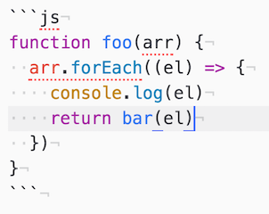
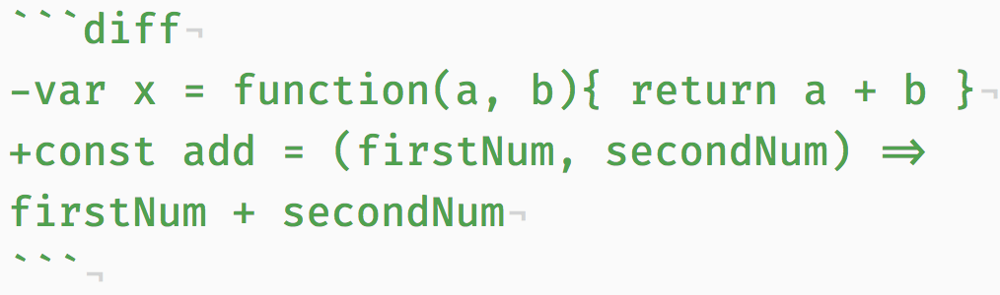

# Writing Documentation

## Framing (5 minutes)
Adding clear and thorough documentation to your projects is very important both for yourself and for others. It is important for yourself so that when you revisit your code in the future, you have ways to remember the purpose, tooling, and development history of what you made. Documentation is important for others because without it, no one will use or contribute to your code. From [A beginner’s guide to writing documentation](http://www.writethedocs.org/guide/writing/beginners-guide-to-docs/):

>If people don’t know why your project exists,
they won’t use it.  
If people can’t figure out how to install your code,
they won’t use it.  
If people can’t figure out how to use your code,
they won’t use it.  

In short, writing good documentation is a way for developers to transfer the *why* behind the code that they create. Code without documentation is not useful.

## Learning Objectives (5 minutes)
- Define the steps in adding documentation to a hosted repository
- Describe the content that good documentation should contain
- Define what Markdown is and how to use it
- Create a `readme.md` for a project

## Adding Documentation to a Repo (5 minutes)
The first step to adding documentation to a project is to a create a `readme.md` file (sometimes capitalized as `README.md`) to the **root directory** of your project's repository. By using this naming convention, code hosting platforms such as GitHub will automatically detect this file, render it into HTML, and display it when users navigate to your repository.

## Documentation Content (10 minutes)
You want to provide your readers with all of the information that they need to know, but no more. Unlike some other forms of writing, documentation should be clear, concise, and to the point. Additionally, it should be written in a way to appeal both to normal users (who don't know or care how the code works) and developers (who may want to evaluate or contribute to your code).

Generally, a good `readme` will contain (or link to) *at least* the following sections:
- **Description**
  - What your project is / should be used for
  - What problem(s) your projects solves
- **Brief Example**
  - This could be a code snippet showing how your project should be used (if it is meant to be integrated into another app)
  - This could be a screenshot of your project running in the browser (if it is a stand-alone application)
- **List of Features / User Stories**
  - This typically will be a short list of the features / user stories that you planned during the development phase of the project
  - To provide more detail, you can show how you categorized these features into Bronze (MVP), Silver, and Gold Levels and indicate which features you complete / have yet to complete
- **List of Technologies Used**
  - Often you will want to list the technologies you used to create the project.
  - This typically would consist of all primary languages, frameworks, and libraries your app is composed of
  - This is particularly important when it comes to recruiters scanning your projects for keywords
- **Installation Instructions / Getting Started**
  - This section should walk a reader, step by step, through the process of setting up your project
  - For a tool meant to be integrated into other projects, this would likely outline the process of installing and accessing this tool in your project
  - For an application, this would likely outline the process of forking, cloning, and starting the app locally
- **Contribution Guidelines**
  - This section should offer guidance on where and how users can contribute to your code, identify bugs, and propose improvements
  - Good links to include are:
    - A link to the project's main repository
    - A link to the project's issue tracker

It will look something like this [Readme Template](https://gist.github.com/PurpleBooth/109311bb0361f32d87a2) or this [Readme](https://github.com/ga-dc/ga_exit_tickets).


## Markdown (5 minutes)

The `.md` extension on your `readme.md` stands for [Markdown](https://en.wikipedia.org/wiki/Markdown), which is a light-weight markup language that can be easily rendered into HTML (or other formats). However, its syntax is much simpler and faster to write than HTML, making it a good choice for writing up documentation.
> This lesson is written in Markdown. [Click Here](https://git.generalassemb.ly/raw/ga-wdi-lessons/documentation-markdown/master/readme.md) to see the unformatted version.

## You Do: Markdown Tutorial (15 minutes)
Complete this short tutorial on Markdown's syntax. Please raise your hand if you get stuck or have questions.

[Markdown Tutorial](http://www.markdowntutorial.com/)

### Bonus: GitHub Extended Markdown
When adding content to GitHub, you have access to some additional features in Markdown beyond the original syntax. These include...

- language-specific syntax highlighting and code formatting
- task lists
- tables
- references to specific commits, issues, or users

> A full guide on these GitHub-specific features can be found [here](https://guides.github.com/features/mastering-markdown/)

Of these, the most important one to use is the code formatting. Backticks <code>```</code> are part of Markdown's original syntax and should be used when adding code snippets to any readme, issue, or comment. GitHub adds language-specific syntax highlighting to code snippets in Markdown. For example:



will be rendered as...
```js
function foo(arr) {
  arr.forEach((el) => {
    console.log(el)
    return bar(el)
  })
}
```

---



will be rendered as...

```diff
-var x = function(a, b){ return a + b }
+const add = (firstNum, secondNum) => firstNum + secondNum
```

## You Do: Create Documentation
For the remainder of the class period, create documentation for your Project 1 by adding a `readme.md` to your project's **root directory** and filling it in with the neccessary content. Be sure to follow the rubric listed above and refer to the [Example Readme](https://github.com/ga-dc/ga_exit_tickets) for guidance.

## Markdown Cheatsheet

See the [Markdown Cheatsheet](https://github.com/adam-p/markdown-here/wiki/Markdown-Cheatsheet) for quick and easy reference!
