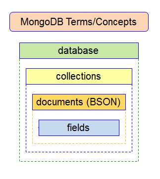
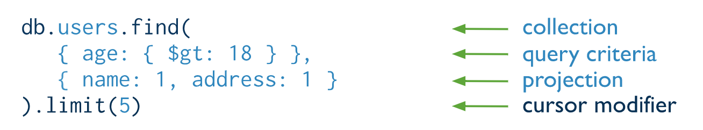

# MongoDB


## Learning Objectives

- Compare and contrast relational to document based (NoSql) databases
- Setup local MongoDB server
- Define what a document is in the context of MongoDB
- CRUD documents using Mongo CLI
- Build a simple node CLI to query MongoDB

## Framing (10 minutes / 0:10)

Today we're going to learn how to store information via a document-based database. Traditional relational databases are complicated, rigid, and can be very taxing to alter. **When dealing with less complex associations, non relational databases can be more effective**. Mongo provides a more flexible, scalable solution for less complex domain models.

MongoDB (from hu**mongo**us) is an open-source [No SQL](https://www.mongodb.com/nosql-explained) **document database** that provides: high performance, high availability, and automatic scaling. In a nutshell, you should use Mongo if you are working with a flexible data model, that involves similar, but different objects.

[MongoDB Documentation](https://www.mongodb.org)

## MongoDB's Key Advantages

#### Usability

- Documents (i.e. objects) correspond to native data types in many
programming languages.
- Schema-less, less need to manage migrations
- Dynamic schema supports fluent polymorphism.

#### High Performance

- Embedded documents and arrays reduce need for expensive joins (reduces I/O).
- Indexes support faster queries and can include keys from embedded documents
and arrays.

#### High Availability

MongoDB’s replication facility, called replica sets, provide:

- automatic failover.
- data redundancy.

#### Automatic Scaling

- Automatic sharing distributes data across a cluster of machines.
- Replica sets can provide eventually-consistent reads for low-latency high
throughput deployments.


## [Document Database](https://docs.mongodb.com/manual/introduction/)? (15 minutes / 0:25)

### A basic example of a `Person` document:

```json
{
  "name": "Sue",
  "age": 26,
  "status": "Active",
  "groups": ["sass", "express"]
}
```

TPS: What do you see?

- json
- different data types
- even arrays

### More complicated example of a `Restaurant` document:

```json
{
   "_id" : ObjectId("54c955492b7c8eb21818bd09"),
   "address" : {
      "street" : "2 Avenue",
      "zipcode" : "10075",
      "building" : "1480",
      "coord" : [ -73.9557413, 40.7720266 ],
   },
   "borough" : "Manhattan",
   "cuisine" : "Italian",
   "grades" : [
      {
         "date" : ISODate("2014-10-01T00:00:00Z"),
         "grade" : "A",
         "score" : 11
      },
      {
         "date" : ISODate("2014-01-16T00:00:00Z"),
         "grade" : "B",
         "score" : 17
      }
   ],
   "name" : "Vella",
   "restaurant_id" : "41704620"
}
```

## Documents

### A record in MongoDB is a document

- a data structure composed of field(key) and value pairs.
  - similar to JSON objects.
  - stored as BJSON
- fields may include other documents, arrays, and arrays of documents.

## Collections

MongoDB stores documents in collections.

- does **NOT** require its documents to have the same schema.
- documents stored in a collection must have a unique `_id` field that acts
as a primary key.

###  MongoDB in a Nutshell



Great, now that we have a high level understanding of what Mongo is and what purpose it serves, let's look at how to use it!

## Installation (5 minutes / 0:30)

### Don't Do This Unless You Don't Already Have MongoDB installed

Check with `$ mongo --version`. If you already have it installed you should see output like this...

```sh
$ mongo --version

git version: 3287gd3278df73fd783fd781f23d8f187
OpenSSL version: OpenSSL 1.0.2l  25 May 2017
allocator: system
modules: none
build environment:
    distarch: x86_64
    target_arch: x86_64
```

If you already have mongo installed, skip to the **Mongo Shell** section.

Otherwise, follow the instructions below.

### Installation Instructions

#### Proceed only if you don't have installed! Consult the previous section.

If you already have mongo installed, skip to the **Mongo Shell** section.

- Mac OS X
    1. Install mongodb with brew

        ```bash
        brew install mongodb
        ```

    2. Create the folder mongo will be using to store your databases

        ```bash
        sudo mkdir -p /data/db
        ```

    3. Change permission so your user account owns this folder you just created

        ```bash
        sudo chown -R $(whoami) /data/db
        ```

    > Type these commands exactly as displayed, you don't need to substitute anything.

- [Linux Instructions on the mongodb website](https://docs.mongodb.org/manual/tutorial/install-mongodb-on-ubuntu/)

### Start mongo:

```
$ mongod
```

You should see:

`a bunch of output but with the prompt hanging`
> This is good news, `mongod` just starts up a mongo server locally. **NOTE**: you need this running in order to use the mongo cli

### More info?

```
$ brew info mongo
```

## Mongo shell  (5 minutes / 0:30)


### Start the shell

```
$ mongo
```

> feels a little bit like a JS REPL

You should see:

```
MongoDB shell version: 3.x.x
connecting to: test
>
```

### Help

```
> help
```

#### ThinkShare (2min):
Based on what you see in the help menu:
- What jumps out as important?
- What might be useful for debugging?

---

### What jumped out to me:
- `show dbs`: show database names
- `show collections`:  show collections in current database
- `use <db_name>`: set current database
- `db.foo.find()`: list objects in collection foo

Also:

- `<tab>` key completion
- `<up-arrow>` and the `<down-arrow>` for history.

### CLI: Creating a Database

In the Mongo REPL, let's go ahead and create our first database, one which we will be using to store information about restaurants.

In order to create/connect to a new database, we have to tell mongo to `use` a specific database that we want to work with:

```
> use restaurant_db
```
> **Note**: `use` will create the database it received as an argument if not already initialized and connect to it

Verify:
```
> db
restaurant_db
```
> **Note**: the `db` variable is provided by mongo and will point to the currently connected database

Common Gotcha, what happens when we run:

```
$ show dbs
```

> **Note** we don't see `restaurant_db` listed. It isn't until we add a document to
our database that our  db will show up in `show dbs`

## CLI: Create a record

### Insert

- use `insert()` to add documents to a collection

### Insert a restaurant

``` json
> db.restaurants.insert(
   {
      "name": "Cookies Corner",
      "address" : {
         "street" : "1970 2nd St NW",
         "zipcode" : 20001,
      },
      "yelp": "http://www.yelp.com/biz/cookies-corner-washington"
   })
```

**Important to note**:
> The `db` is the database we’re connected to. In this case, `restaurant_db`.
`.restaurants` is then referring to a collection in our `restaurant_db`. We
use the `.insert()` to add the document inside the parentheses.

### Verify the insert
```bash
> show collections
restaurants
```

Note: `restaurants` was saved as a collection

```js
> db.restaurants.find()
```

Returns documents with the following fields:
- `name`
- `address`
- `yelp`

**Q**. What is surprising/unexpected?

- where did `restaurants` come from?
- `_id`?
- [ObjectId](https://docs.mongodb.org/manual/reference/object-id/)

## Review `insert`
```js
// insert
> db.your_collection_name.insert({ data as json })
// find
> db.your_collection_name.find()
```

New Record:
- If the document passed to the `insert()` method does not contain the `_id` field the mongo shell automatically adds the field to the document and sets the field’s value to a generated `ObjectId`.

New collection:
- If you attempt to add documents to a collection that does not exist,
MongoDB will create the collection for you.

## Dropping a Database

```bash
> use random_db
> db.dropDatabase()
```

Drops the **current** database.

### Exercise (5 minutes): Add a few more restaurants.

Using the Mongo Shell CLI, add at least 4 new restaurant documents to your `restaurants` collection.

**ProTip**: I recommend you construct your statements in your editor and copy /
paste. It will help you now & later.

---

> Prompt: Did anyone insert multiple at one time?

Let's recreate the steps together:

**Q**. How can we tell which database we are connected to currently?
> `db`

1. Create DB
2. Use the appropriate DB
3. Insert multiple restaurants

``` json
db.restaurants.remove({});
db.restaurants.insert([
  {
    "name": "Cookies Corner",
    "address": {
      "street" : "1970 2nd St NW",
      "zipcode" : 20001
    },
    "yelp": "http://www.yelp.com/biz/cookies-corner-washington"
  },
  {
    "name": "The Blind Dog Cafe",
    "address": {
      "street": "944 Florida Ave",
      "zipcode": 20001
    },
    "yelp": "http://www.yelp.com/biz/the-blind-dog-cafe-washington-2?osq=cookies"
  },
  {
    "name": "Birch & Barley",
    "address": {
      "street": "1337 14th St NW",
      "zipcode": 20005
    },
    "yelp": "http://www.yelp.com/biz/birch-and-barley-washington?osq=Restaurants+cookies"
  },
  {
    "name": "Captain Cookie and the Milk Man",
    "address": {
      "street": "Dupont Circle",
      "zipcode": 20036
    },
    "yelp": "http://www.yelp.com/biz/captain-cookie-and-the-milk-man-washington-5"
  },
  {
    "name": "J's Cookies",
    "address": {
      "street": "1700 N Moore St",
      "zipcode": 22209
    },
    "yelp": "http://www.yelp.com/biz/js-cookies-arlington" }
])

> db.restaurants.count()
```

## [Primary key](http://docs.mongodb.org/manual/reference/glossary/#term-primary-key)  - the *_id* field

- A record’s unique immutable identifier.
- Usually a *[BSON](http://docs.mongodb.org/manual/reference/glossary/#term-bson ) [ObjectId](http://docs.mongodb.org/manual/reference/glossary/#term-objectid)*.

## CLI: QUERY for Records

Breaking down the anatomy of a typical query with Mongo:

   collection + operation + modification = results



In order to Find all restaurants:
```js
> db.restaurants.find()
```

> **Note**: we can format our output to be a little nicer on the eyes by chaining the `.pretty()` method to end of our query like so: `db.restaurants.find().pretty()`

### Find by Conditions

We can add conditions to our query to target documents based on matching key-value pairs:

```js
> db.restaurants.find({name: "Cookies Corner"});
> db.restaurants.find({"address.zipcode": 20001});
```

### CLI: Update a record(s)

http://docs.mongodb.org/manual/core/write-operations-introduction/

```
> db.your_collection.update(
  { criteria },
  {
    $set: { assignments }
  },
  { options }
)
```

> **Note**: the first key value pair is the condition on which to find the document you'd like to update, the second
is what values you'd like to set, and third is any additional options

### You do (10 min):

Take time to think about and execute the appropriate commands so that you:

- Update all restaurants to have a new key-value pair `{state: "DC"}`
- Add a property of `rating` to at least 2 documents and give it a numerical value between 1-5
- Change the street `address` of a specific restaurant

**Bonus**
- Add nested sub-documents to each restaurant to that it has many `reviews`
- Store important information about each `review`
---

> **Note** this what a sample update might look like:

```js
> db.restaurants.update(
  {"name": "Cookies Corner"},
  { $set: { state: "DC" }}
)
```

> **Note**: In order to update multiple documents at a time, make sure to pass the `multi` option as true, like so:

```js
db.restaurants.update(
  {},
  {
    $set: { "state": "DC" }
  },
  {multi: true}
)
```

Verify:

```js
> db.restaurants.find().pretty()
```

### CLI: Remove records

```
> db.restaurants.remove({ conditions })
```

### CLI: Add a nested object

> We already did this! (The address 'object' / 'subdocument')


---

## Bonus Exercise

[Build a CLI Mongo App w/ Node](https://github.com/ga-wdi-exercises/mongo-cli/)

## Helpful References

- [Mongo to SQL Mapping Chart](http://docs.mongodb.org/manual/reference/sql-comparison/)
- [CRUD Intro](http://docs.mongodb.org/manual/core/crud-introduction/)
- [CRUD Commands](http://docs.mongodb.org/manual/reference/crud/)
- [bios Collection](http://docs.mongodb.org/manual/reference/bios-example-collection/)
