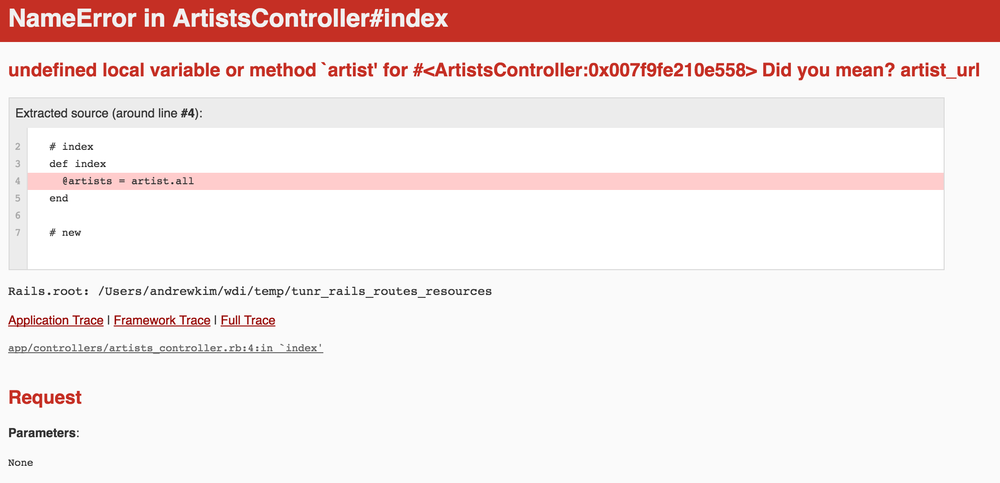

# Effective Written Questions

## Learning Objectives

- Evaluate components of a good question.
- Submit effective questions to github issues/stack overflow.

# Framing

How many times a week do we struggle as developers? Per day? Frequently. It is important to understand that this comes with the job and that we need to learn through these struggles. Sometimes we get stuck though, and that's ok.

As developers, we will have questions. Lots of them. One of the most important skills that we will develop over time, is asking effective questions. Often times, searching for the right question, will lead us the the very answer we seek in the first place.

# Ineffective

> "My (insert programmatic term here) doesn't work. Can you fix it?"

### Turn & Talk

Spend two minutes answering and discussing the following questions with a partner...
- Why is this an ineffective question?
- Identify five ways to improve this question.

# A Little Better...

> I got (insert error here). What's wrong?

### Turn & Talk

Spend two minutes answering and discussing the following questions with a partner...
- Why is this still an ineffective question?
- Identify five ways to improve this question.

# Effective

## The P.E.A.R. Method

### 1. Problem

The exact issue for the basis of this question.

> I did `_____` and expected `_____` to happen. Instead I got `_____` result

### 2. Environment

- What tools/technologies are you using? jQuery? Rails? Angular?

### 3. Attempts

- What have you tried?
- What parts of the error message / result might be useful in diagnosing the problem?

### 4. Relevant Code / Screenshots

- What parts of the code are broken?
- What are some examples of code that you have tried?
- Supporting your question with screenshots can be helpful.
- Don't post entire files unless they are relevant to the problem.

## Example

The following error is happening because in the index action for artists we have a lower case `artist.all` and it needs to be upper case (i.e., `Artist.all`). After the image will be the example question.



> Notice that as the developer, we can see this error but anyone reading our question can't unless we reference the specific error or include a screenshot.

### Good Question Model

I'm working on a Rails app that displays artists and their songs. I was working on the feature to list all of the artists in one view. I am currently running into this error, which is being generated by my `artists_controller.rb` file...

```
undefined local variable or method 'artist' for #<ArtistsController:0x007f9fe219e558>
```

I tried to access `http://localhost:3000/artists`, which is defined in `config/routes.rb` as...

```ruby
resources :artists
```

The code thats highlighted in the error message is in `app/controllers/artists_controller.rb`...

```ruby
def index
  @artists = artist.all
end
```

I tried making `@artist` singular, I also tried changing `index` to `show` but that doesn't seem to be working. Please help!

## Markdown

Github issues use markdown for their issue system. Stackoverflow uses something similar but not exactly the same. We'll be going over a bit of the Github markdown but you can use some of the same things on Stackoverflow. They have their own directions you can see on their site if/when you ask a question.

If you learn some basic Markdown, it will help you write more effective questions. Take the above example without markdown formatting niceties.

Here are some Markdown resources...
- [Markdown Tutorial](http://www.markdowntutorial.com/)
- [Markdown Cheatsheet](https://github.com/adam-p/markdown-here/wiki/Markdown-Cheatsheet)
- [Daring Fireball: Markdown Basics](https://daringfireball.net/projects/markdown/basics)

### Good Question Model (without Markdown)

I'm working on a basic Rails app that displays artists and their songs. I was working on the feature to list all of the artists in one view. When I ran into this error in my controller:

undefined local variable or method 'artist' for #<ArtistsController:0x007f9fe219e558>

I tried to access http://localhost:3000/artists which is defined in config/routes.rb as:

resources :artists

The code thats highlighted in the error message is in app/controllers/artists_controller.rb:

def index
  @artists = artist.all
end

I tried making @artist singular, I also tried changing index to show but that doesn't seem to be working. Please help!

> Doesn't look so great, does it? Fortunately, Markdown isn't that complicated. It's very similar to HTML. Here are the basics you need for asking effective questions on github.

### Headers

(\#) are used for headers.
# `# header 1`
## `## header 2`
### `### header 3`
#### `#### header 4`

### Backticks

Use backticks as delimiters to display code inline. \`Like this\`. It will look `Like this`. This is useful for file names, URLs and small bits of code.

Use triple backtickets on either end of a code block to display block code.

Like this...

\`\`\`ruby
def index
  @artists = Artist.all
end
\`\`\`

...and it will look like the below snippet. This is useful for large, multi-line blocks of code.

```ruby
def index
  @artists = Artist.all
end
```

### Closing Thoughts

The dev community is one of the friendliest out there. That being said, fellow developers are more likely to help someone that already put significant effort into trying to solve a problem. Also, helping others is the best way to grow and cement your own knowledge base which helping to grow that community.
