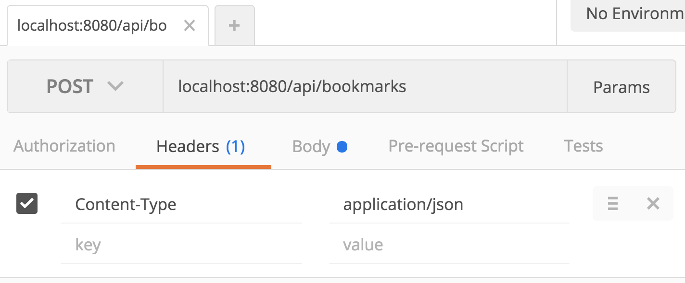
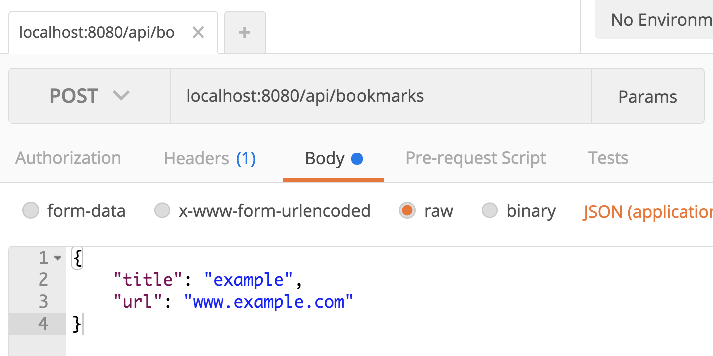
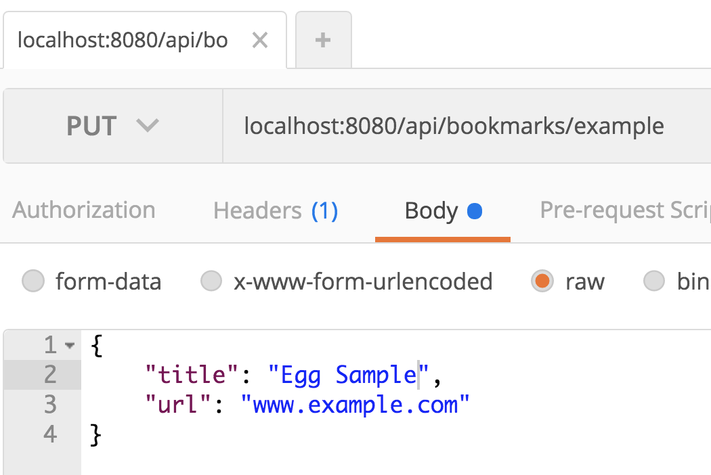
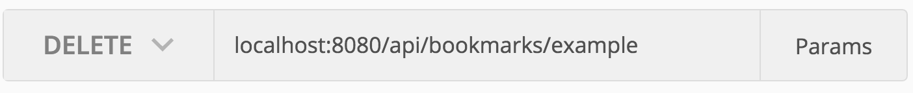

# HTTP APIs and Microservices in Express

## Lesson Objectives

  - Define microservice architecture
  - Build a RESTful HTTP API in Express that serves JSON data from a Mongo DB
  - Use Postman to test our RESTful routes
  - Use CORS with our Express API to permit requests from other domains
  - Use jQuery to consume an Express API

## Framing 
> (10 min, 0:10)

We've just learned about using the handlebars templating engine to handle our views. This is a kind of single-server configuration, where the the server is handling models, views, and controller.

---

What does each element in MVC do?

<details>
  <summary>
    Model
  </summary>
		Models encapsulate information from the database and give us an interface to query the database and change data.
</details>

<details>
	<summary>
		Views
	</summary>
      Views are the user-interface: they take data and render it to the page.
</details>

<details>
	<summary>
		Controllers
	</summary>
      Controllers define how routes are handled, and what response the server provides. Controllers also contain <a href="https://en.wikipedia.org/wiki/Business_logic">'business logic'</a> for our applications.
</details>

---

There is an alternative to the single-server architecture, which is the idea of microservices. We're briefly going to explore microservices as a category, but in the context of this lesson, we'll be talking about how to separate our views from the server. 

Instead of directly rendering a view, the server will serve *data in the form of JSON* that a client-side JS application will 'consume' and generate content from.

> This an increasingly common pattern in modern web development, especially with the rise of 'serverless' services. You may or may not be familiar with the terms Platform as a Service and Service as a Service, but these are examples of 'serverless' services. See the Additional Reading header at the end of the lesson for readings on this topic.

**SERVERLESS means: executes code in the client's browser without using third-party services, client-side logic, and service hosted remote procedure calls.**

**(Pros: can cut costs signficantly and improve agility of an app.)**

**(Cons: May be overly complicated and unnecessary for some applications)**

## Microservices
> (10 min, 0:20)

Take a few minutes [to read the article here on microservices](https://pivotal.io/microservices).

We're not going to build a super complex application with many sets of endpoints today, but rather build a single microservice that implements a RESTful API over HTTP. We'll also have a basic pre-built front-end that we'll add AJAX functionality to, so that it can communicate with our REST API.

**Essentially, we are going to build a back-end server that will serve as an API for our front-end. Our front end will make AJAX calls to render the info for a view.**

## Building an API in Express
> (5 min, 0:25)

For the remainder of class, we'll be building an application called 'book-e' which can save bookmarks for us. We'll clone down the back-end for `book-e` and examine the codebase, which just includes a model to start with. Then, we'll add a controller that serves JSON and then test the backend using a tool called [Postman, which can be downloaded here](https://app.getpostman.com/app/download/osx64).

**Model: already set up in back end**

**Controller: will be set up in back end**

**Views: then we'll set up the views in the front end**

After we've tested our API, we'll clone down a separate repository

Let's dive in!

### Book-e

#### Set Up Book-e Backend
> (5 min, 0:30)

Clone down the [book-e-backend](https://git.generalassemb.ly/ga-wdi-exercises/book-e-backend) and follow the set-up instructions there. After you're all set up, head back here.


#### Codebase Review
> (10 min, 0:40)

Spend the next 5 minutes with a partner looking over the codebase. Then, we'll discuss each part of the starting codebase, using the commented annotations as our guide.

#### Walkthrough
> (60min, 1:40)

First, we'll install express.

```sh
 $ npm i express
```

##### Add Test Route

Next, we'll set up a controller that handles our routing.

```sh
 $ mkdir controllers/
 $ touch controllers/bookmarks.js
``` 

> In `controllers/bookmarks.js`...

```js
const express = require('express')
// This will create an instance of an express router
const router = express.Router()
// Below, we'll use the express route handler methods to define (or set, with **setter methods**)

// Let's export this router instance now so we don't forget to do it later!
module.exports = router
```

We'll have to import our router and set up our application to use our controller

> In `index.js`...

```js
cconst express = require('express')
const app = express()

const bookmarksController = require('./controllers/bookmarks')

app.use('/api/bookmarks/', bookmarksController)

app.listen(8080, () => console.log(`They see me rollin...on port 8080...`))
```

Back in the controller: let's define a route and test it...

```js
router.get('/', (req, res) => {
  res.send('<h1>Sup Multiverse?</h1>')
})
```

**What do you see when you go to `http://localhost:8080/apis/bookmarks`?**

Now, let' try an express response method that we haven't seen yet:  `.json()`

```js
router.get('/', (req, res) => {
  res.json({hello: 'multiverse'})
})
```

This is the basis for how we will send data from the database to the front end.

##### Reading Data

> The R in CRUD

Our controller is really intended to serve data from database, which means we need to query the database. To this end, we'll import a model that we defined on our configured `mongoose` connection to the mongo database.

In `controllers/bookmarks.js`:

```js
const mongoose = require('../db/connection')

// gets the model from our database connection, for querying and changing data  
const Bookmark = mongoose.model('Bookmark')
```

Next, let's define routes for **reading** from the database.

```js
router.get('/', (req, res) => {
  Bookmark
    .find({})
    .then(bookmarks => res.json(bookmarks))
})

router.get('/:title', (req, res) => {
  Bookmark
    .findOne({title: req.params.title})
    .then(bookmark => res.json(bookmark))
})
```

Let's test these routes in the browser.

>Note: In URLs, spaces are represented with `%20`.


##### Creating Data

> The C in CRUD

We'll need to install `body-parser` to be able to interpret the request body.

`$ npm install body-parser`

Then we'll add this dependency to `index.js`...


```diff
const express             = require('express')
+const parser              = require('body-parser')

const app = express()

const bookmarksController = require('./controllers/bookmarks')

// Middleware configuration
+app.use(parser.urlencoded({extended: true})) // interprets key value pairs in URLs
+app.use(parser.json()) // interprets a stringified JSON object on the request body

app.use('/api/bookmarks/', bookmarksController)

app.listen(8080, () => console.log(`They see me rollin...on port 8080...`))
```

Then, in `controllers/bookmarks.js`...

```js
router.post('/', (req, res) => {
  Bookmark
    .create(req.body)
    .then(bookmarks => res.json(bookmarks))
})
```

**In order to test this, we would need to create a form in the front end, etc**

**Another way to test a route without the front end is to use a tool called Postman**

***TEST GET route first!**

**NOTE:** You may see a new property in the new JSON document: __v

- This a version key property set on each document when first created by Mongoose. This keys value contains the internal revision of the document. 

###### Testing with Postman

1. Launch Postman.
2. Enter the URL into the bar at the top of the screen.
3. Click on headers and add the following...
     > 
4. Then, click on the body tab, select the raw radio button, and enter something like this...
     > 
5. Hit send! Scroll down and you'll the response in the panel below.

**NOTE (reminder):**

- in Header tab: create row (Content-Type: application/json)
- in Body tab: choose "raw"
- in Body tab: choose "JSON (application/json)"


##### Updating Data

> The U in CRUD

In bookmarks.js:

```js
router.put("/:title", (req, res) => {
  Bookmark
    .findOneAndUpdate({ title: req.params.title }, req.body)
    .then(bookmark => res.json(bookmark))
})
```

###### Testing with Postman

1. Click on headers and add the following...
     > 
     > This will be the JSON object that will replace the object to be updated.
2. Hit send! Scroll down and you'll the response in the panel below. By default, this should be the old document that got updated. Check `localhost:8080/api/bookmarks/` in your browser to see the updated list.

##### Deleting Data

> The D in CRUD

In bookmarks.js:

```js
router.delete("/:title", (req, res) => {
  Bookmark
    .findOneAndRemove({ title: req.params.title })
    .then(bookmark => res.json(bookmark))
})
```

###### Testing with Postman

1. Click on headers and add the following...
     > 
     > This will be the JSON object that will replace the object to be updated.
2. Hit send! Scroll down and you'll the response in the panel below. By default, this should be the old document that got deleted. Check `localhost:8080/api/bookmarks/` in your browser to see the updated list.

### Integration with JS App

Next, we'll add the `cors` dependency. CORS stands for cross origin resource sharing.
Express is enforcing a CORS policy that prevents resource sharing without proper configuration on the back end.

Origins are separate entities, like `localhost:3000`, `localhost:8080`, `google.com`, `<insert-app-name-here>.herokuapp.com`, and so on. The npm package `cors` is middleware that allows different origins to communicate with the Express app.

```diff
const express             = require('express')
const bookmarksController = require('./controllers/bookmarks')
const parser              = require('body-parser')
+const cors                = require('cors')

const app = express()
const PORT = 8080

+app.use(cors())

app.use(parser.urlencoded({extended: true}))
app.use(parser.json())

app.use('/api/bookmarks/', bookmarksController)

app.listen(PORT, () => console.log(`Live on port ${PORT}`))
```

### Book-E Frontend
> 30 min (2:20)

Clone down [this repository](https://git.generalassemb.ly/ga-wdi-exercises/book-e-front) and follow the set up instructions there. We'll be connecting this with our express back-end.

**ANSWERS:**

```

```

**END ANSWERS**

## Closing 
> 10 min (2:30)

1. What are microservices?
2. What role did our back-end play today?
3. How did the front-end application interact with the back-end?

## Additional Reading
- [Introduction to Microservices](https://www.nginx.com/blog/introduction-to-microservices/)
- ['Serverless' services](https://stackoverflow.com/questions/16820336/what-is-saas-paas-and-iaas-with-examples)
