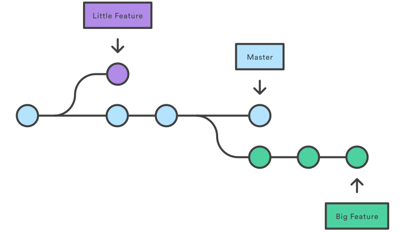
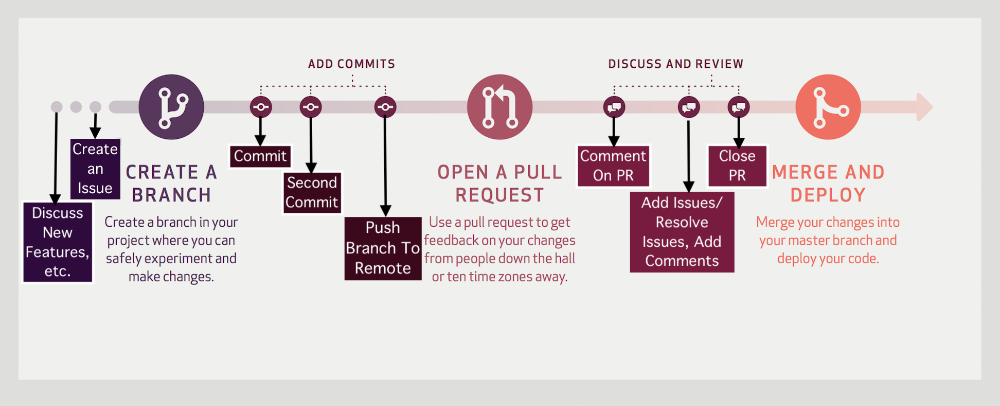
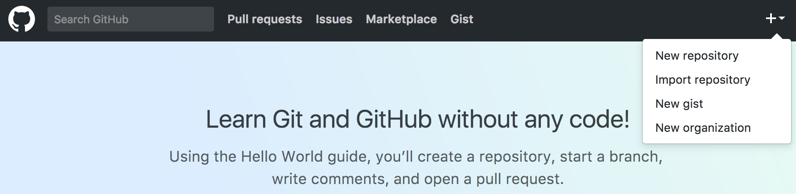
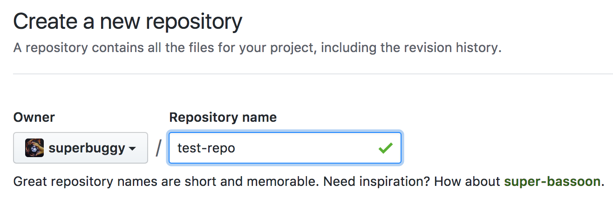
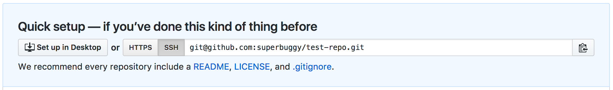
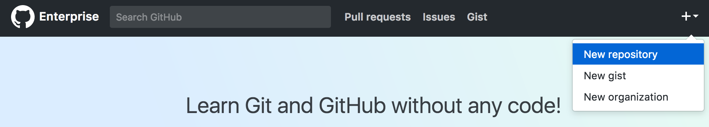

# Git Branching + Workflows

## Learning Objectives
- Manage multiple remotes on a single repository
- Explain what a branch is in git
- Create, merge, and delete branches on local and remote repositories
- Describe how branching and merging allows for collaboration during development
- Describe Github Workflows using issues, branches, and pull-requests
- Resolve a merge conflict


## Review (10 min, 0:10)

Quickly review the basics of git:

<details>
<summary>1. What is the purpose of git? How does it differ from GitHub?</summary>

> **Git** is a version control system allowing us to easily track files, manage changes and move between versions.
>
> **GitHub** is a web application that hosts remote repositories and allows developers to easily host and share code.

</details>


<details>
<summary>2. What command is used to start tracking a directory? What commands record the changes that occurred in the tracked directory?</summary>

> `$ git init` - create an empty Git repo
>
> `$ git add <file-path>` - stage file(s) for commit
>
> `$ git commit -m "message"` - commit staged files

</details>


<details>
<summary>3. What's the difference between a fork and a clone?</summary>

> A fork is when you copy a repository on GitHub to your own GitHub account.
>
> A clone is when you download a remote repository (likely from GitHub) to your local file system.

</details>


<details>
<summary>4. What commands are used to share changes (commits) between local and remote repos?</summary>

> `$ git remote add <remote_name> <remote_url>` - add a remote repo with a given name and url
>
> `$ git push <remote_name> <branch_name>` - update a remote repo with commits from a branch of a local repo
>
> `$ git pull <remote_name> <branch_name>` - update a local repo with commits from a branch of a remote repo

</details>


## Framing (0:05 / 0:15)

As we discussed before, Git is a very powerful version control and collaboration tool. We've learned about the ability to keep track of changes to our code using staging and committing, how to work with others using  forks and pull requests.


Git has a couple of other really powerful features that we'll discuss today.


Think about these questions:

- What if I'm working on a feature and I want to try something out? Will I be able to cleanly remove that work if I decide I don't want to keep it?
- What if I'm working on a team and everyone is working on their own feature? How will we keep our work separate until it is finished?
- What if I'm working together with some other developers on a feature? How will we keep our work separate until it is finished?


<details>

​	<summary>What is the answer?</summary>

​	Branching.

</details>


## How Git Branching Works (15 min, 0:30)

In Git, branches are a part of your everyday development process. When you want to add a new feature or fix a bug — no matter how big or how small — you should set up a new branch to encapsulate your changes. This makes sure that unstable code is never committed to the main code base and it gives you the chance to clean up your feature’s commit history before merging it into the main branch.

Branches are incredibly lightweight "movable pointers" that help us as developers make experimental changes! A branch in git is just a label or pointer to a particular commit in a repository, along with all of it's history (parent commits).

What makes a branch special in git, is that we're always *on* a specific branch, and when we commit, the current branch HEAD moves forward to the new commit.

**Terminology:** HEAD is simply a reference to the current commit. By default, this is the most recent commit.



> The diagram above visualizes a repository with multiple lines of development, one is the master branch, and the others are feature branches. By developing in branches, it’s not only possible to work on branches in parallel, but it also keeps the main master branch free from questionable code.


## Merging (10 min, 0:40)

Now imagine that we have completed our awesome feature on its own branch and we want to bring those changes back into `master`, we now need a way to consolidate these two versions of our code base. The easiest way to do this is by  **merging** the feature branch into the master branch.

Let's see what this process looks like visually:


***Locally***, all we need to do is checkout (switch to) the master branch and then run the merge command to integrate our feature branch:

```
$ git checkout master
```

```
$ git merge <feature_branch_name>
```


Once merged, you can delete the branch:

```bash
$ git branch -d <feature_branch_name>
```
***Remotely***, we could easily merge our branch back into master through a Pull Request and delete the branch on GitHub.

**Note:** You merge another branch in to your current branch. So if I want to merge `some_feature_branch` branch in to `master`, I have to checkout `master` and run `git merge some_feature_branch`

### You Do: Branching Exercise (15 min, 0:55)

The goal of this exercise is to give you the opportunity to explore working with branches.

Change to your `sandbox` directory and create a new directory called `sample_portfolio` (You may already have one from a previous exercise). Change in to the `sample_portfolio` directory and create an `index.html` file. Stage and commit your changes so far.

Your sample portfolio directory should:

- be a git repository
- have only the `master` branch
- include an `index.html` file

Once your `sample_portfolo` directory is all set up. Use the commands we've discussed so far for working with branches to complete the following:

1. Create a new branch called `home_page`
2. Modify your `index.html` file to include the HTML5 boilerplate and an `<h1>` in the `<body>` for your name
3. Stage and commit your work to your `home_page` branch
4. Merge `home_page` in to the `master` branch
5. Delete the `home_page` branch
6. Create a new branch called `about_page`
7. On the `about_page` branch, create an `about.html` file with a `<p>` element with 1 or 2 sentences about yourself.
8. Stage and commit your work to the `about_page` branch
9. Merge `about_page` with the `master` branch
10. Run `git log` on the `master` branch


## Break (10 min, 1:05)


## Overview of a GitHub Workflow (10 min, 1:15)

> From [Github Guides](https://guides.github.com/introduction/flow/)

We're going to have an entire class on team workflows with Git and GitHub before Project 3 (the group project). But we want to take a few minutes to get started thinking about working in groups with Git by talking about the GitHub workflow:





#### Discuss

Discuss an idea for a new feature or any questions about our project/application with our team and agree on what needs to be done.

#### Create an Issue

An Issue is a note on a repo regarding some matter that needs attention. It could be a bug, a suggestion for a new feature, a question about the repo or code, etc! On GitHub you can also label, search and assign issues, which help with managing projects.

It can be useful to write the issue as short functional spec.

#### Create a Branch

Create a feature branch off of master to work on this issue. The branch name should reflect the issue or feature we are working on.

```bash
 $ git checkout -b <feature_branch_name>
```

> Example of good branch names: `fix-login-authentication`, `animate-nav-bar`

#### Work on your Branch and Commit Locally

Make changes, stage, and commit locally, then push your branch up to the remote repository.

```bash
 $ git add <file-path>
```

```bash
 $ git commit -m "message"
```

```bash
 $ git push <remote_name> <feature_branch_name>
```

> Example: `$ git push origin fix-login-authentication`

#### Open a Pull Request (PR)

By making a pull request, you’re requesting that someone pull in your changes (commits) and merge them into the branch you are making the pull request against (probably `master`). A PR allows you to compare the contents of two branches, and all the changes (the diff) are highlighted in green and red.

As soon as you commit and push a change, you can open a Pull Request. People use Pull Requests as a medium for starting discussion about commits (code review) even before the code is finished. This way you can get feedback as you go or help from other developers/team members! This type of feedback can be extremely potent and productive since your code and its comments will have an evident thought process that will be the basis for targeted feedback on your code.

#### Merge Branch into Master

It's good practice to even make a pull request for branches in your own repository and merge it yourself to get more comfortable with PRs!

## You Do: Make a PR from a Branch (15 min, 1:30)

Building off the previous `sample_portfolio` exercise, work through the following:

1. Create a remote repository on GitHub for your `sample_portfolio` project (can be under GitHub or GitHub Enterprise - up to you). Be sure to checkout the `master` branch when doing your first push!
2. From the `master` branch, create a `contact_page` branch
3. Create a `contact.html` page with the HTML5 boilerplate for a html document and an `<a>` tag with your email address in it
4. Push the `contact_page` branch to your new remote on GitHub
5. From GitHub, make a pull request and merge your `contact_page` branch in to `master`

## Merge Conflicts (15 min, 1:45)

Merging does not always go smoothly, so don't be alarmed! When git tries to automatically merge commit histories,  it sometimes fails due to conflicting changes. This is called a **merge conflict**.

```
Auto-merging <file_name>
CONFLICT (content): Merge conflict in <file_name>
Automatic merge failed; fix conflicts and then commit the result.
```

When we try to merge two branches (or commits from the same branch from a remote), changes may conflict. In this case, git will stop and ask us to fix the issues manually.

A "conflict" occurs when the commit that has to be merged has some change in the same place as the current commit.

To resolve a merge conflict:

1. Locate which files contain conflicts using `git status`
2. Open those files and fix the conflicts. (Look for the '<<<<', '====', and '>>>>' which will guide you to the conflict)
3. Commit the fixes.

```
<<<<<<< HEAD:file.txt
This is the original text in your current branch
=======
This is the modified text
>>>>>>> 77976da35a11db4580b80ae27e8d65caf5208086:file.txt
```

> The HEAD is a reference to the last commit in your current checked out branch. Anything between <<<<< HEAD and ===== is the original code from your checked out branch, while anything beneath from ===== to >>>>>> are the changes introduced by the commit you are trying to merge


## You Do: Inducing a Merge Conflict

This exercise will continue to build off of the `sample_portfolio` exercise. Follow the instructions carefully!

#### Make Changes to the Home Page

1. Checkout the `home_page` branch from the previous exercise
2. Modify the `index.html` file by changing the `<h1>` element and adding a `<p>` element below it.
3. Stage and commit your changes to the `home_page` branch
4. Push your changes to the remote repository (`origin home_page`)


### Make the Exact Same Changes to the Master Branch

1. Checkout the `master` branch
2. Modify the `index.html` file by making the exact same changes to the `<h1>` element and adding a `<p>` element below it, just like you did on the `home_page` branch in Step 2.

> The idea is to each make changes to the ***same thing***--a merge conflict will occur once the second set of conflicting changes are pushed

2. Stage and Commit your changes on the `master` branch
3. Push your changes to the remote repository (`origin master`)


From GitHub try to make a pull request and merge your changes!


## Break (10 min, 1:55)


## You Do: Start a Git Cheat Sheet (20 min, 2:25)

Divide up in to groups of 3 or 4 for this activitiy. Your mission is to create a repository with a set of cheat sheets for common git commands and workflows. Divide up the work up amongst yourselves but you should all contribute to the same repository!

This exercise is an opportunity for you to practice following good Git practices like committing often and pushing to a remote. It is also an opportunity for you to practice working with Git in a team.

Your cheat sheet needs to include the following:

- Readme
  - Description of the cheat sheet
  - List of links to the other markdown files
  - List of collaborators (everyone in your group with links to their GitHub)
- Basics
  - creating a new repository
  - "saving" your work by staging and committing
  - cloning
- Branching
  - creating branches
  - deleting branches
  - merging branches
- Remotes
  - adding a remote
  - removing a remote
  - renaming a remote

**Bonus**

* Changing a branch name
* Reviving a previously deleted branch
* Add a cheat sheet on `git log` and some of the ways it can be used.

## Closing (5 min, 2:30)

Review Learning Objectives:

- Explain what a branch is in git
- Create, merge and delete branches on local and remote repositories
- Describe how branching and merging allows for collaboration during development
- Describe Github Workflows using issues, branches, and pull-requests
- Resolve a merge conflict


## Bonus

### Quiz Questions:

  - What is a feature branch in Git?
  - What CLI command will indicate the branch you are currently on?
  - How should you bring a new feature in the main branch?
  - What causes a merge conflict in git? How can a merge conflict be resolved?

### References & Additional Resources

  - [Git-Guide](http://rogerdudler.github.io/git-guide/)
  - [Atlassian - Git Merging versus Rebasing](https://www.atlassian.com/git/tutorials/merging-vs-rebasing/)
  - [Github - Git-Command-Cheat-Sheet](https://education.github.com/git-cheat-sheet-education.pdf)
  - [Git Book - Git Branching - Basic Branching and Merging](https://git-scm.com/book/en/v2/Git-Branching-Basic-Branching-and-Merging)
  - [Atlassian - Git Branching Tutorial](https://www.atlassian.com/git/tutorials/using-branches)
  - [Interactive Git Branching Tutorial](http://pcottle.github.io/learnGitBranching/) - [Git Cheat Sheet](http://ndpsoftware.com/git-cheatsheet.html)
  - [Git from the Bottom Up](https://jwiegley.github.io/git-from-the-bottom-up/)


## I Do then You Do: Managing Multiple Remotes

We're going to get a little more practice pushing local code to remotes as we incorporate some new skills with managing multiple remotes.

Since, we had you sign up for not only for a GitHub account (`github.com`), but also for a GitHub Enterprise account (`git.generalassemb.ly`), there are potentially two places to push code.

School assignments will go on `git.generalassemb.ly` while personal projects should go to your `github.com` account.

In some cases, you may want to push code you have on your GitHub Enterprise account to your GitHub account. These are 2 distinct remote hosts, but `git` has features enabling us to push our code to multiple remotes.


## Pushing Local Code to Multiple Remotes

1. Change to your home directory and type `git status` to ensure you don't have a repository initialized in your home directory. This is to avoid nesting repositories or "gitception."

```sh
 $ cd ~
 $ git status
```

If you are in your home directory and don't see the error message below after entering `git status`, flag down an instructor for assistance.

```
fatal: Not a git repository (or any of the parent directories): .git
```

1. Create a new directory in your sandbox directory called `test-repo`.

```sh
$ cd ~/wdi/sandbox
$ mkdir test-repo
```

1. Change directory into `test-repo` and initialize a repository.

```sh
 $ git init
```

1. Next create a random file, then add and commit that file.

```sh
 $ echo "hello world" > random.txt
 $ git add random.txt
 $ git commit -m "add random.txt for testing purposes"
```

1. Create a repo called `test-repo` on your GitHub account.

- > 

- > 

Click the green `Create Repository` button at the bottom.

1. Copy the clone URL to your clipboard.

- > 

1. Add a new remote, and then push to it.

```sh
 $ git remote add origin <PASTE CLIPBOARD CONTENTS HERE DO NOT COPY THIS PART>
 $ git push origin master
```

1. Refresh your GitHub `test-repo` page. You should see your commits reflected.
2. Create an identically titled repo called `test-repo` on your ***GitHub Enterprise account***.

- > 

- > 

1. Repeat steps 6-8 for the `test-repo` hosted on your ***GitHub Enterprise account***.

### Troubleshooting

> With `git remote remove` & `git remote -v`

To check what remotes you have, and where they point to, type `git remote -v`.

If you mistype a remote name, and instead type something like `oririgin` instead of `origin`, or miscopy/mistype a clone url...

```sh
 $ git remote add oririgin git@@@@@@git.generalassemb.ly:username/test-repo.git
```

> bad clone-url, mistyped remote name

You can use `git remote remove` <remote name> to remove the incorrectly titled remote...

```sh
$ git remote remove oririgin
```

This removes the remote named `oririgin`.

### Why is this important?

Practically speaking, you will want to include some of your labs on your GitHub account. Future perspective employers will not be able to see any work you do under your GitHub Enterprise. This is fine for your homework, but not for your projects and some of the labs. Create a remote under both GitHub and GitHub Enterprise in that case!


When you're working on a project you've **forked**, you will want a way to pull changes from the original repository. The way to do this is to add the original repository as a second remote, conventionally called the **upstream**. Once you do, you can pull changes from `upstream master`.